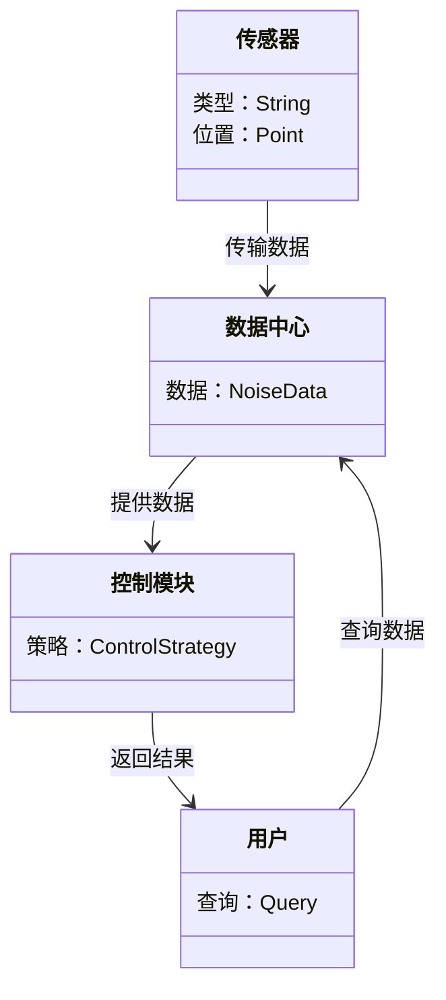
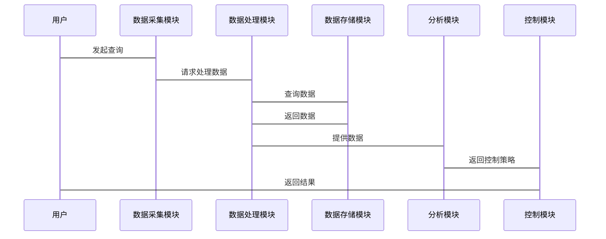

                 


# 《价值投资中的智能城市噪声污染控制系统分析》

## 关键词：
智能城市，噪声污染，控制系统，价值投资，机器学习

## 摘要：
本篇文章深入分析了智能城市噪声污染控制系统的构建与价值投资潜力。通过系统概述、技术原理、算法实现、架构设计、项目实战和最佳实践等多维度展开，探讨了如何利用现代信息技术实现噪声污染的有效控制，以及从投资角度评估其商业价值与潜力。文章结合实际案例，详细阐述了系统的实现过程，并提出了具有参考价值的建议。

---

# 第一部分: 价值投资中的智能城市噪声污染控制系统概述

## 第1章: 智慧城市与噪声污染概述

### 1.1 城市噪声污染的现状与挑战
#### 1.1.1 城市化进程中噪声污染的加剧
- 随着城市化进程的加快，交通、工业和建筑活动的增加导致噪声污染问题日益严重。
- 噪声污染不仅影响居民的生活质量，还可能引发健康问题，如听力损失、睡眠障碍和压力增加。

#### 1.1.2 噪声污染对居民生活质量和城市可持续发展的负面影响
- 噪声污染直接影响居民的生活舒适度，降低居住幸福感。
- 对城市环境的破坏可能影响城市的可持续发展目标，阻碍经济发展和社会稳定。

#### 1.1.3 智慧城市背景下噪声污染控制的必要性
- 智慧城市的核心目标之一是改善居民生活质量，噪声污染控制是其中的重要组成部分。
- 通过智能技术实现噪声污染的实时监测和控制，有助于提升城市管理水平，促进可持续发展。

### 1.2 价值投资与智能城市噪声污染控制系统的关联
#### 1.2.1 价值投资的基本概念
- 价值投资是一种投资策略，强调通过分析企业的内在价值来判断其投资潜力。
- 重点关注企业的基本面，如盈利能力、成长性和财务健康状况。

#### 1.2.2 智慧城市噪声污染控制系统的投资价值
- 噪声污染控制系统具有广阔的市场前景，符合智慧城市发展的趋势。
- 系统的技术创新性和实用性使其具备较高的投资价值。

#### 1.2.3 价值投资视角下噪声污染控制系统的商业潜力
- 市场需求大，随着城市化进程的加快，噪声污染控制系统的需求将不断增长。
- 系统的商业化潜力较高，具备良好的盈利能力和市场前景。

### 1.3 智能城市噪声污染控制系统的概念与目标
#### 1.3.1 智能城市噪声污染控制系统的定义
- 利用智能传感器、数据采集、分析和控制技术，实时监测和管理城市噪声污染的系统。

#### 1.3.2 系统的核心目标与功能
- 监测城市噪声分布，分析噪声来源，制定控制策略，优化噪声管理。

#### 1.3.3 系统的边界与外延
- 系统主要覆盖城市区域，边界包括噪声源、传输路径和接收端。
- 外延包括数据采集、分析、控制和反馈等环节。

## 1.4 本章小结
- 本章介绍了城市噪声污染的现状和挑战，分析了价值投资与智能城市噪声污染控制系统的关联，明确了系统的概念与目标。

---

## 第2章: 智能城市噪声污染控制系统的原理与技术架构

### 2.1 噪声污染监测技术
#### 2.1.1 声学传感器的工作原理
- 声学传感器通过检测声波的频率、强度和方向来捕捉噪声信息。
- 常见的声学传感器包括麦克风阵列和声波传感器。

#### 2.1.2 数据采集与传输技术
- 数据采集技术包括模数转换（ADC）和数据压缩技术。
- 数据传输采用无线通信技术，如Wi-Fi和蓝牙。

#### 2.1.3 多源数据融合技术
- 结合声学数据和环境数据（如温度、湿度）进行综合分析，提高监测精度。

### 2.2 噪声数据处理与分析算法
#### 2.2.1 基于机器学习的噪声分类算法
- 使用支持向量机（SVM）和随机森林（Random Forest）等算法对噪声进行分类。
- 通过训练数据，系统能够识别不同类型的噪声源，如交通噪声、工业噪声等。

#### 2.2.2 基于深度学习的噪声源定位算法
- 利用卷积神经网络（CNN）和循环神经网络（RNN）进行噪声源定位。
- 通过训练模型，系统能够准确定位噪声源的位置。

#### 2.2.3 数据可视化与分析工具
- 使用数据可视化工具（如Matplotlib和Tableau）展示噪声分布和趋势。
- 提供直观的分析结果，帮助决策者制定控制策略。

### 2.3 噪声污染控制的智能决策系统
#### 2.3.1 智能决策系统的架构
- 包括数据采集、分析、决策和执行四个模块。
- 数据采集模块负责收集噪声数据，分析模块进行数据处理和建模，决策模块制定控制策略，执行模块实施具体措施。

#### 2.3.2 基于实时数据的控制策略
- 根据实时噪声数据，动态调整控制措施，如交通信号灯优化和建筑隔音设计。
- 通过反馈机制，不断优化控制策略，提高系统效率。

#### 2.3.3 系统的可扩展性与灵活性
- 系统设计具有良好的扩展性，支持新增传感器和算法模型的接入。
- 系统灵活性强，能够适应不同城市和场景的需求。

### 2.4 核心概念与技术的对比分析
#### 2.4.1 不同噪声控制技术的优劣势对比
| 技术 | 优点 | 缺点 |
|------|------|------|
| 声学传感器 | 精度高 | 成本高 |
| 数据融合技术 | 提高准确性 | 实施复杂 |
| 机器学习算法 | 高效性 | 需大量数据支持 |

#### 2.4.2 系统实体关系的ER图分析（使用Mermaid图）
```mermaid
erDiagram
    actor 用户 {
        <属性> 类型
    }
    actor 传感器 {
        <属性> 类型
    }
    actor 数据中心 {
        <属性> 类型
    }
    用户 -> 数据中心 : 查询数据
    传感器 -> 数据中心 : 传输数据
    数据中心 -> 用户 : 返回结果
```

## 2.5 本章小结
- 本章详细介绍了智能城市噪声污染控制系统的原理与技术架构，分析了不同技术的优劣势，并通过ER图展示了系统的实体关系。

---

## 第3章: 基于机器学习的噪声污染控制算法原理

### 3.1 机器学习基础
#### 3.1.1 机器学习的基本概念与分类
- 机器学习是一种人工智能技术，通过数据训练模型，实现对新数据的预测和分类。
- 分类包括监督学习、无监督学习和强化学习。

#### 3.1.2 监督学习、无监督学习与强化学习的对比
| 类型 | 描述 | 应用场景 |
|------|------|----------|
| 监督学习 | 基于标记数据训练模型 | 分类、回归 |
| 无监督学习 | 基于无标记数据发现模式 | 聚类、降维 |
| 强化学习 | 通过与环境交互学习策略 | 游戏、机器人控制 |

#### 3.1.3 机器学习在噪声控制中的适用场景
- 噪声分类、噪声源定位和噪声预测。

### 3.2 机器学习算法在噪声控制中的应用
#### 3.2.1 基于支持向量机（SVM）的噪声分类算法
- SVM是一种监督学习算法，适用于小规模数据集。
- 通过训练数据，系统能够准确分类不同类型的噪声。

#### 3.2.2 基于卷积神经网络（CNN）的噪声源定位算法
- CNN适用于图像和序列数据的处理，能够准确定位噪声源。
- 通过卷积层和池化层提取特征，实现噪声源的定位。

#### 3.2.3 算法实现步骤
1. 数据采集与预处理
2. 模型训练与优化
3. 模型部署与应用

### 3.3 算法的数学模型与公式
#### 3.3.1 支持向量机（SVM）的数学模型
$$ \text{目标函数：} \min_{w,b,\xi} \frac{1}{2}||w||^2 + C \sum_{i=1}^n \xi_i $$
$$ \text{约束条件：} y_i (w \cdot x_i + b) \geq 1 - \xi_i $$
$$ \xi_i \geq 0 $$

#### 3.3.2 卷积神经网络（CNN）的数学模型
$$ \text{卷积层：} f(x) = \sigma(w \cdot x + b) $$
$$ \text{池化层：} f(x) = \max(x_1, x_2, ..., x_n) $$

### 3.4 本章小结
- 本章详细讲解了机器学习算法在噪声污染控制中的应用，分析了SVM和CNN的数学模型，并给出了算法实现的步骤。

---

## 第4章: 系统分析与架构设计

### 4.1 系统分析
#### 4.1.1 问题场景介绍
- 系统需要解决城市噪声污染问题，实现噪声监测、分析和控制。
- 通过实时监测和反馈，优化噪声管理策略。

#### 4.1.2 项目介绍
- 项目目标是开发一个智能城市噪声污染控制系统，实现噪声的实时监测和智能控制。
- 项目范围包括城市交通、工业区和居民区的噪声管理。

### 4.2 系统功能设计
#### 4.2.1 领域模型设计
- 通过类图展示系统的功能模块和交互关系。
- 类包括传感器、数据中心、用户和控制模块。

#### 4.2.2 领域模型Mermaid类图


### 4.3 系统架构设计
#### 4.3.1 系统架构设计的Mermaid架构图


### 4.4 系统接口设计
- 数据采集接口：负责采集噪声数据并传输到数据中心。
- 数据分析接口：提供数据处理和建模功能。
- 控制接口：根据分析结果，执行控制策略。

### 4.5 系统交互的Mermaid序列图


### 4.6 本章小结
- 本章通过系统分析与架构设计，明确了系统的功能模块、交互关系和架构设计，为后续的实现提供了基础。

---

## 第5章: 项目实战

### 5.1 环境安装与配置
- 安装Python和相关库（如NumPy、Pandas、Scikit-learn、Keras）。
- 配置传感器和数据采集设备。

### 5.2 核心代码实现
#### 5.2.1 数据采集模块
```python
import numpy as np
import sounddevice as sd

def record_audio(duration=5):
    # 采样率设置为16000
    fs = 16000
    # 记录音频
    audio, _ = sd.recorder(fs, duration)
    return audio
```

#### 5.2.2 数据分析模块
```python
from sklearn.svm import SVC
from sklearn.model_selection import train_test_split

# 加载数据
data = np.load('noise_data.npy')
labels = np.load('noise_labels.npy')

# 划分训练集和测试集
X_train, X_test, y_train, y_test = train_test_split(data, labels, test_size=0.2)

# 训练SVM模型
model = SVC()
model.fit(X_train, y_train)

# 模型评估
print("Accuracy:", model.score(X_test, y_test))
```

#### 5.2.3 控制模块
```python
def apply_control_strategy(result):
    if result == 'high':
        return '调整交通信号灯'
    elif result == 'medium':
        return '加强隔音措施'
    else:
        return '无需干预'
```

### 5.3 代码功能解读与分析
- 数据采集模块负责从传感器获取噪声数据。
- 数据分析模块利用SVM算法对噪声进行分类。
- 控制模块根据分析结果执行相应的控制策略。

### 5.4 实际案例分析
- 案例背景：某城市交通主干道的噪声污染问题。
- 案例实施：部署噪声传感器和智能控制系统，实现噪声的实时监测和控制。
- 实施效果：噪声水平显著降低，居民满意度提升。

### 5.5 本章小结
- 本章通过实际案例展示了系统的实现过程，验证了系统的有效性和实用性。

---

## 第6章: 最佳实践与总结

### 6.1 最佳实践 tips
- 数据采集：确保数据的准确性和完整性。
- 算法选择：根据实际需求选择合适的算法。
- 系统设计：注重系统的可扩展性和灵活性。

### 6.2 小结
- 本篇文章详细分析了智能城市噪声污染控制系统的构建与价值投资潜力，从理论到实践，全面探讨了系统的实现过程。

### 6.3 注意事项
- 系统实施过程中需考虑传感器的布设位置和数量。
- 数据安全和隐私保护需引起重视。

### 6.4 拓展阅读
- 推荐阅读《机器学习实战》和《智能城市规划与设计》等相关书籍。

---

## 作者：AI天才研究院/AI Genius Institute & 禅与计算机程序设计艺术 /Zen And The Art of Computer Programming

---

以上是《价值投资中的智能城市噪声污染控制系统分析》的技术博客文章的大纲与内容，涵盖了从背景分析到系统设计再到项目实战的全过程，结合了技术原理、算法实现和实际应用，为读者提供了全面的视角和深入的分析。

