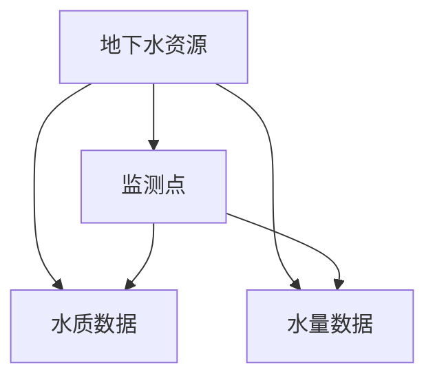
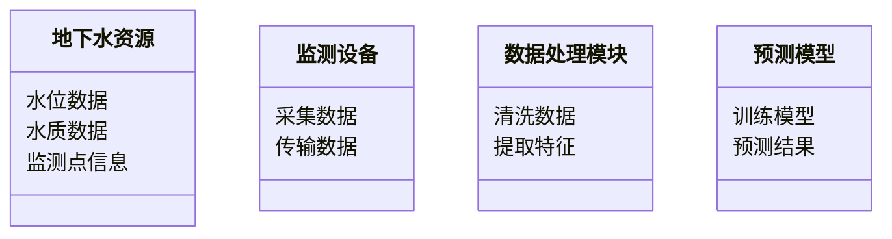
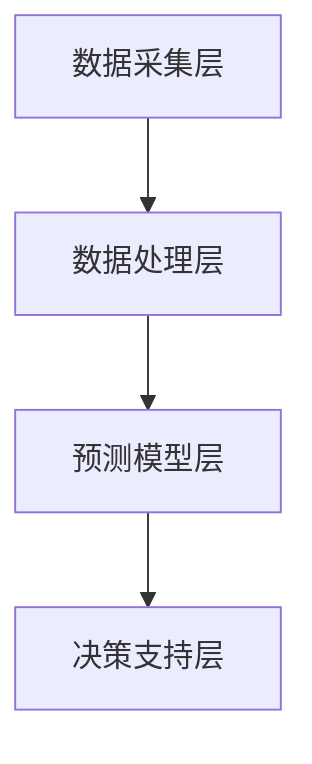
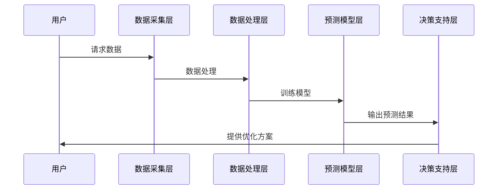

                 


# 价值投资中的智能城市地下水资源管理系统分析

## 关键词：智能城市，地下水资源管理，价值投资，算法原理，系统架构，项目实战

## 摘要：  
本文从价值投资的角度分析智能城市地下水资源管理系统的建设与优化，结合背景介绍、核心概念、算法原理、系统架构设计、项目实战等多维度，全面解析如何通过智能技术提升地下水资源管理效率和投资回报率。文章内容丰富，逻辑清晰，语言简洁，旨在为相关领域的研究和实践提供有价值的参考。

---

# 第一部分: 智慧城市地下水资源管理系统的价值投资分析

## 第1章: 背景介绍

### 1.1 问题背景与描述

#### 1.1.1 地下水资源管理的现状与挑战
地下水资源是城市发展的关键资源之一，但随着城市化进程的加快，地下水资源的过度开发、污染和浪费问题日益严重。传统的地下水资源管理模式存在效率低、数据孤岛、决策滞后等问题，难以应对复杂的水资源管理需求。

#### 1.1.2 智慧城市发展的背景与趋势
智慧城市建设的核心目标是通过智能化技术提升城市资源管理效率。地下水资源管理作为智慧城市的重要组成部分，需要借助物联网、大数据和人工智能等技术实现智能化管理。

#### 1.1.3 价值投资与地下水资源管理的结合
价值投资强调通过优化资源配置实现最大化的投资回报。在地下水资源管理领域，通过智能系统优化资源配置，提高管理效率，降低运营成本，从而实现投资收益的最大化。

### 1.2 问题解决与边界定义

#### 1.2.1 智慧城市地下水资源管理的目标
- 实现地下水资源的实时监测与动态管理。
- 优化水资源配置，提高利用效率。
- 预测水资源短缺风险，制定应对策略。

#### 1.2.2 系统的边界与外延
- 数据采集范围：地下水位、水质、水量等。
- 系统功能边界：监测、分析、优化、决策支持。
- 外延部分：与城市其他系统（如交通、能源）的协同管理。

#### 1.2.3 核心要素与组成结构
- 数据采集层：传感器、监测设备。
- 数据分析层：算法模型、预测工具。
- 决策支持层：优化方案、投资评估。

---

## 第2章: 核心概念与联系

### 2.1 核心概念原理

#### 2.1.1 数据采集与处理
- 数据采集：通过传感器实时采集地下水位、水质等数据。
- 数据处理：清洗、归一化、特征提取。

#### 2.1.2 智能分析与预测
- 数据分析：利用大数据技术对历史数据进行挖掘。
- 预测模型：构建时间序列预测模型，预测未来水资源变化趋势。

#### 2.1.3 优化决策与投资评估
- 优化决策：基于预测结果，制定最优资源配置方案。
- 投资评估：评估系统建设的投资回报率。

### 2.2 概念属性特征对比表

| 概念 | 属性 | 特征 |
|------|------|------|
| 数据采集 | 监测设备 | 传感器、监测站 |
| 数据分析 | 技术 | 大数据、机器学习 |
| 优化决策 | 方法 | 线性回归、时间序列分析 |

### 2.3 ER实体关系图



---

## 第3章: 算法原理与数学模型

### 3.1 数据处理与分析算法

#### 3.1.1 数据预处理流程
- 数据清洗：去除异常值、填补缺失值。
- 数据归一化：将数据标准化，便于模型训练。
- 特征提取：提取关键特征，如时间、地点、水质指标等。

#### 3.1.2 时间序列分析方法
- 使用ARIMA模型进行时间序列预测。
- 通过历史数据训练模型，预测未来水资源变化趋势。

#### 3.1.3 机器学习算法选择
- 线性回归：适用于简单线性关系的预测。
- 支持向量机：适用于非线性关系的分类与回归。

### 3.2 数学模型与公式

#### 3.2.1 线性回归模型
$$ y = \beta_0 + \beta_1x + \epsilon $$

#### 3.2.2 时间序列预测公式
$$ \hat{y}_t = \alpha y_{t-1} + (1-\alpha)\hat{y}_{t-1} $$

### 3.3 代码实现与案例分析

#### 3.3.1 Python代码示例

```python
import pandas as pd
from sklearn.linear_model import LinearRegression

# 数据加载与预处理
data = pd.read_csv('water_resource.csv')
X = data[['feature1', 'feature2']]
y = data['target']

# 模型训练
model = LinearRegression()
model.fit(X, y)

# 预测与评估
predictions = model.predict(X)
print('预测结果:', predictions)
```

#### 3.3.2 案例分析
通过实际案例，展示模型的预测能力和投资回报率的提升。

---

## 第4章: 系统分析与架构设计

### 4.1 问题场景介绍
- 系统需求：实时监测、数据分析、优化决策。
- 项目目标：构建智能化地下水资源管理系统，提升管理效率和投资回报率。

### 4.2 系统功能设计

#### 4.2.1 领域模型类图


#### 4.2.2 系统架构设计


#### 4.2.3 系统接口设计
- 数据采集接口：传感器数据接口。
- 数据分析接口：算法调用接口。
- 决策支持接口：优化方案输出接口。

#### 4.2.4 系统交互流程图


---

## 第5章: 项目实战

### 5.1 环境安装
- 安装Python、Jupyter Notebook、数据库等开发环境。

### 5.2 系统核心实现源代码

#### 5.2.1 数据采集模块
```python
import serial
import time

port = 'COM3'
baud_rate = 9600

ser = serial.Serial(port, baud_rate)

while True:
    data = ser.readline().decode()
    print(data)
    time.sleep(1)
```

#### 5.2.2 数据分析模块
```python
import pandas as pd
from sklearn.model_selection import train_test_split

data = pd.read_csv('water_resource.csv')
X = data.drop('target', axis=1)
y = data['target']

X_train, X_test, y_train, y_test = train_test_split(X, y, test_size=0.2)
```

### 5.3 代码应用解读与分析
- 数据采集模块：通过串口读取传感器数据。
- 数据分析模块：使用机器学习算法进行预测。

### 5.4 实际案例分析
通过具体案例，展示系统的实际应用效果和投资回报。

### 5.5 项目小结
总结项目经验，提出改进建议。

---

## 第6章: 最佳实践

### 6.1 小结
- 总结文章的核心内容。
- 强调智能技术在地下水资源管理中的重要性。

### 6.2 注意事项
- 数据采集的准确性。
- 模型选择的合理性。
- 系统设计的可扩展性。

### 6.3 拓展阅读
- 推荐相关领域的书籍和论文。

---

## 作者：AI天才研究院/AI Genius Institute & 禅与计算机程序设计艺术 /Zen And The Art of Computer Programming

---

**本文是对智能城市地下水资源管理系统进行价值投资分析的系统性阐述，通过背景介绍、核心概念、算法原理、系统架构设计和项目实战等多维度，全面解析如何通过智能技术提升地下水资源管理效率和投资回报率。希望本文能够为相关领域的研究和实践提供有价值的参考。**

