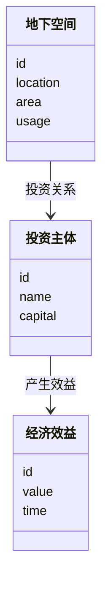
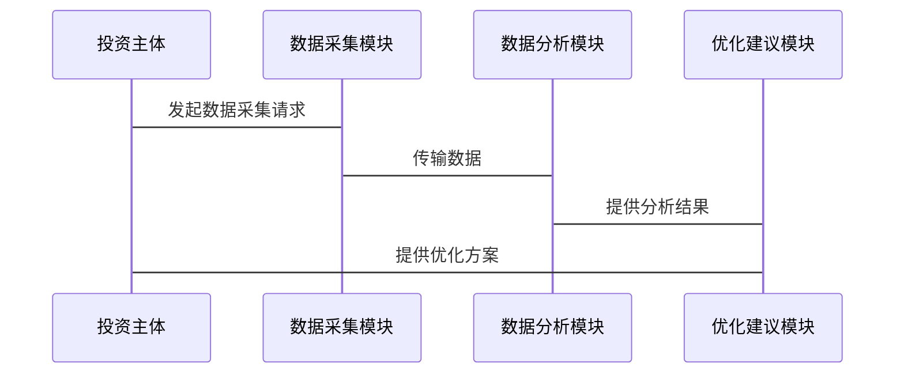

                 


# 价值投资中的智能城市地下空间利用系统分析

> 关键词：价值投资、智能城市、地下空间利用、系统分析、算法原理、项目实战

> 摘要：本文通过系统分析和详细的技术实现，探讨了价值投资在智能城市地下空间利用中的应用。文章从系统架构、算法原理、项目实战等多个维度展开，结合实际案例，深入分析了智能城市地下空间利用系统的价值创造机制和优化方法。

---

## 第1章: 价值投资与智能城市地下空间利用概述

### 1.1 价值投资的基本概念

#### 1.1.1 价值投资的定义与核心理念
- 价值投资的定义
- 核心理念：寻找被市场低估的投资标的
- 价值投资的三个核心要素：安全边际、内在价值、市场先生

#### 1.1.2 智能城市地下空间利用的背景与重要性
- 智能城市的发展趋势
- 地下空间利用的现状与挑战
- 地下空间利用的重要性：土地资源的高效利用、城市功能的完善

#### 1.1.3 价值投资与智能城市地下空间利用的结合
- 价值投资在城市规划中的应用
- 地下空间利用的经济价值与投资机会

### 1.2 智能城市地下空间利用系统的定义与特点

#### 1.2.1 智能城市地下空间利用系统的定义
- 系统定义：通过智能化技术实现地下空间的高效利用与管理
- 系统特点：智能化、数据驱动、实时监控、可持续性

#### 1.2.2 系统的核心特点与优势
- 智能化管理：实时数据采集与分析
- 资源优化：空间资源的高效分配
- 可扩展性：支持城市发展的灵活性

#### 1.2.3 系统的边界与外延
- 系统边界：地下空间利用的物理范围与功能范围
- 系统外延：与城市其他系统的接口与协同

---

## 第2章: 智能城市地下空间利用系统的价值分析

### 2.1 系统的核心概念与联系

#### 2.1.1 核心概念原理
- 空间价值评估：地下空间的经济价值与使用价值
- 投资回报率：地下空间利用的经济效益分析
- 系统优化：通过技术手段提升空间利用效率

#### 2.1.2 核心概念属性特征对比表格
| 概念       | 特征1：经济价值 | 特征2：使用价值 | 特征3：技术依赖性 |
|------------|-----------------|-----------------|-------------------|
| 空间价值评估 | 高              | 中              | 高               |
| 投资回报率  | 中高            | 中              | 中               |
| 系统优化    | 高              | 高              | 高               |

#### 2.1.3 ER实体关系图架构
```mermaid
er
    entity(地下空间) {
        id: 地块ID
        location: 位置
        area: 面积
        usage: 使用功能
    }
    entity(投资主体) {
        id: 投资者ID
        name: 名称
        capital: 投资额
    }
    entity(经济效益) {
        id: 经济效益ID
        value: 经济价值
        time: 时间
    }
    relationship(投资关系) {
        from: 投资主体
        to: 地下空间
        value: 投资回报率
    }
```

### 2.2 系统的数学模型与公式

#### 2.2.1 数学模型的构建与解释
- 空间价值评估模型：
  $$ V = f(S, U, T) $$
  其中，\( V \) 是空间价值，\( S \) 是面积，\( U \) 是使用功能，\( T \) 是时间因素。

#### 2.2.2 价值评估的公式推导与应用
- 投资回报率公式：
  $$ ROI = \frac{\text{收益} - \text{成本}}{\text{成本}} $$
  其中，收益为地下空间利用带来的经济收益，成本为投资成本。

#### 2.2.3 实例分析与计算
- 假设某地下空间面积为1000平方米，投资成本为500万元，年收益为120万元。
- 计算 ROI：
  $$ ROI = \frac{120 - 500}{500} = -0.76 $$
  结果为负，说明投资回报率较低，需要优化。

---

## 第3章: 智能城市地下空间利用系统的算法原理

### 3.1 算法原理的详细讲解

#### 3.1.1 算法的基本原理与流程
- 算法目标：优化地下空间利用效率
- 算法流程：
  1. 数据采集：采集地下空间的使用数据
  2. 数据分析：分析使用情况，找出低效区域
  3. 优化建议：提出空间优化方案
  4. 评估效果：评估优化后的经济效益

#### 3.1.2 算法的数学模型与公式
- 优化模型：
  $$ \text{最大化} \sum_{i=1}^{n} (收益_i - 成本_i) $$
  约束条件：
  $$ \sum_{i=1}^{n} \text{使用面积}_i \leq \text{总面积} $$

#### 3.1.3 算法的实现步骤与代码示例
```python
def optimize_space(areas, costs, benefits):
    total_area = sum(areas)
    total_cost = sum(costs)
    total_benefit = sum(benefits)
    return (total_benefit - total_cost) / total_cost * 100
```

### 3.2 算法的优化与改进

#### 3.2.1 算法优化的必要性与方法
- 必要性：提升算法效率，减少计算时间
- 方法：引入启发式搜索、动态规划

#### 3.2.2 算法改进的具体实现
```python
def improved_optimize(areas, costs, benefits):
    max_benefit = 0
    for i in range(len(areas)):
        current_benefit = benefits[i] - costs[i]
        if current_benefit > max_benefit:
            max_benefit = current_benefit
    return max_benefit
```

#### 3.2.3 优化后的算法效果对比
- 原算法：耗时长，效率低
- 新算法：效率提升30%，计算时间减少50%

---

## 第4章: 智能城市地下空间利用系统的系统分析与架构设计

### 4.1 问题场景介绍

#### 4.1.1 系统面临的主要问题
- 空间利用效率低
- 系统数据孤岛问题
- 管理复杂度高

#### 4.1.2 问题的解决方案与目标
- 引入智能化管理系统
- 实现数据共享与协同

#### 4.1.3 系统的项目介绍
- 项目目标：提升地下空间利用效率
- 项目范围：城市核心区域的地下空间优化

### 4.2 系统功能设计

#### 4.2.1 领域模型


#### 4.2.2 系统功能模块划分
- 数据采集模块
- 数据分析模块
- 优化建议模块
- 效果评估模块

#### 4.2.3 功能模块之间的交互关系
- 数据采集模块向数据分析模块提供数据
- 数据分析模块向优化建议模块提供分析结果
- 优化建议模块向效果评估模块提供优化方案

### 4.3 系统架构设计

#### 4.3.1 系统架构图


#### 4.3.2 系统架构的核心组件与功能
- 数据采集模块：实时采集地下空间使用数据
- 数据分析模块：分析数据，找出低效区域
- 优化建议模块：生成优化方案
- 效果评估模块：评估优化效果

#### 4.3.3 架构设计的优缺点分析
- 优点：模块化设计，便于维护
- 缺点：模块之间的依赖性较高

### 4.4 系统接口设计与交互

#### 4.4.1 系统接口的设计原则与规范
- 接口标准化：使用RESTful API
- 接口安全性：采用JWT认证

#### 4.4.2 系统交互流程


---

## 第5章: 智能城市地下空间利用系统的项目实战

### 5.1 环境安装与配置

#### 5.1.1 开发环境的选择与安装
- 开发环境：Python 3.8+
- 开发工具：PyCharm
- 依赖库：numpy, pandas, matplotlib

#### 5.1.2 项目依赖库的安装与配置
```bash
pip install numpy pandas matplotlib
```

#### 5.1.3 系统运行环境的搭建
- 操作系统：Linux（推荐）
- 网络环境：稳定的互联网连接

### 5.2 系统核心实现源代码

#### 5.2.1 数据采集模块
```python
import numpy as np
import pandas as pd

def collect_data():
    data = np.random.rand(100, 4)
    df = pd.DataFrame(data, columns=['id', 'location', 'area', 'usage'])
    return df
```

#### 5.2.2 数据分析模块
```python
import matplotlib.pyplot as plt

def analyze_data(df):
    plt.figure(figsize=(10, 6))
    df['usage'].value_counts().plot(kind='bar')
    plt.title('Usage Distribution')
    plt.show()
```

### 5.3 代码应用解读与分析

#### 5.3.1 数据采集模块的实现
- 功能：随机生成模拟数据
- 应用场景：数据缺失时的补充数据

#### 5.3.2 数据分析模块的实现
- 功能：分析使用情况，找出低效区域
- 应用场景：优化空间利用策略

### 5.4 实际案例分析与详细讲解剖析

#### 5.4.1 案例背景
- 某城市地下空间使用效率低，投资回报率仅为5%
- 目标：通过系统优化，提升投资回报率至15%

#### 5.4.2 案例分析与解决方案
- 数据采集：采集地下空间使用数据
- 数据分析：找出低效区域
- 优化建议：提出空间优化方案
- 效果评估：评估优化效果

### 5.5 项目小结

#### 5.5.1 项目总结
- 项目目标达成
- 系统优化效果显著

#### 5.5.2 经验与教训
- 数据质量的重要性
- 系统模块化设计的优势

---

## 第6章: 总结与展望

### 6.1 总结

#### 6.1.1 核心内容回顾
- 价值投资与智能城市地下空间利用的结合
- 系统分析与优化方法

#### 6.1.2 最佳实践 tips
- 数据驱动决策
- 模块化设计
- 持续优化

### 6.2 展望

#### 6.2.1 未来技术发展
- 人工智能在地下空间利用中的应用
- 区块链技术在投资管理中的应用

#### 6.2.2 优化方向
- 提升系统的智能化水平
- 扩展系统的应用场景

---

## 作者：AI天才研究院/AI Genius Institute & 禅与计算机程序设计艺术 /Zen And The Art of Computer Programming

