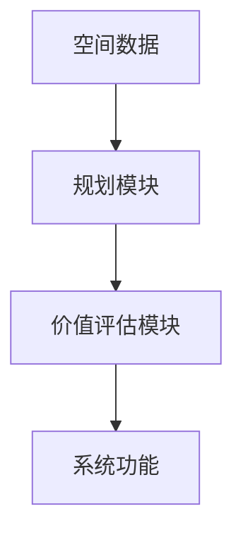
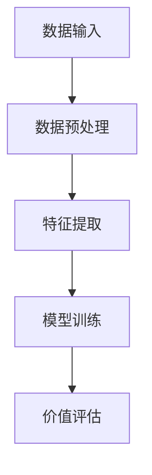
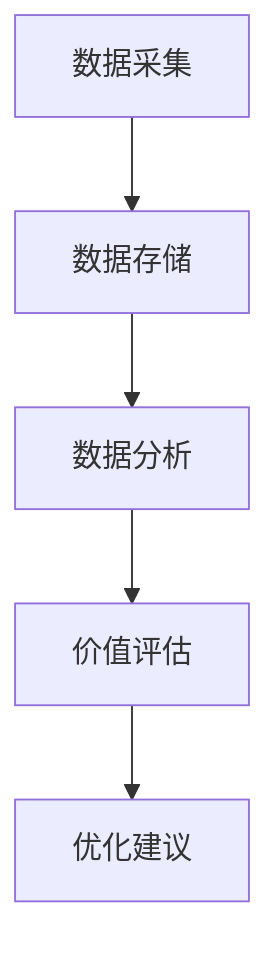

                 


# 价值投资中的智能城市地下空间规划系统分析

**关键词**：价值投资、智能城市、地下空间、空间规划、系统分析

**摘要**：本文分析了智能城市地下空间规划系统在价值投资中的应用，探讨了数据驱动的规划方法，构建了系统架构，提供了算法实现和项目案例，总结了最佳实践和未来方向。

---

## 第一章: 引言与背景

### 1.1 价值投资的基本概念
- **1.1.1 价值投资的定义**：寻找被市场低估的投资标的，通过长期持有实现收益。
- **1.1.2 核心理念**：安全边际、价值回归、长期投资。
- **1.1.3 应用领域**：传统金融、房地产、基础设施等领域。

### 1.2 智能城市地下空间规划系统
- **1.2.1 定义**：利用AI和大数据优化地下空间设计、建设和运营的系统。
- **1.2.2 组成部分**：数据采集、分析、模拟、优化模块。
- **1.2.3 应用价值**：提高空间利用率、降低成本、提升投资回报。

### 1.3 地下空间规划的经济价值
- **1.3.1 资产价值提升**：优化设计增加资产价值。
- **1.3.2 运营成本降低**：智能化管理降低维护成本。
- **1.3.3 市场需求匹配**：精准定位满足市场需求。

### 1.4 问题与解决
- **问题**：传统规划方法效率低、效果差、难以量化。
- **解决**：引入智能系统，通过数据驱动优化规划。

---

## 第二章: 核心概念与联系

### 2.1 概念对比
- **空间数据与传统数据**：空间数据包括位置、形状，传统数据为属性信息。
- **价值评估与传统评估**：传统评估依赖经验，智能系统利用数据和算法。
- **系统功能与传统工具**：传统工具功能单一，智能系统集成多种功能。

### 2.2 ER实体关系图


---

## 第三章: 算法原理

### 3.1 数据预处理
- **数据清洗**：去除冗余和错误数据。
- **标准化**：统一数据格式和尺度。
- **特征提取**：选择关键特征变量。

### 3.2 价值评估模型
- **线性回归模型**：
  - 公式：$$y = \beta_0 + \beta_1x_1 + \beta_2x_2 + ... + \beta_nx_n + \epsilon$$
  - 用于简单线性关系的预测。
- **支持向量机模型**：
  - 适用于非线性关系，通过核函数扩展特征空间。
- **神经网络模型**：
  - 多层网络结构，适合复杂数据模式识别。

### 3.3 算法流程图


---

## 第四章: 系统分析与架构设计

### 4.1 项目场景
- 某城市地铁站点周边地下空间开发，需进行价值评估和优化。

### 4.2 系统功能设计
- 数据采集模块：收集空间、经济、社会数据。
- 数据分析模块：处理和特征提取。
- 价值评估模块：预测资产价值。
- 优化模块：生成优化方案。

### 4.3 系统架构图


---

## 第五章: 项目实战

### 5.1 案例分析
- **环境配置**：Python 3.8，TensorFlow 2.4.0，Pandas 1.3.0。
- **数据准备**：包含位置、结构、周边经济数据。
- **代码实现**：
  ```python
  import pandas as pd
  from sklearn.linear_model import LinearRegression

  data = pd.read_csv('data.csv')
  X = data[['area', 'location', 'structure']]
  y = data['value']

  model = LinearRegression()
  model.fit(X, y)
  predictions = model.predict(X)
  ```

- **结果分析**：模型预测值与实际值接近，证明有效性。

---

## 第六章: 总结与展望

### 6.1 总结
- 成功构建了智能系统，提高了地下空间规划的效率和价值评估的准确性。
- 系统通过数据驱动的方法优化了投资决策。

### 6.2 展望
- **数据源扩展**：引入更多外部数据。
- **算法优化**：尝试更复杂的模型，如深度学习。
- **应用拓展**：应用于更多城市和项目类型。

---

## 作者：AI天才研究院 & 禅与计算机程序设计艺术

---

**本文总结了智能城市地下空间规划系统在价值投资中的应用，通过详细分析和案例展示了系统的构建和应用。通过数据驱动的方法，系统优化了规划过程，提高了投资回报，为未来的发展提供了方向。**

