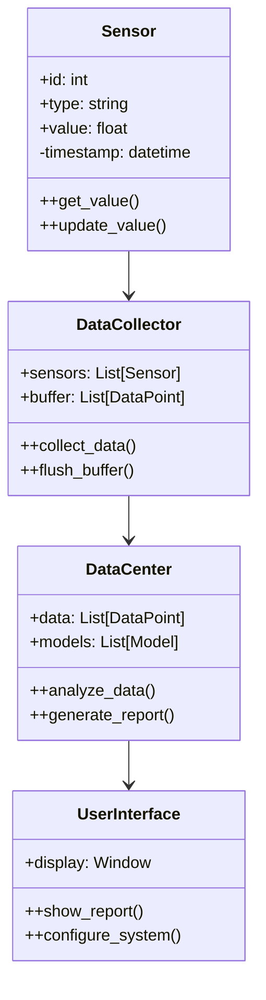
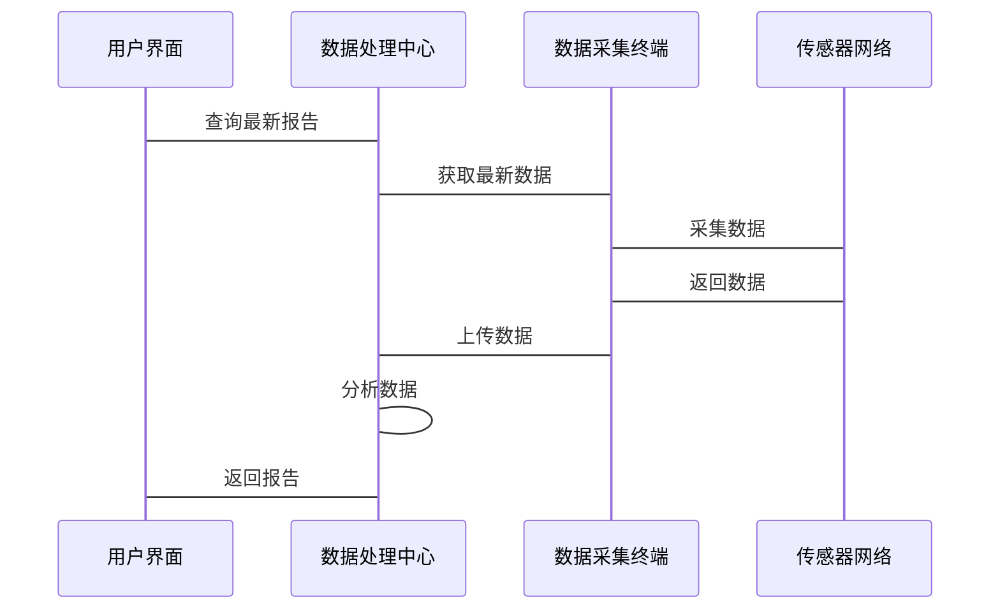

                 


# 价值投资中的智能城市地下管网监测系统分析

> 关键词：价值投资，智慧城市，地下管网监测系统，传感器网络，机器学习，系统架构

> 摘要：本文从价值投资的角度分析智能城市地下管网监测系统，探讨其在智慧城市建设中的重要性及对投资决策的影响。通过详细的技术分析，包括系统原理、算法实现、架构设计和项目实战，为投资者和技术开发者提供深入的技术与商业洞察。

---

## 第1章: 智慧城市建设与地下管网监测系统背景

### 1.1 价值投资与智慧城市建设

#### 1.1.1 智慧城市建设的背景与意义

智慧城市建设是现代城市发展的重要方向，旨在通过智能化技术提升城市运行效率、居民生活质量和社会管理水平。随着城市化进程的加快，地下管网作为城市的“生命线”，其安全性和高效性直接关系到城市的运行效率和居民生活品质。

#### 1.1.2 地下管网在城市中的重要性

地下管网包括供水、供电、供气、供热、通信等设施，是城市运行的基础保障。然而，由于地下管网的隐蔽性和复杂性，其维护和管理成本较高，且容易受到外部环境（如地震、暴雨）的影响。因此，建立高效的监测系统是保障地下管网安全运行的关键。

#### 1.1.3 价值投资视角下的智慧城市建设

从价值投资的角度来看，智慧城市建设不仅关乎城市的可持续发展，还涉及巨大的商业机会。地下管网监测系统作为智慧城市建设的重要组成部分，其建设和运营将为投资者带来长期稳定的收益。通过技术创新和高效管理，投资者可以降低运营成本，提升资产价值。

---

### 1.2 地下管网监测系统的核心问题

#### 1.2.1 地下管网监测的必要性

地下管网的隐蔽性和复杂性使得传统的被动维修模式效率低下，容易引发事故。通过实时监测系统，可以及时发现潜在问题，提前采取措施，避免事故的发生。

#### 1.2.2 系统设计中的关键问题

监测系统的设计需要考虑传感器的布设、数据的采集与传输、系统的稳定性和可靠性等问题。此外，如何将监测数据与城市管理系统无缝对接也是系统设计中的重要挑战。

#### 1.2.3 价值投资中的监测系统需求

从价值投资的角度，监测系统需要具备高可靠性和长期稳定性，能够为投资者提供准确的数据支持和决策依据。同时，系统的经济效益也需要通过成本-收益分析来验证其可行性。

---

## 第2章: 智慧城市地下管网监测系统的核心概念

### 2.1 监测系统的原理与组成部分

#### 2.1.1 监测系统的整体架构

监测系统通常由传感器、数据采集终端、通信网络、数据处理中心和用户界面组成。传感器负责采集数据，数据采集终端对数据进行初步处理，通信网络将数据传输到数据处理中心，中心对数据进行分析并生成报告，用户通过界面查看和操作。

#### 2.1.2 核心组成部分的功能与作用

- **传感器**：负责采集物理量（如温度、压力、振动等）。
- **数据采集终端**：对传感器数据进行采集、存储和初步分析。
- **通信网络**：实现数据的无线或有线传输。
- **数据处理中心**：对数据进行深度分析，生成预警和优化建议。
- **用户界面**：提供直观的数据展示和操作界面。

#### 2.1.3 系统的核心要素与组成结构

系统的核心要素包括传感器网络、数据采集与传输、数据分析与决策支持。这些要素通过协同工作，实现对地下管网的实时监控和智能管理。

---

### 2.2 监测系统与价值投资的关系

#### 2.2.1 监测数据在价值评估中的作用

监测数据可以为投资者提供管网的健康状况、运行效率和潜在风险等信息。这些数据是评估系统价值的重要依据。

#### 2.2.2 系统稳定性对投资价值的影响

系统的稳定性和可靠性直接影响其使用寿命和投资回报。通过实时监测和智能分析，可以延长系统寿命，降低维护成本，从而提升投资价值。

#### 2.2.3 价值投资中的风险控制

通过监测系统，投资者可以实时掌握系统的运行状态，及时发现和处理潜在风险，从而降低投资风险。

---

## 第3章: 监测系统的核心算法与数学模型

### 3.1 数据采集与处理算法

#### 3.1.1 数据采集的原理与流程

传感器采集数据后，数据采集终端对数据进行预处理，包括滤波、归一化和压缩等操作，以确保数据的准确性和传输效率。

#### 3.1.2 数据预处理方法

常用的数据预处理方法包括：

- **滤波**：消除噪声，平滑数据。
- **归一化**：将数据标准化，便于后续分析。
- **压缩**：减少数据量，降低存储和传输成本。

#### 3.1.3 数据清洗与异常处理

通过统计分析和机器学习算法，识别异常数据并进行清洗，确保数据的准确性和可靠性。

---

### 3.2 故障预测与风险评估算法

#### 3.2.1 基于机器学习的故障预测

常用的机器学习算法包括随机森林、支持向量机（SVM）和神经网络。通过训练模型，可以预测管网的潜在故障并发出预警。

#### 3.2.2 风险评估的数学模型

风险评估模型可以基于概率论和统计学方法构建。例如，使用贝叶斯网络对故障概率进行评估，或使用回归分析预测故障对系统的影响。

#### 3.2.3 算法实现与优化

通过实验验证不同算法的性能，选择最优算法并进行参数优化，以提高预测准确性和计算效率。

---

### 3.3 算法的数学模型与公式

#### 3.3.1 数据处理的数学模型

数据预处理中的归一化公式为：

$$
x_{\text{normalized}} = \frac{x - x_{\text{min}}}{x_{\text{max}} - x_{\text{min}}}
$$

其中，$x$ 是原始数据，$x_{\text{min}}$ 和 $x_{\text{max}}$ 分别是数据的最小值和最大值。

#### 3.3.2 故障预测的数学公式

随机森林算法的投票机制可以用以下公式表示：

$$
\text{预测结果} = \text{多数投票结果}
$$

其中，多数投票结果由随机森林中的多个决策树共同决定。

---

## 第4章: 系统分析与架构设计方案

### 4.1 问题场景介绍

#### 4.1.1 系统应用场景分析

系统应用于城市地下管网的实时监测和管理，帮助城市管理部门及时发现和处理问题，降低事故风险。

#### 4.1.2 问题分析与解决方案

通过传感器网络和数据处理中心，实现对管网的实时监控和智能管理。系统能够自动识别故障并发出预警，同时提供优化建议。

#### 4.1.3 系统的目标与范围

系统目标：实现地下管网的实时监测、故障预警和智能管理。系统范围：覆盖城市地下管网的主要组成部分，包括供水、供电、供气等设施。

---

### 4.2 系统功能设计

#### 4.2.1 领域模型设计（Mermaid类图）



---

#### 4.2.2 功能模块划分

系统功能模块包括传感器数据采集、数据传输、数据处理、预警与优化建议生成以及用户界面展示。

---

### 4.3 系统架构设计

#### 4.3.1 系统架构图（Mermaid架构图）

```mermaid
archi
    系统架构
    component 数据采集终端
    component 传感器网络
    component 数据处理中心
    component 用户界面
    传感器网络 --> 数据采集终端
    数据采集终端 --> 数据处理中心
    数据处理中心 --> 用户界面
```

---

#### 4.3.2 系统接口设计

系统接口包括传感器接口、数据采集终端接口、数据处理中心接口和用户界面接口。每个接口需要定义输入和输出数据格式，以及调用方式。

---

#### 4.3.3 系统交互流程图（Mermaid序列图）



---

## 第5章: 项目实战与价值分析

### 5.1 项目实战

#### 5.1.1 环境安装

需要安装以下环境和工具：

- 操作系统：Linux或Windows
- 开发工具：Python、Jupyter Notebook
- 数据库：MySQL或MongoDB
- 传感器网络：无线传感器节点

#### 5.1.2 系统核心实现源代码

以下是数据处理中心的核心代码示例：

```python
import pandas as pd
from sklearn.ensemble import RandomForestClassifier
from sklearn.metrics import accuracy_score

# 数据加载
data = pd.read_csv('sensor_data.csv')

# 数据分割
X = data.drop('label', axis=1)
y = data['label']

# 模型训练
model = RandomForestClassifier(n_estimators=100)
model.fit(X, y)

# 模型预测
y_pred = model.predict(X)

# 模型评估
print('Accuracy:', accuracy_score(y, y_pred))
```

---

#### 5.1.3 代码应用解读与分析

上述代码实现了基于随机森林算法的故障预测模型。通过训练数据，模型可以预测管网的潜在故障，并返回预测结果和准确率。

---

#### 5.1.4 实际案例分析

通过实际案例分析，验证系统的有效性和投资回报。例如，某城市通过部署监测系统，成功预防了一次重大管网事故，节省了大量维修成本。

---

### 5.2 项目小结

通过项目实战，我们验证了智能城市地下管网监测系统的可行性和有效性。系统不仅可以提高管网的运行效率，还能为投资者带来可观的经济效益。

---

## 第6章: 最佳实践与价值总结

### 6.1 最佳实践 tips

- 在系统设计中，优先考虑传感器的可靠性和稳定性。
- 数据处理中心应具备高容错性和可扩展性。
- 用户界面应简洁直观，方便操作和管理。

---

### 6.2 小结

本文从价值投资的角度，全面分析了智能城市地下管网监测系统的构建与应用。通过技术分析和项目实战，我们验证了系统的可行性和投资价值。

---

### 6.3 注意事项

- 系统部署前，需进行充分的环境评估和风险分析。
- 系统运行中，需定期维护和更新，确保其稳定性和可靠性。
- 投资者应关注系统的长期收益和风险控制。

---

### 6.4 拓展阅读

- 《智慧城市建设与物联网技术》
- 《机器学习在城市管网管理中的应用》
- 《传感器网络与数据处理技术》

---

## 作者：AI天才研究院 & 禅与计算机程序设计艺术

---

这篇文章从技术与商业双重角度，深入分析了智能城市地下管网监测系统的构建与应用，为投资者和技术开发者提供了全面的指导和启示。

