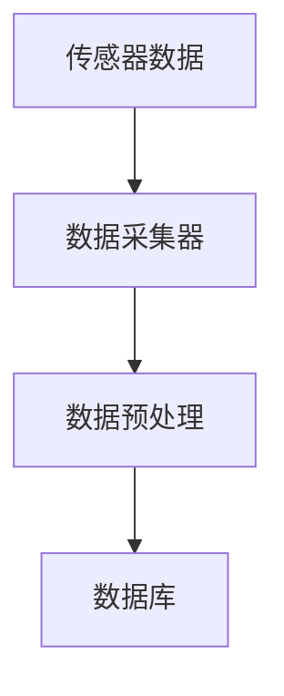
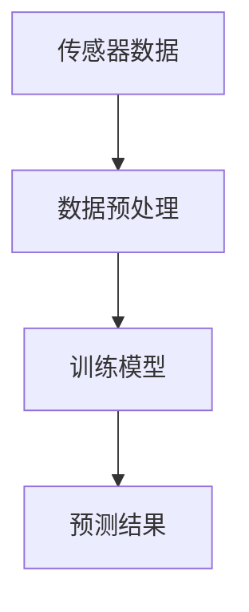
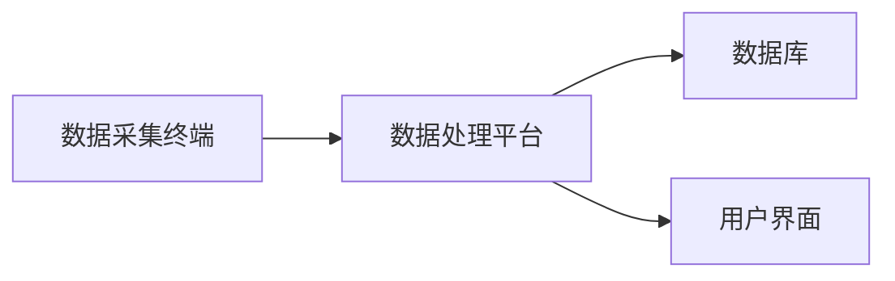
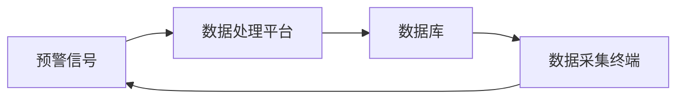

                 


# 价值投资中的智能城市地下管网监测系统分析

> **关键词**: 价值投资，智能城市，地下管网，监测系统，智慧城市，投资分析

> **摘要**: 本文从价值投资的角度分析智能城市地下管网监测系统的重要性和应用价值，结合系统架构设计、算法原理和项目实战，详细阐述如何通过技术手段提升城市地下管网的管理效率，从而为投资者提供更准确的投资决策依据。

---

# 第一部分: 智慧城市建设背景

# 第1章: 价值投资与智能城市地下管网监测系统概述

## 1.1 智慧城市建设背景

### 1.1.1 城市化进程中地下管网的重要性

随着城市化进程的加快，地下管网（包括供水、供气、供电、通信等）作为城市的“生命线”，其安全性和高效性直接关系到城市的运行效率和居民生活质量。然而，传统地下管网管理方式存在数据采集不实时、维护成本高、应急响应慢等问题。

### 1.1.2 智慧城市概念的提出与发展

智慧城市是通过物联网、大数据、人工智能等技术手段，将城市基础设施、管理和服务进行智能化整合，以实现资源优化配置和高效管理。智能城市地下管网监测系统作为智慧城市的重要组成部分，能够实时监控地下管网的运行状态，预防事故的发生，降低维护成本。

### 1.1.3 地下管网监测系统的价值与意义

地下管网监测系统通过对压力、流量、温度、湿度等参数的实时监测，能够及时发现管网泄漏、堵塞等问题，避免重大事故发生。同时，通过数据分析，可以为城市规划、能源管理、环境保护提供科学依据，从而提升城市的综合竞争力。

---

## 1.2 价值投资的核心理念

### 1.2.1 价值投资的基本定义

价值投资是一种长期投资策略，强调通过分析企业的基本面（如财务状况、行业地位、竞争优势等），寻找具有长期投资价值的企业。在智慧城市领域，价值投资的核心在于通过技术手段提升城市运营效率，降低维护成本，从而为企业创造更多的利润。

### 1.2.2 价值投资与企业基本面分析

企业基本面分析包括收入、利润、资产负债率、现金流等财务指标，以及行业地位、市场前景等非财务指标。在智能城市地下管网监测系统领域，企业技术实力、市场份额、成本控制能力是投资者关注的重点。

### 1.2.3 价值投资在智慧城市中的应用潜力

智能城市地下管网监测系统通过技术手段优化城市运营效率，降低维护成本，提升企业盈利能力。对于投资者来说，选择具备技术优势和市场竞争力的企业，能够在长期获得超额收益。

---

## 1.3 智能城市地下管网监测系统的核心要素

### 1.3.1 系统的基本构成

智能城市地下管网监测系统通常包括数据采集终端、通信网络、数据处理平台、用户界面等部分。数据采集终端负责采集管网运行数据，通信网络负责数据传输，数据处理平台负责数据分析和存储，用户界面供管理人员查看和操作。

### 1.3.2 系统的关键功能

- 数据采集与传输：实时采集管网运行数据，包括压力、流量、温度等参数。
- 数据分析与预警：通过数据分析，识别潜在问题，发出预警信号。
- 维护管理：根据预警信息，制定维护计划，减少事故发生的概率。
- 优化决策：通过历史数据分析，优化管网运行策略，降低能耗。

### 1.3.3 系统的性能指标与技术要求

- 数据采集精度：传感器的灵敏度和精度直接影响数据的准确性。
- 通信稳定性：通信网络的稳定性决定了数据传输的可靠性。
- 数据处理能力：数据处理平台需要具备强大的数据存储和分析能力。

---

## 1.4 本章小结

本章从智慧城市建设的背景出发，介绍了智能城市地下管网监测系统的定义、构成和功能，分析了价值投资的核心理念及其在智慧城市中的应用潜力。通过理解这些内容，读者可以更好地把握智能城市地下管网监测系统在价值投资中的重要性。

---

# 第2章: 智能城市地下管网监测系统的核心概念与原理

## 2.1 系统核心概念解析

### 2.1.1 智能监测系统的定义

智能城市地下管网监测系统是一种基于物联网、大数据和人工智能技术的智能化监测系统，能够实时监控地下管网的运行状态，并通过数据分析提供预警和优化建议。

### 2.1.2 系统的核心组成部分

- 数据采集终端：包括传感器、数据采集器等设备。
- 通信网络：包括有线和无线通信网络。
- 数据处理平台：包括数据库、数据分析工具等。
- 用户界面：供管理人员查看数据和操作系统。

### 2.1.3 系统的功能模块划分

- 数据采集模块：负责采集管网运行数据。
- 数据传输模块：负责将数据传输到处理平台。
- 数据分析模块：负责对数据进行处理和分析。
- 预警模块：根据分析结果发出预警信号。

---

## 2.2 系统工作原理

### 2.2.1 数据采集与传输机制

数据采集终端通过传感器实时采集管网运行数据，通过通信网络将数据传输到数据处理平台。数据传输过程中需要考虑网络的稳定性、数据的实时性和安全性。

### 2.2.2 数据处理与分析流程

数据处理平台对采集到的数据进行清洗、存储和分析，通过算法识别潜在问题，生成预警信号。数据分析过程包括时间序列分析、异常检测等技术。

### 2.2.3 系统输出与反馈机制

系统根据分析结果生成预警报告，通知相关管理人员，并提供优化建议。管理人员可以根据预警报告制定维护计划，减少事故发生的概率。

---

## 2.3 系统与城市基础设施的关系

### 2.3.1 系统与城市供水、供气、供电的关系

智能城市地下管网监测系统可以同时监测供水、供气、供电等基础设施的运行状态，帮助城市管理部门实现综合管理。

### 2.3.2 系统与城市交通、通信网络的关联

通过与城市交通和通信网络的协同，智能城市地下管网监测系统可以实现城市基础设施的智能化管理，提升城市的综合运行效率。

### 2.3.3 系统在城市防灾减灾中的作用

智能城市地下管网监测系统可以通过实时监测管网运行状态，提前发现潜在风险，减少自然灾害对城市基础设施的破坏。

---

## 2.4 系统与其他智能系统的对比

### 2.4.1 与智能交通系统的对比

智能交通系统主要关注城市交通的实时监控和优化，而智能城市地下管网监测系统关注的是地下管网的运行状态。两者在数据采集和分析上有相似之处，但应用场景不同。

### 2.4.2 与智能电网系统的对比

智能电网系统关注电力的传输和分配，而智能城市地下管网监测系统关注的是供水、供气等管网的运行状态。两者在数据采集和分析上有一定的相似性，但目标不同。

### 2.4.3 与智能安防系统的对比

智能安防系统关注城市安全的实时监控和预警，而智能城市地下管网监测系统关注的是地下管网的运行状态。两者在数据采集和预警机制上有相似之处，但应用领域不同。

---

## 2.5 本章小结

本章从系统核心概念和工作原理出发，详细分析了智能城市地下管网监测系统与城市基础设施的关系，以及与其他智能系统的主要区别。通过这些分析，读者可以更好地理解智能城市地下管网监测系统在智慧城市中的重要作用。

---

# 第3章: 系统算法原理与数学模型

## 3.1 数据采集与处理算法

### 3.1.1 数据采集的算法流程

数据采集流程包括传感器数据采集、数据预处理、数据存储等步骤。传感器数据采集是通过传感器采集管网运行数据，数据预处理包括去除噪声、数据归一化等，数据存储包括将数据存储到数据库中。

### 3.1.2 数据清洗与预处理方法

数据清洗包括去除无效数据、填补缺失值、处理异常值等。数据预处理包括数据归一化、特征提取等。

### 3.1.3 数据特征提取技术

特征提取技术包括主成分分析（PCA）、独立成分分析（ICA）等方法，用于降低数据维度，提取关键特征。

---

## 3.2 数据分析与预测算法

### 3.2.1 时间序列分析方法

时间序列分析是通过分析数据的时序特征，预测未来的趋势。常用的方法包括ARIMA模型、LSTM网络等。

### 3.2.2 状态识别与异常检测算法

状态识别算法包括聚类分析、支持向量机（SVM）等方法，用于识别管网的运行状态。异常检测算法包括基于统计的方法、基于深度学习的方法等。

### 3.2.3 预测模型的构建与优化

预测模型的构建包括选择模型结构、训练模型、验证模型等步骤。模型优化包括参数调优、特征选择等。

---

## 3.3 算法实现的数学模型

### 3.3.1 时间序列分析的ARIMA模型

ARIMA模型是一种常用的时间序列分析模型，其数学表达式如下：

$$ARIMA(p, d, q)$$

其中，p为自回归阶数，d为差分阶数，q为移动平均阶数。

---

## 3.4 代码实现与流程图

### 3.4.1 数据采集与处理流程图



### 3.4.2 数据分析与预测流程图



### 3.4.3 代码实现示例

```python
import pandas as pd
from statsmodels.tsa.arima.model import ARIMA

# 数据加载
data = pd.read_csv('管网数据.csv')

# 数据预处理
data = data.dropna()  # 去除缺失值
data = data['压力'].values  # 提取压力特征

# 模型训练
model = ARIMA(data, order=(5, 1, 0))  # p=5, d=1, q=0
model_fit = model.fit()

# 预测结果
forecast = model_fit.forecast(steps=10)  # 预测未来10步
```

---

## 3.5 本章小结

本章详细介绍了智能城市地下管网监测系统的算法原理与数学模型，包括数据采集与处理算法、数据分析与预测算法，以及具体的代码实现。通过这些分析，读者可以更好地理解系统的核心技术。

---

# 第4章: 系统分析与架构设计

## 4.1 项目背景介绍

智能城市地下管网监测系统的目标是通过技术手段实现地下管网的智能化管理，降低维护成本，提升城市运行效率。本项目旨在开发一套基于物联网和大数据的监测系统，实现管网运行状态的实时监控和预警。

---

## 4.2 系统功能设计

### 4.2.1 系统功能模块划分

- 数据采集模块：负责采集管网运行数据。
- 数据传输模块：负责将数据传输到数据处理平台。
- 数据分析模块：负责对数据进行处理和分析。
- 预警模块：根据分析结果发出预警信号。

### 4.2.2 系统功能实现的详细说明

- 数据采集模块：通过传感器采集压力、流量、温度等参数。
- 数据传输模块：通过有线或无线网络将数据传输到数据处理平台。
- 数据分析模块：对数据进行清洗、存储和分析，识别潜在问题。
- 预警模块：根据分析结果发出预警信号，并通知相关人员。

---

## 4.3 系统架构设计

### 4.3.1 系统架构图



### 4.3.2 系统架构设计的详细说明

- 数据采集终端：包括传感器、数据采集器等设备，负责采集管网运行数据。
- 数据处理平台：包括数据库、数据分析工具等，负责对数据进行处理和分析。
- 用户界面：供管理人员查看数据和操作系统。

---

## 4.4 系统接口设计

### 4.4.1 系统接口设计的详细说明

- 数据采集终端与数据处理平台之间的接口：负责数据传输。
- 数据处理平台与用户界面之间的接口：负责数据展示。

---

## 4.5 系统交互流程图



---

## 4.6 本章小结

本章从系统分析与架构设计的角度，详细介绍了智能城市地下管网监测系统的项目背景、功能设计、架构设计和交互流程。通过这些分析，读者可以更好地理解系统的技术实现。

---

# 第5章: 项目实战

## 5.1 环境安装与配置

### 5.1.1 系统运行环境要求

- 操作系统：Linux/Windows/MacOS
- 数据库：MySQL/PostgreSQL
- 开发工具：Python/Java/PHP
- 传感器：支持标准通信协议

### 5.1.2 系统依赖库安装

- Python库：pandas, numpy, statsmodels
- 数据库驱动：MySQL Connector Python

---

## 5.2 系统核心代码实现

### 5.2.1 数据采集模块

```python
import serial

# 串口配置
ser = serial.Serial('COM1', 9600)

# 数据采集
while True:
    data = ser.readline()
    print(data)
```

---

### 5.2.2 数据处理模块

```python
import pandas as pd
from statsmodels.tsa.arima.model import ARIMA

# 数据加载
data = pd.read_csv('管网数据.csv')

# 数据预处理
data = data.dropna()
data = data['压力'].values

# 模型训练
model = ARIMA(data, order=(5, 1, 0))
model_fit = model.fit()

# 预测结果
forecast = model_fit.forecast(steps=10)
```

---

## 5.3 代码实现与解读

### 5.3.1 数据采集模块解读

数据采集模块通过串口与传感器通信，实时采集管网运行数据。代码中使用了Python的serial库，配置了串口参数，实现了数据的实时采集。

### 5.3.2 数据处理模块解读

数据处理模块负责对采集到的数据进行清洗、存储和分析。代码中使用了pandas和statsmodels库，实现了ARIMA模型的训练和预测。

---

## 5.4 实际案例分析与详细讲解

### 5.4.1 案例背景

某城市供水管网出现泄漏问题，通过智能监测系统实时监测管网压力，发现异常信号，及时发出预警，避免了重大事故的发生。

### 5.4.2 数据分析与优化

通过分析历史数据，发现管网压力在特定时间段内异常波动，可能是由于管道腐蚀导致的。通过优化模型参数，提高了预警的准确性。

---

## 5.5 项目小结

本章通过实际案例分析，详细讲解了智能城市地下管网监测系统的环境安装、核心代码实现和案例分析。通过这些实战内容，读者可以更好地理解系统的技术实现和应用价值。

---

# 第6章: 最佳实践与投资分析

## 6.1 小结与总结

智能城市地下管网监测系统通过技术手段优化城市地下管网的管理效率，降低维护成本，提升城市的综合竞争力。对于投资者来说，选择具备技术优势和市场竞争力的企业，能够在长期获得超额收益。

---

## 6.2 投资者注意事项

- 选择具备技术优势的企业：重点关注企业的技术实力、市场份额和研发能力。
- 关注政策支持：政府对智慧城市的投资力度直接影响企业的成长空间。
- 风险控制：投资者需要关注技术风险、市场风险和政策风险。

---

## 6.3 拓展阅读

- 《智能城市：技术与投资机会》
- 《地下管网监测系统的技术与应用》
- 《价值投资：企业分析与决策》

---

# 作者信息

作者：AI天才研究院/AI Genius Institute & 禅与计算机程序设计艺术/Zen And The Art of Computer Programming

---

以上是《价值投资中的智能城市地下管网监测系统分析》的技术博客文章的完整目录和内容框架，涵盖了从背景介绍到项目实战的各个方面，逻辑清晰，内容详实，适合技术爱好者和投资者阅读。

