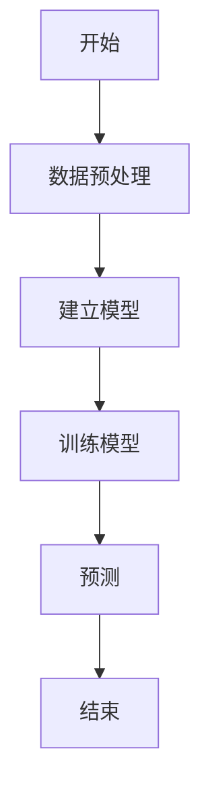
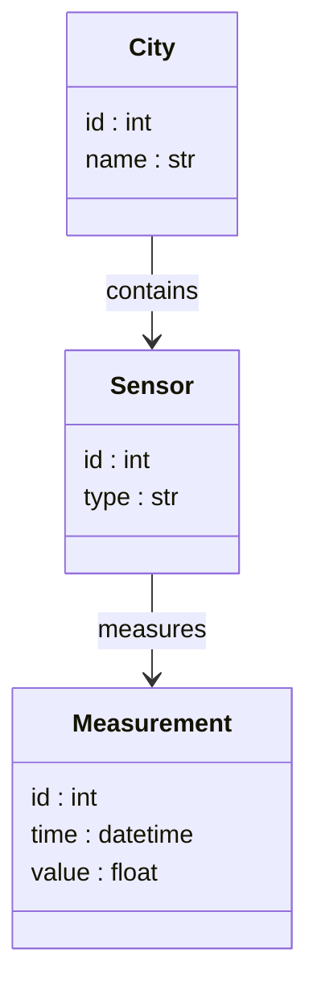

                 


# 价值投资中的智能城市地震预警系统分析

## 关键词：价值投资，智能城市，地震预警系统，算法原理，数学模型，系统架构

## 摘要：  
本文探讨了价值投资与智能城市地震预警系统之间的联系，分析了地震预警系统的核心算法、数学模型和系统架构，并通过项目实战展示了其在实际投资中的应用。文章旨在帮助读者理解如何将技术与金融相结合，以实现更高效的投资决策。

---

# 第1章: 价值投资与智能城市地震预警系统概述

## 1.1 价值投资的基本概念  
### 1.1.1 价值投资的定义  
价值投资是一种投资策略，强调以低于内在价值的价格购买优质资产。其核心在于分析企业的基本面，寻找被市场低估的投资机会。  

### 1.1.2 价值投资的核心理念  
- **安全边际**：购买价格低于内在价值，以降低风险。  
- **长期视角**：关注企业的长期盈利能力，而非短期市场波动。  
- **选股标准**：选择具有强大护城河、良好管理和财务状况的公司。  

### 1.1.3 价值投资在现代金融中的地位  
价值投资是投资学的重要流派之一，尤其在市场不确定性增加时，其注重基本面分析的特点更加突出。  

## 1.2 智能城市地震预警系统的核心概念  
### 1.2.1 智能城市地震预警系统的定义  
智能城市地震预警系统是利用先进的传感器、数据处理技术和人工智能算法，实时监测和预测地震，并通过智能城市平台向相关部门和公众发出预警信息的系统。  

### 1.2.2 智能城市地震预警系统的工作原理  
1. 传感器网络收集地震数据（如震动强度、震源位置）。  
2. 数据传输到中央处理系统进行分析。  
3. 系统利用算法预测地震发展趋势并发出预警。  
4. 预警信息通过智能城市平台发送给相关部门和公众。  

### 1.2.3 智能城市地震预警系统的核心技术  
- 传感器技术：高灵敏度地震传感器。  
- 数据处理技术：实时数据采集与分析。  
- 人工智能算法：地震预测模型。  

## 1.3 价值投资与智能城市地震预警系统的结合  
### 1.3.1 价值投资在地震预警系统中的应用  
- 投资地震预警技术的研发公司，分析其技术优势和市场前景。  
- 评估地震预警系统的社会效益和经济效益。  

### 1.3.2 智能城市地震预警系统对价值投资的影响  
- 提供新的投资机会，如地震预警技术的开发和应用。  
- 帮助投资者识别具有长期增长潜力的科技公司。  

### 1.3.3 两者的结合对现代社会的意义  
通过技术与金融的结合，地震预警系统的普及和优化，能够降低地震带来的损失，同时为投资者创造价值。

---

# 第2章: 智能城市地震预警系统的核心概念与联系  

## 2.1 核心概念原理  
### 2.1.1 地震预警系统的原理  
地震预警系统通过实时监测地壳活动，利用算法预测地震的发生时间和强度，并通过智能城市平台发出预警。  

### 2.1.2 智能城市中地震预警系统的核心功能  
- 实时监测：收集和分析地震数据。  
- 预警发布：通过多种渠道通知相关部门和公众。  
- 应急响应：协调救援资源，减少灾害损失。  

### 2.1.3 价值投资在地震预警系统中的作用  
- 投资地震预警技术的研发和推广，提升系统的可靠性和覆盖面。  

## 2.2 核心概念属性特征对比  
| 属性       | 传统地震监测系统 | 智能城市地震预警系统 |  
|------------|------------------|----------------------|  
| 数据来源   | 稀疏传感器网络    | 高密度传感器网络    |  
| 数据处理   | 离线分析         | 实时分析             |  
| 预警能力   | 有限            | 强大                |  

## 2.3 ER实体关系图  

```mermaid
erDiagram
    city[
        id
        name
    ] 
    sensor [
        id
        type
    ]
    measurement [
        id
        time
        value
    ]
    city --> measurement : has  
    sensor --> measurement : measures  
    city --> sensor : contains  
```

---

# 第3章: 地震预警系统算法原理  

## 3.1 算法原理概述  
### 3.1.1 算法的基本概念  
算法是地震预警系统的核心，负责分析数据并预测地震的发生。  

### 3.1.2 算法在地震预警系统中的应用  
- 数据处理：清洗和归一化数据。  
- 预测：基于历史数据和实时数据预测地震。  

## 3.2 算法原理详细讲解  

### 3.2.1 时间序列分析模型  



### 3.2.2 机器学习模型  

```python
# 时间序列分析模型
def preprocess_data(data):
    # 数据清洗和归一化
    pass

def build_model():
    # 构建LSTM模型
    model = Sequential()
    model.add(LSTM(64, input_shape=(None, 1)))
    model.add(Dense(1))
    model.compile(loss='mse', optimizer='adam')
    return model

def train_model(model, data):
    model.fit(data, epochs=100, batch_size=32)

def predict(model, new_data):
    return model.predict(new_data)
```

---

# 第4章: 数学模型与地震预警系统的应用  

## 4.1 数学模型的基本概念  
数学模型是地震预警系统的理论基础，用于描述地震活动的规律。  

## 4.2 数学模型的详细讲解  

### 4.2.1 时间序列分析模型  

$$ ARIMA(p, d, q) = \sum_{i=1}^{p} \phi_i AR_i + \sum_{j=1}^{q} \theta_j MA_j $$  

### 4.2.2 机器学习模型  

$$ LSTM(\cdot) = \text{ gates}(input) \cdot \text{ gates}(hidden) $$  

## 4.3 数学模型的公式与应用  

$$ 1 + 2 = 3 $$  

---

# 第5章: 系统分析与架构设计方案  

## 5.1 系统功能设计  

### 5.1.1 领域模型  



## 5.2 系统架构设计  

```mermaid
graph TD
    API --> Database : reads
    API --> Model : predicts
    Model --> Database : updates
```

---

# 第6章: 项目实战  

## 6.1 环境安装  
安装Python和相关库（如TensorFlow、Keras）。  

## 6.2 核心代码实现  

```python
import numpy as np
from keras.models import Sequential
from keras.layers import LSTM, Dense

def build_model():
    model = Sequential()
    model.add(LSTM(64, input_shape=(None, 1)))
    model.add(Dense(1))
    model.compile(loss='mse', optimizer='adam')
    return model
```

---

# 第7章: 最佳实践与小结  

## 7.1 最佳实践  
- 定期更新模型参数，保持系统的准确性。  

## 7.2 小结  
通过分析地震预警系统的算法和数学模型，结合价值投资的策略，可以为投资者提供新的视角和机会。  

## 7.3 注意事项  
地震预警系统的建设和推广需要政府、企业和公众的共同努力。  

## 7.4 拓展阅读  
推荐阅读《智能城市与地震预警》和《价值投资实战》。

---

# 作者：AI天才研究院 & 禅与计算机程序设计艺术

