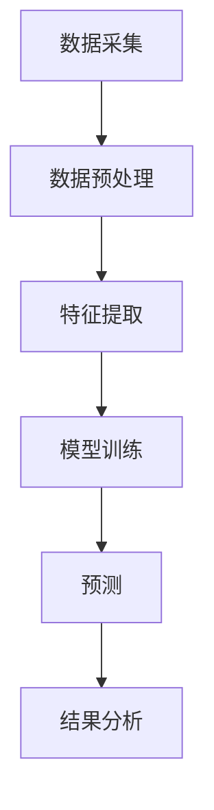
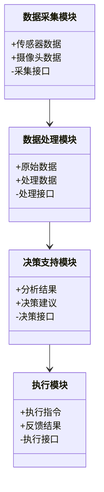
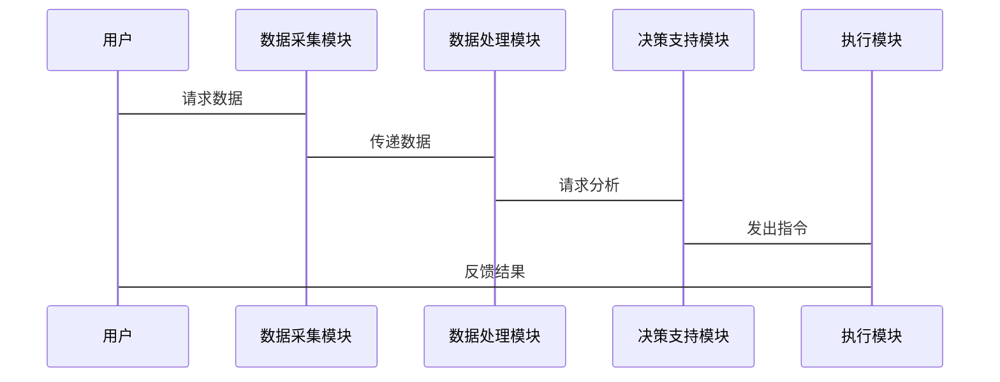

                 


# 价值投资中的智能城市应急响应系统分析

---

## 关键词：价值投资、智慧城市、应急响应系统、算法原理、系统架构

---

## 摘要

智能城市应急响应系统作为智慧城市的重要组成部分，通过实时数据采集、分析和决策支持，提升城市应对突发事件的能力。本文从价值投资的角度，分析智能城市应急响应系统的构建和优化，探讨其在投资中的潜力和挑战。通过技术与投资的结合，为投资者提供长期价值。

---

## 第一部分: 智慧城市应急响应系统概述

## 第1章: 价值投资与智慧城市应急响应系统引言

### 1.1 价值投资的核心概念

#### 1.1.1 价值投资的定义与特点

价值投资是一种长期投资策略，强调通过深入分析企业的基本面，寻找具有长期增长潜力和低估价值的企业进行投资。其核心在于寻找那些能够持续创造价值、具有竞争优势和稳定收益的公司。

#### 1.1.2 智慧城市应急响应系统的概念

智慧城市应急响应系统是指通过智能技术和数据驱动的方式，实时监测城市运行状态，预测和应对突发事件的系统。它利用物联网、大数据和人工智能等技术，优化资源配置，提高城市应对危机的能力。

#### 1.1.3 价值投资与智慧城市的结合

价值投资在智慧城市建设中具有重要意义。通过投资于高效、可靠的智能系统，投资者可以分享智慧城市发展的长期收益。智能城市应急响应系统的建设不仅提升城市管理水平，还创造了投资价值。

---

### 1.2 智慧城市应急响应系统的背景与意义

#### 1.2.1 智慧城市的发展现状

全球范围内，智慧城市建设迅速发展，涵盖交通、能源、医疗等多个领域。技术的进步推动了城市智能化，但同时也带来了新的挑战，如数据安全、系统整合等。

#### 1.2.2 应急响应系统的必要性

突发事件如自然灾害、公共卫生事件等对城市造成严重影响。传统的应急响应系统效率低下，难以应对复杂情况。智能系统的引入能够提高响应速度和准确性，减少损失。

#### 1.2.3 价值投资视角下的智慧城市发展机遇

智慧城市建设涉及大量投资，但其带来的效率提升和成本节约为投资者创造价值。应急响应系统的优化能够提升城市韧性，吸引更多投资，形成良性循环。

---

### 1.3 本章小结

本章介绍了价值投资和智慧城市应急响应系统的基本概念，探讨了两者结合的重要性。价值投资为智慧城市建设提供资金支持，而智慧应急系统则为投资者创造长期价值。

---

## 第二部分: 智慧城市应急响应系统的价值分析

## 第2章: 智慧城市应急响应系统的构成与功能

### 2.1 智慧城市应急响应系统的构成

#### 2.1.1 系统架构

智慧应急响应系统通常采用分层架构，包括数据采集层、数据处理层、决策支持层和执行层。各层协同工作，确保系统高效运行。

#### 2.1.2 核心模块

- **数据采集模块**：通过传感器、摄像头等设备实时采集城市数据。
- **数据分析模块**：利用大数据技术对数据进行处理和分析，识别潜在风险。
- **决策支持模块**：基于分析结果，生成应对方案。
- **执行模块**：将决策指令传递给相关部门和人员，启动应急响应。

#### 2.1.3 边界与外延

系统边界包括城市内部的数据源和响应机构，外延则涉及与周边城市、区域应急系统的信息共享和协同响应。

---

### 2.2 应急响应系统的功能模块

#### 2.2.1 数据采集与处理

- 数据采集：传感器、摄像头等设备实时采集城市运行数据。
- 数据处理：对采集的数据进行清洗、转换和存储，确保数据质量。

#### 2.2.2 风险评估与预警

- 风险评估：基于历史数据和实时信息，评估潜在风险。
- 预警系统：通过算法模型预测突发事件，及时发出预警。

#### 2.2.3 应急决策支持

- 数据分析：利用机器学习和统计模型，提供决策支持。
- 优化建议：根据数据结果，优化资源配置和应急流程。

#### 2.2.4 执行与反馈

- 应急执行：根据决策指令，启动应急措施。
- 反馈机制：收集执行效果，调整和优化决策。

---

### 2.3 本章小结

本章详细介绍了智慧应急响应系统的构成和功能模块，强调了各部分协同工作的必要性。系统的高效运行依赖于数据采集、分析和决策的无缝衔接。

---

## 第三部分: 智慧城市应急响应系统的算法与数学模型

## 第3章: 应急响应系统的算法原理

### 3.1 数据分析与预测算法

#### 3.1.1 时间序列分析

时间序列分析用于预测未来的数据点。ARIMA模型是常用的工具之一，适用于非平稳数据的预测。

##### ARIMA模型公式
$$ ARIMA(p, d, q) $$
其中，p为自回归阶数，d为差分阶数，q为移动平均阶数。

##### 示例
假设某城市交通事故数据经过差分后变为平稳，ARIMA模型能够预测未来事故数量，帮助制定应急计划。

#### 3.1.2 机器学习在应急响应中的应用

- **监督学习**：用于分类和回归问题，如预测事故类型和严重程度。
- **无监督学习**：用于聚类分析，发现数据中的异常模式。
- **深度学习**：用于复杂模式识别，如图像识别和语音识别。

#### 3.1.3 算法流程图（Mermaid）



### 3.2 系统优化与决策算法

#### 3.2.1 线性规划模型

线性规划用于优化资源配置，如应急资源的分配问题。

##### 线性规划公式
$$ \text{Maximize } z = c_1x_1 + c_2x_2 + \dots + c_nx_n $$
$$ \text{Subject to } a_1x_1 + a_2x_2 + \dots + a_nx_n \leq b $$
$$ x_i \geq 0 $$

#### 3.2.2 非线性规划模型

非线性规划适用于复杂约束条件下的优化问题。

##### 示例
某城市在应对地震时，需优化救援队伍和物资的分配。非线性规划模型考虑交通、人口密度等因素，找到最优解。

#### 3.2.3 算法实现代码示例

```python
import numpy as np
from scipy.optimize import minimize

# 定义目标函数
def objective(x):
    return np.sum(x)

# 定义约束条件
def constraint1(x):
    return np.sum(x) - 10 >= 0

# 初始猜测
x0 = np.zeros(5)

# 求解
result = minimize(objective, x0, constraints={'type': 'ineq', 'fun': constraint1})

# 输出结果
print(result.x)
```

### 3.3 数学模型与公式

#### 3.3.1 时间序列模型：ARIMA

$$ ARIMA(p, d, q) $$
其中，p为自回归参数，d为差分次数，q为移动平均参数。

#### 3.3.2 优化模型：线性规划公式

$$ \text{Minimize } \sum_{i=1}^{n} c_i x_i $$
$$ \text{Subject to } \sum_{i=1}^{n} a_i x_i \leq b $$

#### 3.3.3 示例：应急资源分配优化

某城市需分配救援队伍到不同区域，目标是最小化总成本，同时满足每个区域的需求。

### 3.4 本章小结

本章介绍了时间序列分析和机器学习在应急响应中的应用，详细讲解了线性规划和非线性规划模型。算法的应用能够提高系统的预测和决策能力，为投资者创造价值。

---

## 第四部分: 智慧城市应急响应系统的系统分析与架构设计

## 第4章: 系统分析与架构设计

### 4.1 问题场景介绍

假设某城市面临频繁的自然灾害，需要建立一个智能应急响应系统，整合多个部门的数据，实现快速响应。

### 4.2 系统功能设计

#### 4.2.1 领域模型（Mermaid类图）



### 4.3 系统架构设计（Mermaid架构图）

```mermaid
archi
    网络层 --> 数据采集模块
    数据采集模块 --> 数据处理模块
    数据处理模块 --> 决策支持模块
    决策支持模块 --> 执行模块
    执行模块 --> 用户界面
```

### 4.4 系统接口设计

#### 4.4.1 数据接口

- 数据采集接口：接收传感器和摄像头的数据。
- 数据处理接口：处理数据并传递给决策模块。

#### 4.4.2 用户接口

- Web界面：供用户查看实时数据和决策建议。
- API接口：供其他系统调用数据和功能。

### 4.5 系统交互（Mermaid序列图）



### 4.6 本章小结

本章通过系统分析和架构设计，展示了智慧应急响应系统的整体结构。各模块协同工作，确保系统的高效运行。

---

## 第五部分: 项目实战

## 第5章: 项目实战

### 5.1 环境安装

#### 5.1.1 安装Python和相关库

```bash
pip install numpy pandas scikit-learn mermaid4jupyter
```

#### 5.1.2 安装Jupyter Notebook

```bash
pip install jupyter
```

### 5.2 系统核心实现源代码

#### 5.2.1 数据采集模块

```python
import pandas as pd
import numpy as np

# 读取传感器数据
data = pd.read_csv('sensor_data.csv')
print(data.head())
```

#### 5.2.2 数据分析模块

```python
from sklearn.linear_model import LinearRegression

# 训练线性回归模型
model = LinearRegression()
model.fit(X_train, y_train)
```

#### 5.2.3 决策支持模块

```python
from sklearn.ensemble import RandomForestClassifier

# 训练随机森林分类器
model = RandomForestClassifier()
model.fit(X_train, y_train)
```

### 5.3 案例分析

#### 5.3.1 案例背景

某城市发生地震，系统启动应急响应，协调救援队伍和医疗资源。

#### 5.3.2 数据分析与决策

系统通过分析地震影响区域和救援资源分布，优化救援路径和资源分配。

#### 5.3.3 系统执行

根据决策结果，系统发出指令，启动应急措施，协调各部门行动。

### 5.4 项目小结

本章通过实际项目展示系统的实现过程，从环境搭建到代码实现，再到案例分析，详细说明了智慧应急响应系统的应用场景和价值。

---

## 第六部分: 最佳实践与总结

## 第6章: 最佳实践与总结

### 6.1 小结

智慧城市应急响应系统的建设需要技术与投资的结合。通过价值投资视角，分析系统的构建和优化，能够为投资者创造长期价值。

### 6.2 注意事项

- 数据隐私和安全是系统建设的重要考虑因素。
- 系统的实时性和准确性直接影响应急响应的效果。
- 需要考虑系统的可扩展性和灵活性，以应对未来的发展需求。

### 6.3 拓展阅读

- 《智慧城市：大数据与云计算的应用》
- 《应急响应系统的算法优化》
- 《价值投资在科技领域的实践》

---

## 结语

智慧城市应急响应系统的建设不仅是技术的挑战，也是投资的机遇。通过价值投资的视角，我们能够更好地理解系统的建设和优化，为投资者提供长期价值。未来，随着技术的发展，智慧应急响应系统将更加智能化和高效，为智慧城市建设注入更多活力。

---

## 作者：AI天才研究院 & 禅与计算机程序设计艺术

---

# 结束语

感谢您的阅读！如需进一步探讨或获取更多内容，请随时联系。

