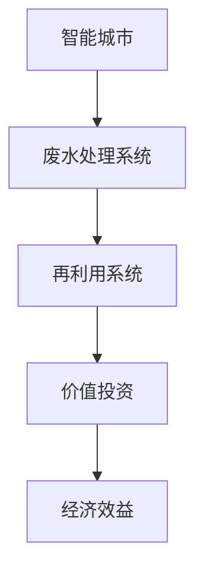
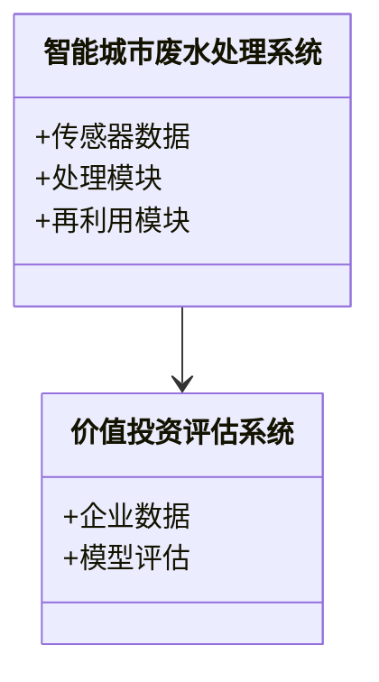
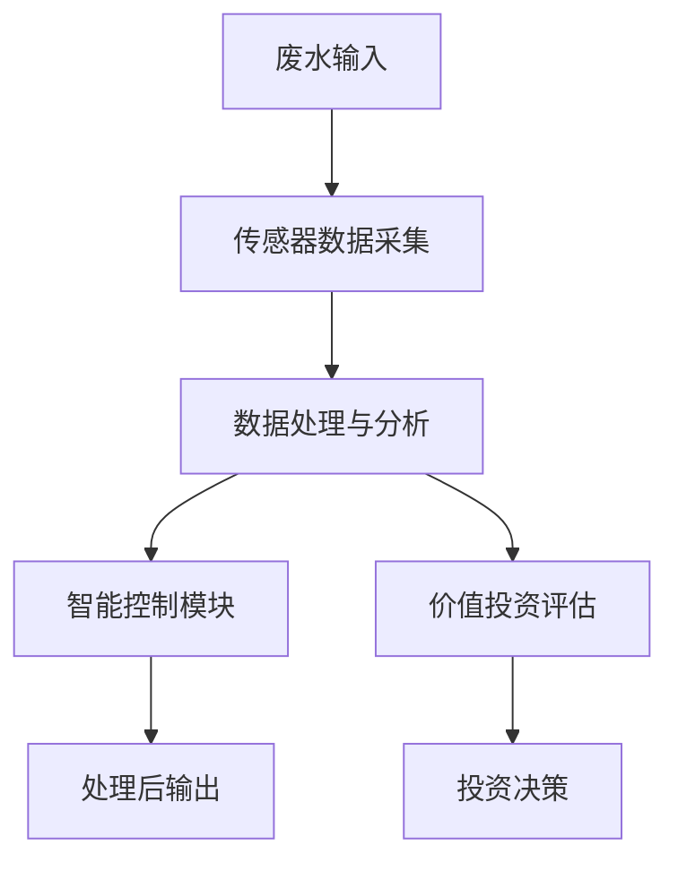
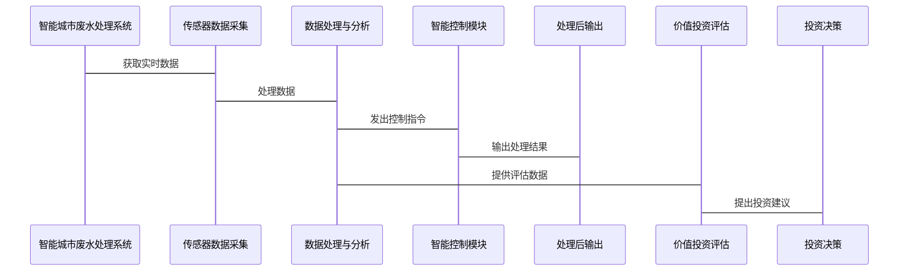

                 


# 价值投资中的智能城市废水处理与再利用系统分析

## 关键词：智能城市，废水处理，价值投资，再利用，系统架构

## 摘要：  
本文分析了智能城市废水处理与再利用系统的价值投资潜力，探讨了该系统的核心概念、算法原理、系统架构及实际应用。通过对废水处理与再利用的技术创新和经济效益的分析，揭示了其在智慧城市建设中的重要地位及投资价值。本文旨在为投资者和技术创新者提供理论支持和实践指导。

---

## 第一部分: 背景介绍

### 第1章: 价值投资与智能城市废水处理的背景

#### 1.1 问题背景
##### 1.1.1 智慧城市建设的现状与挑战
智慧城市建设已成为全球城市发展的趋势，废水处理与再利用是智慧城市建设的重要组成部分。随着城市化进程的加快，水资源短缺问题日益严重，废水处理与再利用不仅是环保的需要，也是城市可持续发展的重要保障。

##### 1.1.2 废水处理与再利用的必要性
废水处理与再利用可以减少水资源的消耗，缓解水资源短缺问题，同时减少环境污染。通过智能技术的应用，废水处理系统可以实现更高的处理效率和更低的运营成本。

##### 1.1.3 价值投资在环保产业中的潜力
环保产业是全球经济增长的新引擎，废水处理与再利用作为环保产业的重要领域，具有巨大的市场潜力。价值投资可以通过对技术创新和市场前景的分析，找到具有长期投资价值的企业和项目。

#### 1.2 问题描述
##### 1.2.1 智能城市废水处理与再利用的定义
智能城市废水处理与再利用系统是指利用人工智能、物联网等技术，对城市废水进行高效处理和资源化利用的系统。

##### 1.2.2 智能城市废水处理系统的特点
- 高效性：通过智能技术实现自动化处理和优化控制。  
- 资源化：将处理后的废水用于工业、农业或生活用水，实现水资源的循环利用。  
- 可持续性：减少对环境的污染，促进城市可持续发展。

##### 1.2.3 价值投资在废水处理产业中的目标
价值投资者通过分析废水处理企业的技术优势、市场前景和财务状况，寻找具有长期竞争优势和稳定收益的企业进行投资。

#### 1.3 问题解决
##### 1.3.1 智能城市废水处理的核心技术
- 智能传感器：实时监测废水水质参数。  
- 数据分析：利用机器学习算法优化处理流程。  
- 自动化控制：实现废水处理系统的智能化运行。

##### 1.3.2 价值投资在废水处理项目中的策略
- 技术评估：选择具有技术创新能力的企业。  
- 市场分析：关注政策支持和市场需求。  
- 财务评估：分析企业的盈利能力和发展潜力。

##### 1.3.3 废水处理与再利用的经济效益分析
通过减少水资源消耗和降低处理成本，废水处理与再利用可以为城市和企业带来显著的经济效益。

#### 1.4 边界与外延
##### 1.4.1 智能城市废水处理系统的边界
- 输入：城市废水。  
- 输出：处理后的水资源。  
- 边界条件：技术、政策、市场等因素。

##### 1.4.2 废水处理与再利用的外延领域
- 工业废水处理：适用于制造业、化工等行业。  
- 农业废水处理：适用于农业灌溉和农村污水处理。  
- 生活废水处理：适用于居民区和公共建筑的污水处理。

##### 1.4.3 价值投资的适用范围与限制
- 适用范围：环保技术企业、污水处理项目。  
- 限制：技术风险、政策变化、市场波动等。

#### 1.5 概念结构与核心要素组成
##### 1.5.1 智能城市废水处理系统的组成
- 数据采集模块：传感器和数据采集设备。  
- 数据分析模块：机器学习算法和数据处理系统。  
- 自动化控制模块：智能阀门和水泵等设备。

##### 1.5.2 价值投资的核心要素
- 投资标的企业：具有技术创新能力和市场竞争力的企业。  
- 投资策略：长期价值导向，关注企业基本面和行业前景。  
- 风险管理：分散投资风险，控制投资组合波动。

##### 1.5.3 两者结合的系统架构
通过将智能城市废水处理技术与价值投资策略相结合，构建一个高效、可持续的废水处理与再利用系统，实现技术和经济的双重目标。

---

## 第二部分: 核心概念与联系

### 第2章: 智能城市废水处理与再利用系统的核心概念

#### 2.1 核心概念原理
##### 2.1.1 智能城市废水处理的原理
通过传感器、物联网和机器学习等技术，实时监测和优化废水处理过程，提高处理效率和资源利用率。

##### 2.1.2 废水再利用的技术特点
- 资源化：将处理后的废水用于工业、农业或生活用水。  
- 循环化：实现水资源的循环利用，减少对外部水资源的依赖。  
- 环保性：减少废水排放对环境的污染。

##### 2.1.3 价值投资的评估方法
- 技术评估：分析企业的技术创新能力和专利情况。  
- 市场评估：研究行业的市场需求和竞争格局。  
- 财务评估：分析企业的盈利能力、现金流和财务健康状况。

#### 2.2 核心概念属性特征对比
##### 2.2.1 智能城市废水处理系统与传统处理系统的对比

| 特性                | 智能城市废水处理系统 | 传统处理系统 |
|---------------------|----------------------|--------------|
| 自动化程度          | 高                   | 低           |
| 处理效率            | 高                   | 中           |
| 资源利用率          | 高                   | 低           |
| 运维成本            | 低                   | 高           |
| 技术复杂度          | 高                   | 中           |

##### 2.2.2 价值投资与传统投资的对比

| 特性                | 价值投资             | 传统投资      |
|---------------------|----------------------|--------------|
| 投资目标            | 长期价值             | 短期收益      |
| 投资策略            | 选择优质企业         | 追逐市场热点   |
| 风险承受能力        | 较高                 | 较低          |
| 投资期限            | 长期                 | 短期          |

##### 2.2.3 废水处理技术的经济效益分析
通过技术创新和资源化利用，智能城市废水处理系统可以显著降低运营成本，提高资源利用率，从而为企业和城市创造更大的经济效益。

#### 2.3 ER实体关系图



---

## 第三部分: 算法原理讲解

### 第3章: 价值投资分析算法

#### 3.1 算法流程
##### 3.1.1 数据收集与处理
收集废水处理企业的财务数据、技术数据和市场数据，进行清洗和预处理。

##### 3.1.2 模型构建与训练
利用机器学习算法，构建企业价值评估模型，对企业的盈利能力、成长能力和风险水平进行量化评估。

##### 3.1.3 结果分析与优化
根据模型评估结果，筛选出具有投资价值的企业，优化投资组合，降低投资风险。

#### 3.2 算法实现
##### 3.2.1 数据预处理
```python
import pandas as pd
data = pd.read_csv('waste_water_company.csv')
data.dropna(inplace=True)
```

##### 3.2.2 模型训练
```python
from sklearn.linear_model import LinearRegression
model = LinearRegression()
model.fit(data[['revenue', 'profit_margin']], data['valuation'])
```

##### 3.2.3 结果可视化
```python
import matplotlib.pyplot as plt
plt.scatter(data['valuation'], data['prediction'])
plt.xlabel('Actual Valuation')
plt.ylabel('Predicted Valuation')
plt.show()
```

#### 3.3 算法代码实现
##### 3.3.1 数据预处理
```python
import pandas as pd
import numpy as np

data = pd.read_csv('waste_water_company.csv')
data = data.dropna()
data['log_revenue'] = np.log(data['revenue'])
```

##### 3.3.2 模型训练
```python
from sklearn.ensemble import RandomForestRegressor
model = RandomForestRegressor(n_estimators=100)
model.fit(data[['log_revenue', 'profit_margin']], data['valuation'])
```

##### 3.3.3 结果可视化
```python
importances = model.feature_importances_
plt.bar(data.columns, importances)
plt.xticks(rotation=45)
plt.show()
```

#### 3.4 数学模型
##### 3.4.1 净现值（NPV）计算
$$ \text{NPV} = \sum_{t=0}^{n} \frac{\text{现金流}}{(1 + r)^t} $$
其中，\( r \) 为折现率，\( t \) 为时间。

##### 3.4.2 内部收益率（IRR）计算
$$ \text{IRR} = \text{使净现值为零的折现率} $$

##### 3.4.3 投资回报率（ROI）计算
$$ \text{ROI} = \frac{\text{净收益}}{\text{初始投资}} \times 100\% $$

---

## 第四部分: 系统分析与架构设计

### 第4章: 系统分析与架构设计

#### 4.1 问题场景介绍
智能城市废水处理与再利用系统需要解决废水处理效率低、资源利用率低、运营成本高等问题。

#### 4.2 项目介绍
##### 4.2.1 项目目标
实现废水处理的智能化、自动化和资源化利用，降低运营成本，提高水资源利用率。

##### 4.2.2 项目范围
覆盖城市居民区、工业区和农业区，实现废水的分类处理和资源化利用。

#### 4.3 系统功能设计
##### 4.3.1 领域模型


##### 4.3.2 系统架构


##### 4.3.3 系统接口设计
- 数据接口：传感器数据输入和输出接口。  
- 控制接口：智能控制模块的控制指令接口。  
- 评估接口：价值投资评估系统的数据接口。

##### 4.3.4 系统交互


---

## 第五部分: 项目实战

### 第5章: 项目实战

#### 5.1 环境安装
##### 5.1.1 安装Python
```bash
python --version
pip install --upgrade pip
```

##### 5.1.2 安装依赖
```bash
pip install numpy pandas scikit-learn matplotlib
```

#### 5.2 系统核心实现
##### 5.2.1 数据预处理
```python
import pandas as pd
data = pd.read_csv('waste_water_company.csv')
data = data.dropna()
```

##### 5.2.2 模型训练
```python
from sklearn.ensemble import RandomForestRegressor
model = RandomForestRegressor(n_estimators=100)
model.fit(data[['revenue', 'profit_margin']], data['valuation'])
```

##### 5.2.3 结果分析
```python
importances = model.feature_importances_
plt.bar(data.columns, importances)
plt.xticks(rotation=45)
plt.show()
```

#### 5.3 案例分析
##### 5.3.1 案例介绍
分析一家废水处理企业的财务数据和技术数据，评估其投资价值。

##### 5.3.2 模型评估
计算企业的净现值、内部收益率和投资回报率，评估其投资可行性。

##### 5.3.3 实际应用
将模型应用于实际投资决策中，指导投资者选择具有长期价值的企业。

#### 5.4 项目小结
通过项目实战，验证了智能城市废水处理与再利用系统的可行性和价值投资的潜力。

---

## 第六部分: 总结与展望

### 第6章: 总结与展望

#### 6.1 总结
智能城市废水处理与再利用系统是智慧城市建设的重要组成部分，具有巨大的市场潜力和投资价值。通过技术创新和价值投资的结合，可以实现技术和经济的双重目标。

#### 6.2 价值投资策略
投资者应关注具有技术创新能力和市场竞争力的企业，长期持有优质资产，分享行业发展的成果。

#### 6.3 未来展望
随着人工智能和物联网技术的不断发展，智能城市废水处理与再利用系统将更加高效和智能化，为城市可持续发展提供更强有力的支持。

---

## 附录

### 附录1: 工具安装指南
#### 1. 安装Python
```bash
python --version
pip install --upgrade pip
```

#### 2. 安装依赖
```bash
pip install numpy pandas scikit-learn matplotlib
```

### 附录2: 相关数据集
#### 废水处理企业数据集
- 数据来源：公开上市公司财务数据和专利数据。
- 数据格式：CSV文件。
- 数据字段：收入、利润 margin、估值等。

---

## 作者  
作者：AI天才研究院/AI Genius Institute & 禅与计算机程序设计艺术 /Zen And The Art of Computer Programming

