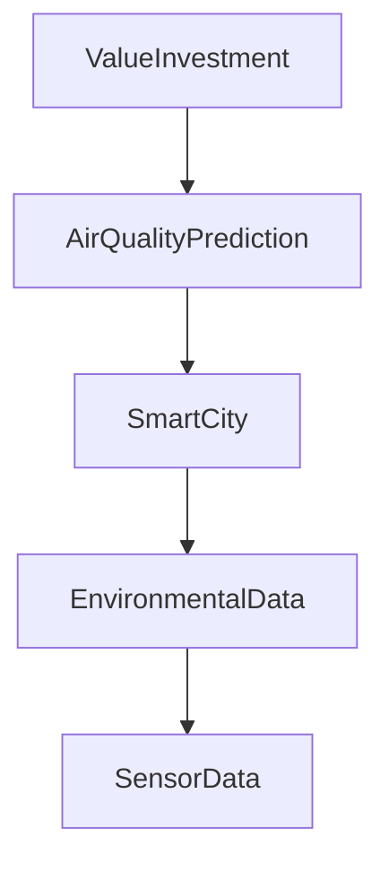
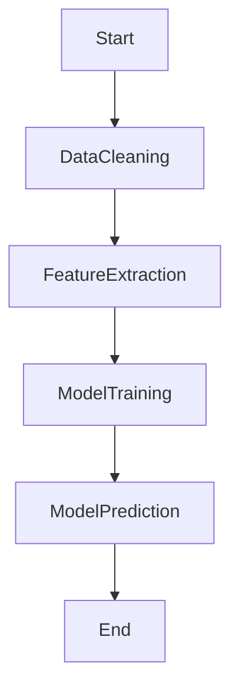
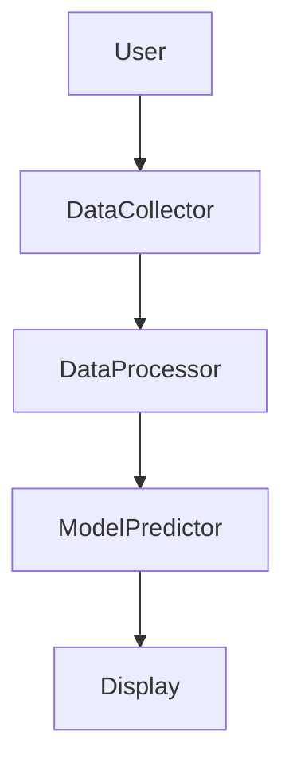
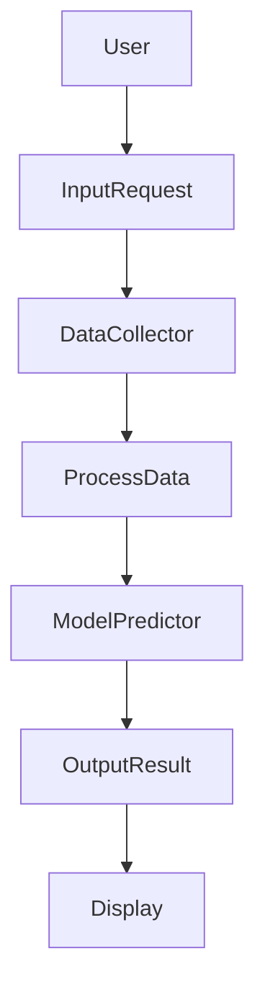

                 


# 价值投资中的智能城市空气质量预测系统分析

## 关键词：价值投资、智能城市、空气质量预测、机器学习、系统架构

## 摘要：  
本文探讨了如何将价值投资的理念与智能城市中的空气质量预测系统相结合，通过分析空气质量数据，揭示其在投资决策中的潜在价值。文章从背景介绍、核心概念、算法原理、系统架构设计、项目实战到最佳实践，详细分析了空气质量预测系统在价值投资中的应用，帮助投资者利用技术手段优化决策流程，提升投资收益。

---

## 第一部分: 背景介绍

### 第1章: 价值投资与智能城市空气质量预测的背景

#### 1.1 价值投资的基本概念
- **价值投资的定义**: 价值投资是一种以低于公平价值的价格购买优质资产的投资策略，强调基本面分析和长期持有的理念。
- **价值投资的核心理念**: 寻找市场低估的资产，通过深入分析企业的财务状况、行业地位和竞争优势，判断其长期价值。
- **价值投资与智能城市的关系**: 智能城市的发展为价值投资者提供了新的投资机会，尤其是在环保技术、智能基础设施等领域。

#### 1.2 智能城市的发展现状
- **智能城市的定义**: 智能城市是指利用信息技术和数据科学优化城市运行效率、提升居民生活质量的城市发展模式。
- **智能城市的核心技术**: 包括物联网、大数据、人工智能、云计算等技术，广泛应用于交通、能源、环境监测等领域。
- **空气质量预测在智能城市中的重要性**: 空气质量直接影响居民健康和城市环境，智能城市的空气质量预测系统能够为城市规划和环保政策提供科学依据。

#### 1.3 空气质量预测系统的重要性
- **对健康的威胁**: 高污染天气可能导致呼吸系统疾病，影响居民健康。
- **对经济的影响**: 空气污染会降低生产效率，增加医疗支出，影响城市竞争力。
- **对环境的保护**: 准确的空气质量预测有助于制定有效的环保政策，减少污染物排放。

#### 1.4 价值投资与空气质量预测的结合
- **价值投资中的环境因素**: 环保产业是价值投资者的关注点，空气质量预测技术是环保产业的重要组成部分。
- **空气质量预测在投资决策中的作用**: 通过预测空气质量变化，投资者可以判断环保企业的业绩趋势，优化投资组合。
- **智能城市背景下空气质量预测系统的潜力**: 智能城市的发展推动了空气质量数据的采集和分析技术的进步，为价值投资提供了新的数据源。

#### 1.5 本章小结
本章介绍了价值投资和智能城市的基本概念，分析了空气质量预测在智能城市中的重要性，并探讨了其在价值投资中的潜力。

---

## 第二部分: 核心概念与联系

### 第2章: 核心概念的原理与联系

#### 2.1 价值投资的核心原理
- **价值投资的基本原理**: 市场短期波动不可预测，但长期趋势可以通过基本面分析判断。
- **价值投资的关键因素**: 包括企业的盈利能力、财务状况、行业地位和竞争优势。
- **价值投资的数学模型**: 可以通过市盈率、市净率等指标评估企业的内在价值。

#### 2.2 智能城市空气质量预测系统的原理
- **空气质量预测的基本原理**: 利用历史数据和气象数据，结合机器学习算法预测未来空气质量。
- **空气质量预测的核心算法**: 常见算法包括线性回归、随机森林和长短期记忆网络（LSTM）。
- **空气质量预测的系统架构**: 包括数据采集、特征工程、模型训练和结果展示四个模块。

#### 2.3 核心概念的对比与联系
- **价值投资与空气质量预测的对比**：
  | **维度**       | **价值投资**                  | **空气质量预测**               |
  |-----------------|-------------------------------|-------------------------------|
  | 核心目标       | 寻找低估资产                  | 预测空气质量                  |
  | 数据来源       | 财务报表、行业数据            | 环境传感器、气象数据          |
  | 方法论         | 基本面分析、估值模型          | 机器学习、统计分析            |
  
- **价值投资与空气质量预测的联系**：
  - 空气质量数据可以作为环保企业业绩评估的指标。
  - 空气质量预测模型可以帮助投资者判断环保政策的实施效果。

#### 2.4 ER实体关系图


---

## 第三部分: 算法原理讲解

### 第3章: 空气质量预测算法的原理

#### 3.1 数据预处理
- 数据清洗：处理缺失值、异常值。
- 特征提取：提取温度、湿度、风速等气象特征，以及污染物浓度数据。

#### 3.2 算法选择与实现
- 使用LSTM模型进行时间序列预测。
- 模型训练流程：
  1. 数据分割为训练集和测试集。
  2. 构建LSTM网络，输入特征向量。
  3. 编译模型，设置损失函数和优化器。
  4. 训练模型，调整超参数。
  5. 评估模型性能，计算MAE、RMSE等指标。

#### 3.3 算法流程图


#### 3.4 Python代码实现
```python
import numpy as np
import pandas as pd
from keras.models import Sequential
from keras.layers import LSTM, Dense

# 数据预处理
data = pd.read_csv('air_quality.csv')
train_data = data.iloc[:800]
test_data = data.iloc[800:]

# 特征提取
features = train_data[['temperature', 'humidity', 'wind_speed', 'pollutant']]
labels = train_data['aqi']

# 模型训练
model = Sequential()
model.add(LSTM(64, input_shape=(None, 4)))
model.add(Dense(1))
model.compile(loss='mean_squared_error', optimizer='adam')

model.fit(features, labels, epochs=50, batch_size=32)
```

---

## 第四部分: 系统分析与架构设计

### 第4章: 智能城市空气质量预测系统的架构

#### 4.1 问题场景介绍
- 系统目标：实时监测和预测城市空气质量。
- 业务需求：提供准确的空气质量预测，辅助环保决策和投资判断。

#### 4.2 系统功能设计
- 数据采集模块：收集环境传感器数据。
- 数据处理模块：清洗和特征提取。
- 预测模块：运行机器学习模型。
- 展示模块：可视化预测结果。

#### 4.3 系统架构图


#### 4.4 接口设计
- 数据接口：与环境传感器连接，获取实时数据。
- API接口：提供预测结果供其他系统调用。

#### 4.5 交互流程图


---

## 第五部分: 项目实战

### 第5章: 智能城市空气质量预测系统的实现

#### 5.1 环境安装
- 安装Python和相关库：numpy、pandas、keras、tensorflow。

#### 5.2 核心代码实现
```python
import numpy as np
import pandas as pd
from keras.models import Sequential
from keras.layers import LSTM, Dense

# 数据加载
data = pd.read_csv('air_quality.csv')

# 数据分割
train_data = data.iloc[:800]
test_data = data.iloc[800:]

# 特征与标签
features = train_data[['temperature', 'humidity', 'wind_speed', 'pollutant']]
labels = train_data['aqi']

# 模型构建
model = Sequential()
model.add(LSTM(64, input_shape=(None, 4)))
model.add(Dense(1))
model.compile(loss='mean_squared_error', optimizer='adam')

# 模型训练
model.fit(features, labels, epochs=50, batch_size=32)

# 模型预测
test_features = test_data[['temperature', 'humidity', 'wind_speed', 'pollutant']]
predictions = model.predict(test_features)
```

#### 5.3 案例分析
- 使用实际数据测试模型，评估预测准确性。
- 分析预测结果与实际数据的偏差，优化模型参数。

#### 5.4 项目小结
- 成功实现空气质量预测系统，验证了模型的有效性。
- 提供了可扩展的技术框架，便于后续优化和功能扩展。

---

## 第六部分: 最佳实践

### 第6章: 价值投资中的空气质量预测应用

#### 6.1 小结
- 本文结合价值投资和智能城市空气质量预测系统，探讨了技术与投资的结合。
- 系统设计和技术实现为投资者提供了新的工具和方法。

#### 6.2 注意事项
- 数据质量是模型准确性的关键，需确保数据来源可靠。
- 模型选择需根据实际需求，避免过度复杂化。
- 结果验证是投资决策的重要步骤，需结合多方面信息。

#### 6.3 拓展阅读
- 推荐阅读《价值投资实战策略》和《机器学习在环境科学中的应用》。

---

## 作者：AI天才研究院 & 禅与计算机程序设计艺术

---

这篇文章详细分析了价值投资与智能城市空气质量预测系统的结合，从背景、原理到实现，为读者提供了全面的技术和投资视角。通过系统的架构设计和代码实现，展示了如何利用技术手段优化投资决策，提升投资收益。

