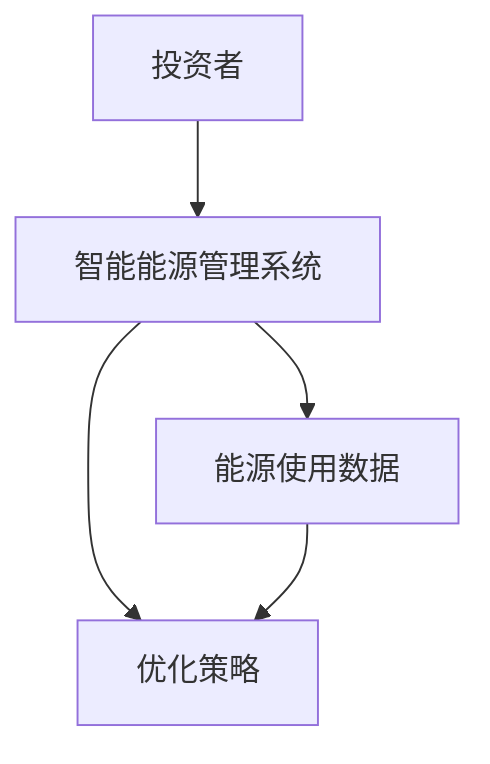
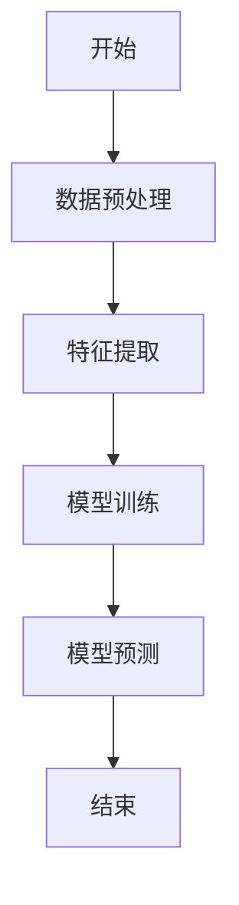
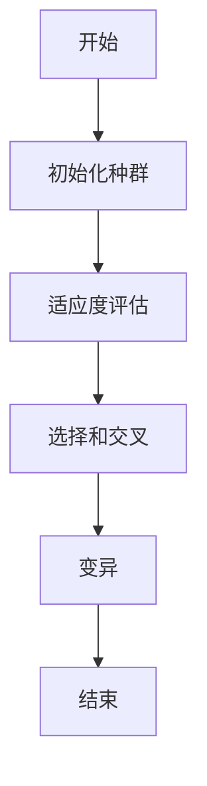
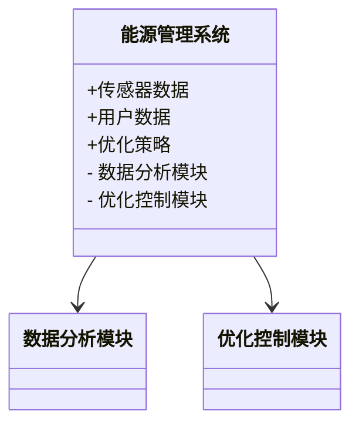
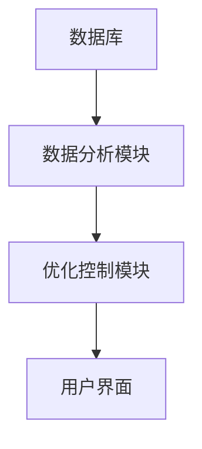
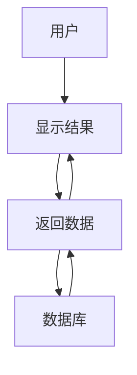

                 


# 价值投资中的智能城市能源管理系统分析

## 关键词
智能城市能源管理系统, 价值投资, 数据分析, 优化算法, 系统架构

## 摘要
随着城市化进程的加快和能源需求的增加，智能城市能源管理系统在优化能源使用效率和降低运营成本方面发挥着重要作用。本文通过分析智能城市能源管理系统的构建和优化，探讨其在价值投资中的应用。文章详细介绍了系统的背景、核心概念、算法原理、系统架构，并通过项目实战和最佳实践，为投资者提供数据支持，帮助其做出更明智的投资决策。

---

# 第1章 背景介绍

## 1.1 智慧城市能源管理系统的概念

### 1.1.1 智慧城市的基本概念
智慧城市建设以信息技术为核心，旨在提高城市运行效率和居民生活质量。能源管理系统是智慧城市建设的重要组成部分，通过智能化技术实现能源的高效管理和优化分配。

### 1.1.2 能源管理系统的核心功能
能源管理系统包括数据采集、数据分析、优化控制等功能。系统通过传感器和物联网技术实时采集能源使用数据，利用数据分析技术优化能源分配，减少浪费。

### 1.1.3 智慧城市能源管理系统的演进
随着技术的进步，智慧能源管理系统从简单的数据采集逐步发展为基于人工智能的智能优化系统，能够根据实时数据动态调整能源分配策略。

## 1.2 价值投资的基本概念

### 1.2.1 价值投资的定义
价值投资是一种长期投资策略，通过分析资产的内在价值，选择被市场低估的投资标的进行投资。

### 1.2.2 价值投资的核心理念
价值投资强调基本面分析，关注企业的财务状况、行业地位和成长潜力，寻找具有长期投资价值的资产。

### 1.2.3 价值投资与智慧城市的结合点
智慧城市建设涉及大量基础设施投资，价值投资者可以通过分析智慧城市相关产业的市场前景和财务指标，寻找具有长期投资价值的项目。

## 1.3 智慧城市能源管理系统与价值投资的结合

### 1.3.1 智慧城市能源管理系统的投资价值
智能能源管理系统能够提高能源使用效率，降低运营成本，具有较高的市场应用价值和投资回报潜力。

### 1.3.2 价值投资在智慧能源管理中的应用
通过分析能源管理系统的市场前景和运营数据，价值投资者可以识别出具有长期增长潜力的项目。

### 1.3.3 智慧城市能源管理系统的投资机会
智能能源管理系统在智慧城市建设中的广泛应用为投资者提供了丰富的投资机会，特别是在技术创新和市场拓展方面。

## 1.4 本章小结
本章介绍了智慧城市能源管理系统的概念、核心功能及其与价值投资的结合。通过分析两者的结合点，为后续章节的深入探讨奠定了基础。

---

# 第2章 核心概念与联系

## 2.1 智慧城市能源管理系统的原理

### 2.1.1 数据采集与传输
系统通过传感器和物联网技术实时采集能源使用数据，并通过通信网络传输到中央控制系统。

### 2.1.2 数据分析与处理
利用大数据分析技术，对采集到的数据进行清洗、建模和分析，识别能源使用中的异常情况和优化机会。

### 2.1.3 优化控制与反馈
基于分析结果，系统动态调整能源分配策略，并通过反馈机制优化控制过程。

## 2.2 价值投资的核心原理

### 2.2.1 资产评估与定价
价值投资者通过分析企业的财务状况和市场地位，评估其内在价值，并与市场价格进行比较。

### 2.2.2 投资组合优化
通过优化投资组合，分散风险，提高投资回报率。

### 2.2.3 风险管理与控制
价值投资者通过分析市场风险和企业特有风险，制定风险管理策略，降低投资风险。

## 2.3 智慧城市能源管理系统与价值投资的关联

### 2.3.1 数据驱动的投资决策
智能能源管理系统提供实时数据支持，帮助投资者做出更准确的投资决策。

### 2.3.2 能源管理系统对投资价值的影响
高效的能源管理系统能够降低运营成本，提高企业盈利能力，从而提升其市场价值。

### 2.3.3 价值投资在能源管理中的应用案例
通过分析智能能源管理系统的市场前景和财务数据，投资者可以识别出具有长期增长潜力的项目。

## 2.4 核心概念对比表

| 智慧城市能源管理系统 | 价值投资 |
|----------------------|----------|
| 数据采集与传输      | 资产评估 |
| 数据分析与处理      | 投资组合优化 |
| 优化控制与反馈      | 风险管理与控制 |

## 2.5 实体关系图



---

# 第3章 算法原理

## 3.1 数据分析算法

### 3.1.1 时间序列分析
时间序列分析用于预测能源使用趋势，帮助投资者制定长期投资策略。

### 3.1.2 机器学习算法
利用机器学习算法对能源数据进行分类、聚类和预测，识别能源使用中的异常情况。

### 3.1.3 算法流程图



## 3.2 优化算法

### 3.2.1 线性规划
线性规划用于优化能源分配策略，降低运营成本。

### 3.2.2 遗传算法
遗传算法用于寻找最优的能源分配方案，提高能源使用效率。

### 3.2.3 算法流程图



## 3.3 算法实现代码

### 3.3.1 数据分析代码

```python
import pandas as pd
import numpy as np

# 数据预处理
data = pd.read_csv('energy_data.csv')
data = data.dropna()
data = data.drop_duplicates()

# 特征提取
features = data[['time', 'energy_usage', 'temperature']]
target = data['energy_usage']

# 模型训练
from sklearn.linear_model import LinearRegression
model = LinearRegression()
model.fit(features, target)

# 模型预测
predicted = model.predict(features)
```

### 3.3.2 优化算法代码

```python
import numpy as np

def fitness(population):
    # 计算适应度
    pass

def evolve(population, mutation_rate):
    # 选择和交叉
    pass
    # 变异
    pass

# 初始化种群
population = np.random.rand(100, 2)
evolve(population, 0.1)
```

## 3.4 数学模型与公式

### 3.4.1 数据分析模型
$$ y = \beta_0 + \beta_1x_1 + \beta_2x_2 + \epsilon $$

### 3.4.2 优化模型
$$ \min \sum_{i=1}^{n} (x_i - \hat{x}_i)^2 $$

---

# 第4章 系统分析与架构设计

## 4.1 系统应用场景

### 4.1.1 智慧能源管理系统的应用场景
智能能源管理系统广泛应用于城市电网、热网和燃气网等领域，帮助城市优化能源使用。

## 4.2 系统功能设计

### 4.2.1 领域模型



### 4.2.2 系统架构



## 4.3 系统接口设计

### 4.3.1 接口设计
系统提供API接口，允许第三方应用程序访问能源数据和优化策略。

### 4.3.2 交互流程图



---

# 第5章 项目实战

## 5.1 环境安装

### 5.1.1 安装Python和相关库
安装Python和pandas、scikit-learn等数据处理库。

## 5.2 系统核心实现

### 5.2.1 数据采集与处理
读取能源数据并进行预处理。

### 5.2.2 模型训练与预测
训练机器学习模型并进行预测。

## 5.3 代码实现

### 5.3.1 数据分析代码

```python
import pandas as pd
import numpy as np

data = pd.read_csv('energy.csv')
data = data.dropna()
print(data.head())
```

### 5.3.2 优化算法代码

```python
import numpy as np

def fitness(population):
    return np.sum(population, axis=1)

def evolve(population, mutation_rate):
    pass

population = np.random.rand(100, 2)
evolve(population, 0.1)
```

## 5.4 代码解读与分析
代码实现数据采集、处理和模型训练，为投资者提供实时数据支持。

## 5.5 实际案例分析
通过具体案例分析，验证系统的实际应用效果。

## 5.6 项目小结
本章通过实战项目展示了智能城市能源管理系统的实现过程。

---

# 第6章 最佳实践

## 6.1 小结
智能城市能源管理系统在价值投资中的应用具有重要意义，能够帮助投资者做出更明智的决策。

## 6.2 注意事项
投资者在进行价值投资时，需关注系统的实际应用效果和市场风险。

## 6.3 拓展阅读
推荐相关书籍和论文，供读者进一步学习。

---

# 作者：AI天才研究院 & 禅与计算机程序设计艺术

---

这篇博客文章详细介绍了智能城市能源管理系统的背景、核心概念、算法原理、系统架构、项目实战和最佳实践，为投资者提供了数据支持和决策依据。

