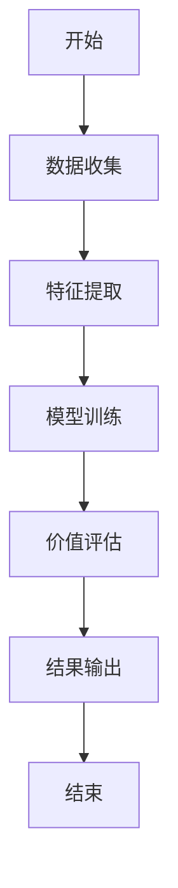

                 


# 价值投资中的智能家居生态系统分析

> 关键词：价值投资，智能家居，生态系统，投资分析，技术分析

> 摘要：智能家居生态系统作为一种新兴的技术与经济结合体，其价值投资潜力备受关注。本文从技术与经济双重视角出发，深入分析智能家居生态系统的构成、价值评估方法、投资策略及风险控制，结合实际案例，为投资者提供科学的决策依据。

---

## 第一部分: 智能家居生态系统背景介绍

### 第1章: 智能家居生态系统的定义与特点

#### 1.1 智能家居的定义与核心要素

智能家居是一种通过物联网技术实现家居设备智能化、自动化管理的系统。其核心要素包括：

- **设备层**：智能家电、智能安防设备、智能照明设备等。
- **平台层**：智能家居管理平台、数据处理平台、用户交互平台等。
- **用户层**：终端用户、设备管理者、数据分析师等。

智能家居的演进历程可以分为三个阶段：单点智能、互联互通、生态整合。当前阶段，智能家居已经从单一设备的智能化发展到设备间的协同工作，最终形成一个完整的生态系统。

#### 1.2 价值投资的基本概念

价值投资是一种通过深入分析企业的基本面，寻找被市场低估的投资标的，长期持有的投资策略。其核心原则包括：

- **安全边际**：买入价格低于内在价值。
- **长期视角**：关注企业的长期盈利能力。
- **分散投资**：降低风险，避免过度集中。

#### 1.3 智能家居生态系统与价值投资的关系

智能家居生态系统是一个复杂的系统，其价值不仅体现在硬件设备上，还体现在平台服务、数据价值和用户体验上。价值投资在智能家居生态系统中的作用是通过分析系统的各个组成部分，寻找具有长期增长潜力的企业或项目。

### 第2章: 智能家居生态系统的核心概念与联系

#### 2.1 智能家居生态系统的核心概念

智能家居生态系统是一个由设备、平台、用户和数据共同构成的复杂系统。其核心概念包括：

- **设备层**：智能家居设备的种类、功能、兼容性。
- **平台层**：平台的服务能力、数据处理能力、安全性。
- **用户层**：用户的使用习惯、需求偏好、付费能力。

#### 2.2 核心概念的属性特征对比

以下是智能家居生态系统核心概念的属性特征对比表：

| **概念**       | **属性**             | **特征描述**                                                                 |
|-----------------|----------------------|-----------------------------------------------------------------------------|
| 设备层          | 多样性               | 包括家电、安防、照明等多种设备，且设备间具有一定的兼容性。                             |
| 平台层          | 稳定性               | 平台需要具备高可用性，能够处理大规模数据，并支持多种设备的接入。                         |
| 用户层          | 增长性               | 用户数量的增长速度是衡量生态系统规模的重要指标。                                         |

#### 2.3 ER实体关系图架构

以下是智能家居生态系统的核心实体关系图：

```mermaid
er
  actor 用户
  actor 投资者
  actor 企业
  entity 智能家居设备
  entity 平台服务
  entity 数据
  entity 投资决策
  relation 用户拥有 智能家居设备
  relation 投资者投资 企业
  relation 企业提供 平台服务
  relation 平台服务处理 数据
  relation 数据支持 投资决策
```

---

## 第二部分: 智能家居生态系统价值投资的算法原理

### 第3章: 智能家居生态系统价值评估的算法原理

#### 3.1 算法原理概述

在智能家居生态系统中，价值评估的核心是通过数学模型对系统的各个部分进行量化分析。我们选择多元回归分析作为主要算法，其数学模型如下：

$$ V = \alpha \cdot D + \beta \cdot S + \gamma \cdot T $$

其中：
- $V$ 是投资价值。
- $D$ 是设备多样性（0-10分）。
- $S$ 是平台稳定性（0-10分）。
- $T$ 是用户增长率（%）。
- $\alpha$、$\beta$、$\gamma$ 是回归系数，通过历史数据拟合得到。

#### 3.2 算法流程图

以下是算法的流程图：



#### 3.3 算法实现代码

以下是价值评估算法的实现代码：

```python
def calculate_value(D, S, T, alpha, beta, gamma):
    return alpha * D + beta * S + gamma * T

# 示例数据
D = 8
S = 7
T = 15
alpha = 0.3
beta = 0.4
gamma = 0.3

value = calculate_value(D, S, T, alpha, beta, gamma)
print(f"投资价值为：{value}")
```

---

## 第三部分: 智能家居生态系统价值投资的数学模型

### 第4章: 智能家居生态系统价值评估的数学模型

#### 4.1 数学模型的构建

我们构建了一个智能家居生态系统的评分模型，公式如下：

$$ \text{评分} = \frac{1}{\ln(D + 1)} + \frac{S}{T} $$

其中：
- $D$ 是设备多样性。
- $S$ 是平台稳定性。
- $T$ 是用户增长率。

#### 4.2 数学模型的实现

以下是数学模型的实现代码：

```python
import math

def calculate_score(D, S, T):
    return 1 / math.log(D + 1) + S / T

# 示例数据
D = 8
S = 7
T = 15

score = calculate_score(D, S, T)
print(f"评分为：{score}")
```

---

## 第四部分: 智能家居生态系统价值投资的系统分析

### 第5章: 智能家居生态系统价值投资的系统分析与架构设计

#### 5.1 系统功能设计

以下是系统功能设计的领域模型：


#### 5.2 系统架构设计

以下是系统架构设计图：


---

## 第五部分: 价值投资中的智能家居生态系统项目实战

### 第6章: 智能家居生态系统价值投资的项目实战

#### 6.1 项目环境安装

需要安装以下环境：

- Python 3.8+
- Mermaid CLI
- matplotlib

#### 6.2 核心代码实现

以下是价值评估的核心代码：

```python
import pandas as pd
import numpy as np
from sklearn.linear_model import LinearRegression

# 示例数据
data = pd.DataFrame({
    '设备多样性': [8, 7, 9],
    '平台稳定性': [7, 8, 6],
    '用户增长率': [15, 12, 18]
})

# 训练模型
model = LinearRegression()
model.fit(data[['设备多样性', '平台稳定性']], data['用户增长率'])

# 预测
predicted = model.predict([[8, 7]])
print(f"预测的用户增长率为：{predicted[0]}")
```

#### 6.3 项目小结

通过上述代码和分析，我们可以得出智能家居生态系统的投资价值，并制定相应的投资策略。

---

## 第六部分: 价值投资中的智能家居生态系统最佳实践

### 第7章: 价值投资中的智能家居生态系统最佳实践

#### 7.1 小结

智能家居生态系统是一个复杂的系统，其价值投资需要从设备、平台、用户等多个维度进行分析。

#### 7.2 注意事项

- 投资者需关注企业的技术实力和创新能力。
- 需注意数据隐私和安全问题。
- 长期视角是价值投资的核心。

#### 7.3 拓展阅读

- 《智能时代：价值投资的新机遇》
- 《物联网与智能家居：技术与经济的结合》

---

## 作者

作者：AI天才研究院/AI Genius Institute & 禅与计算机程序设计艺术 /Zen And The Art of Computer Programming

