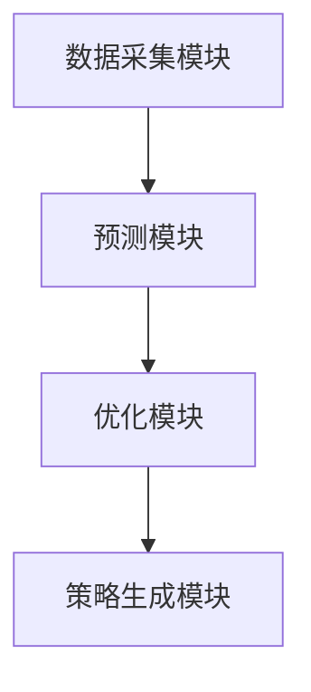

                 


# 价值投资中的智能家居能源优化系统分析

> 关键词：智能家居，能源优化，价值投资，能源管理，优化算法

> 摘要：智能家居能源优化系统通过优化能源使用，降低能耗，从而提升投资回报。本文从背景、核心概念、算法原理、系统架构、项目实战等多方面详细分析，为投资者和技术人员提供理论支持和实践指导。

---

## 第一部分: 背景介绍

### 第1章: 问题背景

#### 1.1 智能家居能源消耗的现状
智能家居的普及带来了能源消耗的增加。传统家居能源使用效率低下，缺乏智能化管理，导致能源浪费严重。

#### 1.2 能源优化的必要性
能源优化是降低运营成本、提升能源使用效率的关键。通过优化能源管理，可以减少能源浪费，降低能源开支。

#### 1.3 价值投资与能源优化的关联
能源优化直接影响运营成本，降低能源消耗意味着更高的利润，从而提升投资回报率。优化能源使用是实现价值投资的重要手段。

### 第2章: 问题描述

#### 2.1 智能家居能源浪费的主要表现
能源浪费主要表现在设备运行时间过长、设备空闲时能耗高等方面。例如，灯光、空调在不需要时仍然开启。

#### 2.2 能源优化的目标与边界
优化目标是降低能源消耗，提高能源使用效率。边界包括系统设计、实施范围和性能限制。

#### 2.3 优化系统的外延与限制
系统外延包括与其他智能家居设备的协同工作，限制则包括技术可行性、成本限制等。

### 第3章: 问题解决

#### 3.1 能源优化的核心目标
通过智能化管理，实现能源使用的最优化，降低能耗，提升效率。

#### 3.2 优化方法的选择
选择合适的方法，如智能算法、实时监控等，以达到最佳优化效果。

#### 3.3 系统实现的可行性分析
分析技术可行性、经济可行性，确保系统能够顺利实施并带来投资回报。

## 第二部分: 核心概念与联系

### 第4章: 核心概念原理

#### 4.1 智能家居能源优化系统的原理
系统通过数据采集、预测和优化策略生成，实现能源管理。例如，使用传感器收集能源使用数据，通过算法预测未来消耗，生成优化策略。

#### 4.2 核心概念对比
对比不同优化算法的优缺点，选择最适合的算法。例如，线性规划适合处理线性问题，动态规划适合处理多阶段优化问题。

#### 4.3 ER实体关系图
展示系统中的实体关系，如用户、设备、系统之间的关系。

```mermaid
erDiagram
    用户 {
        +id : 整数
        +name : 字符串
    }
    设备 {
        +id : 整数
        +type : 字符串
    }
    系统 {
        +id : 整数
        +algorithm : 字符串
    }
    用户 --> 设备 : 控制
    设备 --> 系统 : 传输数据
    系统 --> 用户 : 提供优化方案
```

## 第三部分: 算法原理讲解

### 第5章: 算法概述

#### 5.1 线性规划模型
线性规划是一种优化方法，适用于处理线性目标函数和约束条件。例如，目标是最小化能源成本，约束是设备运行时间。

$$ \text{目标函数: } \min \sum_{i} c_i x_i $$
$$ \text{约束条件: } \sum_{i} a_i x_i \leq b $$

#### 5.2 动态规划模型
动态规划适用于处理多阶段优化问题。例如，分阶段优化能源使用，每阶段的决策影响后续阶段。

$$ \text{状态转移方程: } dp[i] = \min_{j} (dp[j] + cost(i,j)) $$

### 第6章: 算法实现

#### 6.1 智能家居能源优化系统的算法实现
使用Python编写优化算法，实现数据采集、预测和策略生成。

## 第四部分: 系统分析与架构设计

### 第7章: 问题场景介绍

#### 7.1 系统功能设计
设计系统功能，如数据采集、预测、优化策略生成。

#### 7.2 系统架构设计
用架构图展示系统结构，包括数据采集模块、预测模块、优化模块。



## 第五部分: 项目实战

### 第8章: 环境安装

#### 8.1 系统安装与配置
安装必要的软件和硬件，配置系统环境。

#### 8.2 核心代码实现
编写核心代码，实现优化算法。

#### 8.3 案例分析
分析实际案例，展示系统优化效果。

## 第六部分: 最佳实践

### 第9章: 总结与展望

#### 9.1 项目小结
总结项目成果，展望未来发展方向。

---

作者：AI天才研究院 & 禅与计算机程序设计艺术

