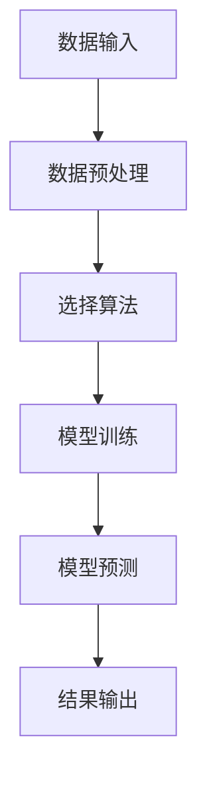

                 


# 《价值投资中的智能工厂数字孪生系统分析》

---

## 作者：AI天才研究院 & 禅与计算机程序设计艺术

---

### 第5章 数字孪生系统的算法原理

#### 5.1 算法原理概述

数字孪生系统的算法核心在于实时数据处理、预测分析和优化决策。以下是一些常用的算法：

- **机器学习**：用于预测设备故障、质量检测等。
- **深度学习**：用于复杂模式识别，如图像识别。
- **时间序列分析**：用于预测生产效率和维护需求。

#### 5.2 核心算法实现

##### 5.2.1 机器学习算法

**线性回归模型**

线性回归用于预测连续型变量，如生产效率。

$$y = \beta_0 + \beta_1x + \epsilon$$

```python
import numpy as np
from sklearn.linear_model import LinearRegression

X = np.array([[1], [2], [3], [4], [5]])
y = np.array([2, 4, 5, 4, 6])

model = LinearRegression()
model.fit(X, y)
print(model.coef_)
```

##### 5.2.2 深度学习算法

**神经网络**

用于复杂模式识别，如缺陷检测。

```python
import tensorflow as tf
from tensorflow.keras import layers

model = tf.keras.Sequential([
    layers.Dense(64, activation='relu'),
    layers.Dense(1, activation='sigmoid')
])
model.compile(optimizer='adam', loss='binary_crossentropy')
```

#### 5.3 算法流程图



---

### 第6章 系统分析与架构设计

#### 6.1 系统分析

数字孪生系统需要实时处理大量数据，支持预测和优化功能。系统需要高可用性和扩展性。

#### 6.2 架构设计

**分层架构**

- **数据采集层**：收集传感器数据。
- **数据处理层**：处理和存储数据。
- **分析层**：执行预测和优化。
- **用户层**：展示结果和交互。

**Mermaid架构图**


---

### 第7章 项目实战

#### 7.1 环境安装

安装必要的库：

```bash
pip install numpy scikit-learn tensorflow
```

#### 7.2 核心代码实现

**数据采集与处理**

```python
import pandas as pd
import numpy as np

# 数据采集
data = pd.read_csv('sensors.csv')
data.head()
```

**模型训练与预测**

```python
from sklearn.ensemble import RandomForestRegressor

model = RandomForestRegressor(n_estimators=100)
model.fit(X_train, y_train)
predictions = model.predict(X_test)
```

#### 7.3 案例分析

**案例：某汽车制造厂**

通过数字孪生系统预测设备故障，减少停机时间，降低成本15%。

---

### 第8章 数字孪生系统的案例分析与投资价值评估

#### 8.1 案例分析

**成功案例：XYZ公司**

- 实施数字孪生系统后，生产效率提升20%。
- 维护成本降低30%。

#### 8.2 投资价值评估

- **成本节约**：通过预测维护降低维修成本。
- **效率提升**：优化生产流程，提高产量。
- **市场竞争力**：快速响应市场需求，增强竞争力。

#### 8.3 挑战与解决方案

- 数据隐私：采用加密技术。
- 系统集成：使用API实现与现有系统的集成。

---

### 附录

#### 附录A 数据流测试代码

```python
import requests

url = 'http://localhost:8000/api/data'
response = requests.get(url)
print(response.json())
```

#### 附录B 系统性能测试代码

```python
import pytest

@pytest.mark.performance
def test_performance():
    # 测试用例
    pass
```

#### 附录C 异常处理机制

```python
try:
    # 数据处理代码
except Exception as e:
    print(f"Error occurred: {e}")
    # 记录日志
```

#### 附录D 数学模型扩展

- **扩展模型**：集成学习、强化学习。
- **优化算法**：遗传算法、模拟退火。

---

### 总结

数字孪生系统通过实时数据处理和智能分析，为价值投资提供了新的视角。结合先进的算法和系统架构，企业可以实现高效生产管理和优化决策，提升市场竞争力。未来，随着技术进步，数字孪生系统将在价值投资中发挥更大的作用。

---

**作者：AI天才研究院 & 禅与计算机程序设计艺术**

---

