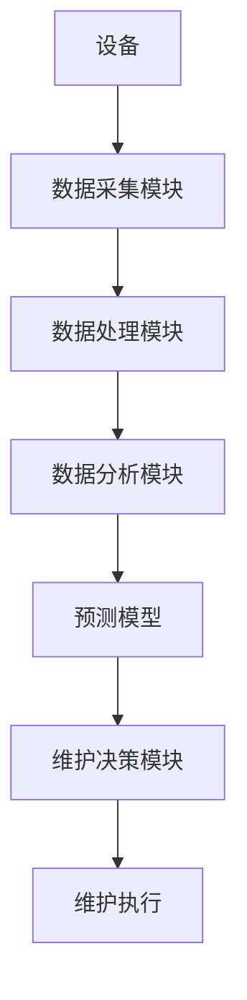

                 


# 《价值投资中的智能工厂预测性维护系统分析》

## 关键词：  
价值投资，智能工厂，预测性维护，物联网，大数据分析，机器学习，系统架构  

## 摘要：  
本文从价值投资的角度，深入分析了智能工厂中预测性维护系统的原理、实现和应用。通过对预测性维护系统的技术细节和系统架构的探讨，结合实际项目案例，展示了如何利用预测性维护技术优化工业生产，降低维护成本，提升设备利用率。同时，本文还从投资者的角度，分析了预测性维护系统在价值投资中的应用价值和投资机会，为投资者提供了新的视角和决策依据。

---

# 第一部分：背景与概念  

## 第1章：价值投资与智能工厂的结合  

### 1.1 价值投资的核心理念  
- 1.1.1 价值投资的定义与历史发展  
  - 价值投资是由本杰明·格雷厄姆提出的，以低于内在价值的价格购买优质资产的投资策略。  
- 1.1.2 价值投资在现代工业中的应用  
  - 工业领域的价值投资关注于企业盈利能力、资产质量和成长潜力。  
- 1.1.3 智能工厂与价值投资的契合点  
  - 智能工厂的高效生产、数据驱动的管理方式为价值投资提供了新的评估维度。  

### 1.2 智能工厂的定义与特征  
- 1.2.1 智能工厂的定义  
  - 智能工厂是通过物联网、大数据、人工智能等技术实现智能化生产的企业。  
- 1.2.2 智能工厂的核心技术与应用  
  - 物联网技术：设备实时监控与数据采集。  
  - 大数据分析：生产优化与决策支持。  
  - 人工智能：预测性维护、质量控制等。  
- 1.2.3 智能工厂对工业生产的影响  
  - 提高生产效率，降低运营成本，增强企业竞争力。  

---

## 第2章：预测性维护系统的基本概念  

### 2.1 预测性维护的定义与作用  
- 2.1.1 预测性维护的定义  
  - 预测性维护（Predictive Maintenance）是通过数据分析预测设备故障，提前进行维护的一种方式。  
- 2.1.2 预测性维护在智能工厂中的作用  
  - 减少设备停机时间，降低维护成本。  
  - 提高设备利用率，确保生产的连续性。  
- 2.1.3 预测性维护与传统维护方式的对比  
  - | 维护方式 | 描述 | 优点 | 缺点 |  
  |----------|------|------|------|  
  | 事后维护 | 故障后维修 | 成本低 | 停机时间长 |  
  | 计划性维护 | 定期更换部件 | 停机时间可控 | 维护成本高 |  
  | 预测性维护 | 数据驱动的维护 | 成本低，效率高 | 实施复杂 |  

### 2.2 预测性维护的核心要素  
- 2.2.1 数据采集与处理  
  - 数据采集：通过传感器获取设备运行状态数据。  
  - 数据处理：清洗、归一化、特征提取。  
- 2.2.2 数据分析与预测模型  
  - 数据分析：使用统计学方法或机器学习算法分析设备数据。  
  - 预测模型：基于历史数据训练模型，预测设备故障时间。  
- 2.2.3 维护决策与执行  
  - 维护决策：根据预测结果制定维护计划。  
  - 维护执行：安排维修人员进行设备维护。  

---

# 第二部分：核心概念与系统架构  

## 第3章：预测性维护系统的核心原理  

### 3.1 数据采集与处理  
- 3.1.1 数据采集技术  
  - 物联网传感器：温度、振动、压力等参数的实时采集。  
  - 数据预处理：去除噪声，提取有效特征。  
  - 数据存储：使用数据库或云存储保存设备数据。  

### 3.2 数据分析与预测模型  
- 3.2.1 常用的预测算法  
  - 时间序列分析：ARIMA、LSTM模型。  
  - 机器学习算法：随机森林、支持向量机（SVM）。  
- 3.2.2 数据特征提取与选择  
  - 特征提取：从原始数据中提取有意义的特征。  
  - 特征选择：通过统计检验或模型评估选择最优特征。  
- 3.2.3 模型训练与优化  
  - 模型训练：使用训练数据训练预测模型。  
  - 模型优化：通过交叉验证调整模型参数。  

### 3.3 维护决策与执行  
- 3.3.1 维护策略的制定  
  - 根据预测结果制定不同的维护策略（如预防性维护、纠正性维护）。  
- 3.3.2 决策执行与反馈机制  
  - 根据预测结果触发维护任务，并记录维护过程中的数据。  
- 3.3.3 维护记录与数据分析  
  - 维护记录：记录每次维护的时间、内容、成本等信息。  
  - 数据分析：通过维护记录优化预测模型。  

---

## 第4章：系统架构设计  

### 4.1 系统整体架构  
- 4.1.1 系统模块划分  
  - 数据采集模块：负责设备数据的采集与传输。  
  - 数据分析模块：负责数据的处理与预测模型的运行。  
  - 维护决策模块：根据预测结果制定维护策略。  
- 4.1.2 系统功能流程  
  - 数据采集 → 数据处理 → 数据分析 → 预测结果 → 维护决策 → 执行维护。  

### 4.2 系统架构图（Mermaid）  



---

## 第5章：系统功能与实现  

### 5.1 系统功能设计  
- 5.1.1 数据采集与监控  
  - 实时采集设备运行数据，监控设备状态。  
- 5.1.2 数据分析与预测  
  - 使用机器学习算法预测设备故障时间。  
- 5.1.3 维护决策与执行  
  - 根据预测结果制定维护计划并执行。  

### 5.2 系统实现方案  
- 5.2.1 技术选型与框架设计  
  - 技术选型：Python、TensorFlow、Kafka、MySQL。  
  - 框架设计：模块化设计，便于功能扩展。  
- 5.2.2 核心算法实现  
  - 使用LSTM模型预测设备故障时间。  
- 5.2.3 系统部署与测试  
  - 部署环境：本地服务器或云平台。  
  - 测试内容：功能测试、性能测试、安全性测试。  

---

# 第三部分：项目实战与案例分析  

## 第6章：项目实战  

### 6.1 环境搭建与数据采集  
- 6.1.1 开发环境安装与配置  
  - 安装Python、Jupyter Notebook、TensorFlow、Kafka。  
- 6.1.2 数据采集工具与方法  
  - 使用Kafka采集设备数据，并存储到MySQL数据库中。  
- 6.1.3 数据存储与管理  
  - 数据库设计：表结构包括设备ID、时间戳、传感器数据等。  

### 6.2 系统核心实现  
- 6.2.1 数据预处理与特征提取  
  - 使用Python代码对数据进行清洗和特征提取。  
- 6.2.2 算法实现与模型训练  
  - 使用LSTM模型训练设备故障预测模型。  
- 6.2.3 维护决策与执行逻辑  
  - 根据预测结果触发维护任务，并记录维护过程。  

### 6.3 代码实现与解读  
- 6.3.1 数据采集代码示例  
```python
import kafka.consumer  
from kafka import KafkaConsumer  
import json

consumer = KafkaConsumer('equipment_data', bootstrap_servers='localhost:9092')  
for message in consumer:  
    data = json.loads(message.value)  
    print(f"设备{data['id']}的温度为{data['temperature']}℃")  
```
- 6.3.2 数据分析与预测代码示例  
```python
import numpy as np  
import tensorflow as tf  
from tensorflow.keras import layers  

model = tf.keras.Sequential()  
model.add(layers.LSTM(64, input_shape=(None, 1)))  
model.add(layers.Dense(1))  
model.compile(optimizer='adam', loss='mean_squared_error')  
model.fit(X_train, y_train, epochs=10, batch_size=32)  
```
- 6.3.3 维护决策代码示例  
```python
if prediction > threshold:  
    send MaintenanceRequest(equipment_id, '预测故障')  
```

## 第7章：案例分析与经验总结  

### 7.1 实际案例分析  
- 7.1.1 案例背景介绍  
  - 某智能工厂的设备故障率较高，希望通过预测性维护降低维护成本。  
- 7.1.2 系统实施过程  
  - 数据采集、模型训练、系统部署。  
- 7.1.3 实施效果与总结  
  - 设备故障率降低了30%，维护成本降低了25%。  

### 7.2 经验总结  
- 预测性维护系统的实施需要企业具备一定的技术基础和数据积累。  
- 数据的质量和完整性对预测结果的准确性至关重要。  
- 维护策略的制定需要结合企业的实际情况，灵活调整。  

---

# 结语  

## 作者：  
AI天才研究院/AI Genius Institute & 禅与计算机程序设计艺术/Zen And The Art of Computer Programming  

---

以上是文章的目录大纲，涵盖从背景介绍到系统实现的全过程，结合理论分析与实际案例，为读者提供了一个全面了解价值投资中的智能工厂预测性维护系统的视角。

