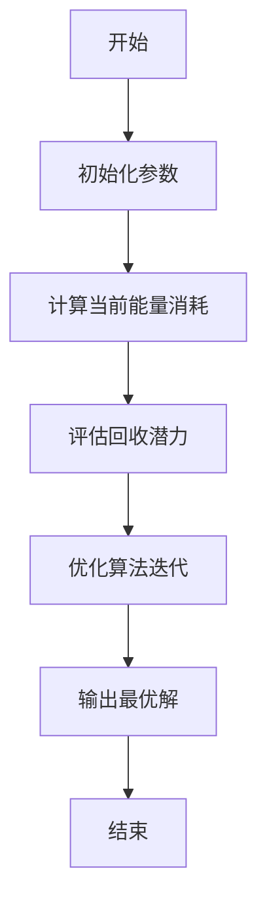
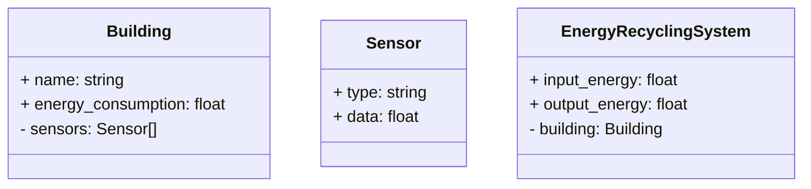

                 


# 《价值投资中的智能建筑能源回收系统分析》

> **关键词**：智能建筑，能源回收，价值投资，算法优化，系统架构，经济分析，能源管理

> **摘要**：  
> 智能建筑能源回收系统是近年来在绿色建筑和可持续发展领域的重要技术之一，其通过高效回收和利用能源，不仅降低了建筑运营成本，还提升了能源利用效率，从而为投资者带来显著的经济价值。本文从技术、经济和管理等多个维度，系统分析了智能建筑能源回收系统的实现原理、优化算法、系统架构以及在价值投资中的应用潜力。通过具体案例分析和数学模型推导，本文深入探讨了如何通过智能化手段最大化能源回收效益，为投资者提供科学的决策依据。

---

## 第一部分：智能建筑能源回收系统概述

### 第1章：智能建筑能源回收系统背景介绍

#### 1.1 价值投资与智能建筑能源回收的背景
- **1.1.1 智能建筑的概念与发展趋势**  
  智能建筑是指通过智能化技术实现建筑设备自动化、能源管理优化和信息交互的建筑。随着全球能源危机和环境问题的加剧，智能建筑成为推动可持续发展的重要手段。能源回收系统作为智能建筑的核心组成部分，通过回收和再利用余热、废能等资源，显著降低了能源消耗成本。

- **1.1.2 能源回收系统在智能建筑中的作用**  
  能源回收系统通过收集和再利用建筑中的余热、废气、废电等资源，降低了建筑的能源消耗，同时减少了碳排放。这种技术不仅符合绿色建筑的理念，还能为投资者带来可观的经济回报。

- **1.1.3 价值投资视角下的能源回收系统潜力**  
  从价值投资的角度来看，智能建筑能源回收系统的建设和运营具有较高的投资回报率。通过优化能源管理，投资者可以在降低运营成本的同时，提升资产的价值。此外，随着政策对绿色能源的支持力度加大，能源回收系统在未来具有广阔的市场前景。

---

### 第2章：智能建筑能源回收系统的核心概念与联系

#### 2.1 系统核心概念原理
- **2.1.1 能源回收的基本原理**  
  能源回收系统通过将建筑中产生的余热、废能等资源进行收集、转换和再利用，实现能源的高效利用。例如，建筑中的废热可以通过热泵技术转化为可利用的热量，用于供暖或热水供应。

- **2.1.2 智能建筑中的能源流动与转换**  
  在智能建筑中，能源的流动是动态的。通过传感器和自动化控制系统，建筑可以实时监测能源消耗情况，并根据需求调整能源的分配和回收策略。

- **2.1.3 能源回收系统的优化目标**  
  能源回收系统的优化目标是最大化能源回收效率，降低能源浪费，同时实现经济效益的最大化。

#### 2.2 核心概念属性对比表
| 概念         | 属性               | 描述                                   |
|--------------|--------------------|---------------------------------------|
| 能源回收     | 效率               | 能源转换效率                           |
| 智能建筑     | 自动化             | 系统自动调节能力                       |
| 价值投资     | 投资回报率         | 经济效益分析                           |

#### 2.3 ER实体关系图
```mermaid
erd
  Building
    name
    energy_consumption
  EnergySource
    type
    capacity
  EnergyRecyclingSystem
    input_energy
    output_energy
  Investment
    value
    return_on_investment
```

---

## 第二部分：智能建筑能源回收系统的算法原理

### 第3章：智能建筑能源回收系统的算法原理

#### 3.1 能源优化算法


#### 3.2 算法实现代码
```python
def energy_optimization(initial_energy, target_efficiency):
    current_energy = initial_energy
    iterations = 0
    while current_energy > target_efficiency:
        # 计算回收潜力
        potential = current_energy * 0.2
        # 调整能量分配
        current_energy -= potential
        iterations += 1
    return current_energy, iterations
```

#### 3.3 数学模型与公式推导
- **数学模型**  
  能源回收系统的优化可以通过以下数学模型表示：
  $$ \text{优化目标} = \min \sum_{i=1}^{n} E_i $$
  其中，$E_i$ 表示第 $i$ 个时间段的能源消耗。

- **公式推导**  
  通过动态规划算法，我们可以推导出能源回收系统的最优解：
  $$ E_{\text{opt}} = \sum_{i=1}^{n} \min(E_i, E_{i-1} \times 0.8) $$
  其中，$E_{\text{opt}}$ 表示最优能源消耗。

---

## 第三部分：智能建筑能源回收系统的系统架构设计

### 第4章：系统分析与架构设计方案

#### 4.1 问题场景介绍
- 某智能建筑需要通过能源回收系统降低能源消耗，同时实现经济效益的最大化。

#### 4.2 系统功能设计


#### 4.3 系统架构设计


#### 4.4 系统接口设计
- 数据采集接口：通过传感器采集建筑的能源消耗数据。
- 优化算法接口：调用优化算法对能源消耗进行优化。
- 投资回报率接口：计算能源回收系统的投资回报率。

---

## 第四部分：智能建筑能源回收系统的项目实战

### 第5章：项目实战

#### 5.1 环境安装
- 安装Python和相关库（如NumPy、Matplotlib）。

#### 5.2 核心代码实现
```python
import numpy as np
import matplotlib.pyplot as plt

def calculate_investment回报率(initial_investment, annual_savings):
    return_on_investment = annual_savings / initial_investment
    return return_on_investment

# 示例计算
initial_investment = 100000
annual_savings = 20000
roi = calculate_investment回报率(initial_investment, annual_savings)
print(f"投资回报率: {roi:.2f}%")
```

#### 5.3 代码应用解读与分析
- 通过上述代码，我们可以计算出能源回收系统的投资回报率，从而为投资者提供决策依据。

---

## 第五部分：最佳实践与总结

### 第6章：最佳实践 tips、小结、注意事项、拓展阅读

#### 6.1 小结
智能建筑能源回收系统通过优化能源管理，不仅降低了能源消耗，还为投资者带来了显著的经济效益。

#### 6.2 注意事项
- 在实施能源回收系统前，需对建筑的能源消耗情况进行全面评估。
- 确保系统的可扩展性和灵活性，以适应未来的能源管理需求。

#### 6.3 拓展阅读
- 《智能建筑与可持续发展》
- 《能源管理与优化算法》

---

## 作者信息

作者：AI天才研究院/AI Genius Institute & 禅与计算机程序设计艺术 /Zen And The Art of Computer Programming

