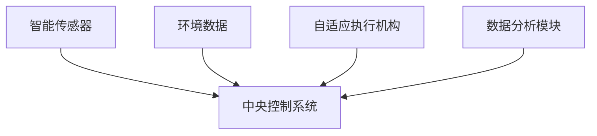
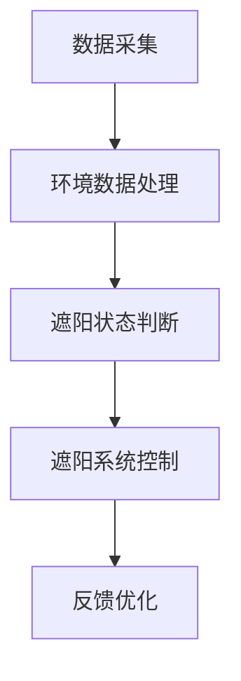
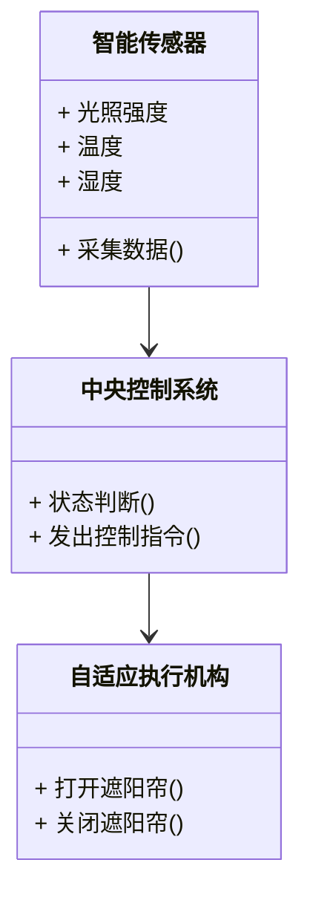
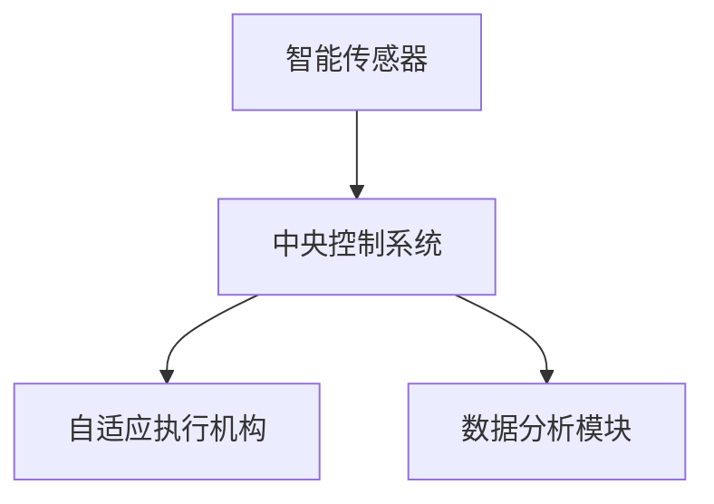

                 


# 价值投资中的智能建筑自适应遮阳系统分析

> 关键词：智能建筑，自适应遮阳系统，价值投资，建筑节能，智能化技术

> 摘要：本文从技术角度深入分析智能建筑自适应遮阳系统的原理、算法、架构及应用场景，探讨其在价值投资中的潜力，为相关领域提供理论和实践参考。

---

## 第一部分：智能建筑自适应遮阳系统概述

### 第1章：价值投资中的智能建筑自适应遮阳系统背景

#### 1.1 问题背景

建筑能耗问题日益严重，智能技术的应用成为关键。遮阳系统在降低能耗中起重要作用，而智能化遮阳系统通过动态调节，显著提升节能效果。

#### 1.2 问题描述

传统遮阳系统存在手动操作、效率低的问题。智能遮阳系统通过传感器和自动化控制，实现自适应调节，优化能源使用，降低成本，提升投资回报。

#### 1.3 问题解决

智能化遮阳系统通过实时数据采集和分析，动态调整遮阳策略，优化能源消耗，降低运营成本，提升投资收益。

#### 1.4 系统边界与外延

系统边界包括智能传感器、执行机构和控制系统。外延涉及建筑自动化系统、能源管理系统等，与其他系统如 HVAC 和照明系统有接口。

#### 1.5 核心要素组成

- 智能传感器：实时监测光照、温度等环境参数。
- 自适应执行机构：调整遮阳设备。
- 中央控制系统：处理数据，发出控制指令。
- 数据分析模块：优化遮阳策略。

---

## 第二部分：智能建筑自适应遮阳系统的核心概念与联系

### 第2章：核心概念与联系

#### 2.1 核心概念原理

自适应遮阳系统通过传感器实时监测环境数据，分析后调整遮阳设备，优化能源使用。

#### 2.2 概念属性特征对比

| 参数 | 传统遮阳系统 | 智能自适应遮阳系统 |
|------|---------------|---------------------|
| 调节方式 | 手动或定时 | 实时自适应         |
| 节能效果 | 有限       | 显著               |
| 系统复杂度 | 低         | 高                 |

#### 2.3 系统实体关系图



---

## 第三部分：算法原理讲解

### 第3章：算法原理

#### 3.1 算法流程



#### 3.2 算法实现

```python
def adaptive_shading_control(environment_data):
    processed_data = preprocess(environment_data)
    if processed_data['光照强度'] > threshold:
        return '打开遮阳帘'
    else:
        return '关闭遮阳帘'
```

---

## 第四部分：数学模型

### 第4章：数学模型

建立遮阳系统优化的数学模型：

$$
\text{目标函数} = \min \sum_{t=1}^{T} E_t
$$

其中，$E_t$ 表示时间 $t$ 的能源消耗。

约束条件：

$$
\begin{cases}
\text{光照强度} \leq \text{阈值} \\
\text{温度} \leq \text{舒适范围} \\
\end{cases}
$$

---

## 第五部分：系统分析与架构设计

### 第5章：系统分析与架构设计

#### 5.1 项目背景

智能遮阳系统应用于现代建筑，通过自动化调节降低能耗，提升投资价值。

#### 5.2 系统功能设计



#### 5.3 系统架构设计



---

## 第六部分：项目实战

### 第6章：项目实战

#### 6.1 环境安装

安装Python环境和相关库，如numpy和pandas。

#### 6.2 核心实现

```python
import numpy as np
import pandas as pd

def main():
    data = pd.read_csv('environment.csv')
    processed_data = data.apply(preprocess)
    result = adaptive_shading_control(processed_data)
    print(result)

if __name__ == "__main__":
    main()
```

#### 6.3 案例分析

分析实际案例，验证系统优化效果，计算投资回报率。

---

## 第七部分：最佳实践

### 第7章：总结

#### 7.1 小结

智能遮阳系统通过实时调节优化能源使用，降低运营成本，提升投资价值。

#### 7.2 注意事项

- 数据采集精度影响系统性能。
- 系统维护和更新需及时。
- 与其他建筑系统协同工作。

#### 7.3 拓展阅读

建议阅读相关书籍和文献，深入了解智能建筑技术。

---

作者：AI天才研究院/AI Genius Institute & 禅与计算机程序设计艺术 /Zen And The Art of Computer Programming

