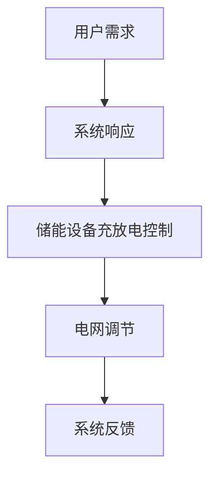

                 


# 价值投资中的智能电网分布式储能管理分析

## 关键词：智能电网, 分布式储能, 价值投资, 强化学习, 系统架构

## 摘要：本文深入分析了智能电网分布式储能管理的背景、核心概念、算法原理、系统架构，并通过项目实战展示了价值投资在其中的应用。文章结合理论与实践，提出了优化储能管理的策略和建议，为投资者和技术开发者提供了参考。

---

## 第1章：智能电网与分布式储能管理概述

### 1.1 智能电网的基本概念

#### 1.1.1 智能电网的定义与特点
智能电网是一种集成现代信息技术的新型电力系统，具有高效、可靠和环保的特点。它通过智能设备和数据分析实现对电力的实时监控和管理。

#### 1.1.2 智能电网的核心技术与应用
核心技术包括智能测量、数据分析、自动化控制等。应用场景广泛，如智能配电、需求侧管理等。

#### 1.1.3 智能电网与传统电网的区别
传统电网依赖人工操作，而智能电网通过自动化技术实现高效管理。

### 1.2 分布式储能管理的定义与特点

#### 1.2.1 分布式储能的定义
分布式储能是指在分布式能源系统中，利用储能设备存储电能的技术。

#### 1.2.2 分布式储能的核心技术与应用
核心技术包括电池技术、能量管理系统等。应用场景包括可再生能源整合、电力备用等。

#### 1.2.3 分布式储能与集中式储能的区别
分布式储能设备分散在各个节点，而集中式储能设备集中在特定位置。

### 1.3 价值投资在智能电网中的作用

#### 1.3.1 价值投资的基本概念
价值投资是以低于内在价值的价格购买优质资产的投资策略。

#### 1.3.2 价值投资在智能电网中的应用
通过分析智能电网公司的财务状况和市场前景，寻找被低估的投资机会。

#### 1.3.3 价值投资与分布式储能管理的结合
通过优化储能系统的投资回报，提升整体电网的经济效益。

---

## 第2章：智能电网分布式储能管理的核心概念

### 2.1 智能电网分布式储能管理的原理

#### 2.1.1 能源互联网的概念
能源互联网是将能源与互联网技术结合的新型能源体系，支持分布式能源的高效利用。

#### 2.1.2 分布式储能管理的实现机制
通过智能算法和物联网技术实现对分布式储能设备的实时监控和管理。

#### 2.1.3 智能电网与分布式储能的协同作用
两者协同可以提高能源利用效率，降低电力浪费。

### 2.2 智能电网分布式储能管理的属性特征对比

#### 2.2.1 技术属性对比
技术属性包括设备效率、响应速度等，分布式储能在灵活性方面更具优势。

#### 2.2.2 经济属性对比
经济属性包括成本、收益等，分布式储能在初始投资较高，但长期收益更好。

#### 2.2.3 管理属性对比
管理属性包括复杂度、维护成本等，分布式储能管理更复杂，但灵活性更高。

### 2.3 智能电网分布式储能管理的ER实体关系图
```mermaid
erDiagram
    actor 用户
    actor 系统管理员
    actor 电力供应商
    actor 储能设备
    actor 电网
    用户 --> 储能设备: 使用储能设备
    系统管理员 --> 储能设备: 管理储能设备
    电力供应商 --> 储能设备: 提供电力
    储能设备 --> 电网: 存储和释放电能
```

### 2.4 智能电网分布式储能管理的Mermaid流程图


---

## 第3章：智能电网分布式储能管理的算法原理

### 3.1 基于强化学习的储能管理优化算法

#### 3.1.1 强化学习的基本概念
强化学习是一种通过试错机制优化决策的算法，适用于复杂环境下的决策问题。

#### 3.1.2 分布式储能管理的优化目标
目标包括最大化储能效率、最小化能源浪费、提高系统稳定性等。

#### 3.1.3 基于强化学习的储能管理算法
算法通过状态感知、动作选择和奖励机制优化储能设备的充放电策略。

#### 3.1.4 算法实现步骤
1. 状态空间定义：包括储能电量、电网负荷等。
2. 动作空间定义：包括充电、放电、待机等。
3. 奖励函数设计：根据储能效率和系统稳定性设计奖励函数。

#### 3.1.5 数学模型与公式
状态空间表示为：$S = (s_1, s_2, ..., s_n)$，其中$s_i$表示第$i$个状态变量。
动作空间表示为：$A = (a_1, a_2, ..., a_m)$，其中$a_j$表示第$j$个动作。
奖励函数表示为：$R(s, a) = r_{ij}$，其中$r_{ij}$表示状态$s_i$和动作$a_j$的奖励值。

#### 3.1.6 算法的数学推导
通过马尔可夫决策过程（MDP）模型，强化学习算法不断更新策略以最大化期望奖励。

### 3.2 分布式储能管理优化模型

#### 3.2.1 模型构建
模型考虑储能设备的充放电功率、时间、成本等因素。

#### 3.2.2 数学表达式
目标函数为：$$\max \sum_{t=1}^{T} (收益_t - 成本_t)$$
约束条件包括：$$\sum_{t=1}^{T} 充放电功率_t \leq 储能容量$$

#### 3.2.3 模型求解方法
使用动态规划或遗传算法等方法求解优化问题。

### 3.3 算法实现与分析

#### 3.3.1 强化学习算法的实现
编写Python代码实现强化学习算法，包括环境定义、智能体设计、训练循环等。

#### 3.3.2 算法效果评估
通过模拟实验评估算法的储能效率、系统稳定性等指标。

---

## 第4章：智能电网分布式储能管理的系统分析与架构设计

### 4.1 系统背景与项目介绍

#### 4.1.1 系统背景
随着可再生能源的广泛应用，智能电网分布式储能管理的需求日益增加。

#### 4.1.2 项目介绍
本项目旨在设计和实现一个基于强化学习的分布式储能管理系统。

### 4.2 系统功能设计

#### 4.2.1 功能需求
系统需要实现数据采集、优化控制、监控管理等功能。

#### 4.2.2 功能模块划分
主要模块包括数据采集模块、优化控制模块、监控管理模块等。

### 4.3 系统架构设计

#### 4.3.1 系统架构图
使用Mermaid图展示系统的整体架构，包括前端、后端和数据库的设计。

#### 4.3.2 模块交互关系
描述各模块之间的交互关系，如数据采集模块与优化控制模块的交互。

### 4.4 系统接口设计

#### 4.4.1 API接口设计
定义系统各模块之间的API接口，如数据采集接口、优化控制接口等。

#### 4.4.2 数据接口设计
描述数据的格式和传输方式，确保各模块之间数据的一致性和准确性。

### 4.5 系统交互设计

#### 4.5.1 交互流程
使用Mermaid图展示系统各模块之间的交互流程，如用户请求、系统响应等。

#### 4.5.2 交互协议
描述系统中各模块之间的通信协议，如HTTP、MQTT等。

---

## 第5章：智能电网分布式储能管理的项目实战

### 5.1 案例分析

#### 5.1.1 案例背景
选择一个实际项目，分析其需求、设计和实施过程。

#### 5.1.2 案例分析
详细分析项目的实现步骤，包括环境搭建、代码编写、测试等。

### 5.2 项目实现

#### 5.2.1 环境搭建
安装必要的软件和库，如Python、TensorFlow、Flask等。

#### 5.2.2 核心代码实现
编写实现强化学习算法的Python代码，包括环境定义、智能体设计、训练循环等。

#### 5.2.3 代码解读
解释代码的功能和实现细节，确保读者能够理解和复现。

### 5.3 项目测试与结果分析

#### 5.3.1 测试环境
描述测试环境的配置，如硬件、软件版本等。

#### 5.3.2 测试结果
展示测试结果，分析系统的性能和优化效果。

### 5.4 项目小结

#### 5.4.1 成果总结
总结项目取得的成果，如提高了储能效率、降低了能源浪费等。

#### 5.4.2 经验总结
总结项目中的经验教训，为未来的优化提供参考。

---

## 第6章：最佳实践与小结

### 6.1 最佳实践

#### 6.1.1 技术选型
根据项目需求选择合适的技术和算法，如强化学习、分布式系统架构等。

#### 6.1.2 系统设计
注重系统的可扩展性、可维护性和安全性，确保系统的长期稳定运行。

### 6.2 项目小结

#### 6.2.1 项目成果
总结项目的主要成果，如优化了储能管理算法、提高了系统效率等。

#### 6.2.2 项目经验
分享项目中的经验和教训，为未来的优化提供参考。

### 6.3 注意事项

#### 6.3.1 安全性
确保系统的安全性，防止数据泄露和网络攻击。

#### 6.3.2 可扩展性
系统设计应具有良好的可扩展性，适应未来的需求变化。

### 6.4 拓展阅读

#### 6.4.1 相关书籍
推荐相关的书籍和论文，帮助读者深入学习智能电网和分布式储能管理。

#### 6.4.2 技术博客
推荐相关技术博客和资源，供读者进一步学习和研究。

---

## 作者信息

作者：AI天才研究院 & 禅与计算机程序设计艺术

---

以上就是整篇文章的详细结构和内容，按照这一思路逐步撰写，可以确保文章逻辑清晰、内容详实，满足读者的需求。

