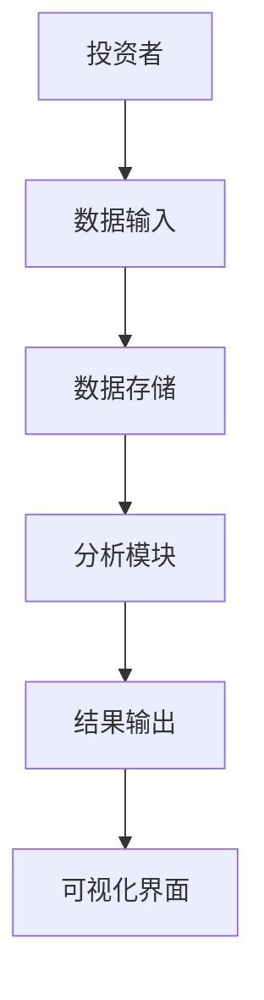

                 


# 价值投资中的气候变化风险考量

> 关键词：价值投资，气候变化，风险管理，资产估值，情景分析，系统性风险

> 摘要：本文探讨了在价值投资中如何考虑气候变化带来的风险。通过分析气候变化对传统财务指标的影响，情景分析法的应用，系统性风险的量化，以及风险管理策略的制定，本文为投资者提供了全面的视角和方法，以应对气候变化带来的挑战。

---

# 第一部分: 价值投资与气候变化风险的背景介绍

## 第1章: 气候变化风险的定义与影响

### 1.1 气候变化风险的核心概念

#### 1.1.1 气候变化的定义与特征
气候变化是指全球气候系统长期的变化，主要表现为温度上升、极端天气事件增多、海平面上升等。这些变化对企业运营、资产价值和经济活动产生深远影响。

#### 1.1.2 气候变化对经济和金融的影响
气候变化可能导致资源短缺、生产成本上升、政策变化等，进而影响企业的盈利能力。同时，气候变化也可能引发市场对高碳排放企业的规避，导致资产贬值。

#### 1.1.3 气候变化风险的分类与层次
- **物理风险**：极端天气事件对企业运营的直接影响。
- **转型风险**：政策变化和低碳技术进步对企业的影响。
- **法律与声誉风险**：企业因不符合环保要求而面临诉讼或声誉损失。

---

### 1.2 价值投资中的气候变化风险考量

#### 1.2.1 价值投资的基本原理
价值投资强调以低于内在价值的价格买入优质资产。然而，气候变化可能改变资产的内在价值，因此必须将气候变化风险纳入考量。

#### 1.2.2 气候变化对传统价值投资的影响
- 气候变化可能导致某些行业（如化石能源）的资产价值下降。
- 高碳排放企业可能面临更高的合规成本和政策风险。

#### 1.2.3 气候变化风险在投资决策中的重要性
投资者需要重新评估资产的长期表现，将气候变化因素纳入资产定价模型。

---

## 第2章: 气候变化对传统财务指标的影响

### 2.1 常见财务指标的重新审视

#### 2.1.1 市盈率（P/E）的调整
- 气候变化可能导致企业盈利下降，从而影响市盈率的合理性。
- 需要引入碳排放成本作为调整因素。

#### 2.1.2 市净率（P/B）的调整
- 高碳排放企业的资产可能面临贬值，影响市净率的准确性。
- 需要考虑资产的碳足迹对估值的影响。

#### 2.1.3 股息率的重新评估
- 气候变化可能影响企业的盈利能力和现金流，从而影响股息支付能力。

---

### 2.2 气候变化对资产估值的影响

#### 2.2.1 能源行业的估值变化
- 石油、天然气等高碳排放行业可能面临估值下调。
- 可再生能源行业的估值可能上升。

#### 2.2.2 房地产行业的风险评估
- 海平面上升可能导致沿海房地产贬值。
- 城市化进程中的气候变化适应性成本增加。

#### 2.2.3 制造业的碳排放成本
- 制造业的碳排放可能导致更高的合规成本和环保税。
- 碳中和目标可能影响企业的长期盈利能力。

---

## 第3章: 气候变化风险的量化与情景分析

### 3.1 气候变化情景分析法

#### 3.1.1 不同气候变化情景的定义
- **极端情景**：全球温度上升4°C以上。
- **中度情景**：全球温度上升2°C。
- **最优情景**：全球实现碳中和。

#### 3.1.2 情景分析的步骤与方法
1. 确定分析目标。
2. 收集相关数据（如历史气候数据、政策文件）。
3. 构建数学模型。
4. 进行模拟分析。
5. 输出结果并制定应对策略。

#### 3.1.3 情景分析的优缺点
- 优点：能够全面评估不同情况下的风险。
- 缺点：依赖模型假设，可能不够准确。

---

### 3.2 气候变化风险的数学模型

#### 3.2.1 气候变化风险的度量公式
$$ R = \sum_{i=1}^{n} w_i \cdot C_i $$
其中，$R$ 表示总风险，$w_i$ 表示情景权重，$C_i$ 表示各情景的风险值。

#### 3.2.2 情景分析的数学模型
$$ S = \alpha \cdot E + \beta \cdot V $$
其中，$S$ 表示情景评分，$E$ 表示环境因素，$V$ 表示经济因素，$\alpha$ 和 $\beta$ 为系数。

---

## 第4章: 气候变化风险的管理策略

### 4.1 风险管理的核心原则

#### 4.1.1 风险分散化
通过投资多样化资产类别，降低特定行业的风险。

#### 4.1.2 风险对冲
利用衍生工具（如期货、期权）对冲气候变化带来的价格波动风险。

#### 4.1.3 风险监控
定期评估投资组合的气候变化风险，及时调整策略。

---

### 4.2 气候变化风险管理的具体方法

#### 4.2.1 利用衍生工具对冲风险
- 通过买入期权，锁定资产价格，避免极端气候事件带来的损失。

#### 4.2.2 通过投资组合分散风险
- 投资于低碳排放行业，减少对高碳行业的依赖。

#### 4.2.3 定期进行压力测试
- 模拟极端气候情景，评估投资组合的承受能力。

---

## 第5章: 气候变化风险的系统性分析

### 5.1 系统性分析的框架

#### 5.1.1 系统性分析的步骤
1. 确定分析目标。
2. 构建系统模型。
3. 收集相关数据。
4. 进行模拟分析。
5. 输出结果并制定应对策略。

#### 5.1.2 系统性分析的关键指标
- 系统性风险：整个市场的波动性。
- 特定风险：单个资产的波动性。

#### 5.1.3 系统性分析的工具与方法
- 使用蒙特卡洛模拟评估不同情景下的风险。

---

### 5.2 气候变化风险的系统性模型

#### 5.2.1 系统性风险的数学模型
$$ S = \sum_{i=1}^{m} w_i \cdot R_i $$
其中，$S$ 表示系统性风险，$w_i$ 表示各风险因素的权重，$R_i$ 表示各风险因素的值。

#### 5.2.2 系统性风险的评估流程
1. 收集数据。
2. 构建模型。
3. 进行模拟。
4. 分析结果。

#### 5.2.3 系统性风险的控制策略
- 通过政策监管和市场机制减少系统性风险。

---

## 第6章: 气候变化风险的系统架构设计

### 6.1 系统功能设计

#### 6.1.1 数据收集模块
- 收集气候数据、政策文件、企业信息等。

#### 6.1.2 分析模块
- 使用数学模型进行风险评估和情景分析。

#### 6.1.3 可视化模块
- 展示分析结果，帮助投资者制定决策。

---

### 6.2 系统架构设计

#### 6.2.1 系统架构图


#### 6.2.2 系统交互流程
- 投资者输入需求。
- 数据输入模块收集数据。
- 分析模块处理数据。
- 可视化界面展示结果。

---

## 第7章: 气候变化风险的项目实战

### 7.1 环境安装

#### 7.1.1 安装Python
```bash
pip install numpy pandas matplotlib
```

#### 7.1.2 安装相关库
```bash
pip install pymermaid
```

---

### 7.2 核心实现源代码

#### 7.2.1 数据分析代码
```python
import numpy as np
import pandas as pd

# 示例数据
data = {'行业': ['能源', '房地产', '制造业'],
        '碳排放': [100, 50, 70]}
df = pd.DataFrame(data)

# 计算碳排放风险
def calculate-risk(carbon_emission):
    return sum(carbon_emission * 0.5)

carbon_risk = calculate-risk(df['碳排放'])
print(carbon_risk)
```

#### 7.2.2 情景分析代码
```python
import numpy as np

# 示例情景分析
def scenario-analysis(情景数):
    return np.random.normal(0, 1, 情景数)

s情景数 = 1000
s结果 = scenario-analysis(s情景数)
print(s结果)
```

---

## 第8章: 总结与展望

### 8.1 小结
本文系统地探讨了气候变化风险在价值投资中的考量，提出了多种应对策略和分析方法。

### 8.2 最佳实践 tips
- 定期进行风险评估。
- 多元化投资以分散风险。
- 关注政策变化和技术创新。

### 8.3 注意事项
- 数据的准确性和完整性。
- 模型的合理性和适用性。
- 风险管理的及时性和有效性。

### 8.4 拓展阅读
- 《气候变化与金融》
- 《价值投资实战技巧》

---

作者：AI天才研究院/AI Genius Institute & 禅与计算机程序设计艺术 /Zen And The Art of Computer Programming

