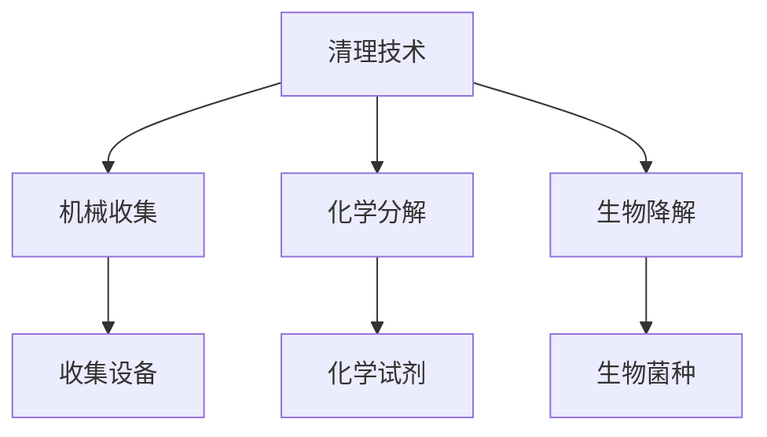
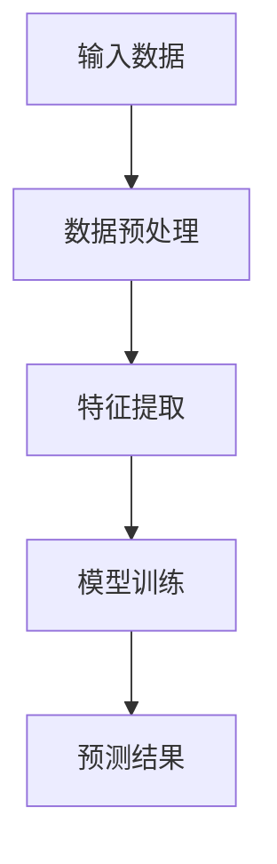
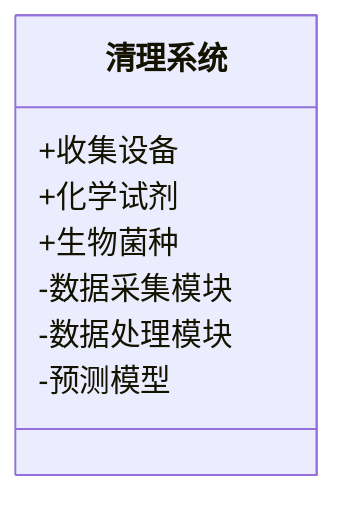
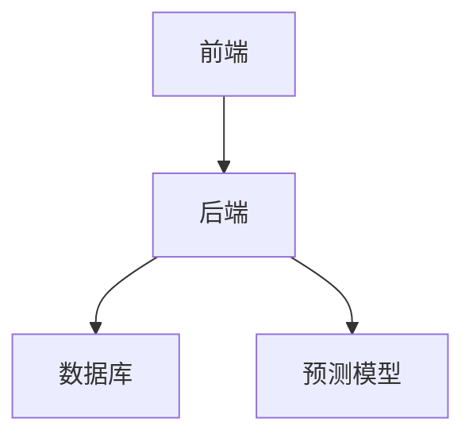

                 


# 价值投资中的海洋塑料污染清理技术前景

> 关键词：价值投资、海洋塑料污染、清理技术、技术前景、投资机会、环境保护

> 摘要：本文探讨了海洋塑料污染问题的严重性，分析了各种清理技术及其投资价值，评估了这些技术的市场潜力，并为投资者提供了有参考价值的建议。通过技术分析和投资策略的结合，本文揭示了在环保和经济双重驱动下，海洋塑料污染清理技术的未来发展前景。

---

## 第1章: 海洋塑料污染问题概述

### 1.1 全球海洋塑料污染现状

#### 1.1.1 海洋塑料污染的定义
海洋塑料污染是指海洋环境中存在的塑料制品的累积和扩散，这些塑料制品对海洋生态系统、人类健康以及全球经济活动造成威胁。

#### 1.1.2 全球海洋塑料污染的分布与规模
根据研究，全球海洋中约有1.5亿吨塑料垃圾，且每年新增800万吨塑料垃圾进入海洋。这些塑料垃圾主要分布在太平洋、大西洋和印度洋的五个主要垃圾带。

#### 1.1.3 海洋塑料污染的主要来源
海洋塑料污染的主要来源包括：
1. **陆地来源**：河流、风暴排水和垃圾倾倒。
2. **海洋活动**：渔业、航运和海滩垃圾。
3. **大气沉降**：塑料微粒通过空气传播到海洋。

### 1.2 海洋塑料污染的影响

#### 1.2.1 对海洋生态系统的破坏
海洋塑料污染对海洋生物造成严重威胁，包括误食塑料、缠绕和栖息地破坏。

#### 1.2.2 对人类健康的风险
塑料中的化学物质可能通过食物链积累，对人体健康造成潜在威胁。

#### 1.2.3 对全球经济和社会的影响
海洋塑料污染影响了渔业、旅游业和航运业，每年造成的经济损失高达数亿美元。

### 1.3 海洋塑料污染治理的必要性

#### 1.3.1 治理海洋塑料污染的紧迫性
海洋塑料污染问题日益严重，如果不及时治理，将对全球生态系统和人类社会造成不可逆转的影响。

#### 1.3.2 治理技术与投资的结合
治理技术的进步需要资金支持，而投资的回报需要通过技术创新和市场化运作来实现。

#### 1.3.3 全球治理行动与合作
海洋塑料污染问题需要全球合作，各国政府、企业和非营利组织需要共同努力。

### 1.4 本章小结
本章通过分析海洋塑料污染的现状、影响和治理的必要性，为后续的技术分析和投资策略奠定了基础。

---

## 第2章: 清理技术的核心概念与联系

### 2.1 清理技术的分类与原理

#### 2.1.1 机械收集技术
机械收集技术通过物理方法捕获海洋中的塑料垃圾，例如使用网具、吸盘和磁性装置。

#### 2.1.2 化学分解技术
化学分解技术通过化学反应将塑料分解为小分子，例如使用酶或化学试剂。

#### 2.1.3 生物降解技术
生物降解技术利用微生物将塑料分解为二氧化碳和水。

### 2.2 清理技术的优缺点对比

#### 2.2.1 机械收集技术的优缺点
- **优点**：可以直接捕获大块塑料垃圾，技术成熟。
- **缺点**：成本高，效率低，难以处理微塑料。

#### 2.2.2 化学分解技术的优缺点
- **优点**：可以分解微塑料，效率高。
- **缺点**：可能产生有害副产品，技术复杂。

#### 2.2.3 生物降解技术的优缺点
- **优点**：环保，可持续。
- **缺点**：分解速度慢，成本高。

### 2.3 清理技术的核心要素与联系

#### 2.3.1 清理技术的实体关系图


---

## 第3章: 清理技术的算法原理与数学模型

### 3.1 清理技术的预测模型

#### 3.1.1 基于机器学习的塑料污染预测
机器学习可以用于预测塑料污染的分布和扩散路径。

#### 3.1.2 算法流程图


#### 3.1.3 数学模型
$$
\text{预测结果} = \sum_{i=1}^{n} w_i x_i + b
$$
其中，$w_i$ 是权重，$x_i$ 是特征，$b$ 是偏置。

---

## 第4章: 系统分析与架构设计

### 4.1 系统功能设计

#### 4.1.1 领域模型


#### 4.1.2 系统架构设计


---

## 第5章: 项目实战与投资分析

### 5.1 环境安装与工具准备
安装Python、机器学习库（如scikit-learn）和数据可视化工具（如Matplotlib）。

### 5.2 核心代码实现

#### 5.2.1 数据预处理
```python
import pandas as pd
data = pd.read_csv('plastic Pollution.csv')
data = data.dropna()
```

#### 5.2.2 模型训练
```python
from sklearn.linear_model import LinearRegression
model = LinearRegression()
model.fit(X, y)
```

#### 5.2.3 模型预测
```python
predictions = model.predict(X_test)
```

### 5.3 案例分析
以某个海洋塑料污染区域为例，分析清理技术的经济效益和环境效益。

---

## 第6章: 结论与展望

### 6.1 本章总结
本文分析了海洋塑料污染的严重性，探讨了各种清理技术及其投资价值，为投资者提供了参考。

### 6.2 未来研究方向
未来可以研究更高效、更环保的清理技术，以及如何将技术转化为可持续的商业模式。

### 6.3 投资建议
投资者应关注技术创新和市场潜力，选择具有竞争优势的清理技术进行投资。

### 6.4 最佳实践 tips
- 保持对技术发展的关注。
- 评估技术的经济可行性。
- 考虑环境和社会效益。

---

## 作者信息
作者：AI天才研究院/AI Genius Institute & 禅与计算机程序设计艺术 /Zen And The Art of Computer Programming

