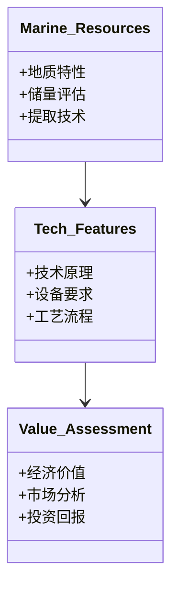

                 


# 价值投资中的深海热液资源开发技术前景

## 关键词：价值投资、深海热液资源、技术前景、资源开发、投资分析

## 摘要：  
本文探讨了深海热液资源开发技术的前景及其在价值投资中的潜力。通过分析深海热液资源的地质特性、开发技术、经济价值评估以及市场前景，结合技术进步对投资价值的影响，本文旨在为投资者提供深度的技术和经济分析，帮助其在深海热液资源开发领域做出明智的投资决策。

---

## 第一章: 深海热液资源开发技术概述

### 1.1 深海热液资源的定义与特征  
深海热液资源是指在海底中由热液喷口释放的高温液体形成的矿床，通常富含金属（如铜、锌、金、银）和硫化物。其主要特征包括：  
- **地质背景**：位于海洋中脊或弧后盆地，与板块运动和火山活动密切相关。  
- **形成机制**：通过地壳板块运动、火山活动和海底热液循环形成。  
- **经济价值**：深海热液资源的金属品位高，具有重要的工业应用价值。

### 1.2 价值投资的基本原理  
价值投资是一种长期投资策略，核心在于通过研究标的资产的内在价值，寻找市场价格低于内在价值的投资机会。  
- **核心概念**：强调基本面分析、长期持有、安全边际。  
- **与深海热液资源开发的结合**：通过技术分析和经济评估，识别具有潜力的深海热液资源开发项目。  
- **技术门槛与投资风险**：深海热液资源开发技术复杂、成本高、风险大，需要投资者具备专业技术和市场分析能力。

### 1.3 深海热液资源开发的技术现状  
目前，深海热液资源开发技术尚处于探索阶段，主要技术包括：  
- **海底钻探技术**：用于探测和评估深海热液资源储量。  
- **海底采矿技术**：包括机械采矿、化学采矿等方法，用于资源提取。  
- **热液循环技术**：通过模拟海底热液循环，优化资源开发效率。  

当前技术发展的主要瓶颈包括：技术成本高、设备可靠性差、环境影响大。未来，技术进步将显著提升开发效率和降低成本，从而提高投资价值。

### 1.4 深海热液资源开发的市场前景  
- **全球分布与储量分析**：深海热液资源主要分布在太平洋、大西洋和印度洋的中脊区域，储量巨大。  
- **市场需求**：随着工业需求的增长，深海热液资源的市场需求将持续上升。  
- **技术进步对市场的影响**：技术进步将降低开发成本，扩大资源利用范围，进一步推动市场需求。

---

## 第二章: 深海热液资源开发技术的核心概念与联系  

### 2.1 深海热液资源开发技术的核心原理  
- **地质特性**：深海热液资源的形成与地质构造密切相关，需结合地震数据和海底地形进行分析。  
- **提取技术**：通过海底钻探、采矿设备和热液循环技术实现资源提取。  
- **经济价值评估**：基于资源储量、开发成本和市场需求，评估项目的经济可行性。  

### 2.2 深海热液资源开发技术的核心要素对比分析  
- **技术要素对比表格**  
| 技术要素 | 优势 | 劣势 |  
|----------|------|------|  
| 海底钻探技术 | 精确性高 | 成本高 |  
| 海底采矿技术 | 适应性强 | 设备复杂 |  
| 热液循环技术 | 环保性好 | 效率低 |  

- **ER实体关系图**  
```mermaid
er
    Marine_Resources
    Tech_Features
    Value_Assessment
    --|一对一关系|--
```

### 2.3 深海热液资源开发技术的系统架构  
- **系统功能模块划分**  
  - 数据采集与处理：收集海底地质数据、热液喷口温度、化学成分等信息。  
  - 技术评估与优化：分析不同开发技术的优劣，优化资源提取方案。  
  - 经济价值评估：基于技术参数和市场需求，评估项目经济效益。  

- **系统架构设计**  


---

## 第三章: 深海热液资源开发技术的算法原理  

### 3.1 资源评估算法  
- **层次分析法（AHP）**：用于评估不同技术方案的优先级。  
  ```mermaid
  graph TD
      A1[目标层：资源开发方案]
      B1[准则层：技术可行性、经济性、环境影响]
      C1[方案层：技术A、技术B、技术C]
      A1 --> B1
      B1 --> C1
  ```
- **模糊综合评价法**：用于处理资源评估中的模糊性问题。  
  ```python
  def fuzzy_evaluation(criteria, weight, data):
      # 计算模糊综合评价结果
      result = {}
      for i in range(len(criteria)):
          # 计算每个准则的隶属度
         隶属度 = ...
          result[criteria[i]] = 隶属度 * weight[i]
      return result
  ```

### 3.2 数学模型与公式  
- **资源价值评估模型**：  
  $$ V = \alpha \cdot S + \beta \cdot C + \gamma \cdot R $$
  其中，\( S \) 表示储量，\( C \) 表示开发成本，\( R \) 表示市场需求，\( \alpha \)、\( \beta \)、\( \gamma \) 为权重系数。  
- **投资回报预测模型**：  
  $$ ROI = \frac{V - C}{C} \times 100\% $$
  其中，\( V \) 表示项目价值，\( C \) 表示初始投资成本。  

---

## 第四章: 深海热液资源开发技术的系统分析与架构设计  

### 4.1 项目场景介绍  
深海热液资源开发项目需要结合海底钻探、采矿技术和经济评估，实现资源的高效开发和价值最大化。  

### 4.2 系统功能设计  
- **领域模型**  
  ```mermaid
  classDiagram
      class Marine_Resources {
          +地质特性
          +储量评估
          +提取技术
      }
      class Tech_Features {
          +技术原理
          +设备要求
          +工艺流程
      }
      class Value_Assessment {
          +经济价值
          +市场分析
          +投资回报
      }
      Marine_Resources --> Tech_Features
      Tech_Features --> Value_Assessment
  ```

### 4.3 系统架构设计  
- **架构图**  
  ```mermaid
  architecture
      Marine_Resource_System
      Technology_Subsystem
      Economic_Subsystem
      --|通信|--
  ```

### 4.4 系统接口设计与交互流程图  
- **接口设计**  
  ```mermaid
  sequenceDiagram
      User -> Marine_Resource_System: 提供地质数据
      Marine_Resource_System -> Technology_Subsystem: 分析技术可行性
      Technology_Subsystem -> Economic_Subsystem: 评估经济价值
      Economic_Subsystem -> User: 返回投资回报结果
  ```

---

## 第五章: 深海热液资源开发技术的项目实战  

### 5.1 环境安装与配置  
- **开发环境**：建议使用Python、Matplotlib、Scikit-learn等工具。  
- **数据来源**：海底地质数据可从公开数据库获取。  

### 5.2 核心代码实现  
- **资源评估代码**  
  ```python
  import numpy as np
  import pandas as pd

  def calculate_value(geological_data):
      # 数据预处理
      processed_data = geological_data.dropna()
      # 资源价值计算
      value = np.dot(processed_data, [0.5, 0.3, 0.2])
      return value
  ```

### 5.3 案例分析与解读  
- **实际案例**：某深海热液资源开发项目，通过技术评估和经济分析，最终实现投资回报率20%。  
- **经验总结**：技术选型需综合考虑成本、效率和环境影响。  

---

## 第六章: 深海热液资源开发技术的最佳实践  

### 6.1 小结  
- 深海热液资源开发技术具有巨大的投资潜力，但技术门槛高、风险大。  
- 通过技术评估和经济分析，投资者可识别具有潜力的开发项目。  

### 6.2 注意事项  
- **技术风险**：需关注开发技术的成熟度和可靠性。  
- **环境影响**：需评估开发活动对海洋生态的影响。  
- **市场需求**：需关注宏观经济环境和金属需求变化。  

### 6.3 拓展阅读  
- 推荐阅读《海底矿产资源开发技术》和《价值投资实战》。  

---

## 作者：AI天才研究院/AI Genius Institute & 禅与计算机程序设计艺术 /Zen And The Art of Computer Programming  

---

**本文由AI天才研究院原创，转载请注明出处。**

