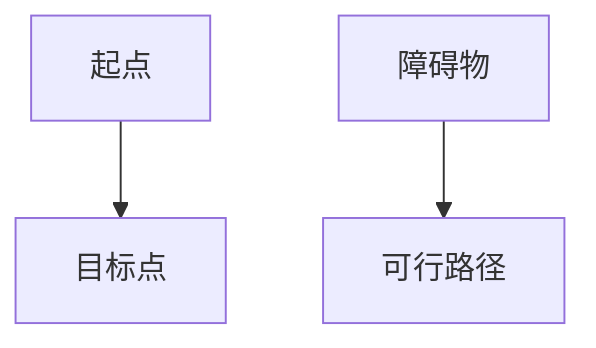
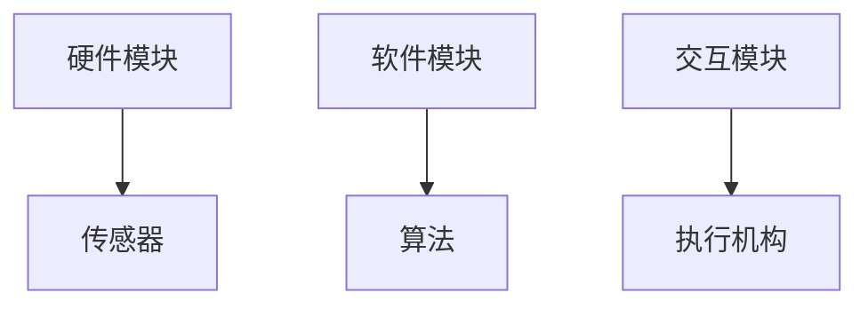
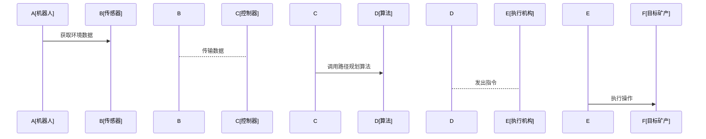

                 


# 价值投资中的深海采矿机器人技术前景

> **关键词**: 深海采矿、机器人技术、价值投资、路径规划、目标识别、系统架构、算法实现

> **摘要**: 本文探讨了深海采矿机器人技术在价值投资中的前景，分析了其核心技术、系统架构、算法原理，并通过实际案例展示了其应用潜力。文章从背景介绍、核心概念、算法实现、系统架构、项目实战、最佳实践等多方面进行了详细阐述，为投资者和技术爱好者提供了深入的分析和见解。

---

# 第一部分: 价值投资中的深海采矿机器人技术背景

# 第1章: 深海采矿与机器人技术的结合

## 1.1 深海采矿的现状与挑战

### 1.1.1 深海矿产资源的分布与价值

深海矿产资源主要分布在海底多金属结核、多金属硫化物和多金属泥等多种形式中，这些资源富含铜、镍、钴等贵金属，具有极高的经济价值。随着陆地矿产资源的枯竭，深海采矿成为全球关注的焦点。

### 1.1.2 深海采矿的传统技术与局限性

传统深海采矿依赖于大型船舶和 dredging（疏浚）技术，但这些技术成本高昂、效率低下，且对环境破坏严重。此外，深海环境的复杂性和危险性使得传统技术难以应对。

### 1.1.3 深海采矿的环境与经济影响

深海采矿对海洋生态系统的影响不可忽视，但其经济效益却非常显著。通过机器人技术，可以大幅降低成本，提高效率，同时减少对环境的破坏。

## 1.2 机器人技术在深海采矿中的应用前景

### 1.2.1 机器人技术的定义与特点

机器人技术是一种结合了机械、电子、计算机和人工智能等多学科的综合技术，具有高精度、高效率和高可靠性的特点。在深海采矿中，机器人技术可以实现对海底资源的自动化开采。

### 1.2.2 深海采矿中机器人技术的核心优势

相比传统技术，机器人技术具有以下优势：
1. **高精度**：机器人可以通过传感器和算法实现精准的资源定位和开采。
2. **高效率**：机器人可以在恶劣环境中持续工作，大幅提高采矿效率。
3. **低环境影响**：机器人技术可以减少对海洋生态系统的破坏。

### 1.2.3 深海采矿机器人技术的市场潜力

随着全球对贵金属需求的增加，深海采矿机器人技术的市场潜力巨大。预计未来几年，这一领域的投资将呈现爆发式增长。

## 1.3 价值投资视角下的深海采矿机器人技术

### 1.3.1 价值投资的基本概念

价值投资是一种投资策略，通过分析企业的内在价值，寻找被市场低估的投资机会。在深海采矿机器人技术领域，价值投资需要考虑技术的先进性、市场的潜力和企业的财务状况。

### 1.3.2 深海采矿机器人技术的商业价值

深海采矿机器人技术不仅具有巨大的经济价值，还能够带来显著的社会效益，如减少资源浪费、保护环境等。

### 1.3.3 价值投资中的技术评估与风险分析

投资者在进行价值投资时，需要对深海采矿机器人技术的技术成熟度、市场前景、竞争环境和政策风险进行全面评估。

## 1.4 本章小结

---

# 第二部分: 深海采矿机器人技术的核心概念与联系

# 第2章: 深海采矿机器人技术的核心原理

## 2.1 深海采矿机器人技术的系统构成

### 2.1.1 机器人硬件组成

深海采矿机器人通常由机械臂、传感器、控制器和执行机构组成。这些硬件设备协同工作，实现对海底资源的精准开采。

### 2.1.2 机器人软件系统

软件系统包括路径规划算法、目标识别算法和数据处理模块。这些算法帮助机器人实现自主导航和高效作业。

### 2.1.3 机器人与环境的交互机制

机器人通过传感器感知环境，通过执行机构与环境交互。这种交互机制是深海采矿机器人技术的核心。

## 2.2 深海采矿机器人技术的关键技术

### 2.2.1 自动化采矿技术

自动化采矿技术通过机器人实现对海底资源的自动开采，显著提高效率和降低成本。

### 2.2.2 机器人导航与定位技术

导航与定位技术是深海采矿机器人技术的关键，确保机器人在复杂环境中准确导航。

### 2.2.3 机器人作业的安全性与可靠性

深海环境的极端条件对机器人作业的安全性和可靠性提出了更高的要求。

## 2.3 深海采矿机器人技术的核心要素对比

### 2.3.1 不同采矿技术的对比分析

| 技术类型       | 优点                     | 缺点                     |
|----------------|--------------------------|--------------------------|
| 传统采矿技术   | 成本低，技术成熟         | 环境影响大，效率低       |
| 机器人采矿技术 | 高效，环保               | 成本高，技术复杂         |

### 2.3.2 机器人技术与传统采矿技术的优劣势对比

| 技术类型       | 优势                     | 劣势                     |
|----------------|--------------------------|--------------------------|
| 机器人技术     | 高效，精准               | 技术复杂，成本高         |
| 传统技术       | 成本低，技术成熟         | 环境影响大，效率低       |

### 2.3.3 核心技术的ER实体关系图

```mermaid
graph TD
A[机器人] --> B[传感器]
B --> C[控制器]
C --> D[执行机构]
E[环境] --> F[目标矿产]
```



## 2.4 本章小结

---

# 第三部分: 深海采矿机器人技术的算法原理

# 第3章: 深海采矿机器人技术的算法实现

## 3.1 深海采矿机器人路径规划算法

### 3.1.1 路径规划的基本概念

路径规划是机器人在复杂环境中找到最优路径的过程，是深海采矿机器人技术的核心算法之一。

### 3.1.2 常用路径规划算法（如A*算法）

A*算法是一种常用的路径规划算法，通过评估节点的优先级，找到从起点到目标的最短路径。



### 3.1.3 基于概率的路径优化算法

基于概率的路径优化算法通过评估路径的可能性，选择最优路径。

$$P(路径) = \frac{1}{1 + e^{-x}}$$

## 3.2 深海采矿机器人目标识别算法

### 3.2.1 目标识别的基本原理

目标识别算法通过图像处理和模式识别，实现对目标矿产的精准识别。

### 3.2.2 基于深度学习的目标识别算法

基于深度学习的目标识别算法通过训练神经网络，实现对目标的高精度识别。

### 3.2.3 算法实现的数学模型

目标识别算法的数学模型如下：

$$y = f(x)$$

其中，$x$ 是输入图像，$f$ 是神经网络模型，$y$ 是输出结果。

## 3.3 算法实现的数学模型与公式

### 3.3.1 路径规划的数学模型

路径规划的数学模型如下：

$$C = \min \sum_{i=1}^{n} c_i$$

其中，$c_i$ 是路径中的成本，$n$ 是路径的长度。

### 3.3.2 目标识别的数学模型

目标识别的数学模型如下：

$$P(y|x) = \frac{1}{\sqrt{2\pi\sigma^2}} e^{-\frac{(y - \mu)^2}{2\sigma^2}}$$

其中，$\mu$ 是均值，$\sigma^2$ 是方差。

## 3.4 本章小结

---

# 第四部分: 深海采矿机器人技术的系统分析与架构设计

# 第4章: 深海采矿机器人技术的系统分析

## 4.1 深海采矿机器人系统的功能设计

深海采矿机器人系统的主要功能包括资源探测、路径规划、目标识别和作业执行。

### 4.1.1 资源探测

资源探测是深海采矿机器人的首要任务，通过传感器实现对海底资源的精确定位。

### 4.1.2 路径规划

路径规划算法帮助机器人找到从起点到目标的最优路径。

### 4.1.3 目标识别

目标识别算法实现对目标矿产的精准识别。

### 4.1.4 作业执行

作业执行模块负责实现对目标矿产的开采和收集。

## 4.2 深海采矿机器人系统的架构设计

### 4.2.1 系统架构的模块划分

深海采矿机器人系统的架构通常包括硬件模块、软件模块和交互模块。

### 4.2.2 系统架构的mermaid图



### 4.2.3 系统接口设计

系统接口设计包括传感器接口、控制器接口和执行机构接口。

### 4.2.4 系统交互的mermaid序列图



## 4.3 本章小结

---

# 第五部分: 深海采矿机器人技术的项目实战

# 第5章: 深海采矿机器人技术的项目实战

## 5.1 项目环境搭建

### 5.1.1 开发环境的选择

建议使用Linux系统，安装Python、ROS（机器人操作系统）和相关开发工具。

### 5.1.2 项目依赖的安装

安装必要的依赖项，如numpy、opencv、scipy等。

## 5.2 系统核心实现源代码

### 5.2.1 路径规划算法的实现

```python
import numpy as np
import math

def a_star(start, goal, obstacles):
    # 定义启发函数
    def heuristic(nodo, goal):
        return np.sqrt((nodo.x - goal.x)**2 + (nodo.y - goal.y)**2)
    
    # 初始化开放列表和闭合列表
    open_list = []
    closed_list = set()
    
    # 启始节点加入开放列表
    start.g = 0
    start.h = heuristic(start, goal)
    heapq.heappush(open_list, (start.g + start.h, start))
    
    while open_list:
        current = heapq.heappop(open_list)
        if current in closed_list:
            continue
        closed_list.add(current)
        
        if current == goal:
            break
        
        for neighbor in current.neighbors:
            if neighbor not in closed_list:
                temp_g = current.g + current.distance(neighbor)
                temp_h = heuristic(neighbor, goal)
                temp_f = temp_g + temp_h
                if (temp_f < neighbor.f):
                    neighbor.g = temp_g
                    neighbor.h = temp_h
                    neighbor.f = temp_f
                    heapq.heappush(open_list, (temp_f, neighbor))
    
    return path
```

### 5.2.2 目标识别算法的实现

```python
import cv2
import numpy as np

def target_recognition(image, model):
    # 预处理图像
    gray = cv2.cvtColor(image, cv2.COLOR_BGR2GRAY)
    edges = cv2.Canny(gray, 50, 150)
    
    # 使用预训练模型进行目标识别
    prediction = model.predict(edges)
    return prediction
```

### 5.2.3 系统交互流程

1. **资源探测**：通过传感器获取海底资源分布数据。
2. **路径规划**：调用A*算法，找到最优路径。
3. **目标识别**：通过目标识别算法，精确定位目标矿产。
4. **作业执行**：通过执行机构，实现对目标矿产的开采。

## 5.3 项目实战案例分析

### 5.3.1 案例背景

假设我们在太平洋某海域发现了一处富含钴的多金属结核矿床，需要进行开采。

### 5.3.2 案例分析

通过路径规划算法，找到从起点到目标的最优路径。然后，通过目标识别算法，精确定位目标矿产的位置。最后，通过执行机构，实现对目标矿产的开采。

### 5.3.3 案例实现

1. **路径规划**：使用A*算法，找到从起点到目标的最优路径。
2. **目标识别**：通过目标识别算法，精确定位目标矿产的位置。
3. **作业执行**：通过执行机构，实现对目标矿产的开采。

## 5.4 本章小结

---

# 第六部分: 深海采矿机器人技术的最佳实践

# 第6章: 深海采矿机器人技术的最佳实践

## 6.1 最佳实践 tips

### 6.1.1 技术选型

在选择机器人技术时，需要综合考虑技术的先进性、成本和可靠性。

### 6.1.2 系统优化

通过优化算法和硬件设计，提高系统的效率和可靠性。

### 6.1.3 风险控制

在价值投资中，需要充分评估技术的风险，制定合理的风险管理策略。

## 6.2 本章小结

---

# 作者

**作者：AI天才研究院/AI Genius Institute & 禅与计算机程序设计艺术 /Zen And The Art of Computer Programming**

---

以上是《价值投资中的深海采矿机器人技术前景》的完整目录大纲和文章内容，文章详细阐述了深海采矿机器人技术的核心原理、系统架构、算法实现和实际应用，并从价值投资的角度分析了其市场潜力和投资风险。通过具体的案例分析和代码实现，为读者提供了全面的视角和深入的见解。

