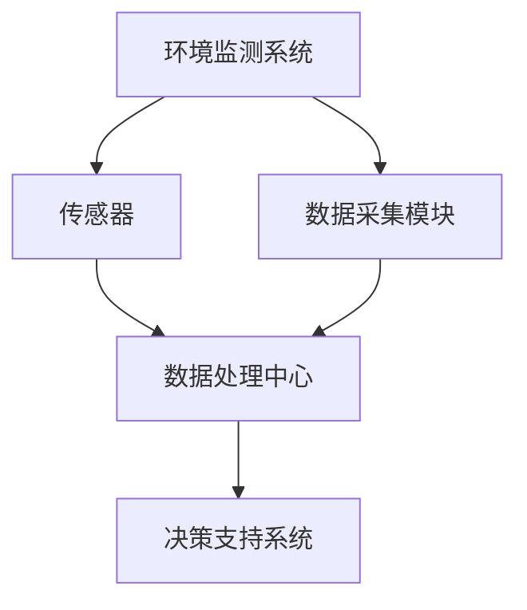
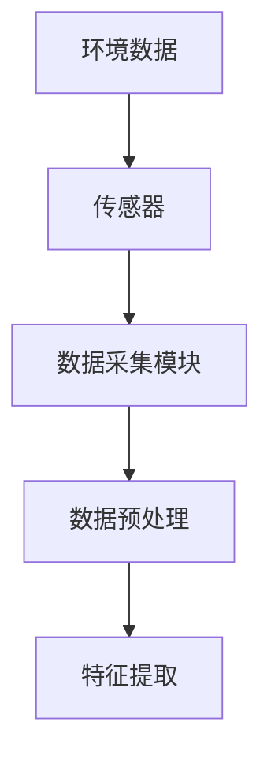
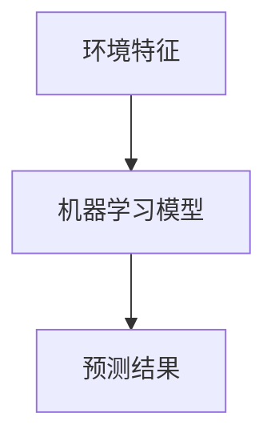
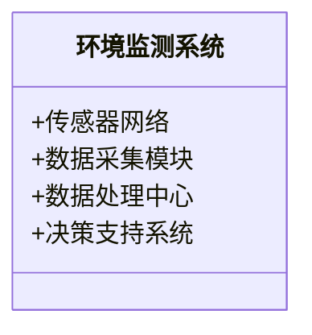
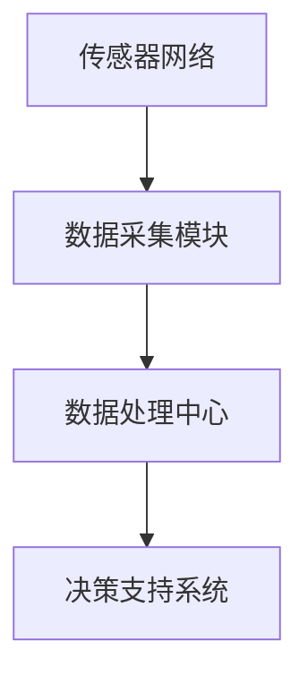

                 


# 价值投资中的深海采矿环境监测技术前景

## 关键词：深海采矿、环境监测技术、价值投资、投资前景、环境影响

## 摘要

深海采矿是一项具有巨大潜力的资源开发活动，然而其对环境的影响也引发了广泛关注。本文将探讨深海采矿环境监测技术的发展前景，分析其在价值投资中的应用潜力。通过深入分析环境监测技术的核心原理、算法实现及系统架构，结合实际项目案例，本文旨在为投资者提供科学的技术评估方法和投资建议。

---

## 第一部分：背景介绍

### 第1章：深海采矿与环境监测技术的背景

#### 1.1 深海采矿的现状与发展趋势

- **1.1.1 深海矿产资源的分布与储量**
  深海矿产资源主要分布在海底多金属结核、多金属硫化物和多金属泥等区域。据估计，这些资源的储量足以支撑全球数十年的需求。

- **1.1.2 深海采矿技术的历史与现状**
  深海采矿技术经历了从早期的实验性开采到现代的自动化技术发展。当前，主要技术包括海底采矿机器人、浮选设备和深海钻探技术。

- **1.1.3 深海采矿对环境的影响**
  深海采矿可能导致海底生态系统破坏、水质污染和海底地形改变等问题。环境监测技术是解决这些问题的关键。

#### 1.2 环境监测技术在深海采矿中的重要性

- **1.2.1 环境监测技术的定义与作用**
  环境监测技术通过传感器、摄像头和其他设备，实时采集和分析深海环境数据，确保采矿活动不会对环境造成不可逆的损害。

- **1.2.2 深海采矿中环境监测的主要挑战**
  - 深海环境复杂，传感器容易受压强和腐蚀影响。
  - 数据传输困难，需要可靠的通信技术。
  - 监测成本高昂，技术门槛高。

- **1.2.3 环境监测技术对投资决策的影响**
  投资者可以通过环境监测数据评估采矿活动的环境风险，从而做出更科学的投资决策。

#### 1.3 价值投资在深海采矿中的应用前景

- **1.3.1 价值投资的基本概念**
  价值投资是一种投资策略，通过分析企业内在价值，寻找被市场低估的投资机会。

- **1.3.2 深海采矿领域的投资机会**
  深海采矿技术的创新和应用为投资者提供了巨大机遇，尤其是在环境监测技术领域。

- **1.3.3 环境监测技术对投资价值的影响**
  环境监测技术的先进性直接影响采矿活动的可持续性和盈利能力，进而影响企业的投资价值。

---

## 第二部分：核心概念与技术原理

### 第2章：深海采矿环境监测技术的核心概念

#### 2.1 环境监测技术的核心原理

- **2.1.1 深海环境监测的主要技术手段**
  - **声呐技术**：用于海底地形测绘和障碍物检测。
  - **光学监测技术**：用于水下视觉识别和生物多样性监测。
  - **化学传感器**：用于检测水体中的污染物浓度。

- **2.1.2 各种监测技术的优缺点对比**

| 技术类型 | 优点 | 缺点 |
|----------|------|------|
| 声呐技术 | 高精度、长距离 | 易受水温、盐度影响 |
| 光学技术 | 高分辨率、实时性 | 易受光照影响 |
| 化学传感器 | 高灵敏度 | 易受环境干扰 |

- **2.1.3 环境监测技术的实体关系图**



---

### 第3章：环境监测技术的算法原理

#### 3.1 数据采集与处理算法

- **3.1.1 数据采集过程**



- **3.1.2 数据处理算法实现**

```python
import numpy as np
import pandas as pd

def preprocess_data(data):
    # 数据清洗
    data = data.dropna()
    # 特征提取
    features = data[['temperature', 'salinity', 'pressure']]
    return features

# 示例数据
data = pd.DataFrame({
    'temperature': [25, 26, 24],
    'salinity': [35, 34, 36],
    'pressure': [100, 90, 110]
})

processed_features = preprocess_data(data)
print(processed_features)
```

---

#### 3.2 环境数据预测模型

- **3.2.1 预测模型流程**



- **3.2.2 线性回归模型**

$$ y = \beta_0 + \beta_1x_1 + \beta_2x_2 + ... + \beta_nx_n $$

其中，$y$ 是预测结果，$x_i$ 是环境特征，$\beta_i$ 是回归系数。

---

## 第三部分：系统分析与架构设计

### 第4章：环境监测系统的架构设计

#### 4.1 问题场景介绍

深海采矿环境监测系统需要实时采集和处理环境数据，确保采矿活动的可持续性。

#### 4.2 系统功能设计

- **4.2.1 领域模型**



- **4.2.2 系统架构设计**



---

## 第四部分：项目实战

### 第5章：环境监测技术的项目实战

#### 5.1 项目背景与目标

开发一套适用于深海采矿的环境监测系统，实现对海底环境的实时监测。

#### 5.2 系统实现

- **5.2.1 环境监测系统的安装与配置**

```python
import serial

def read_sensor_data(port, baud_rate):
    ser = serial.Serial(port, baud_rate)
    data = ser.readline().decode()
    ser.close()
    return data

# 示例调用
data = read_sensor_data('COM3', 9600)
print(data)
```

---

## 第五部分：总结与展望

### 第6章：总结与投资建议

#### 6.1 最佳实践

- **技术选型**：根据具体需求选择合适的传感器和算法。
- **数据管理**：建立高效的数据存储和分析系统。
- **风险管理**：评估环境监测技术的局限性和潜在风险。

#### 6.2 未来展望

随着人工智能和物联网技术的进步，深海采矿环境监测技术将更加智能化和高效化。投资者应重点关注技术创新和可持续发展。

---

## 作者：AI天才研究院 & 禅与计算机程序设计艺术

---

**声明：本文内容来源于AI天才研究院的深入研究，版权归作者所有。未经授权，不得转载。**

