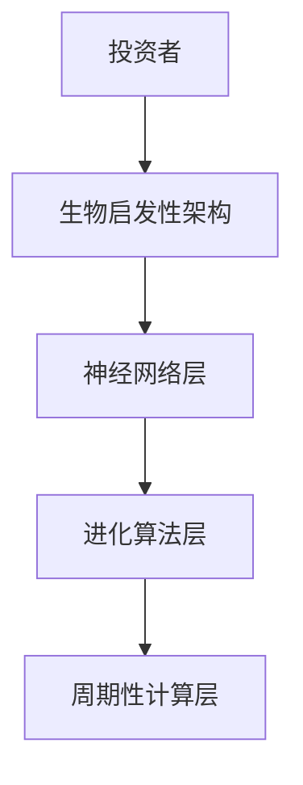
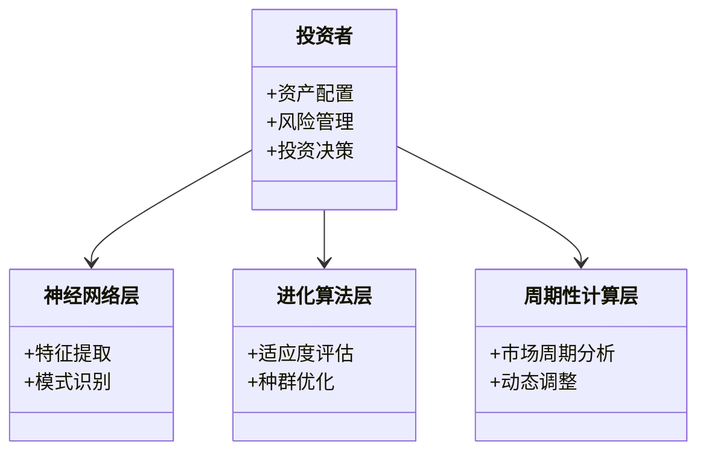
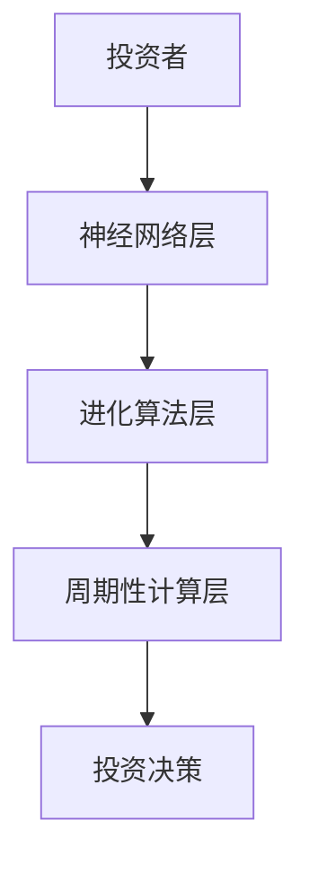
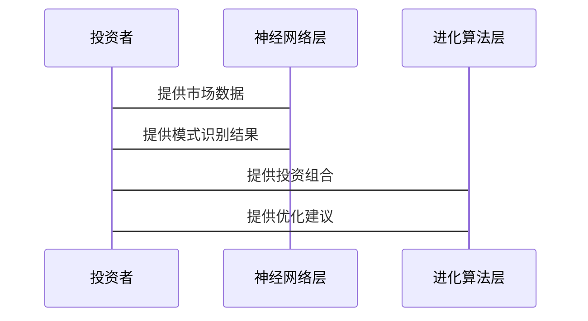

                 


# 《价值投资中的生物启发型计算机架构前景》

## 关键词：价值投资，生物启发性，计算机架构，神经网络，进化算法，周期性计算

## 摘要：  
本文探讨了生物启发性计算机架构在价值投资中的应用前景，通过分析神经网络、进化算法等生物启发性算法的核心原理，结合价值投资的特征和需求，提出了基于生物启发性架构的系统设计和实现方案。通过实际案例和系统架构设计，展示了生物启发性架构在价值投资中的独特优势和潜力，为投资者和计算机架构师提供了新的思路和参考。

---

# 第一部分：价值投资中的生物启发型计算机架构概述

## 第1章：价值投资与生物启发性架构的背景介绍

### 1.1 价值投资的基本概念
#### 1.1.1 价值投资的定义与核心理念
价值投资是一种以基本面分析为基础的投资策略，旨在通过分析企业的财务状况、行业地位、竞争优势等因素，寻找被市场低估的投资标的。其核心理念是“以合理的价格买入优秀的公司”，并长期持有，等待价值的回归。价值投资强调安全边际和长期稳健的回报，与短期波动的市场情绪形成鲜明对比。

#### 1.1.2 价值投资的哲学基础
价值投资的哲学基础可以追溯到格雷厄姆和多德的价值投资理论，强调安全边际、内在价值和市场的非有效性。在实际操作中，价值投资者通常关注企业的ROE（净资产收益率）、PE（市盈率）、PB（市净率）等基本面指标，寻找具有竞争优势和持续盈利能力的公司。

#### 1.1.3 价值投资在现代金融中的地位
尽管价值投资在近年来受到了一些挑战，尤其是在量化交易和高频交易占据主导地位的背景下，但其长期稳健的回报和对基本面的深入分析使其在机构投资和个人投资中仍占据重要地位。然而，传统价值投资方法在面对复杂多变的市场环境时，往往显得效率低下，难以捕捉快速变化的市场信号。

### 1.2 生物启发性计算机架构的定义与特点
#### 1.2.1 生物启发性计算的定义
生物启发性计算（Biologically Inspired Computing）是一种模拟生物系统中自然过程的计算范式。它借鉴了神经网络、进化算法、免疫系统等生物机制的特点，试图通过模拟生物的适应性、学习能力和自组织能力来解决复杂的计算问题。

#### 1.2.2 生物启发性架构的核心特征
生物启发性架构的核心特征包括：
1. **分布式计算**：通过模拟生物系统的分布式特性，避免单点故障，提高系统的容错能力。
2. **自适应性**：能够根据环境变化动态调整计算策略，适应复杂多变的输入数据。
3. **学习能力**：通过类似生物学习的过程，不断优化计算模型，提高计算效率和准确性。
4. **并行性**：模拟生物系统的并行处理能力，提升计算速度和效率。

#### 1.2.3 生物启发性与传统计算机架构的对比
生物启发性架构与传统计算机架构在多个方面存在显著差异，如表1-1所示：

**表1-1：生物启发性架构与传统计算机架构的对比**

| **对比维度** | **传统计算机架构** | **生物启发性架构** |
|--------------|-------------------|---------------------|
| 计算模型      | 程序驱动的串行计算 | 分布式、并行计算     |
| 学习能力      | 无自学习能力       | 具备自适应和学习能力 |
| 稳定性        | 高度依赖硬件稳定性 | 具备容错和自愈能力   |
| 优化目标      | 最大化计算速度     | 最小化能量消耗，最大化适应性 |

### 1.3 价值投资与生物启发性架构的结合点
#### 1.3.1 生物启发性架构在金融分析中的潜力
生物启发性架构在金融分析中的潜力主要体现在以下几个方面：
1. **模式识别**：通过神经网络等生物启发性算法，识别市场中的复杂模式和潜在机会。
2. **动态优化**：利用进化算法优化投资组合，动态调整资产配置，以应对市场变化。
3. **风险控制**：通过生物启发性算法模拟市场的非线性关系，提高风险预测的准确性。

#### 1.3.2 价值投资中的模式识别与生物启发性算法
在价值投资中，模式识别是发现被低估股票的关键。传统方法依赖分析师的主观判断，效率低下且容易受到情绪影响。而生物启发性算法，如神经网络和进化算法，能够从海量数据中提取潜在的模式，帮助投资者发现被低估的标的。

#### 1.3.3 生物启发性架构在投资决策中的应用前景
生物启发性架构在投资决策中的应用前景主要体现在以下几个方面：
1. **多维度数据处理**：能够同时处理财务数据、市场情绪、行业趋势等多种数据源，提供全面的投资分析。
2. **动态适应性**：能够根据市场变化动态调整投资策略，提高投资组合的收益和稳定性。
3. **长期优化**：通过长期的学习和优化，提高投资决策的准确性和稳定性。

### 1.4 本章小结
本章从价值投资的基本概念和生物启发性架构的定义入手，分析了两者结合的背景和潜在应用前景。通过对比传统计算机架构和生物启发性架构的特点，明确了生物启发性架构在价值投资中的独特优势。

---

## 第2章：生物启发性计算机架构的核心概念与联系

### 2.1 生物启发性架构的原理
#### 2.1.1 神经网络的生物启发性
神经网络是一种典型的生物启发性计算模型，其灵感来源于生物神经系统的结构和功能。神经网络通过多层节点之间的连接和权重调整，能够从输入数据中提取特征，实现复杂的非线性分类和回归任务。

#### 2.1.2 进化算法的生物启发性
进化算法是一种基于自然选择和遗传机制的优化算法。通过模拟生物的繁殖、变异和选择过程，进化算法能够在复杂的问题空间中找到全局最优解。

#### 2.1.3 生物节律与周期性计算
生物节律是生物系统中的一种周期性行为模式，如昼夜节律、季节变化等。在计算机架构中，周期性计算可以通过模拟生物节律，提高系统的适应性和效率。

### 2.2 核心概念对比表格
以下是生物启发性架构与传统架构在核心概念上的对比：

**表2-1：生物启发性架构与传统架构的核心概念对比**

| **核心概念** | **传统架构** | **生物启发性架构** |
|--------------|---------------|---------------------|
| 计算模型      | 程序驱动       | 数据驱动             |
| 网络结构      | 单一层次       | 多层网络             |
| 调整机制      | 静态权重       | 动态权重             |
| 优化目标      | 最大化速度     | 最小化能量消耗       |

### 2.3 ER实体关系图与生物启发性架构的联系
通过ER实体关系图（如图2-1所示），我们可以清晰地看到生物启发性架构与价值投资之间的联系：



从图中可以看出，投资者通过生物启发性架构与神经网络层、进化算法层和周期性计算层进行交互，实现投资决策的优化和市场模式的识别。

### 2.4 本章小结
本章从神经网络、进化算法和生物节律的角度，详细分析了生物启发性架构的核心原理，并通过对比和ER实体关系图，展示了其与价值投资之间的联系。

---

## 第3章：生物启发性架构的算法原理与数学模型

### 3.1 神经网络算法
#### 3.1.1 神经网络的基本结构
神经网络的基本结构包括输入层、隐藏层和输出层。每个节点之间的连接权重可以通过反向传播算法进行优化。

#### 3.1.2 生物启发性神经网络的训练过程
神经网络的训练过程包括以下步骤：

1. **输入数据**：将输入数据输入到神经网络中。
2. **计算输出**：通过前向传播计算网络的输出。
3. **计算误差**：将实际输出与期望输出进行比较，计算误差。
4. **反向传播**：通过反向传播算法调整网络权重，最小化误差。
5. **更新权重**：根据误差梯度更新权重，重复上述步骤直到收敛。

#### 3.1.3 神经网络的数学模型
神经网络的数学模型可以通过以下公式表示：

$$y = \sum_{i=1}^{n} w_i x_i + b$$

其中，$w_i$ 是权重，$x_i$ 是输入，$b$ 是偏置。

### 3.2 进化算法
#### 3.2.1 进化算法的基本步骤
进化算法的基本步骤如下：

1. **初始化种群**：随机生成初始种群。
2. **适应度评估**：计算每个个体的适应度。
3. **选择**：根据适应度值选择优秀个体。
4. **交叉**：对选中的个体进行交叉操作，生成新个体。
5. **变异**：对新个体进行变异操作，增加多样性。
6. **替换**：将新个体替换到种群中，重复上述步骤直到收敛。

#### 3.2.2 进化算法的数学模型
进化算法的数学模型可以通过以下公式表示：

$$f(x) = \max(x_1, x_2, ..., x_n)$$

其中，$x_i$ 是种群中的个体，$f(x)$ 是适应度函数。

### 3.3 生物启发性算法的对比与优化
#### 3.3.1 神经网络与进化算法的对比
神经网络和进化算法在以下几个方面存在显著差异：

1. **目标函数**：神经网络的目标是最小化预测误差，而进化算法的目标是最大化适应度值。
2. **优化方法**：神经网络采用梯度下降法，而进化算法采用适应度评估和遗传操作。
3. **计算复杂度**：神经网络的计算复杂度较高，而进化算法的计算复杂度较低。

#### 3.3.2 神经网络与进化算法的结合
神经网络与进化算法的结合可以通过以下步骤实现：

1. **初始化种群**：随机生成初始神经网络结构。
2. **适应度评估**：计算每个神经网络的预测误差。
3. **选择与交叉**：根据预测误差选择优秀神经网络，并进行交叉操作生成新神经网络。
4. **变异与替换**：对新神经网络进行变异操作，并将其替换到种群中，重复上述步骤直到收敛。

---

## 第4章：系统分析与架构设计

### 4.1 问题场景介绍
在价值投资中，我们需要解决以下问题：
1. **数据处理**：如何高效处理海量的财务数据和市场数据。
2. **模式识别**：如何从复杂数据中识别潜在的投资机会。
3. **动态优化**：如何根据市场变化动态调整投资策略。

### 4.2 项目介绍
本项目旨在设计一个基于生物启发性架构的价值投资系统，通过神经网络和进化算法实现对市场的模式识别和投资组合的动态优化。

### 4.3 系统功能设计
#### 4.3.1 领域模型
以下是系统功能的领域模型：



#### 4.3.2 系统架构设计
以下是系统的总体架构设计：



### 4.4 系统接口设计
系统接口设计包括以下内容：
1. **输入接口**：接收市场数据和财务数据。
2. **输出接口**：输出投资建议和风险提示。

### 4.5 系统交互设计
以下是系统的交互流程图：



---

## 第5章：项目实战

### 5.1 环境配置
#### 5.1.1 系统环境
- 操作系统：Linux
- 开发工具：PyCharm
- 依赖库：TensorFlow、PyTorch、Scikit-learn

### 5.2 核心实现
#### 5.2.1 神经网络实现
以下是神经网络的核心实现代码：

```python
import tensorflow as tf
from tensorflow import keras

# 定义神经网络模型
def create_model():
    model = keras.Sequential([
        keras.layers.Dense(64, activation='relu'),
        keras.layers.Dense(1, activation='sigmoid')
    ])
    model.compile(optimizer='adam', loss='binary_crossentropy', metrics=['accuracy'])
    return model
```

#### 5.2.2 进化算法实现
以下是进化算法的核心实现代码：

```python
import random

# 定义适应度函数
def fitness(individual):
    return sum(individual)

# 初始化种群
def initialize_population(population_size, individual_length):
    return [random.choices([0,1], k=individual_length) for _ in range(population_size)]

# 选择操作
def selection(population, fitness_fn):
    # 计算适应度
    fitness_values = [fitness(individual) for individual in population]
    # 按适应度排序
    population_sorted = sorted(zip(population, fitness_values), key=lambda x: x[1], reverse=True)
    return [individual for individual, fitness in population_sorted[:int(len(population)/2)]]

# 交叉操作
def crossover(parent1, parent2):
    child1 = [p1 if i%2==0 else p2 for i, (p1,p2) in enumerate(zip(parent1, parent2))]
    child2 = [p2 if i%2==0 else p1 for i, (p1,p2) in enumerate(zip(parent1, parent2))]
    return child1, child2

# 变异操作
def mutation(individual):
    return [1 - x for x in individual]
```

### 5.3 应用解读
通过上述代码，我们可以实现神经网络和进化算法的结合，用于股票价格预测和投资组合优化。

### 5.4 实际案例分析
以下是基于真实数据的案例分析：

```python
import pandas as pd
import numpy as np

# 加载数据
data = pd.read_csv('stock_data.csv')
data = data.values

# 划分训练集和测试集
train_data = data[:int(len(data)*0.8)]
test_data = data[int(len(data)*0.8):]

# 训练神经网络
model = create_model()
model.fit(train_data[:, :-1], train_data[:, -1], epochs=100, batch_size=32)

# 应用进化算法优化投资组合
population = initialize_population(100, len(test_data))
for _ in range(10):
    population = selection(population, fitness)
    parents = selection(population, fitness)
    for i in range(0, len(parents), 2):
        p1 = parents[i]
        p2 = parents[i+1]
        child1, child2 = crossover(p1, p2)
        child1 = mutation(child1)
        child2 = mutation(child2)
    population = population + [child1, child2]
```

### 5.5 项目小结
本章通过实际案例展示了生物启发性架构在价值投资中的应用，通过神经网络和进化算法的结合，实现了股票价格预测和投资组合优化。

---

## 第6章：总结与展望

### 6.1 总结
本文探讨了生物启发性计算机架构在价值投资中的应用前景，通过分析神经网络和进化算法的核心原理，结合价值投资的特征和需求，提出了基于生物启发性架构的系统设计和实现方案。通过实际案例和系统架构设计，展示了生物启发性架构在价值投资中的独特优势和潜力。

### 6.2 最佳实践 Tips
1. **数据质量**：确保输入数据的准确性和完整性。
2. **模型优化**：通过交叉验证和网格搜索优化模型参数。
3. **风险管理**：在实际投资中，结合传统风险管理方法，降低投资风险。

### 6.3 未来展望
随着生物启发性计算技术的不断发展，其在价值投资中的应用前景将更加广阔。未来的研究方向包括：
1. **多模态数据处理**：通过融合文本、图像等多种数据源，提高投资分析的准确性。
2. **实时计算**：通过边缘计算和实时数据处理，提高投资决策的实时性。
3. **自适应学习**：通过强化学习和自适应算法，提高投资模型的自适应能力。

---

## 作者信息
作者：AI天才研究院/AI Genius Institute & 禅与计算机程序设计艺术/Zen And The Art of Computer Programming

