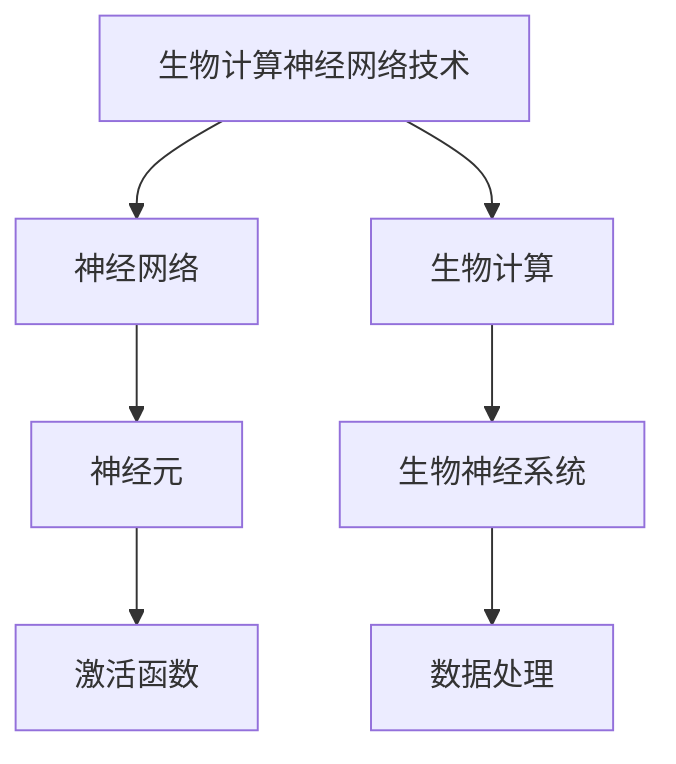
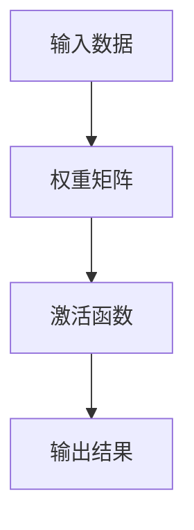
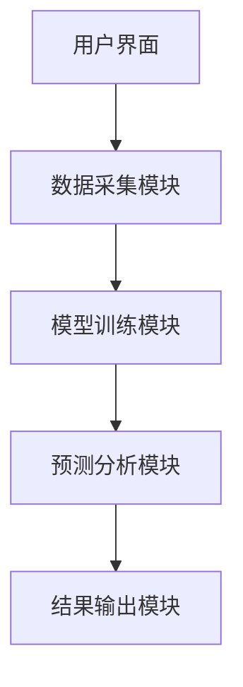

                 


# 价值投资中的生物计算神经网络技术前景

## 关键词：价值投资、生物计算、神经网络技术、投资策略、金融科技、深度学习

## 摘要：
本文探讨了生物计算神经网络技术在价值投资中的应用前景。通过分析生物计算和神经网络技术的核心原理，结合价值投资的特点，本文详细阐述了生物计算神经网络技术在金融领域的潜力、算法原理、系统设计及实际案例。文章还探讨了技术的优势与挑战，并展望了未来的发展趋势，为价值投资者和技术开发者提供了有益的参考。

---

## 第一部分: 价值投资中的生物计算神经网络技术背景

### 第1章: 价值投资的基本概念与现状

#### 1.1 价值投资的定义与核心理念
- **1.1.1 价值投资的起源与发展**  
  价值投资是一种以基本面分析为基础的投资策略，起源于20世纪初。本杰明·格雷厄姆和戴维·多德是价值投资的奠基人。其核心理念是寻找市场价值被低估的股票，通过长期持有实现收益。

- **1.1.2 价值投资的核心原则**  
  价值投资强调安全边际、长期持有和逆向思维。投资者应关注公司的内在价值，而非市场波动，并在市场恐慌时寻找机会。

- **1.1.3 价值投资在现代金融中的地位**  
  随着金融市场的复杂化，传统价值投资方法面临数据量大、分析效率低等挑战。引入新技术（如生物计算神经网络）可以提升价值投资的效率和准确性。

#### 1.2 生物计算与神经网络技术的概述
- **1.2.1 生物计算的基本概念**  
  生物计算是指模拟生物神经系统（如大脑）的信息处理方式，利用神经网络进行数据处理和分析。其核心在于通过模拟生物神经元的连接和计算方式，实现高效的信息处理。

- **1.2.2 神经网络技术的原理**  
  神经网络是一种人工智能技术，通过多层神经元的连接和激活函数，实现对复杂数据的非线性拟合。其学习能力使其能够发现数据中的隐含模式。

- **1.2.3 生物计算与神经网络技术的结合**  
  生物计算神经网络技术结合了生物学和计算机科学，通过模拟生物神经系统的结构和功能，实现高效的数据分析和决策。

### 第2章: 价值投资中的生物计算神经网络技术应用前景
- **2.1 生物计算神经网络技术在金融领域的潜力**  
  生物计算神经网络技术能够处理海量数据，发现传统方法难以察觉的模式，从而为价值投资提供新的视角。

- **2.2 价值投资中的生物计算神经网络技术趋势**  
  随着技术的进步，生物计算神经网络在价值投资中的应用将更加广泛，包括市场预测、风险评估和投资组合优化等方面。

---

## 第二部分: 生物计算神经网络技术的核心概念与联系

### 第3章: 生物计算神经网络技术的核心原理
- **3.1 神经网络的基本原理**  
  神经网络通过多层神经元的连接，利用激活函数和损失函数进行训练，实现对数据的分类和预测。

- **3.2 生物计算的基本原理**  
  生物计算模拟生物神经系统的信息处理方式，通过并行计算和自适应学习，提高数据处理效率。

### 第4章: 生物计算神经网络技术的核心概念与联系
- **4.1 生物计算神经网络技术的核心概念**  
  生物计算神经网络技术结合了生物计算和神经网络技术，具有高效、并行和自适应等特点。

- **4.2 生物计算神经网络技术的实体关系图**  
  下图展示了生物计算神经网络技术的核心实体及其关系：



---

## 第三部分: 生物计算神经网络技术的算法原理讲解

### 第5章: 生物计算神经网络技术的算法原理
- **5.1 神经网络算法的流程图**  
  下图展示了神经网络算法的总体流程：



- **5.2 生物计算神经网络技术的数学模型与公式**  
  神经网络的核心公式包括权重更新公式：

  $$ W_{new} = W_{old} + \eta (y - y_{pred}) $$

  激活函数（如ReLU）的定义：

  $$ f(x) = \max(0, x) $$

### 第6章: 生物计算神经网络技术的系统设计

#### 6.1 系统架构设计
- **6.1.1 系统功能设计**  
  价值投资系统包括数据采集、模型训练、预测分析和结果输出四个模块。

- **6.1.2 系统架构图**  
  下图展示了价值投资系统的架构：



---

## 第四部分: 项目实战

### 第7章: 生物计算神经网络技术的项目实战
- **7.1 环境安装**  
  需要安装Python、TensorFlow和Keras等工具。

- **7.2 系统核心实现源代码**  
  下面是一个简单的神经网络实现代码：

  ```python
  import tensorflow as tf
  from tensorflow import keras

  # 数据准备
  x = tf.constant([1, 2, 3, 4])
  y = tf.constant([0.1, 0.2, 0.3, 0.4])

  # 模型定义
  model = keras.Sequential([
      keras.layers.Dense(1, input_dim=1),
      keras.layers.Dense(1)
  ])

  # 模型编译
  model.compile(optimizer='adam', loss='mean_squared_error')

  # 模型训练
  model.fit(x, y, epochs=100)

  # 模型预测
  print(model.predict([5]))
  ```

- **7.3 代码应用解读与分析**  
  代码实现了一个简单的回归模型，用于预测股票价格。模型通过训练学习数据中的规律，并对新数据进行预测。

- **7.4 实际案例分析**  
  通过分析某公司的股票数据，验证模型的预测能力，并调整参数以提高准确性。

---

## 第五部分: 总结与展望

### 第8章: 总结与展望
- **8.1 最佳实践 tips**  
  投资者应结合技术优势，合理配置资产，降低风险。

- **8.2 小结**  
  生物计算神经网络技术为价值投资提供了新的工具和方法，能够提高分析效率和准确性。

- **8.3 注意事项**  
  投资者需注意技术的局限性，结合市场实际情况进行决策。

- **8.4 拓展阅读**  
  推荐阅读《深度学习》（作者：Ian Goodfellow）和《神经网络与深度学习》（作者：周志华）等书籍。

---

## 作者：AI天才研究院/AI Genius Institute & 禅与计算机程序设计艺术 /Zen And The Art of Computer Programming

