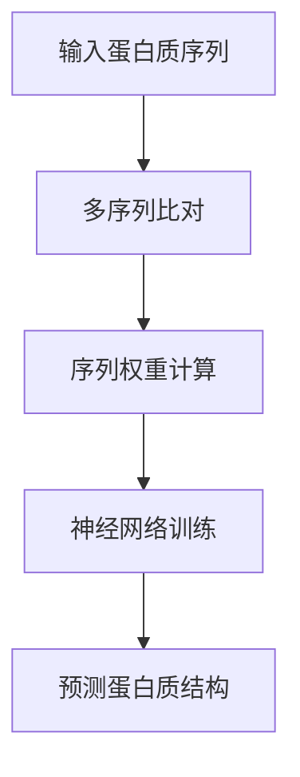

                 


# 价值投资中的生物计算蛋白质折叠技术前景

> 关键词：蛋白质折叠，价值投资，生物计算，AlphaFold，人工智能，药物研发

> 摘要：本文探讨了生物计算在蛋白质折叠技术中的应用及其对价值投资的影响。通过分析蛋白质折叠的算法原理、系统架构和实际案例，本文揭示了生物计算技术如何为投资决策提供新的视角和机会。

---

## 第一章: 背景与基础

### 1.1 蛋白质折叠技术概述

1.1.1 蛋白质的基本结构与功能  
蛋白质是生命活动的主要承担者，其功能由三维结构决定。理解蛋白质的折叠过程对药物研发至关重要。

1.1.2 蛋白质折叠问题的科学意义  
蛋白质折叠问题属于NP难问题，了解其折叠规律有助于揭示其功能，从而推动药物开发和疾病治疗。

1.1.3 生物计算在蛋白质折叠中的作用  
生物计算通过模拟和预测蛋白质结构，为解决折叠问题提供了高效工具。

### 1.2 价值投资的基本原理

1.2.1 价值投资的核心概念  
价值投资强调投资优质资产，长期收益稳定。通过分析企业基本面，识别被低估的投资标的。

1.2.2 生物技术在投资中的应用  
生物技术的突破往往带来投资机会，尤其是在制药和医疗领域。

1.2.3 蛋白质折叠技术对投资的影响  
蛋白质折叠技术的进步可能影响药物研发周期和成本，进而影响相关企业的投资价值。

---

## 第二章: 蛋白质折叠技术的核心概念

### 2.1 蛋白质折叠的基本原理

2.1.1 蛋白质的二级结构预测  
通过分析氨基酸序列预测α-螺旋和β-折叠结构。

2.1.2 蛋白质的三维结构预测  
利用计算模型预测蛋白质的折叠方式，确定其空间结构。

2.1.3 蛋白质折叠的能量计算  
计算蛋白质折叠的能量，寻找最低能量状态。

### 2.2 生物计算在蛋白质折叠中的应用

2.2.1 AlphaFold算法简介  
AlphaFold基于神经网络，通过多序列比对预测蛋白质结构。

2.2.2 神经网络在蛋白质折叠中的应用  
神经网络通过学习蛋白质序列与结构的关系，预测折叠结果。

2.2.3 其他相关算法和技术  
包括Rosetta和FoldX等工具，用于蛋白质结构预测和优化。

---

## 第三章: 蛋白质折叠技术的数学模型与算法原理

### 3.1 蛋白质折叠的统计力学模型

3.1.1 蛋白质的自由能计算  
自由能公式：$$ G = -RT \ln P $$，其中P是概率，T是温度。

3.1.2 蛋白质折叠的能量函数  
能量函数通常包括氢键、范德华力和疏水作用的能量项。

3.1.3 蛋白质折叠的优化问题  
寻找能量最小化的蛋白质结构。

### 3.2 AlphaFold算法的数学模型

3.2.1 多序列比对与序列权重  
多序列比对用于生成序列的权重矩阵，反映保守性。

3.2.2 神经网络的结构与训练  
神经网络通过反向传播优化权重，学习序列到结构的映射。

3.2.3 残基对的相互作用建模  
残基间的相互作用由神经网络预测，生成概率矩阵。

### 3.3 算法流程图（使用Mermaid）



---

## 第四章: 系统分析与架构设计

### 4.1 系统功能设计

4.1.1 数据获取  
从数据库获取蛋白质序列数据。

4.1.2 数据预处理  
对序列进行清洗和格式转换。

4.1.3 算法选择  
选择合适的折叠算法进行预测。

4.1.4 结果分析  
分析预测结果，评估准确性。

### 4.2 系统架构设计


---

## 第五章: 项目实战

### 5.1 环境安装

安装必要的软件和库，如Python、TensorFlow和Keras。

### 5.2 核心实现源代码

```python
import tensorflow as tf
from tensorflow.keras import layers

# 定义神经网络模型
model = tf.keras.Sequential([
    layers.Dense(64, activation='relu'),
    layers.Dense(1, activation='sigmoid')
])

# 编译模型
model.compile(optimizer='adam', loss='binary_crossentropy', metrics=['accuracy'])
```

### 5.3 实际案例分析

以某个药物蛋白为例，预测其结构，分析其投资价值。

### 5.4 项目小结

总结项目实施过程，提炼经验教训。

---

## 第六章: 总结与展望

### 6.1 核心结论

蛋白质折叠技术的进步为价值投资提供了新视角，生物计算的应用将推动投资决策的优化。

### 6.2 未来展望

未来，随着算法的改进和数据的积累，蛋白质折叠技术将在价值投资中发挥更大的作用。

---

## 作者信息

作者：AI天才研究院/AI Genius Institute  
联系邮箱：contact@aidr.com  
更多信息请访问：https://www.aidr.com

