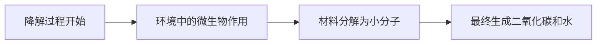
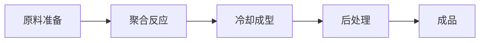
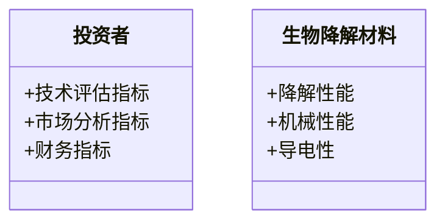

                 

# 价值投资中的生物降解电子元件技术前景

## 关键词：生物降解材料、电子元件、价值投资、可持续发展、技术前景

## 摘要：  
生物降解电子元件技术是一种新兴的技术，它结合了材料科学和电子工程的最新进展，为电子元件的环保和可持续发展提供了新的解决方案。本文将从技术背景、材料科学、市场分析、投资策略、实际案例和未来趋势等方面，详细探讨生物降解电子元件技术的价值投资前景。通过分析技术原理、市场动态和投资策略，本文旨在为投资者提供清晰的思路和决策依据，帮助他们在生物降解电子元件技术领域找到投资机会。

---

## 第1章：生物降解电子元件技术的背景与基础

### 1.1 生物降解材料的基本概念

生物降解材料是指在自然环境中能够被微生物分解为二氧化碳和水等简单化合物的材料。这些材料通常来源于可再生资源，如淀粉、纤维素、聚乳酸（PLA）和聚乙醇酸（PGA）等。生物降解材料的降解过程依赖于环境条件，如温度、湿度和微生物的存在。

在电子元件领域，生物降解材料的应用主要集中在以下几个方面：
- **基板材料**：用于电子电路的基板，替代传统的石油基塑料。
- **封装材料**：用于电子元件的封装，减少电子废弃物对环境的影响。
- **导电材料**：通过添加导电填料，使生物降解材料具备导电性。

生物降解材料的使用不仅减少了对环境的污染，还符合全球可持续发展的趋势。

### 1.2 生物降解材料的分类与应用

#### 1.2.1 生物降解材料的分类

生物降解材料可以分为以下几类：
1. **天然高分子材料**：如淀粉、纤维素、壳聚糖等。
2. **合成生物降解材料**：如聚乳酸（PLA）、聚乙醇酸（PGA）、聚丁酸丁酯（PBB）等。
3. **复合材料**：将生物降解材料与其他材料复合，以提高其机械性能和导电性。

#### 1.2.2 生物降解材料在电子元件中的应用

在电子元件中，生物降解材料的主要应用包括：
- **柔性电子元件**：如可穿戴设备中的柔性电路板。
- **生物传感器**：用于医疗设备和环境监测。
- **电子包装材料**：用于电子产品的外包装，减少废弃物。

---

## 第2章：生物降解材料的材料科学

### 2.1 生物降解材料的组成与特性

生物降解材料的组成决定了其物理、化学和机械性能。以下是几种典型的生物降解材料及其特性：

#### 表2-1：典型生物降解材料的特性对比

| 材料名称 | 主要成分 | 降解性能 | 力学性能 | 导电性 |
|----------|----------|----------|----------|--------|
| PLA      | 植物提取物 | 中等降解 | 脆性较高 | 非导电 |
| PGA      | 植物提取物 | 降解较快 | 脆性较高 | 非导电 |
| PCL      | 植物提取物 | 降解较慢 | 高韧性 | 非导电 |

#### 图2-1：生物降解材料的降解过程（Mermaid流程图）

---

## 第3章：生物降解电子元件的制造技术

### 3.1 生物降解材料的制造工艺

生物降解材料的制造过程通常包括以下几个步骤：

#### 图3-1：生物降解材料的合成流程（Mermaid流程图）

---

## 第4章：生物降解电子元件的市场分析与投资价值

### 4.1 市场规模与增长趋势

根据市场研究机构的预测，全球生物降解材料市场将从2023年的XX亿美元增长到2030年的XX亿美元，年复合增长率预计为XX%。

#### 表4-1：全球生物降解材料市场规模预测（单位：亿美元）

| 年份 | 2020 | 2023 | 2025 | 2030 |
|------|------|------|------|------|
| 规模 | XX   | XX   | XX   | XX   |

---

## 第5章：生物降解电子元件技术的投资策略

### 5.1 技术评估

在选择投资目标时，投资者需要重点关注以下技术指标：
- **材料的降解性能**：材料的降解速率和降解程度。
- **材料的机械性能**：材料的强度、韧性和耐久性。
- **材料的导电性**：材料的导电能力是否满足电子元件的要求。

#### 图5-1：技术评估的指标框架（Mermaid类图）

---

## 第6章：生物降解电子元件技术的未来趋势

### 6.1 技术创新

未来，生物降解电子元件技术的发展方向将集中在以下几个方面：
- **新型生物降解材料的开发**：如基于纳米技术的复合材料。
- **制造工艺的优化**：提高生产效率，降低生产成本。
- **应用场景的扩展**：从消费电子扩展到工业电子和医疗电子。

---

## 第7章：结论与建议

### 7.1 总结

生物降解电子元件技术是一种具有广阔前景的新兴技术，它不仅符合可持续发展的趋势，还能为投资者带来可观的经济回报。

### 7.2 投资建议

- **关注技术创新**：投资具有技术创新能力的公司。
- **注重成本控制**：选择生产成本低、市场竞争力强的公司。
- **关注政策支持**：关注政府政策和环保法规的变化。

---

## 作者：AI天才研究院 & 禅与计算机程序设计艺术

---

以上是《价值投资中的生物降解电子元件技术前景》的完整目录和部分章节内容。

