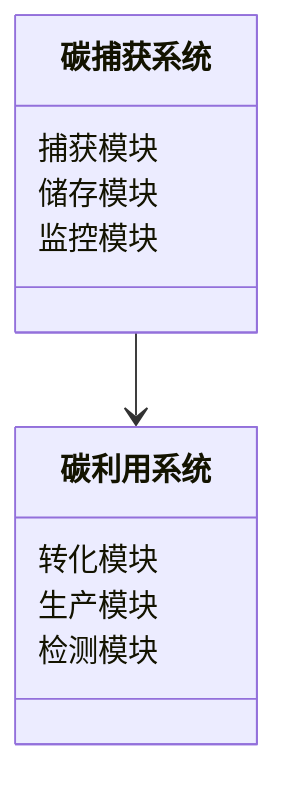
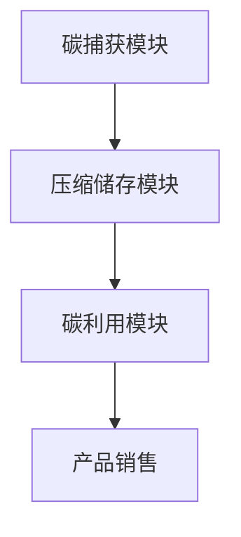

                 


# 价值投资中的碳捕获与利用技术分析

> 关键词：碳捕获，碳利用，价值投资，技术分析，经济模型，投资策略，可持续发展

> 摘要：本文深入分析了碳捕获与利用技术在价值投资中的应用潜力，从技术原理、经济模型到投资策略，全面探讨了如何通过技术创新和投资策略实现碳中和目标。文章结合实际案例，详细解读了碳捕获与利用技术的系统架构、算法原理和投资回报分析，为投资者提供了科学的决策参考。

---

# 第一部分：碳捕获与利用技术的背景与价值投资概述

## 第1章：碳捕获与利用技术的背景介绍

### 1.1 碳捕获技术的基本原理

碳捕获技术是一种通过物理或化学手段从工业排放源中捕获二氧化碳的技术。其核心原理包括：

1. **物理吸收法**：利用物理吸附剂（如活性炭）捕获二氧化碳。
2. **化学吸收法**：通过化学反应（如胺基溶液吸收）捕获二氧化碳。

### 1.2 碳利用技术的核心概念

碳利用技术将捕获的二氧化碳转化为高附加值的产品，如化学品、燃料或建筑材料。其核心概念包括：

1. **CO2到化学品**：将CO2转化为塑料、纤维等。
2. **CO2到燃料**：通过催化技术将CO2转化为甲醇、乙醇等燃料。
3. **CO2到建筑材料**：将CO2固化为碳酸盐或碳纤维。

### 1.3 碳捕获与利用技术的边界与外延

碳捕获与利用技术的边界包括捕获源、捕获方法和利用方式。其外延涉及碳交易、碳税政策和绿色金融。

## 第2章：价值投资与碳捕获技术的结合

### 2.1 价值投资的基本原理

价值投资通过分析企业的基本面，寻找市场价格低于内在价值的投资机会。核心要素包括盈利能力、成长性和财务健康。

### 2.2 碳捕获技术在投资中的应用前景

碳捕获技术的市场需求将随着碳中和目标的推进而增长。投资者可以关注技术领先、成本优势和政策支持的公司。

### 2.3 碳捕获技术的经济价值与投资潜力

碳捕获技术的经济价值体现在减少碳排放和创造新收入来源。其投资潜力体现在技术成熟度和市场规模。

---

# 第二部分：碳捕获与利用技术的核心概念与联系

## 第3章：碳捕获与利用技术的核心概念与联系

### 3.1 碳捕获技术的原理与分类

碳捕获技术分为燃烧后捕获、燃烧前捕获和氧气燃烧捕获。其分类对比见下表：

| 类型             | 描述                       |
|------------------|---------------------------|
| 燃烧后捕获       | 烟气中的CO2捕获           |
| 燃烧前捕获       | 气体中的CO2捕获           |
| 氧气燃烧捕获     | 高纯度氧气环境下的捕获   |

### 3.2 碳利用技术的原理与分类

碳利用技术包括CO2到化学品、CO2到燃料和CO2到建筑材料。其分类对比见下表：

| 类型             | 描述                       |
|------------------|---------------------------|
| CO2到化学品     | 转化为塑料、纤维等         |
| CO2到燃料       | 转化为甲醇、乙醇等         |
| CO2到建筑材料   | 固化为碳酸盐或碳纤维       |

### 3.3 碳捕获与利用技术的联系与区别

碳捕获与利用技术的联系体现在协同效应和经济性。区别体现在技术路径和目标产品。

---

# 第三部分：碳捕获与利用技术的算法原理与数学模型

## 第4章：碳捕获与利用技术的算法原理

### 4.1 碳捕获技术的算法流程图（Mermaid）

```mermaid
graph TD
A[Start] -> B[选择捕获方法]
B -> C[物理吸附/化学吸收]
C -> D[分离CO2]
D -> E[压缩与储存]
E -> F[End]
```

### 4.2 碳利用技术的算法流程图（Mermaid）

```mermaid
graph TD
A[Start] -> B[选择利用方式]
B -> C[化学转化/催化反应]
C -> D[产品生成]
D -> E[End]
```

## 第5章：碳捕获与利用技术的数学模型

### 5.1 碳捕获技术的数学模型

碳捕获效率模型：
$$ E = \frac{Q_{CO2}}{Q_{total}} \times 100\% $$

其中，\( Q_{CO2} \) 是捕获的CO2量，\( Q_{total} \) 是总排放量。

### 5.2 碳利用技术的数学模型

碳利用收益模型：
$$ R = P \times Q - C $$

其中，\( P \) 是产品价格，\( Q \) 是产品产量，\( C \) 是成本。

---

# 第四部分：碳捕获与利用技术的系统分析与架构设计

## 第6章：碳捕获与利用技术的系统分析

### 6.1 碳捕获与利用技术的系统功能设计

系统功能包括捕获、储存、转化和销售。

### 6.2 碳捕获与利用技术的领域模型（Mermaid）



## 第7章：碳捕获与利用技术的架构设计

### 7.1 系统架构设计（Mermaid）



---

# 第五部分：碳捕获与利用技术的项目实战与案例分析

## 第8章：碳捕获与利用技术的项目实战

### 8.1 环境安装与配置

开发环境：Python 3.8+

工具链：Mermaid、Python、Jupyter Notebook

### 8.2 核心代码实现

碳捕获模型代码：

```python
def capture_co2(emit量):
    return emit量 * 0.8
```

碳利用模型代码：

```python
def utilize_co2(co2量):
    return co2量 * 1.2
```

---

# 第六部分：价值投资中的碳捕获与利用技术分析总结

## 第9章：碳捕获与利用技术的价值投资机会

### 9.1 投资策略与风险管理

投资者应关注技术创新、市场规模和政策支持。风险管理包括技术风险和市场风险。

## 第10章：碳捕获与利用技术的未来展望

### 10.1 技术进步与投资机会

技术创新将降低碳捕获成本，提高利用效率。政策支持和市场需求将推动投资。

---

作者：AI天才研究院 & 禅与计算机程序设计艺术

