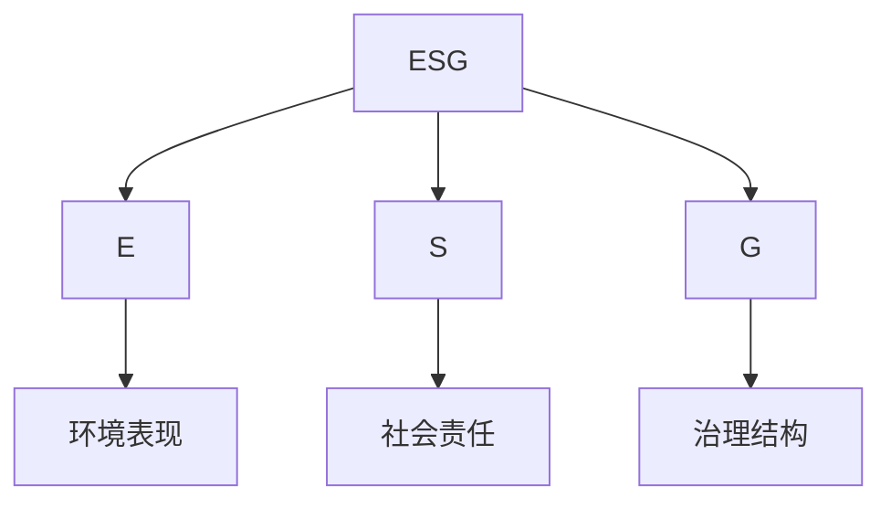
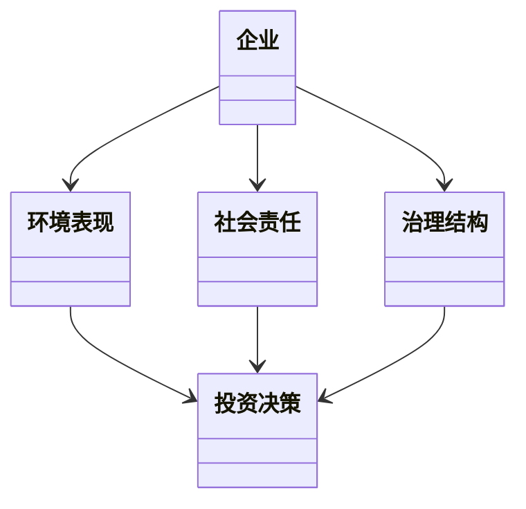
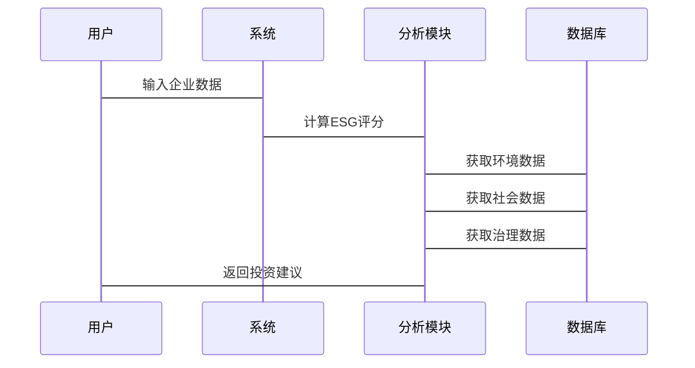

                 


# 价值投资中的社会责任因素

> 关键词：价值投资，社会责任，ESG，可持续发展，投资策略

> 摘要：社会责任因素在价值投资中扮演着越来越重要的角色。随着全球对可持续发展的关注增加，投资者越来越关注企业在环境、社会和治理方面的表现。本文探讨了社会责任投资的核心概念，分析了其在投资决策中的作用，并通过实际案例展示了如何将社会责任因素纳入投资策略。

---

## 第1章: 社会责任投资的背景与定义

### 1.1 社会责任投资的定义

#### 1.1.1 价值投资的基本概念
价值投资是一种投资策略，强调以低于内在价值的价格购买优质资产。传统价值投资主要关注财务指标，如市盈率、市净率和股息率等。然而，随着社会对可持续发展的关注增加，价值投资逐渐将社会责任因素纳入考量。

#### 1.1.2 社会责任投资的核心要素
社会责任投资（SRI）强调企业在环境、社会和治理（ESG）方面的表现。这包括企业的环保措施、社会责任项目和公司治理结构。社会责任投资不仅关注企业的财务表现，还关注其对社会和环境的长期影响。

#### 1.1.3 社会责任投资的边界与外延
社会责任投资的边界包括企业的直接和间接影响，如供应链管理、员工福利和社区贡献。其外延则涉及政策合规性、透明度和创新实践。

### 1.2 社会责任投资的历史发展

#### 1.2.1 国际社会的演变历程
社会责任投资起源于20世纪60年代的美国民权运动和反战运动，投资者开始关注企业行为的社会影响。随后，联合国在2005年提出了《负责任投资原则》，推动了全球社会责任投资的发展。

#### 1.2.2 中国社会责任投资的发展现状
在中国，社会责任投资近年来快速增长，尤其是在政策支持下，ESG投资逐渐成为主流。中国证监会发布了一系列文件，鼓励投资者关注社会责任因素。

#### 1.2.3 社会责任投资的全球趋势
全球范围内，越来越多的投资者将社会责任因素纳入考量，ESG投资规模持续增长。根据研究机构的数据，全球ESG管理资产规模已超过20万亿美元。

---

## 第2章: 社会责任因素的核心概念与联系

### 2.1 社会责任投资的核心概念

#### 2.1.1 环境（Environmental）因素
环境因素关注企业在资源使用、污染排放和气候变化等方面的表现。例如，企业是否采用可再生能源，是否有碳排放目标。

#### 2.1.2 社会（Social）因素
社会因素关注企业的员工权益、社区参与和产品责任。例如，企业是否保障员工权益，是否积极参与社区发展。

#### 2.1.3 治理（Governance）因素
治理因素关注企业的公司治理结构、高管薪酬和董事会多样性。例如，企业是否有透明的治理结构，是否遵循合规性。

### 2.2 社会责任因素的联系与对比

#### 2.2.1 ESG因素对比表格

| ESG维度 | 定义 | 示例指标 |
|----------|------|----------|
| 环境 (E) | 资源使用和排放 | CO2排放量、可再生能源使用比例 |
| 社会 (S) | 员工权益和社区参与 | 员工满意度、社区投资比例 |
| 治理 (G) | 公司治理结构 | 董事会多样性、高管薪酬结构 |

#### 2.2.2 ESG因素的Mermaid关系图



---

## 第3章: 社会责任投资的算法原理

### 3.1 社会责任评分模型

#### 3.1.1 基于ESG的评分算法
社会责任评分模型通常基于对企业环境、社会和治理表现的量化评估。以下是一个简单的评分模型：

$$
\text{ESG评分} = 0.4 \times E + 0.3 \times S + 0.3 \times G
$$

其中，E、S、G分别代表环境、社会和治理评分，权重分别为0.4、0.3和0.3。

#### 3.1.2 权重分配的数学模型
权重分配可以根据行业特点和投资目标进行调整。例如，对于环保行业，环境因素权重可能更高。

### 3.2 社会责任投资的决策树

#### 3.2.1 决策树的构建流程
1. 选择企业
2. 评估环境表现
3. 评估社会表现
4. 评估治理结构
5. 综合评分
6. 决策投资

#### 3.2.2 决策树的Python实现代码

```python
import numpy as np
from sklearn.tree import DecisionTreeClassifier

# 示例数据
X = np.array([[80, 70, 60],  # 环境、社会、治理评分
              [60, 90, 70],
              [70, 80, 50]])

# 标签：是否投资（1代表投资，0代表不投资）
y = np.array([1, 1, 0])

# 构建决策树模型
model = DecisionTreeClassifier()
model.fit(X, y)

# 预测新企业
new_company = np.array([[70, 75, 65]])
print(model.predict(new_company))  # 输出：[1]
```

---

## 第4章: 社会责任投资的系统分析与架构设计

### 4.1 系统分析

#### 4.1.1 问题场景介绍
投资者需要一个系统来评估企业的社会责任表现，并辅助投资决策。

#### 4.1.2 领域模型的Mermaid类图



#### 4.1.3 系统架构的Mermaid架构图


### 4.2 系统接口与交互设计

#### 4.2.1 系统接口设计
- 输入接口：企业数据输入
- 输出接口：社会责任评分和投资建议

#### 4.2.2 系统交互的Mermaid序列图



---

## 第5章: 社会责任投资的项目实战

### 5.1 项目环境与实施

#### 5.1.1 项目目标
评估科技企业的社会责任表现，并优化投资策略。

#### 5.1.2 数据收集
收集企业的环境、社会和治理数据，包括碳排放、员工满意度和董事会结构。

#### 5.1.3 数据分析
使用Python对数据进行分析，计算ESG评分。

### 5.2 核心实现

#### 5.2.1 环境因素分析
计算企业的碳排放强度和可再生能源使用比例。

#### 5.2.2 社会因素分析
评估员工满意度和社区投资比例。

#### 5.2.3 治理因素分析
分析董事会多样性指数和高管薪酬结构。

### 5.3 项目小结

通过分析科技企业的社会责任表现，投资者可以更好地优化投资策略，实现财务和可持续发展目标。

---

## 第6章: 最佳实践与未来展望

### 6.1 小结

社会责任投资不仅关注企业的财务表现，还关注其对环境和社会的影响。通过量化ESG因素，投资者可以做出更全面的投资决策。

### 6.2 注意事项

- 数据质量：确保社会责任数据的准确性和完整性。
- 权重调整：根据行业特点调整ESG评分的权重。
- 长期视角：社会责任投资需要长期关注，才能实现可持续回报。

### 6.3 未来展望

随着技术进步和政策支持，社会责任投资将更加智能化和全球化。未来的投资策略将更加注重企业的可持续发展能力。

---

## 作者

作者：AI天才研究院/AI Genius Institute & 禅与计算机程序设计艺术 /Zen And The Art of Computer Programming

---

通过以上内容，我们系统地探讨了价值投资中的社会责任因素，从概念到实践，为投资者提供了全面的指导和参考。

