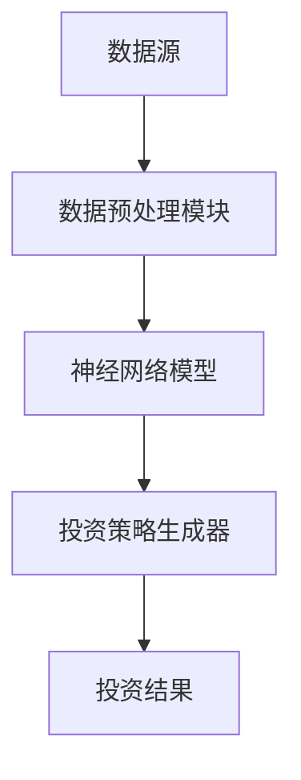

                 


# 价值投资中的神经科技前景分析

## 关键词
- 价值投资
- 神经科技
- 投资策略
- 神经网络
- 人工智能
- 投资决策

## 摘要
本文探讨了神经科技如何优化价值投资策略，分析了当前的应用与趋势，提出了将神经网络模型与传统投资分析相结合的方法，以提升投资决策的科学性和准确性。

## 第一部分：价值投资与神经科技的背景介绍

### 第1章：价值投资与神经科技的结合背景

#### 1.1 价值投资的核心概念
- **定义与历史发展**：价值投资由本杰明·格雷厄姆提出，强调寻找被市场低估的股票，通过长期持有实现收益。
- **核心理念与策略**：注重基本面分析，寻找安全边际，长期投资。
- **当前应用与挑战**：传统方法在复杂市场中面临挑战，需结合新技术提升效率。

#### 1.2 神经科技的基本概念
- **定义与应用**：神经科技利用生物神经系统的原理，应用于数据分析和决策支持。
- **在金融领域的应用**：用于股票预测、风险评估和投资组合优化。
- **结合背景**：神经科技的兴起为投资决策提供了新工具，价值投资需要适应科技发展。

#### 1.3 价值投资与神经科技的结合背景
- **神经科技在投资决策中的作用**：通过分析投资者情绪和市场趋势，辅助决策。
- **优化价值投资策略**：结合神经网络模型，提升选股和估值的准确性。
- **研究现状**：当前研究多集中在量化分析，神经科技在价值投资中的潜力待挖掘。

## 第二部分：神经科技在价值投资中的核心概念与联系

### 第2章：神经科技与价值投资的核心概念

#### 2.1 神经科技在投资决策中的作用机制
- **神经网络模型的应用**：用于识别市场模式和预测价格波动。
- **投资者行为分析**：通过神经科技理解投资者心理，优化投资策略。

#### 2.2 核心概念对比
- **神经科技与价值投资的核心理念对比**：神经科技注重数据分析，价值投资注重基本面分析。
- **与传统金融分析方法的对比**：神经科技更高效，但缺乏解释性；传统方法解释性强，但效率低。
- **优劣势分析**：神经科技优势明显，但需结合传统方法。

#### 2.3 ER实体关系图
```mermaid
er
  actor 投资者
  actor 市场数据
  actor 神经网络模型
  actor 价值投资策略
  actor 投资结果
  投资者 --> 神经网络模型: 提供数据
  市场数据 --> 神经网络模型: 分析数据
  神经网络模型 --> 价值投资策略: 输出建议
  价值投资策略 --> 投资结果: 执行投资
```

## 第三部分：神经科技在价值投资中的算法原理与数学模型

### 第3章：神经科技在价值投资中的算法原理

#### 3.1 神经网络模型在投资决策中的应用
- **基本原理**：神经网络通过多层处理，识别数据中的复杂模式。
- **股票价格预测**：使用RNN处理时间序列数据。
- **投资组合优化**：通过神经网络寻找最优配置。

#### 3.2 基于神经科技的价值投资算法
- **实现步骤**：
  1. 数据采集：收集财务数据和市场指标。
  2. 数据预处理：标准化和特征选择。
  3. 模型训练：训练神经网络识别低估股票。
  4. 投资策略生成：基于模型输出制定投资计划。
- **优缺点分析**：高效率但缺乏透明度，可能受市场变化影响。

#### 3.3 数学模型与公式
- **神经网络模型**：
  $$ y = f(Wx + b) $$
  其中，$W$是权重，$x$是输入，$b$是偏置，$f$是激活函数。
- **损失函数**：
  $$ L = \frac{1}{n}\sum_{i=1}^{n}(y_i - \hat{y_i})^2 $$

#### 3.4 神经网络算法实现
```python
import numpy as np

class NeuralNetwork:
    def __init__(self, input_size, hidden_size, output_size):
        self.W1 = np.random.randn(input_size, hidden_size)
        self.b1 = np.zeros((1, hidden_size))
        self.W2 = np.random.randn(hidden_size, output_size)
        self.b2 = np.zeros((1, output_size))
    
    def forward(self, x):
        z1 = np.dot(x, self.W1) + self.b1
        a1 = np.tanh(z1)
        z2 = np.dot(a1, self.W2) + self.b2
        a2 = np.softmax(z2)
        return a2
    
    def backward(self, x, y, output):
        delta2 = output - y
        dW2 = (1/m) * delta2.T.dot(a1.T)
        db2 = np.mean(delta2, axis=0)
        delta1 = delta2.dot(self.W2.T) * (1 - a1**2)
        dW1 = (1/m) * delta1.dot(x.T)
        db1 = np.mean(delta1, axis=0)
```

## 第四部分：神经科技在价值投资中的系统分析与架构设计

### 第4章：神经科技投资系统的架构设计

#### 4.1 系统总体架构


#### 4.2 功能模块设计
- **数据采集模块**：收集财务数据和市场指标。
- **模型训练模块**：训练神经网络识别低估股票。
- **策略生成模块**：输出投资建议。

#### 4.3 系统架构图


## 第五部分：神经科技在价值投资中的项目实战

### 第5章：神经科技投资系统的项目实战

#### 5.1 项目环境与工具安装
- **环境配置**：Python 3.8+
- **依赖安装**：numpy, pandas, scikit-learn, keras

#### 5.2 数据采集与处理
- **数据来源**：Yahoo Finance API
- **数据清洗**：处理缺失值和异常值。

#### 5.3 系统核心实现
```python
from keras.models import Sequential
from keras.layers import Dense, LSTM

model = Sequential()
model.add(LSTM(50, input_shape=(timesteps, features)))
model.add(Dense(1))
model.compile(optimizer='adam', loss='mean_squared_error')
model.fit(X_train, y_train, epochs=100, batch_size=32)
```

#### 5.4 案例分析
- **案例选择**：分析过去三年表现，预测未来走势。
- **结果评估**：比较预测与实际价格，评估模型准确性。

## 第六部分：神经科技在价值投资中的最佳实践

### 6.1 总结
神经科技为价值投资提供了新的工具，通过数据驱动的方法提升决策效率，但仍需结合传统分析方法。

### 6.2 注意事项
- **数据质量**：确保数据准确可靠。
- **模型解释性**：保持对投资逻辑的理解。
- **市场适应性**：定期更新模型以适应市场变化。

### 6.3 未来研究方向
- **混合模型研究**：结合传统方法与神经网络。
- **实时交易系统**：开发实时投资决策工具。
- **风险控制模型**：利用神经科技优化风险管理。

## 作者
作者：AI天才研究院  
地址：https://www.zhihu.com/columns/1084330303829747904  
简介：专注于人工智能与计算机科学的研究，探索技术与商业的结合。

## 致谢
感谢读者的支持，感谢所有在神经科技和价值投资领域贡献的人们。

--- 

本文通过系统分析神经科技在价值投资中的应用，探讨了其前景与挑战，为投资者提供了新的思路与工具。

