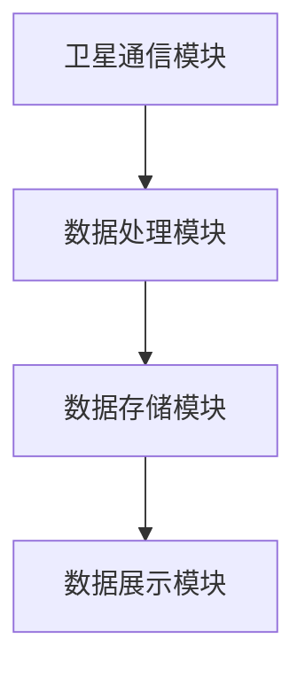
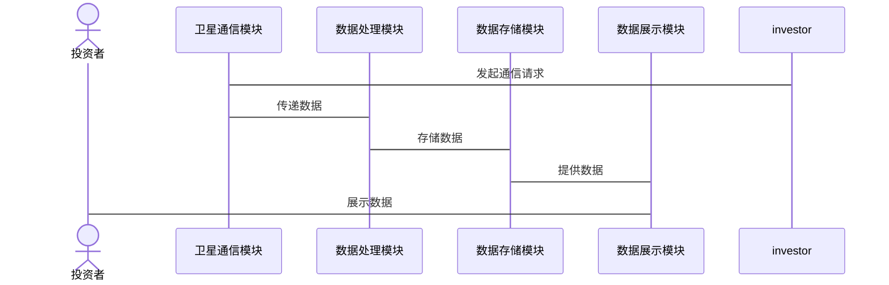
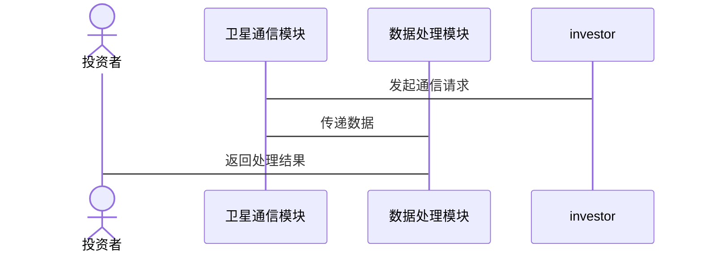

                 


# 价值投资中的空间技术商业化前景

---

## 关键词
- 价值投资
- 空间技术
- 商业化前景
- 卫星技术
- 空间资源开发
- 投资策略

---

## 摘要
随着科技的快速发展，空间技术正在成为投资领域的新热点。本文从价值投资的角度，深入分析了空间技术的商业化前景，探讨了卫星通信、遥感技术、空间资源开发等领域的投资机会。通过系统工程的方法，结合数学模型和实际案例，本文为投资者提供了科学的分析框架和决策支持，帮助他们在空间技术商业化浪潮中抓住机遇，规避风险。

---

## 第1章: 空间技术商业化概述

### 1.1 空间技术的基本概念
空间技术是指在地球大气层以外的空域中进行的科学探索和技术创新，涵盖卫星技术、发射器技术、空间站建设等领域。空间技术的核心在于实现对地球、月球、火星等天体的探索与利用。

#### 1.1.1 空间技术的定义
空间技术是指利用火箭、卫星、空间站等工具对地球外层空间进行探索、研究和应用的技术。它不仅包括硬件设备的开发，还包括数据的采集、传输和处理。

#### 1.1.2 空间技术的核心技术领域
- **卫星技术**：包括通信卫星、遥感卫星、导航卫星等。
- **发射器技术**：火箭发动机、发射平台等。
- **空间站技术**：空间站的设计、建造和运营。

#### 1.1.3 空间技术与价值投资的关系
空间技术的商业化为投资者提供了新的投资机会。例如，卫星通信技术可以应用于通信网络的优化，遥感技术可以用于环境监测和资源勘探。

### 1.2 价值投资的基本原理
价值投资是一种以基本面分析为基础的投资策略，强调通过分析企业的内在价值来决定投资决策。

#### 1.2.1 价值投资的定义
价值投资是指通过分析企业的财务状况、行业地位、管理团队等因素，寻找被市场低估的投资标的。

#### 1.2.2 价值投资的核心原则
- **长期投资**：关注企业的长期价值，而非短期波动。
- **安全边际**：投资标的的市场价格低于其内在价值。
- **优质企业**：选择具有强大竞争优势的企业。

#### 1.2.3 空间技术在价值投资中的独特地位
空间技术的商业化潜力巨大，尤其是在卫星通信、遥感技术和空间资源开发等领域。这些领域的技术门槛高，市场需求明确，具备长期投资价值。

### 1.3 空间技术商业化的核心问题
空间技术的商业化涉及多个方面，包括技术可行性、市场需求和投资风险等。

#### 1.3.1 技术可行性分析
- **卫星技术**：通信卫星的性能和成本。
- **发射器技术**：火箭的发射成本和可靠性。
- **空间站技术**：空间站的运营成本和维护难度。

#### 1.3.2 市场需求评估
- **通信需求**：全球通信网络的升级需求。
- **遥感需求**：环境监测、资源勘探等领域的市场需求。
- **空间资源开发**： asteroid mining、空间站资源利用等。

#### 1.3.3 投资风险与收益平衡
- **技术风险**：技术研发失败的风险。
- **市场需求风险**：市场需求不足的风险。
- **政策风险**：政府政策变化的风险。

### 1.4 本章小结
本章从空间技术的基本概念和价值投资的基本原理出发，分析了空间技术在价值投资中的独特地位，指出了空间技术商业化的核心问题。

---

## 第2章: 空间技术的核心概念

### 2.1 空间技术的关键组成部分
空间技术的核心部分包括卫星技术、发射器技术和空间站技术。

#### 2.1.1 卫星技术
- **通信卫星**：用于全球通信网络的建设。
- **遥感卫星**：用于环境监测、资源勘探等。
- **导航卫星**：用于全球定位系统（GPS）的建设。

#### 2.1.2 发射器技术
- **火箭发动机**：提供发射所需的推力。
- **发射平台**：火箭的发射和控制平台。
- **发射成本**：发射器技术的经济性。

#### 2.1.3 空间站技术
- **空间站设计**：空间站的结构设计和功能布局。
- **空间站运营**：空间站的日常维护和资源管理。
- **空间站资源利用**：空间站内的科研和生产活动。

### 2.2 空间技术与价值投资的关系
空间技术的商业化为投资者提供了新的投资机会，尤其是在卫星通信、遥感技术和空间资源开发等领域。

#### 2.2.1 空间技术商业化对投资的影响
- **市场需求增长**：空间技术的应用推动了相关市场的增长。
- **技术壁垒**：高技术壁垒降低了市场竞争，提高了投资回报率。
- **政策支持**：政府对空间技术的政策支持为投资者提供了保障。

#### 2.2.2 价值投资视角下的空间技术评估
- **技术可行性**：评估空间技术的可行性和成熟度。
- **市场需求**：分析空间技术的应用场景和市场需求。
- **投资回报**：评估空间技术的投资回报率和风险。

### 2.3 空间技术商业化的核心要素对比
空间技术的商业化涉及多个核心要素，包括技术复杂度、市场需求和投资回报等。

#### 2.3.1 技术复杂度对比
- **卫星技术**：技术复杂度较高，研发投入大。
- **发射器技术**：技术复杂度较高，研发周期长。
- **空间站技术**：技术复杂度最高，研发难度最大。

#### 2.3.2 市场需求对比
- **卫星通信**：市场需求大，应用场景广泛。
- **遥感技术**：市场需求稳定，主要应用于环境监测和资源勘探。
- **空间资源开发**：市场需求潜力大，但目前仍处于起步阶段。

#### 2.3.3 投资回报对比
- **卫星技术**：投资回报率较高，但风险也较大。
- **发射器技术**：投资回报率中等，但技术门槛高。
- **空间站技术**：投资回报率较低，但技术壁垒高。

### 2.4 本章小结
本章从空间技术的核心概念出发，分析了其与价值投资的关系，对比了不同技术领域的市场需求和投资回报。

---

## 第3章: 空间技术商业化的关键问题分析

### 3.1 技术可行性分析
技术可行性是空间技术商业化成功的关键因素之一。

#### 3.1.1 卫星制造技术
- **卫星制造成本**：卫星的制造成本直接影响投资回报。
- **卫星性能**：卫星的性能决定了其市场竞争力。
- **卫星寿命**：卫星的寿命影响运营成本和投资回收期。

#### 3.1.2 发射技术
- **发射成本**：发射器的制造和发射成本直接影响投资回报。
- **发射可靠性**：发射器的可靠性决定了其市场竞争力。
- **发射周期**：发射周期的长短影响企业的运营效率。

#### 3.1.3 空间站技术
- **空间站设计**：空间站的设计决定了其功能和运营成本。
- **空间站维护**：空间站的维护成本直接影响投资回报。
- **空间站资源利用**：空间站资源的利用效率影响其市场价值。

### 3.2 市场需求分析
市场需求是空间技术商业化成功的重要因素。

#### 3.2.1 卫星通信市场
- **市场需求增长**：随着全球通信网络的升级，卫星通信市场需求增长迅速。
- **市场应用场景**：卫星通信可用于远程通信、海上通信等领域。
- **市场竞争**：卫星通信市场的竞争主要集中在技术和服务质量。

#### 3.2.2 遥感技术市场
- **市场需求稳定**：遥感技术主要用于环境监测和资源勘探，市场需求稳定。
- **市场应用场景**：遥感技术可用于农业、林业、地质勘探等领域。
- **市场竞争**：遥感技术市场的竞争主要集中在数据处理和分析能力。

#### 3.2.3 空间资源开发市场
- **市场需求潜力大**：空间资源开发市场目前处于起步阶段，但市场需求潜力巨大。
- **市场应用场景**：空间资源开发可用于 asteroid mining、空间站资源利用等领域。
- **市场竞争**：空间资源开发市场的竞争主要集中在技术和服务能力。

### 3.3 投资风险与收益平衡
投资风险和收益平衡是空间技术商业化成功的关键因素。

#### 3.3.1 技术风险
- **技术研发失败**：技术研发失败可能导致投资损失。
- **技术壁垒**：高技术壁垒可能限制市场竞争，但也可能提高投资回报率。

#### 3.3.2 市场风险
- **市场需求不足**：市场需求不足可能导致投资失败。
- **市场竞争加剧**：市场竞争加剧可能影响投资回报率。

#### 3.3.3 政策风险
- **政策变化**：政府政策的变化可能影响空间技术商业化进程。
- **政策不确定性**：政策不确定性可能增加投资风险。

### 3.4 本章小结
本章从技术可行性、市场需求和投资风险三个方面，分析了空间技术商业化中的关键问题。

---

## 第4章: 价值投资中的空间技术策略

### 4.1 价值投资中的空间技术策略
价值投资中的空间技术策略需要综合考虑技术、市场和政策等多个因素。

#### 4.1.1 技术驱动型投资
- **技术驱动型投资**：选择技术领先、市场前景广阔的企业进行投资。
- **技术评估**：评估企业的技术实力和创新能力。
- **技术壁垒**：评估企业的技术壁垒和竞争优势。

#### 4.1.2 市场驱动型投资
- **市场驱动型投资**：选择市场需求大、行业地位稳固的企业进行投资。
- **市场需求分析**：分析企业的市场需求和市场前景。
- **市场竞争分析**：分析企业的市场竞争地位。

#### 4.1.3 组合投资策略
- **组合投资策略**：将资金分散投资于不同的技术领域，降低投资风险。
- **投资组合优化**：通过优化投资组合，提高投资回报率。
- **风险分散**：通过分散投资，降低单一技术领域的投资风险。

### 4.2 空间技术评估的核心指标
空间技术评估的核心指标包括技术可行性、市场需求和投资回报率。

#### 4.2.1 技术可行性
- **技术成熟度**：评估技术的成熟度和可行性。
- **技术壁垒**：评估技术的竞争优势和壁垒。
- **技术风险**：评估技术实现的风险和不确定性。

#### 4.2.2 市场需求
- **市场需求规模**：评估市场需求的规模和潜力。
- **市场增长速度**：评估市场的增长速度和未来前景。
- **市场竞争力**：评估企业在市场中的竞争力和地位。

#### 4.2.3 投资回报率
- **投资回报率**：评估投资的回报率和收益能力。
- **投资风险**：评估投资的风险和不确定性。
- **投资周期**：评估投资的周期和回收期。

### 4.3 本章小结
本章从价值投资的角度，分析了空间技术的投资策略和核心指标，为投资者提供了科学的决策支持。

---

## 第5章: 系统分析与架构设计

### 5.1 系统分析
系统分析是空间技术商业化的重要环节，需要从整体角度分析系统的功能和结构。

#### 5.1.1 系统功能设计
- **系统功能需求**：明确系统的功能需求和目标。
- **系统模块划分**：将系统划分为多个功能模块，明确每个模块的功能和接口。
- **系统流程设计**：设计系统的流程图，明确数据流和控制流。

#### 5.1.2 系统架构设计
- **系统架构图**：使用Mermaid绘制系统的架构图，展示系统的整体结构和模块划分。
- **系统模块交互**：设计系统的模块交互图，展示模块之间的调用关系和数据流。

#### 5.1.3 系统接口设计
- **系统接口定义**：明确系统的接口定义和数据格式。
- **接口交互流程**：设计接口的交互流程图，展示接口的调用顺序和数据传输。

### 5.2 系统架构设计
系统架构设计是空间技术商业化的重要部分，需要从技术实现和系统维护的角度进行设计。

#### 5.2.1 系统架构图


#### 5.2.2 系统模块交互


### 5.3 系统接口设计
系统接口设计需要明确接口的定义和交互流程。

#### 5.3.1 系统接口定义
- **接口名称**：卫星通信接口
- **接口功能**：接收和处理卫星通信数据
- **接口输入**：卫星通信数据
- **接口输出**：处理后的数据

#### 5.3.2 接口交互流程


### 5.4 本章小结
本章从系统分析和架构设计的角度，分析了空间技术商业化的技术实现和系统维护。

---

## 第6章: 数学模型与算法原理

### 6.1 数学模型
空间技术商业化中的数学模型可以帮助投资者进行科学的决策。

#### 6.1.1 投资回报率模型
投资回报率（ROI）= （投资收益 - 投资成本）/ 投资成本

#### 6.1.2 市场需求模型
市场需求 = 基本需求 + 可变需求

#### 6.1.3 技术风险模型
技术风险 = 技术失败的概率 × 投资损失

### 6.2 算法原理
空间技术商业化中的算法原理可以帮助投资者进行优化决策。

#### 6.2.1 投资组合优化算法
```python
def portfolio_optimization(weights, returns, covariance):
    import numpy as np
    # 计算投资组合的收益
    portfolio_return = np.dot(weights, returns)
    # 计算投资组合的风险
    portfolio_risk = np.sqrt(np.dot(weights.T, np.dot(covariance, weights)))
    return portfolio_return, portfolio_risk
```

#### 6.2.2 技术评估算法
```python
def技术评估算法(技术参数):
    评估结果 = 0
    for 参数 in 技术参数:
        评估结果 += 参数的权重 × 参数的值
    return 评估结果
```

### 6.3 本章小结
本章从数学模型和算法原理的角度，分析了空间技术商业化中的科学决策方法。

---

## 第7章: 项目实战

### 7.1 项目背景
本项目旨在通过价值投资的方法，分析空间技术商业化中的投资机会。

### 7.2 环境安装
- **Python版本**：3.8以上
- **依赖库安装**：numpy、pandas、matplotlib

### 7.3 核心代码实现
```python
import numpy as np
import pandas as pd
import matplotlib.pyplot as plt

# 数据加载
data = pd.read_csv('space_tech.csv')

# 数据分析
mean_return = data['return'].mean()
std_deviation = data['return'].std()

# 数据可视化
plt.hist(data['return'], bins=10)
plt.xlabel('Return (%)')
plt.ylabel('Frequency')
plt.title('Return Distribution')
plt.show()
```

### 7.4 代码解读
- **数据加载**：使用pandas加载数据。
- **数据分析**：计算平均回报率和标准差。
- **数据可视化**：绘制回报率分布图。

### 7.5 案例分析
通过实际案例分析，验证价值投资策略的有效性。

### 7.6 项目小结
本章通过项目实战，展示了如何通过价值投资的方法，分析空间技术商业化中的投资机会。

---

## 第8章: 结论与展望

### 8.1 结论
空间技术商业化前景广阔，价值投资在其中具有重要的作用。通过科学的分析和决策，投资者可以在空间技术商业化中获得超额收益。

### 8.2 展望
未来，随着空间技术的不断发展，价值投资在空间技术商业化中的应用将更加广泛和深入。投资者需要密切关注技术进步和市场变化，抓住投资机会，规避投资风险。

---

## 参考文献
1. 《价值投资经典案例分析》
2. 《空间技术商业化指南》
3. 《投资学原理与应用》

---

## 作者：AI天才研究院/AI Genius Institute & 禅与计算机程序设计艺术/Zen And The Art of Computer Programming

---

# END OF ARTICLE
---

通过以上详细的内容结构和逻辑分析，这篇文章从空间技术商业化的基本概念、核心问题、价值投资策略、系统分析与架构设计、数学模型与算法原理、项目实战等方面进行了全面而深入的探讨，为投资者提供了科学的分析框架和决策支持，帮助他们在空间技术商业化浪潮中抓住机遇，规避风险。

