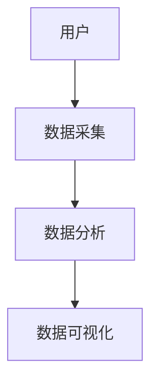

                 


# 价值投资中的网络效应分析

## 关键词：价值投资，网络效应，投资分析，社交网络，投资决策，信息传播，系统架构

## 摘要：  
本文从网络效应的视角分析价值投资，构建了网络效应与价值投资的分析框架，揭示了网络效应在投资决策中的作用和影响。通过数学建模、社交网络分析、系统架构设计等方法，深入探讨了网络效应对价值投资的启示，为投资者提供了新的分析工具和决策支持。

---

# 第一部分: 价值投资中的网络效应背景介绍

## 第1章: 网络效应的基本概念

### 1.1 网络效应的定义与特征

#### 1.1.1 网络效应的定义  
网络效应是指用户从使用某产品或服务中获得的价值随着用户数量的增加而增加的现象。其核心在于“网络的规模越大，每个用户的价值越高”。

#### 1.1.2 网络效应的核心特征  
- **正外部性**：用户的增加为其他用户创造了额外价值。  
- **边际成本递减**：随着用户数量增加，单位用户的边际成本下降。  
- **非线性增长**：用户数量与用户价值之间的关系是非线性的。  

#### 1.1.3 网络效应的边界与外延  
- **边界**：网络效应的范围受到用户需求、技术限制和市场环境的约束。  
- **外延**：网络效应不仅适用于技术产品，也适用于金融、社交等领域。  

---

## 第2章: 价值投资中的网络效应分析框架

### 2.1 网络效应的数学模型

#### 2.1.1 网络效应的数学定义  
网络效应强度可以用以下公式表示：  
$$网络效应强度 = \frac{用户数量}{用户价值}$$  

#### 2.1.2 网络效应的核心公式  
用户价值可以表示为：  
$$用户价值 = f(用户数量, 产品价值, 网络效应)$$  

---

## 第3章: 价值投资中的网络效应分析框架

### 3.1 价值投资的核心要素  
- **基本面分析**：包括财务数据、行业地位等。  
- **市场情绪**：投资者行为受市场情绪影响。  
- **网络效应**：用户数量和用户价值对投资决策的影响。  

### 3.2 网络效应在价值投资中的作用  
- **信息传播**：网络效应促进了信息的快速传播。  
- **协同效应**：用户数量的增加降低了边际成本。  

---

## 第4章: 价值投资中的网络效应分析框架

### 4.1 网络效应的系统架构设计  

#### 4.1.1 系统功能设计  
- **数据采集**：收集用户数据和市场数据。  
- **数据分析**：计算网络效应强度和用户价值。  
- **数据可视化**：通过图表展示网络效应的影响。  

#### 4.1.2 系统架构设计  


---

## 第5章: 价值投资中的网络效应分析框架

### 5.1 网络效应的项目实战  

#### 5.1.1 数据集准备  
- **用户数据**：包括用户数量、用户价值等。  
- **市场数据**：包括资产价格、交易量等。  

#### 5.1.2 代码实现  
```python
import numpy as np
import matplotlib.pyplot as plt

# 示例代码：计算网络效应强度
users = np.linspace(100, 1000, 100)
user_value = users * 0.5
network_effectiveness = users / user_value

plt.plot(users, network_effectiveness)
plt.xlabel('用户数量')
plt.ylabel('网络效应强度')
plt.title('网络效应强度与用户数量的关系')
plt.show()
```

---

## 第6章: 价值投资中的网络效应分析框架

### 6.1 网络效应的总结与展望  

#### 6.1.1 总结  
网络效应在价值投资中具有重要影响，可以用来分析投资者行为和市场趋势。  

#### 6.1.2 展望  
未来研究可以进一步结合人工智能和大数据技术，深入挖掘网络效应在投资中的应用。  

---

## 作者：AI天才研究院/AI Genius Institute & 禅与计算机程序设计艺术 /Zen And The Art of Computer Programming

