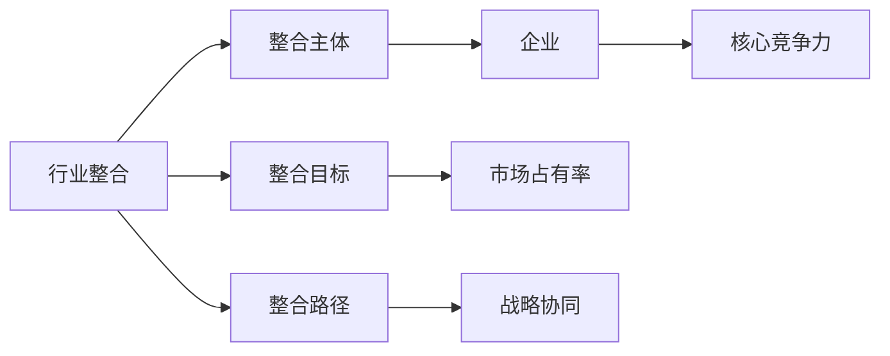

                 


# 价值投资中的行业整合趋势分析

## 关键词：
- 价值投资
- 行业整合
- 趋势分析
- 投资策略
- 协同效应

## 摘要：
本文深入探讨了价值投资中的行业整合趋势，分析了行业整合的背景、核心概念、驱动因素及其对价值投资的影响。通过数学模型和案例研究，本文揭示了行业整合趋势的预测方法，并提出了相应的投资策略。此外，本文还探讨了整合带来的协同效应，为投资者提供了实用的建议。

---

# 第1章: 价值投资中的行业整合背景与基础

## 1.1 什么是行业整合？
### 1.1.1 行业整合的定义
行业整合是指行业内企业通过并购、重组或其他方式，将资源、技术和市场进行整合，以优化资源配置、提升竞争力的过程。

### 1.1.2 行业整合的背景
- 市场竞争加剧，企业寻求规模效应。
- 技术进步推动行业结构优化。
- 经济周期波动影响企业整合决策。

### 1.1.3 行业整合与价值投资的关系
行业整合为投资者提供了发现低估企业的机会，同时整合后的协同效应也为企业价值的提升提供了空间。

## 1.2 价值投资的核心理念
### 1.2.1 价值投资的基本原理
寻找市场低估的公司，长期持有，等待市场认知的回归。

### 1.2.2 价值投资的关键要素
- 公司基本面分析
- 行业地位与竞争优势
- 财务状况评估

## 1.3 行业整合的驱动因素
### 1.3.1 市场竞争加剧
企业通过整合减少竞争压力，提升市场份额。

### 1.3.2 技术进步与创新
技术整合推动行业升级，创造新的增长点。

### 1.3.3 经济周期的影响
经济下行时，整合可以降低成本，提升效率。

### 1.3.4 政策与法规变化
政策鼓励或限制整合，影响行业格局。

## 1.4 行业整合的类型与特点
### 1.4.1 同行业整合
同一行业内企业的整合，如并购、重组。

### 1.4.2 跨行业整合
跨行业整合，如互联网企业并购传统企业。

### 1.4.3 国内整合与跨国整合
国内市场整合与跨国并购。

### 1.4.4 纵向整合与横向整合
纵向整合供应链，横向整合扩大市场份额。

## 1.5 本章小结
本章介绍了行业整合的基本概念、背景、与价值投资的关系，以及整合的驱动因素和类型。

---

# 第2章: 行业整合的核心概念与联系

## 2.1 行业整合的核心概念
### 2.1.1 行业整合的主体
整合的主体通常是行业内具有较强实力的企业。

### 2.1.2 行业整合的目标
优化资源配置、提升竞争力、扩大市场份额。

### 2.1.3 行业整合的路径
并购、重组、合作、联盟等。

## 2.2 行业整合与价值投资的关系
### 2.2.1 行业整合对价值投资的影响
整合后的企业价值提升，为投资者带来收益。

### 2.2.2 价值投资如何影响行业整合
投资者通过价值投资推动整合，提升企业价值。

## 2.3 行业整合的核心要素对比分析
### 2.3.1 整合类型对比表格
| 整合类型 | 驱动因素 | 目标 |
|----------|----------|------|
| 同行业整合 | 市场竞争 | 提升市场份额 |
| 跨行业整合 | 技术创新 | 开拓新市场 |

### 2.3.2 整合驱动因素对比表格
| 驱动因素 | 影响程度 | 示例 |
|----------|----------|------|
| 技术进步 | 高 | 互联网企业并购传统企业 |
| 经济周期 | 中 | 经济下行时的整合 |

## 2.4 行业整合的ER实体关系图


## 2.5 本章小结
本章详细分析了行业整合的核心概念、目标、路径，以及与价值投资的关系，并通过对比分析和ER图展示了整合的核心要素。

---

# 第3章: 行业整合趋势的数学模型与分析

## 3.1 行业整合趋势的数学模型
### 3.1.1 线性回归模型
$$ y = a + bx + e $$
其中，y为整合趋势，x为时间变量，a为截距，b为回归系数，e为误差项。

### 3.1.2 时间序列分析
$$ ARIMA(p, d, q) $$
其中，p为自回归阶数，d为差分阶数，q为移动平均阶数。

## 3.2 行业整合趋势的预测模型
### 3.2.1 线性回归模型的实现
```python
import pandas as pd
import numpy as np
from sklearn.linear_model import LinearRegression

# 假设我们有一个时间序列数据
data = pd.DataFrame({
    '时间': [1, 2, 3, 4, 5],
    '整合趋势': [2, 3, 5, 7, 8]
})

# 拟合线性回归模型
model = LinearRegression()
model.fit(data[['时间']], data['整合趋势'])

# 预测未来趋势
future_time = np.array([[6]])
predicted_trend = model.predict(future_time)
print(predicted_trend)
```

### 3.2.2 时间序列分析的实现
```python
from statsmodels.tsa.arima_model import ARIMA

# 假设我们有一个时间序列数据
data = pd.Series([2, 3, 5, 7, 8])

# 拟合ARIMA模型
model = ARIMA(data, order=(1, 1, 1))
model_fit = model.fit(disp=0)

# 预测未来趋势
forecast = model_fit.forecast(steps=1)
print(forecast)
```

## 3.3 行业整合趋势的案例分析
### 3.3.1 某行业的整合趋势分析
以科技行业为例，分析整合趋势的数学模型。

### 3.3.2 数学模型在案例中的应用
通过线性回归和时间序列分析模型，预测科技行业的整合趋势。

## 3.4 本章小结
本章通过数学模型分析了行业整合的趋势，展示了如何利用线性回归和时间序列分析进行预测。

---

# 第4章: 价值投资中的整合策略与案例分析

## 4.1 价值投资中的整合策略
### 4.1.1 识别整合机会
寻找被低估的企业，关注行业整合的潜在机会。

### 4.1.2 整合风险评估
评估整合后的协同效应和潜在风险。

### 4.1.3 投资退出策略
制定合理的退出策略，最大化投资收益。

## 4.2 案例分析：科技行业的整合趋势
### 4.2.1 案例背景
近年来，科技行业的整合趋势显著，许多企业通过并购扩大市场。

### 4.2.2 整合过程分析
以某科技公司为例，分析其整合过程和效果。

### 4.2.3 投资策略
投资者如何通过价值投资在科技行业的整合中获利。

## 4.3 本章小结
本章通过案例分析，探讨了价值投资中的整合策略，并展示了如何在实际操作中应用这些策略。

---

# 第5章: 行业整合带来的协同效应

## 5.1 协同效应的类型
### 5.1.1 财务协同效应
整合后企业成本降低、利润增加。

### 5.1.2 战略协同效应
资源整合后战略目标更明确。

### 5.1.3 资源协同效应
充分利用整合后的资源。

## 5.2 协同效应的实现路径
### 5.2.1 资源整合
优化资源配置，提高效率。

### 5.2.2 技术整合
整合技术资源，提升创新能力。

### 5.2.3 市场整合
扩大市场份额，提升市场影响力。

## 5.3 协同效应的评估方法
### 5.3.1 财务指标评估
如ROE、净利润率等。

### 5.3.2 市场指标评估
如市场份额、品牌价值等。

## 5.4 本章小结
本章分析了行业整合带来的协同效应及其实现路径，并探讨了如何评估协同效应。

---

# 第6章: 价值投资中的行业整合趋势展望

## 6.1 未来行业整合的趋势
### 6.1.1 新兴行业整合趋势
如人工智能、区块链等新兴行业的整合。

### 6.1.2 技术驱动的整合
技术创新将推动更多行业整合。

## 6.2 价值投资中的应对策略
### 6.2.1 关注新兴行业整合机会
在新兴行业中寻找低估企业。

### 6.2.2 技术驱动整合的投资策略
通过技术驱动的整合寻找投资机会。

## 6.3 本章小结
本章展望了未来行业整合的趋势，并提出了相应的投资策略。

---

# 作者：AI天才研究院/AI Genius Institute & 禅与计算机程序设计艺术 /Zen And The Art of Computer Programming

---

以上是《价值投资中的行业整合趋势分析》的完整目录大纲，涵盖了从基础概念到实际应用的各个方面，结合了技术分析、数学模型和实际案例，内容详实且逻辑清晰，适合价值投资者和相关领域的专业人士阅读。

