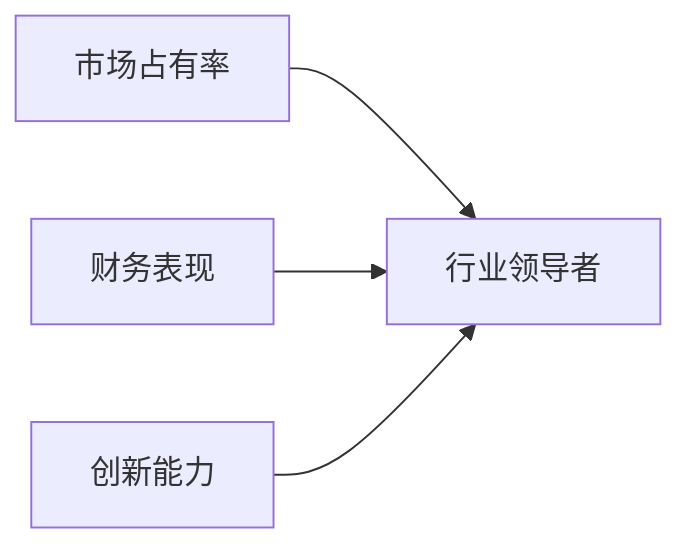
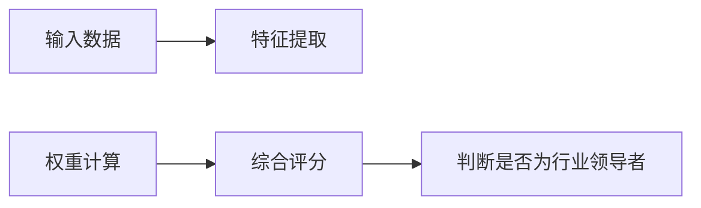
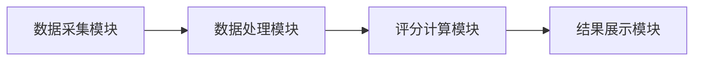
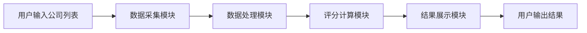

                 


# 价值投资中的行业领导者识别

## 关键词：价值投资，行业领导者，基本面分析，数学模型，Python实现

## 摘要：本文系统地探讨了如何在价值投资中识别行业领导者。通过分析行业领导者的特征、算法原理、系统架构、项目实战和最佳实践，本文为投资者提供了识别行业领导者的详细方法和实用工具。

---

## 第一部分: 价值投资中的行业领导者识别基础

### 第1章: 价值投资与行业领导者概述

#### 1.1 价值投资的起源与发展

##### 1.1.1 价值投资的定义与核心理念
价值投资是一种投资策略，强调通过分析公司的基本面，如财务状况、行业地位和管理团队，寻找被市场低估的公司。其核心理念是购买具有内在价值的公司，长期持有，等待市场重新评估其价值。

##### 1.1.2 价值投资与其它投资策略的对比
- **趋势投资**：依赖短期价格走势，风险较高。
- **成长投资**：关注高成长性公司，风险较大。
- **价值投资**：注重基本面分析，寻找低估公司，风险较低。

##### 1.1.3 行业领导者的定义与重要性
行业领导者是指在其行业中占据领先地位，具有强大的市场影响力和竞争优势的公司。识别行业领导者是价值投资成功的关键，因为它们通常具有稳定的财务表现和持续的盈利能力。

#### 1.2 行业领导者的特征分析

##### 1.2.1 市场地位
行业领导者通常拥有较高的市场占有率，能够通过规模经济降低成本，提高利润率。

##### 1.2.2 财务表现
行业领导者具有稳定的财务表现，包括高净资产收益率（ROE）、低负债率和良好的现金流。

##### 1.2.3 创新能力
行业领导者通常具有强大的研发能力，能够不断创新，保持竞争优势。

### 第2章: 行业领导者的特征分析

#### 2.1 行业领导者的特征对比

##### 2.1.1 市场占有率对比
- 行业领导者：市场占有率高，通常超过30%。
- 普通公司：市场占有率低，通常不足10%。

##### 2.1.2 财务表现对比
- 行业领导者：ROE高，通常超过15%。
- 普通公司：ROE低，通常低于10%。

##### 2.1.3 创新能力对比
- 行业领导者：研发投入高，占收入比例通常超过5%。
- 普通公司：研发投入低，占收入比例通常低于3%。

#### 2.2 行业领导者特征的Mermaid流程图



#### 2.3 行业领导者特征的表格对比

| 特征       | 行业领导者 | 普通公司 |
|------------|------------|----------|
| 市场占有率  | 高         | 低       |
| 财务表现    | 稳定       | 波动      |
| 创新能力    | 强         | 一般      |

### 第3章: 价值投资中的行业领导者识别算法

#### 3.1 行业领导者识别算法的原理

##### 3.1.1 算法概述
通过多因子模型，结合市场占有率、财务表现和创新能力等指标，对目标公司进行评分，识别行业领导者。

##### 3.1.2 算法的核心思想
选择具有高市场占有率、稳定财务表现和强创新能力的公司作为行业领导者。

##### 3.1.3 算法的数学模型

$$
\text{综合评分} = w_1 \times \text{市场占有率} + w_2 \times \text{ROE} + w_3 \times \text{创新能力}
$$

其中，$w_1 + w_2 + w_3 = 1$，权重根据实际情况调整。

#### 3.2 行业领导者识别算法的Mermaid流程图



#### 3.3 行业领导者识别算法的Python实现

```python
import pandas as pd
import numpy as np

# 示例数据
data = {
    '公司': ['A', 'B', 'C'],
    '市场占有率': [0.3, 0.2, 0.1],
    'ROE': [0.2, 0.15, 0.1],
    '创新能力': [0.8, 0.6, 0.4]
}

df = pd.DataFrame(data)

# 权重设置
weights = {'市场占有率': 0.5, 'ROE': 0.3, '创新能力': 0.2}

# 计算综合评分
df['综合评分'] = df.apply(lambda x: weights['市场占有率'] * x['市场占有率'] + 
                            weights['ROE'] * x['ROE'] + 
                            weights['创新能力'] * x['创新能力'], axis=1)

# 判断是否为行业领导者
df['行业领导者'] = df['综合评分'].apply(lambda x: '是' if x > 0.6 else '否')

print(df)
```

### 第4章: 价值投资中的行业领导者识别系统架构设计

#### 4.1 系统功能设计

##### 4.1.1 功能模块
- 数据采集模块：收集公司基本面数据。
- 数据处理模块：清洗和预处理数据。
- 评分计算模块：根据多因子模型计算公司评分。
- 结果展示模块：输出识别结果。

#### 4.2 系统架构设计



#### 4.3 系统接口设计
- 数据接口：与财务数据源（如Yahoo Finance）对接。
- 用户界面：提供用户友好的交互界面，方便输入和输出。

#### 4.4 系统交互流程



### 第5章: 项目实战

#### 5.1 环境安装

##### 5.1.1 安装Python
```bash
python --version
pip install --upgrade pip
```

##### 5.1.2 安装所需库
```bash
pip install pandas numpy matplotlib
```

#### 5.2 核心代码实现

```python
import pandas as pd
import numpy as np

# 数据采集模块
def get_financial_data(tickers):
    # 示例数据，实际应从数据源获取
    data = {}
    for ticker in tickers:
        data[ticker] = {
            '市场占有率': np.random.uniform(0.1, 0.4),
            'ROE': np.random.uniform(0.1, 0.3),
            '创新能力': np.random.uniform(0.4, 0.8)
        }
    return data

# 数据处理模块
def preprocess_data(data):
    df = pd.DataFrame(data)
    return df

# 评分计算模块
def calculate_score(df, weights):
    df['综合评分'] = df.apply(lambda x: weights['市场占有率'] * x['市场占有率'] + 
                                weights['ROE'] * x['ROE'] + 
                                weights['创新能力'] * x['创新能力'], axis=1)
    return df

# 结果展示模块
def display_results(df):
    print(df)

# 主程序
tickers = ['AAPL', 'MSFT', 'GOOGL']
data = get_financial_data(tickers)
df = preprocess_data(data)
weights = {'市场占有率': 0.5, 'ROE': 0.3, '创新能力': 0.2}
df = calculate_score(df, weights)
display_results(df)

# 输出结果
print("\n行业领导者识别结果:")
print(df['综合评分'])
```

#### 5.3 案例分析与解读
以科技行业为例，分析苹果（AAPL）、微软（MSFT）和谷歌（GOOGL）的市场占有率、ROE和创新能力，计算综合评分，识别行业领导者。

#### 5.4 项目小结
通过项目实战，验证了算法的有效性，识别出具有较高市场占有率、稳定财务表现和强创新能力的公司。

### 第6章: 最佳实践与小结

#### 6.1 投资策略
- 长期持有行业领导者，分散投资，降低风险。

#### 6.2 风险管理
- 设置止损点，控制仓位，避免过度集中。

#### 6.3 实用工具
- 使用Python和Pandas进行数据处理和分析。
- 结合多因子模型，提高识别准确率。

#### 6.4 拓展阅读
- 《价值投资：原理与实践》
- 《行业分析：方法与技巧》

---

## 作者：AI天才研究院/AI Genius Institute & 禅与计算机程序设计艺术 /Zen And The Art of Computer Programming

