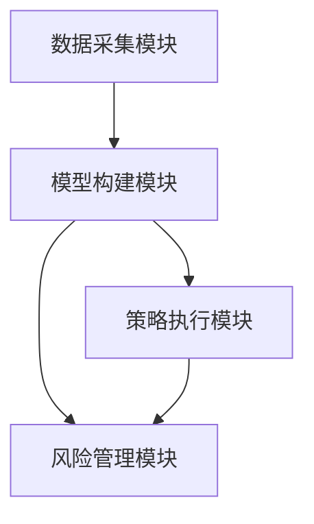

                 

# 价值投资中的逆向思维应用

## 关键词：价值投资、逆向思维、投资策略、风险管理、市场分析

## 摘要：逆向思维是一种从反方向思考问题的方法，能够在复杂多变的市场环境中帮助投资者发现潜在机会。本文将深入探讨逆向思维在价值投资中的应用，结合数学模型和实际案例，分析其在市场情绪分析、价值评估、投资策略制定等方面的核心作用，为投资者提供实用的指导。

---

# 第一部分: 逆向思维的基本概念

## 第1章: 逆向思维的定义与重要性

### 1.1 逆向思维的定义
逆向思维是一种从反方向思考问题的方法，通过寻找问题的对立面来解决问题或发现机会。在投资领域，逆向思维可以帮助投资者在市场低迷时发现低估资产，或者在市场繁荣时识别潜在风险。

### 1.2 逆向思维的重要性
- **发现潜在机会**：逆向思维能够帮助投资者在市场忽视的领域中发现价值。
- **降低风险**：通过逆向分析，投资者可以提前识别市场风险，避免盲目跟风。
- **逆周期投资**：逆向思维强调在市场低谷时买入，在市场高点时卖出，从而实现超额收益。

### 1.3 逆向思维与传统投资思维的区别
- **传统投资思维**：注重市场趋势和短期收益，容易受到市场情绪的影响。
- **逆向思维**：注重市场反向信号和长期价值，强调逆周期操作。

---

# 第二部分: 逆向思维在价值投资中的应用

## 第2章: 逆向思维与市场情绪分析

### 2.1 市场情绪分析的定义
市场情绪分析是指通过分析投资者情绪来预测市场走势。情绪分析可以帮助投资者识别市场过热或恐慌的情况，从而制定相应的投资策略。

### 2.2 逆向思维在市场情绪分析中的应用
- **情绪指数模型**：通过分析媒体、社交网络等渠道的情绪数据，计算市场情绪指数。
- **案例分析**：2020年新冠疫情爆发期间，市场情绪极度恐慌，许多优质资产被低估，逆向投资者在此时进场布局，获得了丰厚的回报。

#### 2.2.1 市场情绪指数模型
$$市场情绪指数 = \frac{正向情绪次数}{总情绪次数}$$

### 2.3 逆向思维与市场情绪的关系
逆向思维强调在市场情绪低落时寻找机会，而在市场情绪高涨时保持冷静。

## 第3章: 逆向思维与价值评估

### 3.1 价值评估的定义
价值评估是指通过对资产的内在价值进行分析，确定其合理价格。价值投资的核心是寻找市场价格低于内在价值的资产。

### 3.2 逆向思维在价值评估中的应用
- **识别价值陷阱**：逆向思维可以帮助投资者避免被表面的低价格迷惑，识别真正具有投资价值的资产。
- **计算安全边际**：逆向思维强调在投资时留出安全边际，即市场价格远低于内在价值。

#### 3.2.1 安全边际计算
$$安全边际 = 内在价值 - 市场价格$$

## 第4章: 逆向思维与投资策略

### 4.1 逆向投资策略的定义
逆向投资策略是指在市场低迷时进行投资，寻找被市场低估的资产。

### 4.2 逆向投资策略的实施步骤
1. **分析市场周期**：识别市场所处的周期阶段，判断是否处于低谷。
2. **寻找低估资产**：通过基本面分析，寻找市场价格低于内在价值的资产。
3. **制定投资计划**：根据分析结果，制定投资计划并逐步执行。

### 4.3 逆向策略的风险管理
- **设定止损点**：在市场反弹无力时及时止损，避免更大的损失。
- **分散投资**：通过分散投资降低单一资产的风险。

---

# 第三部分: 逆向思维的数学模型与算法

## 第5章: 逆向思维的数学模型

### 5.1 市场情绪指数模型
$$市场情绪指数 = \frac{正向情绪次数}{总情绪次数}$$

### 5.2 价值评估模型
$$内在价值 = \sum_{t=1}^{n} \frac{CF_t}{(1 + r)^t}$$
其中，CF_t为第t年的现金流，r为折现率。

---

# 第四部分: 系统化投资方法的构建

## 第6章: 系统化投资方法的设计

### 6.1 系统化投资方法的定义
系统化投资方法是指通过制定明确的投资规则和策略，避免主观判断对投资决策的影响。

### 6.2 投资系统架构
- **数据采集模块**：收集市场数据，包括价格、成交量、情绪等。
- **模型构建模块**：利用数学模型对数据进行分析，生成投资信号。
- **策略执行模块**：根据模型输出的投资信号，执行买入或卖出操作。
- **风险管理模块**：监控投资组合的风险，及时调整投资策略。

#### 6.2.1 系统化投资架构图

---

# 第五部分: 经典案例分析

## 第7章: 逆向思维的经典案例

### 7.1 2008年金融危机期间的逆向投资
- **背景**：金融危机期间，市场情绪极度恐慌，许多优质资产被抛售。
- **操作**：逆向投资者在市场低点买入股票，持有优质资产，最终获得丰厚回报。

---

# 第六部分: 投资者心理与行为分析

## 第8章: 逆向思维与投资者心理

### 8.1 投资者心理的常见问题
- **从众心理**：跟随市场潮流，容易被市场情绪影响。
- **恐惧与贪婪**：在市场下跌时恐惧，在市场上涨时贪婪。

### 8.2 逆向思维与心理调节
- **保持独立思考**：逆向思维需要投资者具备独立思考的能力，不被市场情绪左右。
- **长期视角**：逆向思维强调长期投资，需要投资者克服短期波动的干扰。

---

# 第七部分: 总结与展望

## 第9章: 总结与展望

### 9.1 总结
逆向思维是一种重要的投资方法，能够帮助投资者在市场低迷时发现机会，避免盲目跟风。通过逆向思维，投资者可以实现超额收益，降低投资风险。

### 9.2 展望
随着市场环境的复杂化，逆向思维的重要性将更加凸显。未来，逆向思维将结合更多的技术手段，如大数据分析、人工智能等，为投资者提供更精准的投资策略。

---

# 作者

作者：AI天才研究院/AI Genius Institute & 禅与计算机程序设计艺术 /Zen And The Art of Computer Programming

---

**注**：由于篇幅限制，上述内容为文章的框架和部分核心章节的详细内容。完整文章将包含每个章节的详细展开，包括更多的案例分析、数学公式和系统架构图。

