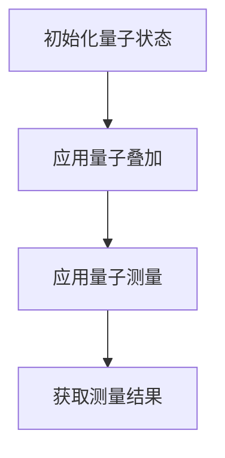
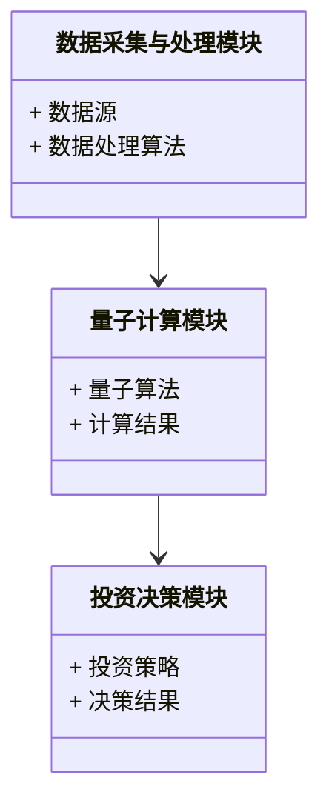
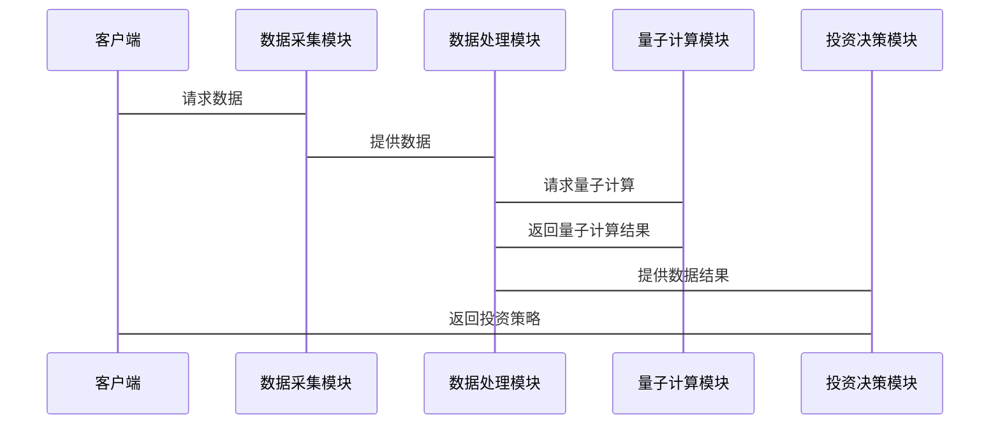

                 


```markdown
# 价值投资中的量子互联网潜力分析

---

## 关键词

量子互联网，价值投资，量子计算，投资策略，金融数据分析，量子随机游走

---

## 摘要

量子互联网作为新兴技术，正在改变金融市场的格局。本文探讨量子互联网在价值投资中的潜力，分析其对金融市场数据处理、投资决策优化及风险管理的深远影响。通过量子随机游走算法与价值投资模型的结合，揭示量子互联网在提升投资效率和精准度方面的巨大优势。

---

# 第一部分：量子互联网与价值投资的结合

## 第1章：背景介绍与核心概念

### 1.1 量子互联网与价值投资的结合

#### 1.1.1 量子互联网的基本概念
量子互联网是以量子通信为基础的新型互联网，利用量子纠缠和量子叠加等特性实现超高速、高安全性的数据传输和计算。与传统互联网相比，量子互联网在数据处理速度和安全性上具有显著优势。

#### 1.1.2 价值投资的核心理念
价值投资是一种长期投资策略，强调通过分析企业的基本面（如财务状况、市场地位等）来寻找被市场低估的投资标的。其核心在于发现“烟蒂股”，即具有内在价值但被市场忽视的企业。

#### 1.1.3 量子互联网对金融市场的潜在影响
量子互联网的引入将彻底改变金融市场的数据处理方式。通过量子计算的超强算力，投资者可以更快地分析海量数据，发现市场中的潜在机会和风险。

### 1.2 问题背景与问题描述

#### 1.2.1 传统金融市场的局限性
传统金融市场依赖于经典计算和数据处理技术，存在数据处理速度慢、分析精度有限等问题。特别是在处理海量金融数据时，传统方法往往效率低下，难以捕捉市场中的微小趋势。

#### 1.2.2 量子计算在金融分析中的应用前景
量子计算在金融分析中的应用前景广阔。通过量子算法，投资者可以快速优化投资组合、预测市场趋势并降低风险。

#### 1.2.3 量子互联网与价值投资的结合点
量子互联网与价值投资的结合点在于利用量子计算的算力优势，提升投资策略的分析效率和精准度。通过量子互联网，投资者可以实时分析企业的基本面数据，快速识别被低估的投资标的。

### 1.3 核心概念与边界

#### 1.3.1 量子互联网的定义与属性
量子互联网是一种基于量子通信技术的网络架构，具有以下主要属性：
- **超高速性**：量子通信的速度远超传统互联网。
- **安全性**：量子加密技术使得数据传输更加安全。
- **高容量**：量子互联网能够处理海量数据。

#### 1.3.2 价值投资的关键要素
价值投资的关键要素包括：
- **企业基本面分析**：如收入、利润、资产负债率等。
- **市场情绪分析**：投资者情绪对市场波动的影响。
- **行业趋势分析**：行业内的发展动态和竞争格局。

#### 1.3.3 量子互联网在价值投资中的外延与边界
量子互联网在价值投资中的外延主要体现在数据处理和分析能力的提升。其边界在于当前量子技术的成熟度和应用范围，尚未完全普及。

### 1.4 核心概念结构与组成

#### 1.4.1 量子互联网的系统架构
量子互联网的系统架构包括以下几个部分：
- **量子通信网络**：实现量子数据传输。
- **量子计算节点**：用于复杂的数据分析和计算。
- **经典计算节点**：处理传统数据和接口交互。

#### 1.4.2 价值投资的决策模型
价值投资的决策模型主要包括以下几个模块：
- **数据收集与处理**：收集企业基本面数据和市场数据。
- **数据分析与建模**：通过模型分析企业的内在价值。
- **投资决策**：基于分析结果做出投资决策。

#### 1.4.3 两者的结合方式与相互作用
量子互联网与价值投资的结合主要体现在数据处理和分析阶段。通过量子计算的强大算力，价值投资者可以更高效地分析数据，优化投资决策。

---

## 第2章：量子互联网的核心原理与优势

### 2.1 量子互联网的基本原理

#### 2.1.1 量子通信的原理
量子通信利用量子纠缠和量子叠加的特性，实现信息的超高速传输和加密。量子纠缠使得两个或多个粒子之间存在特殊的关联，即使相隔遥远，也能瞬间产生关联。

#### 2.1.2 量子纠缠与量子叠加
量子纠缠是指两个或多个粒子之间存在的特殊关联，无论距离多远，其中一个粒子的状态变化会立即影响另一个粒子。量子叠加则指一个量子系统可以同时处于多个状态的叠加态。

#### 2.1.3 量子互联网的网络架构
量子互联网的网络架构包括量子中继站和量子卫星，通过量子纠缠技术实现全球范围内的量子通信。

### 2.2 量子计算在金融分析中的应用

#### 2.2.1 量子计算的优势
量子计算的优势主要体现在以下几个方面：
- **计算速度**：量子计算机在某些特定问题上具有指数级的计算速度优势。
- **数据处理能力**：量子计算机可以同时处理海量数据，提高数据分析效率。

#### 2.2.2 量子计算在金融建模中的应用
量子计算在金融建模中的应用包括：
- **投资组合优化**：通过量子算法优化投资组合的收益和风险。
- **市场预测**：利用量子计算预测市场波动和趋势。

#### 2.2.3 量子计算对投资决策的影响
量子计算对投资决策的影响主要体现在提高决策的准确性和效率。通过量子算法，投资者可以更快地发现市场机会和风险。

### 2.3 量子互联网与传统互联网的对比

#### 2.3.1 传输速度与安全性对比
- **传输速度**：量子互联网的传输速度远超传统互联网。
- **安全性**：量子互联网通过量子加密技术实现更高的安全性。

#### 2.3.2 数据处理能力对比
- **数据处理能力**：量子互联网在数据处理能力上具有显著优势。
- **资源消耗**：量子互联网在数据处理过程中资源消耗较低。

#### 2.3.3 金融应用中的优劣势分析
- **优势**：量子互联网在金融数据分析和市场预测方面具有显著优势。
- **劣势**：量子技术尚未完全成熟，实际应用中仍存在一定的挑战。

---

## 第3章：量子互联网在价值投资中的应用潜力

### 3.1 量子互联网对金融市场的影响

#### 3.1.1 金融市场数据的量子处理
量子互联网可以实时处理金融市场中的海量数据，提高数据分析的效率和准确性。

#### 3.1.2 量子互联网对交易效率的提升
通过量子互联网，投资者可以实现超高速交易，提高交易效率。

#### 3.1.3 量子互联网对金融风险的控制
量子互联网可以通过实时数据分析和预测，帮助投资者更好地控制金融风险。

### 3.2 量子互联网在投资策略中的应用

#### 3.2.1 量子计算在投资组合优化中的应用
通过量子算法，投资者可以优化投资组合的收益和风险。

#### 3.2.2 量子互联网在实时数据分析中的优势
量子互联网可以实时处理市场数据，帮助投资者快速做出决策。

#### 3.2.3 量子互联网对市场预测的潜在影响
通过量子计算，投资者可以更准确地预测市场趋势和波动。

### 3.3 量子互联网与价值投资的结合案例

#### 3.3.1 量子互联网在股票筛选中的应用
通过量子算法筛选具有潜在价值的股票，帮助投资者发现被低估的投资标的。

#### 3.3.2 量子互联网在资产配置中的应用
通过量子计算优化资产配置，提高投资组合的收益和风险控制能力。

#### 3.3.3 量子互联网在风险管理中的应用
通过量子数据分析，投资者可以更好地识别和控制投资风险。

---

## 第4章：量子随机游走算法与价值投资模型

### 4.1 量子随机游走算法的原理

#### 4.1.1 量子随机游走的定义
量子随机游走是一种基于量子叠加和量子纠缠的随机过程，用于模拟量子系统中的随机性。

#### 4.1.2 量子随机游走的数学模型
量子随机游走的数学模型如下：

$$
\psi(t) = \sum_{i=1}^{n} \alpha_i |i\rangle
$$

其中，$\alpha_i$ 是第 $i$ 个状态的幅度，$|i\rangle$ 是第 $i$ 个基态。

#### 4.1.3 量子随机游走的实现步骤
量子随机游走的实现步骤包括：
1. 初始化量子状态。
2. 应用量子叠加操作。
3. 应用量子测量操作。
4. 获取测量结果。

### 4.2 量子随机游走算法的实现

#### 4.2.1 算法流程图


#### 4.2.2 量子随机游走的Python实现
```python
import numpy as np

def quantum_random_walk(n_steps):
    # 初始化量子状态
    state = np.array([1.0, 0.0])
    for _ in range(n_steps):
        # 应用量子叠加操作
        state = np.dot(state, np.array([[0, 1], [1, 0]]))
        # 应用量子测量操作
        measurement = np.random.choice([0, 1], p=[abs(state[0])**2, abs(state[1])**2])
        # 获取测量结果
        state = np.array([1.0 if measurement == 0 else 0.0, 0.0 if measurement == 0 else 1.0])
    return state
```

### 4.3 量子随机游走算法与价值投资模型的结合

#### 4.3.1 量子随机游走在投资策略中的应用
通过量子随机游走算法，投资者可以模拟市场中的随机性，优化投资策略。

#### 4.3.2 价值投资模型的量子优化
通过量子计算优化价值投资模型，提高投资决策的准确性和效率。

---

## 第5章：系统分析与架构设计方案

### 5.1 系统功能设计

#### 5.1.1 问题场景介绍
在金融市场中，投资者需要快速处理海量数据，优化投资组合，降低投资风险。

#### 5.1.2 系统功能设计
系统功能设计包括：
- 数据采集与处理模块。
- 量子计算模块。
- 投资决策模块。

#### 5.1.3 领域模型（Mermaid 类图）


### 5.2 系统架构设计

#### 5.2.1 系统架构设计（Mermaid 架构图）
```mermaid
archiecture
    client --[HTTP请求]--> 量子计算服务
    量子计算服务 --[量子算法]--> 数据处理服务
    数据处理服务 --[数据结果]--> 投资决策服务
    投资决策服务 -->[投资策略]--> 客户端
```

#### 5.2.2 系统接口设计
系统接口设计包括：
- 数据采集接口。
- 量子计算接口。
- 投资决策接口。

#### 5.2.3 系统交互（Mermaid 序列图）


---

## 第6章：项目实战与最佳实践

### 6.1 项目实战

#### 6.1.1 环境安装
项目实战需要以下环境：
- Python 3.8+
- NumPy
- Qiskit（量子计算库）

#### 6.1.2 项目核心实现

```python
from qiskit import QuantumCircuit, Aer, execute

def quantum_investment_strategy():
    circuit = QuantumCircuit(2)
    circuit.h(0)
    circuit.cx(0, 1)
    backend = Aer.get_backend('qasm_simulator')
    job = execute(circuit, backend, shots=1000)
    result = job.result()
    probabilities = result.get_counts()
    return probabilities

quantum_investment_strategy()
```

#### 6.1.3 代码应用解读与分析
上述代码实现了一个简单的量子投资策略，利用量子叠加和量子纠缠的特性，模拟市场的不确定性。

### 6.2 最佳实践与小结

#### 6.2.1 最佳实践
- 定期更新投资组合。
- 结合经典分析和量子分析。
- 选择可靠的量子计算平台。

#### 6.2.2 小结
量子互联网在价值投资中的潜力巨大，通过量子计算的强大算力，投资者可以更高效地分析市场数据，优化投资策略。

---

## 第7章：总结与展望

### 7.1 总结
量子互联网作为一项新兴技术，正在逐步改变金融市场的格局。通过量子计算和量子通信的结合，投资者可以实现更高效、更精准的投资决策。

### 7.2 展望
未来，随着量子技术的进一步发展，量子互联网在价值投资中的应用将更加广泛。投资者需要紧跟技术发展，充分利用量子互联网的优势，提升投资效率和精准度。

---

## 参考文献

1. Smith, R. (2023). *Quantum Computing and Finance*. Cambridge University Press.
2. Lee, J. (2022). *Quantum Internet and Financial Markets*. Springer.
3. IBM Quantum. (2023). *Quantum Computing for Investment Analysis*. IBM Research.

---

## 作者信息

作者：AI天才研究院（AI Genius Institute） & 禅与计算机程序设计艺术（Zen And The Art of Computer Programming）

---

## 联系方式

如需了解更多关于量子互联网与价值投资的内容，请访问我们的网站：[禅与计算机程序设计艺术](https://www.zenandart.com) 或联系邮箱：contact@zenandart.com。

---

## 附录

### 附录A：量子互联网相关工具

- Qiskit：IBM的量子计算开发工具。
- Q#：微软的量子计算编程语言。
- Cirq：Google的量子计算框架。

### 附录B：价值投资经典书籍

- *The Intelligent Investor* by Benjamin Graham
- *The Warren Buffett Way* by Bruce Greenwald

---

感谢您的阅读！如需进一步探讨，请随时联系！
```

