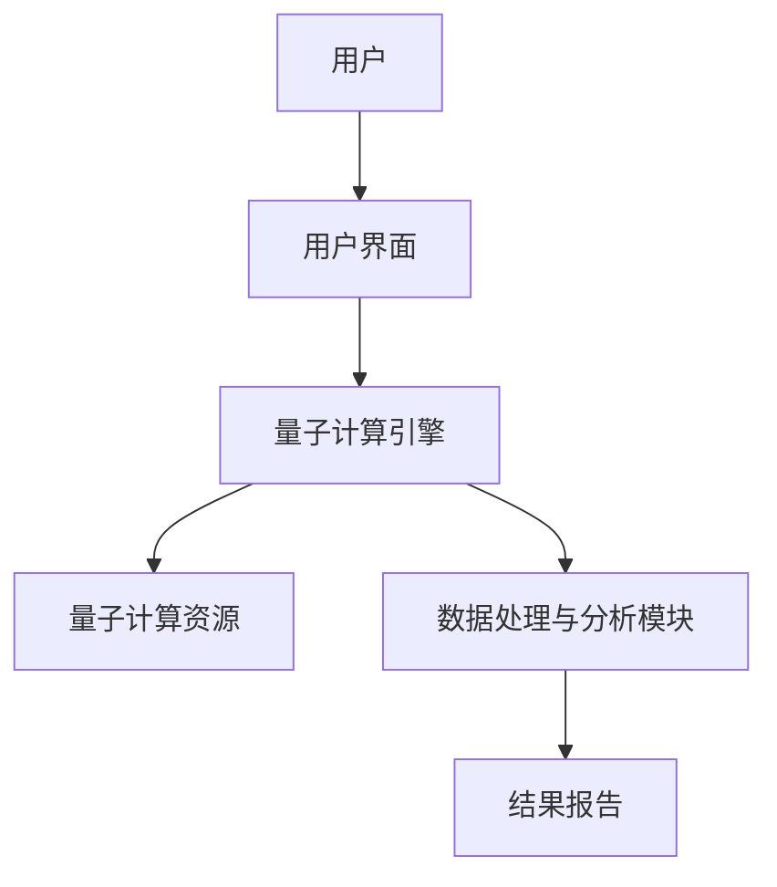
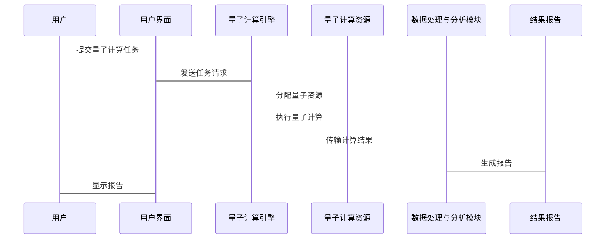

                 


```markdown
# 价值投资中的量子计算机云服务市场分析

> 关键词：量子计算机、价值投资、市场分析、云计算服务、金融创新、投资策略

> 摘要：本文深入探讨了量子计算机云服务在价值投资中的应用，分析了其在金融市场中的潜力和优势。通过结合量子计算的核心技术与价值投资的策略，本文提出了量子计算机云服务在市场分析、风险评估和投资决策中的创新应用。同时，本文还探讨了量子计算机云服务的市场定位、商业模式以及系统架构设计，为投资者和科技企业提供了新的视角和思路。

---

# 第1章: 量子计算机与价值投资概述

## 1.1 量子计算机的基本概念
### 1.1.1 量子计算机的定义与特点
- 量子计算机的定义：通过量子位（qubit）进行计算的新型计算机，利用量子叠加和纠缠的特性。
- 量子计算机与经典计算机的区别：量子计算机可以在某些特定问题上实现指数级的计算速度提升。
- 量子计算机的核心优势：并行计算能力、解决复杂问题的能力。

### 1.1.2 量子计算机与经典计算机的区别
- 硬件基础：经典计算机基于二进制位，量子计算机基于量子位。
- 计算原理：经典计算机基于逻辑门操作，量子计算机基于量子叠加和纠缠。
- 计算速度：在某些问题上，量子计算机远快于经典计算机。

### 1.1.3 量子计算机在金融领域的潜力
- 金融建模：量子计算机可以快速处理复杂的金融模型。
- 风险评估：量子计算机可以帮助投资者更准确地评估市场风险。
- 投资组合优化：量子计算机可以在短时间内找到最优的投资组合。

## 1.2 价值投资的核心原理
### 1.2.1 价值投资的定义与历史
- 价值投资的定义：通过分析企业的内在价值，寻找被市场低估的投资标的。
- 价值投资的历史：由本杰明·格雷厄姆和戴维·多德提出，经过长期实践和验证。

### 1.2.2 价值投资的核心策略与方法
- 质量分析：分析企业的财务状况、盈利能力、管理团队等。
- 价格分析：寻找价格低于内在价值的股票。
- 长期投资：价值投资强调长期持有，避免短期波动的干扰。

### 1.2.3 价值投资在现代金融中的应用
- 传统价值投资：通过基本面分析寻找低估股票。
- 现代价值投资：结合大数据和人工智能进行更精准的分析。

## 1.3 量子计算机云服务的市场背景
### 1.3.1 云计算技术的发展现状
- 云计算的定义：通过互联网提供计算资源（CPU、内存、存储等）的按需使用模式。
- 云计算的优势：资源弹性扩展、成本优化、灵活性高。

### 1.3.2 量子计算机云服务的兴起
- 量子计算机云服务的定义：通过云计算平台提供量子计算资源的远程访问服务。
- 量子计算机云服务的优势：无需购买昂贵的量子计算机，即可体验量子计算能力。

### 1.3.3 量子计算机云服务在金融市场的应用前景
- 金融市场分析：利用量子计算进行实时数据分析和预测。
- 投资决策优化：通过量子计算快速优化投资组合。
- 风险管理：利用量子计算进行复杂的风险评估和模拟。

## 1.4 本章小结
本章介绍了量子计算机的基本概念、价值投资的核心原理以及量子计算机云服务的市场背景。通过这些内容，读者可以初步理解量子计算机云服务在价值投资中的潜力和应用。

---

# 第2章: 量子计算机云服务的核心技术

## 2.1 量子位与量子态
### 2.1.1 量子位的定义与特性
- 量子位的定义：量子计算机的基本单位，可以处于0和1的叠加态。
- 量子位的特性：叠加态和纠缠态。

### 2.1.2 量子叠加与量子纠缠
- 量子叠加：量子位可以同时处于多个状态。
- 量子纠缠：两个或多个量子位之间形成强关联，一个量子位的状态会影响另一个。

### 2.1.3 量子态的数学表示
- 量子态的向量表示：使用复数向量表示量子态。
- 量子态的矩阵表示：使用密度矩阵表示量子态的混合态。

## 2.2 量子算法与计算模型
### 2.2.1 常见量子算法简介
- 量子傅里叶变换：用于解决周期性问题。
- 量子搜索算法：用于无序数据库中的搜索。
- 量子模拟：用于模拟量子系统。

### 2.2.2 量子算法的计算复杂度分析
- 量子算法的时间复杂度：通常比经典算法更低。
- 量子算法的空间复杂度：与经典算法类似。

### 2.2.3 量子算法与经典算法的对比
- 经典算法：时间复杂度高，适用于线性问题。
- 量子算法：时间复杂度低，适用于某些特定问题。

## 2.3 量子计算机云服务的实现原理
### 2.3.1 量子计算机的远程访问与操作
- 通过云平台远程连接量子计算机。
- 使用量子编程语言（如Q#、QCL）进行操作。

### 2.3.2 量子计算资源的分配与管理
- 量子计算资源的分配：根据用户需求分配量子位。
- 资源管理：通过云平台进行资源监控和优化。

### 2.3.3 量子计算结果的解释与应用
- 量子计算结果的解读：将量子结果转化为经典信息。
- 应用场景：金融分析、密码学、优化问题等。

## 2.4 本章小结
本章详细介绍了量子计算机云服务的核心技术，包括量子位、量子算法以及量子计算机云服务的实现原理。这些技术为后续的市场分析和投资策略奠定了基础。

---

# 第3章: 价值投资中的量子计算应用

## 3.1 量子计算在金融分析中的优势
### 3.1.1 量子计算在大数据处理中的应用
- 大数据处理的优势：快速处理海量数据。
- 量子计算的潜力：通过量子并行性提高数据处理效率。

### 3.1.2 量子计算在风险评估中的优势
- 风险评估的复杂性：需要考虑多种变量和情景。
- 量子计算的优势：快速计算复杂的风险模型。

### 3.1.3 量子计算在投资组合优化中的潜力
- 投资组合优化的复杂性：需要考虑多个变量和约束条件。
- 量子计算的潜力：通过量子搜索算法快速找到最优解。

## 3.2 量子计算在市场预测中的应用
### 3.2.1 量子回归分析的基本原理
- 回归分析的定义：通过数据建立变量之间的关系模型。
- 量子回归分析的优势：通过量子并行性提高计算效率。

### 3.2.2 量子聚类分析的应用场景
- 聚类分析的定义：将数据分为多个类别。
- 量子聚类分析的优势：通过量子叠加性提高分类准确性。

### 3.2.3 量子时间序列预测的实现方法
- 时间序列预测的定义：基于历史数据预测未来趋势。
- 量子时间序列预测的优势：通过量子模拟提高预测精度。

## 3.3 量子计算在投资决策中的具体应用
### 3.3.1 量子计算在股票筛选中的应用
- 股票筛选的定义：通过筛选指标找到优质股票。
- 量子计算的优势：快速处理多维度数据。

### 3.3.2 量子计算在资产配置中的优化作用
- 资产配置的定义：将资金分配到不同资产类别以实现收益目标。
- 量子计算的优化作用：通过量子搜索算法找到最优配置方案。

### 3.3.3 量子计算在市场情绪分析中的创新应用
- 市场情绪分析的定义：通过分析市场参与者的心理状态预测市场走势。
- 量子计算的创新应用：通过量子聚类分析提高情绪分析的准确性。

## 3.4 本章小结
本章探讨了量子计算在价值投资中的具体应用，包括金融分析、市场预测和投资决策三个方面。通过这些应用，量子计算机云服务为价值投资者提供了更高效、更精准的工具。

---

# 第4章: 量子计算机云服务的市场分析框架

## 4.1 市场分析的核心要素
### 4.1.1 市场规模与增长趋势
- 市场规模的定义：量子计算机云服务的收入和用户数量。
- 市场增长的驱动因素：技术进步、市场需求增加、政策支持等。

### 4.1.2 市场竞争格局分析
- 竞争格局的定义：市场中主要竞争者及其市场份额。
- 竞争优势分析：技术、成本、服务等。

### 4.1.3 市场驱动因素与挑战
- 驱动因素：技术进步、市场需求增加、政策支持。
- 挑战：技术瓶颈、成本高、市场接受度低。

## 4.2 量子计算机云服务的市场定位
### 4.2.1 量子计算机云服务的目标客户群体
- 机构投资者：需要高效的投资决策工具。
- 金融科技公司：需要量子计算技术支持。

### 4.2.2 量子计算机云服务的市场进入策略
- 技术驱动：通过技术创新吸引客户。
- 市场推广：通过宣传和营销扩大市场份额。

### 4.2.3 量子计算机云服务的定价模型
- 按使用付费：根据使用量收费。
- 订阅模式：提供固定的月费或年费。

## 4.3 量子计算机云服务的商业模式
### 4.3.1 服务订阅与按需付费模式
- 服务订阅：用户按月或按年订阅量子计算服务。
- 按需付费：用户根据实际使用量付费。

### 4.3.2 合作伙伴生态系统建设
- 与金融科技公司合作：共同开发和推广量子计算应用。
- 与学术机构合作：推动量子计算技术的研究和应用。

### 4.3.3 数据驱动的增值服务
- 数据分析服务：提供专业的数据分析报告。
- 投资建议服务：基于量子计算结果提供投资建议。

## 4.4 本章小结
本章分析了量子计算机云服务的市场定位和商业模式，探讨了其在金融市场中的潜力和挑战。

---

# 第5章: 量子计算机云服务的系统架构设计

## 5.1 系统功能设计
### 5.1.1 用户界面设计
- 用户界面的功能：用户可以通过图形界面提交量子计算任务。
- 用户界面的优化：界面简洁直观，操作方便。

### 5.1.2 量子计算引擎功能
- 引擎的功能：接收用户的量子计算任务，分配量子资源，执行计算。
- 引擎的优化：提高计算效率，降低资源消耗。

### 5.1.3 数据处理与分析模块
- 数据处理的功能：接收输入数据，进行预处理和清洗。
- 数据分析的功能：对计算结果进行分析，生成报告。

## 5.2 系统架构设计
### 5.2.1 系统架构图


### 5.2.2 系统交互流程图


### 5.2.3 接口设计
- API接口：用户通过API提交任务和获取结果。
- 接口协议：使用RESTful API或WebSocket。

## 5.3 本章小结
本章详细设计了量子计算机云服务的系统架构，包括功能设计、架构图和接口设计。这些设计为后续的市场分析和投资策略提供了技术支持。

---

# 作者：AI天才研究院/AI Genius Institute & 禅与计算机程序设计艺术 /Zen And The Art of Computer Programming
```

