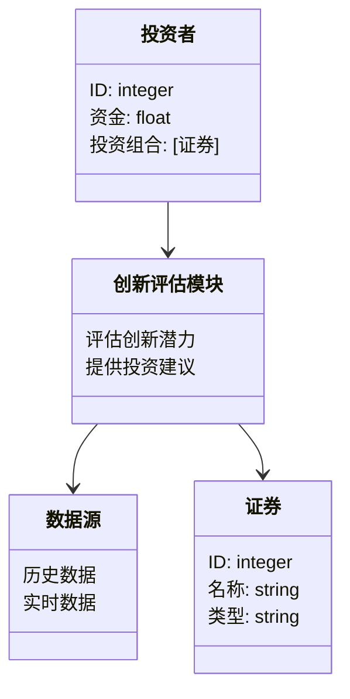

                 


# 价值投资中的颠覆性创新识别

> 关键词：价值投资、颠覆性创新、技术创新识别、投资策略、市场分析、风险管理

> 摘要：本文深入探讨了在价值投资中识别颠覆性创新的关键方法和策略。通过分析创新的定义、特征及其在投资中的应用，结合数学模型和实际案例，帮助投资者更好地理解如何在技术变革中发现投资机会，构建稳健的投资组合。

---

## 第1章 价值投资与颠覆性创新概述

### 1.1 价值投资的核心理念

#### 1.1.1 价值投资的定义与历史发展
价值投资是一种以内在价值为导向的投资策略，起源于20世纪20年代，由本杰明·格雷厄姆和戴维·多德提出。其核心思想是寻找市场价格低于其内在价值的证券进行投资。

#### 1.1.2 价值投资的核心原则
- **安全边际**：买入价格低于内在价值，以降低风险。
- **长期视角**：关注企业的长期盈利能力，而非短期市场波动。
- **基本面分析**：通过对企业财务状况、行业地位和管理团队的分析，评估其内在价值。

#### 1.1.3 价值投资与现代投资理论的联系
价值投资与现代投资组合理论（MPT）的结合，帮助投资者在风险与收益之间找到平衡点，同时通过分散投资降低风险。

---

### 1.2 颠覆性创新的定义与特征

#### 1.2.1 颠覆性创新的定义
颠覆性创新是指通过引入新技术或商业模式，从根本上改变行业现状，创造出新的市场或替代现有产品/服务的创新。

#### 1.2.2 颠覆性创新的核心特征
| 特征 | 描述 |
|------|------|
| 技术驱动 | 依赖新技术实现 |
| 市场破坏性 | 打破现有市场平衡 |
| 用户价值 | 提供更优的产品或服务 |

#### 1.2.3 颠覆性创新与延续性创新的区别
| 维度 | 颠覆性创新 | 延续性创新 |
|------|------------|------------|
| 目标用户 | 非主流用户 | 主流用户 |
| 技术复杂度 | 高 | 低 |
| 市场影响 | 根本性改变 | 细微改进 |

---

### 1.3 价值投资与颠覆性创新的结合

#### 1.3.1 价值投资视角下的创新分类
- **技术创新**：技术层面的突破，如人工智能、区块链等。
- **商业模式创新**：新的商业模式，如订阅制、共享经济等。

#### 1.3.2 颠覆性创新在价值投资中的应用
投资者通过识别颠覆性创新，可以在早期发现具有巨大潜力的企业，从而在市场爆发前布局。

#### 1.3.3 颠覆性创新识别的挑战与机遇
- **挑战**：识别早期创新的难度大，风险高。
- **机遇**：早期发现颠覆性创新，可以获得超额收益。

---

## 第2章 颠覆性创新的识别方法

### 2.1 颠覆性创新的识别框架

#### 2.1.1 颠覆性创新的五要素模型
- **技术可行性**：技术是否成熟。
- **市场需求**：是否有足够的市场需求。
- **商业模式**：商业模式是否可行。
- **竞争环境**：是否存在竞争壁垒。
- **团队能力**：创始团队的能力。

#### 2.1.2 颠覆性创新的生命周期分析
颠覆性创新通常经历以下几个阶段：技术萌芽期、产品形成期、市场扩张期、成熟期。

#### 2.1.3 颠覆性创新的市场渗透曲线
使用数学模型描述创新在市场中的渗透过程，如Gompertz曲线。

---

### 2.2 颠覆性创新的识别工具

#### 2.2.1 创新评分模型
通过对企业技术、市场、团队等多维度进行评分，综合得出创新潜力指数。

#### 2.2.2 市场影响分析工具
使用SWOT分析法，评估创新对企业及其竞争对手的影响。

#### 2.2.3 创新扩散模型
基于Diffusion of Innovation理论，分析创新的传播速度和影响范围。

---

### 2.3 颠覆性创新的案例分析

#### 2.3.1 数字技术领域的颠覆性创新
以比特币为例，分析区块链技术如何颠覆传统金融体系。

#### 2.3.2 新兴产业中的颠覆性创新
以特斯拉为例，分析电动汽车如何颠覆传统汽车行业。

#### 2.3.3 传统行业中的颠覆性创新
以Netflix为例，分析流媒体如何颠覆传统影视产业。

---

## 第3章 价值投资中的创新评估

### 3.1 创新评估的维度

#### 3.1.1 技术可行性评估
通过技术专利数量、研发投入占比等指标，评估技术创新的可能性。

#### 3.1.2 市场需求评估
通过市场规模、增长潜力等指标，评估市场需求的强度。

#### 3.1.3 商业模式评估
通过收入来源、成本结构等指标，评估商业模式的可行性。

---

### 3.2 创新评估的数学模型

#### 3.2.1 创新潜力指数模型
$$ \text{创新潜力指数} = \frac{\text{技术评分} \times \text{市场评分}}{\text{竞争评分}} $$

#### 3.2.2 创新回报率模型
$$ \text{创新回报率} = \frac{\text{预期收益} - \text{投资成本}}{\text{投资成本}} \times 100\% $$

#### 3.2.3 创新风险评估模型
$$ \text{创新风险} = \text{技术风险} + \text{市场风险} + \text{竞争风险} $$

---

### 3.3 创新评估的案例分析

#### 3.3.1 技术型创新的评估
以SpaceX为例，评估其在航天技术领域的创新潜力。

#### 3.3.2 商业模式创新的评估
以Airbnb为例，评估其在共享经济领域的商业模式创新。

#### 3.3.3 综合创新的评估
以Apple为例，评估其在技术和商业模式上的双重创新。

---

## 第4章 颠覆性创新的技术分析方法

### 4.1 技术分析的基本原理

#### 4.1.1 技术分析的定义
通过分析历史价格数据，预测未来价格走势。

#### 4.1.2 技术分析的核心假设
- 市场反映一切信息。
- 价格走势具有延续性。
- 市场行为符合统计规律。

#### 4.1.3 技术分析与价值投资的结合
技术分析用于短期价格波动预测，价值投资用于长期价值判断。

---

### 4.2 技术分析的工具与指标

#### 4.2.1 移动平均线（MA）
- 短期MA：5日、10日。
- 长期MA：50日、200日。

#### 4.2.2 相对强弱指数（RSI）
- RSI指标用于判断超买超卖状态。

#### 4.2.3 布林格带（Bollinger Bands）
- 用于判断价格波动的范围。

---

### 4.3 技术分析在颠覆性创新中的应用

#### 4.3.1 创新周期的技术指标分析
使用RSI和布林格带分析创新公司的股价波动。

#### 4.3.2 技术突破的信号识别
识别股价突破关键阻力位，作为买入信号。

#### 4.3.3 技术分析与市场情绪的关系
通过技术指标分析市场情绪，辅助投资决策。

---

## 第5章 价值投资中的创新组合管理

### 5.1 投资组合管理的核心原则

#### 5.1.1 分散投资
通过投资不同类型的创新，降低风险。

#### 5.1.2 风险与收益平衡
在追求高收益的同时，控制风险。

---

### 5.2 投资组合优化的数学模型

#### 5.2.1 马科维茨有效组合模型
$$ \text{最小方差} = \arg \min \sigma^2 \text{ subject to } \mu \geq \text{目标收益} $$

#### 5.2.2 风险调整后的收益模型
$$ \text{夏普比率} = \frac{\text{收益} - \text{无风险利率}}{\text{收益波动率}} $$

---

### 5.3 创新组合管理的实战案例

#### 5.3.1 理想投资组合构建
- 技术创新类：人工智能、区块链。
- 商业模式创新类：共享经济、订阅制。

#### 5.3.2 风险管理策略
- 设置止损点：当股价下跌至某一水平，立即卖出。
- 定期再平衡：定期调整投资比例，保持最优组合。

---

## 第6章 颠覆性创新的系统分析与架构设计

### 6.1 问题场景介绍

#### 6.1.1 投资决策问题
如何在复杂市场环境中，快速识别和评估颠覆性创新。

#### 6.1.2 系统目标
构建一个智能化的投资决策支持系统，辅助投资者识别颠覆性创新。

---

### 6.2 系统架构设计

#### 6.2.1 领域模型（Mermaid 类图）


#### 6.2.2 系统架构（Mermaid 架构图）
```mermaid
container 投资者交互层 {
    投资者界面
    数据可视化
}
container 创新评估模块 {
    技术分析
    创新评分
}
container 数据层 {
    数据库
    API接口
}
```

---

## 第7章 项目实战：颠覆性创新识别系统

### 7.1 环境安装

#### 7.1.1 安装Python
```bash
pip install numpy pandas matplotlib
```

#### 7.1.2 安装数据处理库
```bash
pip install pandas_datareader
```

---

### 7.2 核心实现源代码

#### 7.2.1 创新评分模型
```python
import pandas as pd
import numpy as np

def calculate_innovation_score(company_data):
    # 技术评分：专利数量占比
    tech_score = company_data['专利数量'] / company_data['行业平均专利数量']
    
    # 市场评分：市场份额增长
    market_score = company_data['市场份额增长率'] / company_data['行业平均增长率']
    
    # 综合评分
    innovation_score = (tech_score + market_score) / 2
    return innovation_score
```

---

### 7.3 案例分析

#### 7.3.1 案例选择
以某科技公司为例，分析其技术创新和市场表现。

#### 7.3.2 数据分析与解读
使用创新评分模型，计算该公司的创新评分，并与行业平均水平对比。

#### 7.3.3 投资建议
根据评分结果，提出买入、持有或卖出的投资建议。

---

## 第8章 总结与展望

### 8.1 本章总结
本文系统性地探讨了价值投资中的颠覆性创新识别方法，结合理论分析和实际案例，为投资者提供了实用的工具和策略。

### 8.2 未来展望
随着人工智能和大数据技术的发展，颠覆性创新识别将更加智能化和精准化。

---

## 作者信息

作者：AI天才研究院/AI Genius Institute & 禅与计算机程序设计艺术/Zen And The Art of Computer Programming

---

通过以上结构，文章详细讲解了颠覆性创新识别的核心概念、方法和实践，帮助投资者在价值投资中发现潜在机会，构建稳健的投资组合。

