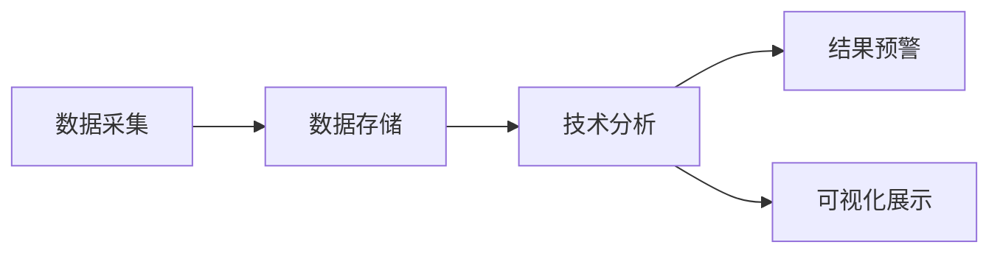

                 


# 价值投资中的颠覆性技术分析

---

## 关键词：
- 价值投资
- 颠覆性技术
- 技术分析
- 企业价值
- 数学模型

---

## 摘要：
在现代投资领域，价值投资与技术分析的结合越来越受到关注。本文从颠覆性技术的定义出发，探讨其对企业价值的影响，结合技术分析的核心算法，构建数学模型，提出颠覆性技术分析的方法。通过实际案例分析和系统架构设计，总结颠覆性技术分析的最佳实践，为投资者提供科学的决策支持。

---

## 第一部分：背景介绍

### 第1章：颠覆性技术与价值投资的结合

#### 1.1 颠覆性技术的定义与特征
- 颠覆性技术是指能够对企业现有业务模式或行业格局产生根本性改变的技术，具有创新性、高成长性和颠覆性。
- 颠覆性技术的生命周期包括萌芽期、快速发展期、成熟期和衰退期。

#### 1.2 价值投资的基本概念
- 价值投资是一种以企业内在价值为导向的投资策略，强调长期持有优质资产。
- 技术分析是通过研究历史价格和交易数据，预测未来价格走势的方法。

#### 1.3 颠覆性技术在价值投资中的应用背景
- 技术进步对投资决策的影响日益显著，颠覆性技术对企业价值的重塑作用不可忽视。
- 技术分析在价值投资中的潜在价值在于帮助企业识别潜在风险和机会。

---

## 第二部分：颠覆性技术与价值投资的核心概念

### 第2章：颠覆性技术的特征与分类

#### 2.1 颠覆性技术的特征
- 创新性：颠覆性技术往往打破传统模式，带来新的可能性。
- 研发周期：颠覆性技术的研发周期较长，但一旦成功，市场影响力巨大。
- 市场影响力：颠覆性技术能够迅速改变市场格局，甚至引发行业重组。

#### 2.2 颠覆性技术的分类
- 替代性技术：能够部分或完全替代现有技术。
- 增值性技术：能够提升现有产品的价值。
- 革命性技术：彻底改变行业格局，引发产业革命。

#### 2.3 颠覆性技术的生命周期模型
- 技术萌芽期：技术初步出现，市场认知度低。
- 快速发展期：技术逐渐成熟，市场关注度提高。
- 成熟稳定期：技术广泛应用，市场趋于饱和。
- 衰退期：技术逐渐被替代，市场逐渐萎缩。

---

## 第三部分：颠覆性技术分析的算法原理

### 第3章：技术分析的核心算法

#### 3.1 技术指标分析
- 移动平均线（MA）：
  $$MA_n = \frac{1}{n} \sum_{i=1}^{n} P_i$$
  其中，$P_i$ 表示第i天的价格，$n$ 是天数。

- 相对强弱指数（RSI）：
  $$RSI = \frac{\text{上涨天数}}{\text{总交易天数}} \times 100$$

---

## 第四部分：数学模型与系统分析

### 第4章：系统架构设计

#### 4.1 系统功能设计
- 采集模块：实时采集股票价格数据。
- 分析模块：基于技术指标进行分析。
- 预警模块：根据分析结果生成预警信号。

#### 4.2 系统架构设计（Mermaid图）


---

## 第五部分：项目实战

### 第5章：项目实战

#### 5.1 实际案例分析
- 以苹果公司为例，分析其股票价格走势和颠覆性技术的影响。
- 使用Python代码实现技术指标分析：
  ```python
  import pandas as pd
  import matplotlib.pyplot as plt

  # 计算移动平均线
  def calculate_ma(data, window):
      return data['Close'].rolling(window=window).mean()

  # 绘制K线图和移动平均线
  def plot_stock_data(data, ma_windows):
      plt.figure(figsize=(12, 6))
      for window in ma_windows:
          ma = calculate_ma(data, window)
          plt.plot(data['Date'], ma, label=f'MA_{window}')
      plt.xlabel('Date')
      plt.ylabel('Price')
      plt.title('Stock Price and Moving Averages')
      plt.legend()
      plt.show()

  # 示例数据（假设为苹果股票数据）
  data = pd.read_csv('apple_stock.csv')
  windows = [50, 100, 200]
  plot_stock_data(data, windows)
  ```

---

## 第六部分：最佳实践

### 第6章：总结与展望

#### 6.1 总结
- 颠覆性技术分析为价值投资提供了新的视角和工具。
- 技术分析与价值投资的结合能够帮助投资者更好地识别投资机会和风险。

#### 6.2 投资策略建议
- 长期投资者应关注颠覆性技术的成熟期，选择具有长期增长潜力的企业。
- 短期投资者应结合技术指标和市场情绪，灵活调整投资策略。

#### 6.3 风险管理
- 设置止损点，避免重大损失。
- 分散投资，降低单一投资的风险。

---

## 作者：AI天才研究院/AI Genius Institute & 禅与计算机程序设计艺术 /Zen And The Art of Computer Programming

---

以上是文章的详细内容，涵盖从理论到实践的各个方面，结合了技术分析和价值投资的核心概念，通过实际案例和系统设计展示了颠覆性技术分析的方法。

