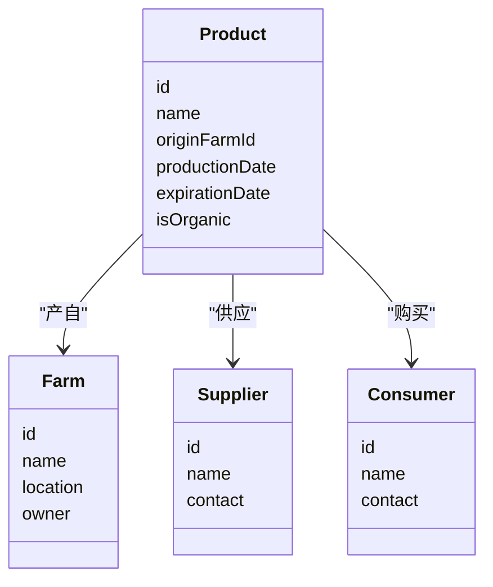
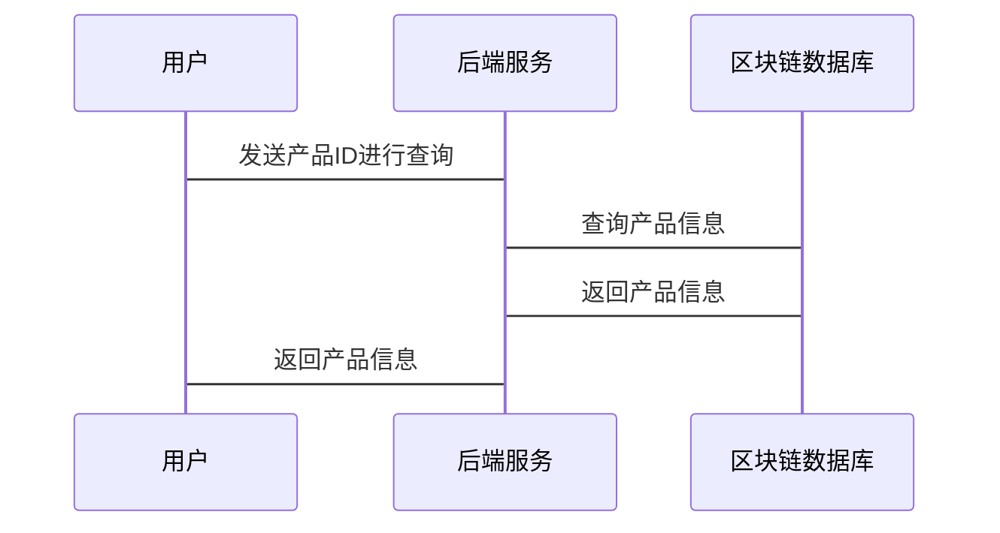

                 


## 第4章：区块链溯源系统的算法原理

### 4.1 区块链的共识机制
#### 4.1.1 共识机制的基本概念
共识机制是区块链系统中确保所有节点达成一致的关键算法。常见的共识机制包括工作量证明（PoW）、权益证明（PoS）、 delegated proof of stake（DPoS）等。

#### 4.1.2 工作量证明（PoW）的实现原理
工作量证明机制通过节点进行大量的计算，找到一个满足特定条件的哈希值来证明工作量。这个过程通常需要解决一个数学难题，如找到一个特定的随机数，使得哈希值的前导零的数量满足要求。

数学模型：
$$
H = hash(message) \\
$$
其中，$H$ 是哈希值，$message$ 是待处理的信息。

在PoW机制中，节点需要不断尝试不同的随机数，直到找到一个满足条件的哈希值。这个过程可以通过以下步骤实现：

1. 从一个随机数种子开始。
2. 计算该种子的哈希值。
3. 检查哈希值是否满足条件（如前导零的数量）。
4. 如果不满足，生成新的随机数种子，重复步骤2和3。
5. 直到找到满足条件的哈希值，完成一个新区块的生成。

#### 4.1.3 权益证明（PoS）的实现原理
权益证明机制通过节点持有的代币数量来决定其在共识过程中的权重。节点需要质押一定数量的代币，质押越多，被选中验证新区块的概率越高。

数学模型：
$$
P_i = \frac{stake_i}{\sum_{j=1}^{n} stake_j} \times 100 \\
$$
其中，$P_i$ 是第i个节点被选中的概率，$stake_i$ 是第i个节点质押的代币数量，$\sum_{j=1}^{n} stake_j$ 是所有节点质押代币的总和。

节点通过随机算法被选中，不需要进行大量的计算，从而降低了能源消耗。

### 4.2 智能合约的实现原理
智能合约是区块链上的可编程脚本，用于自动执行预定义的规则和操作。在智慧农业区块链溯源系统中，智能合约可以用于验证产品的来源、记录物流信息、管理权限等。

#### 4.2.1 智能合约的编写与部署
以Solidity语言为例，编写一个简单的智能合约，用于记录农产品的溯源信息。

Solidity代码示例：
```solidity
// SPDX-License-Identifier: MIT
pragma solidity ^0.8.0;

contract FarmProductTraceability {
    struct Product {
        uint256 id;
        string name;
        uint256 originFarmId;
        uint256 productionDate;
        uint256 expirationDate;
        bool isOrganic;
    }

    mapping(uint256 => Product) public productInfo;

    function registerProduct(uint256 productId, string memory productName, uint256 originFarmId, uint256 productionDate, uint256 expirationDate, bool isOrganic) public {
        Product memory product = Product({
            id: productId,
            name: productName,
            originFarmId: originFarmId,
            productionDate: productionDate,
            expirationDate: expirationDate,
            isOrganic: isOrganic
        });
        productInfo[productId] = product;
    }

    function getProduct(uint256 productId) public view returns (Product memory) {
        return productInfo[productId];
    }
}
```

#### 4.2.2 智能合约的执行流程
1. 用户提交产品信息到区块链节点。
2. 区块链节点验证信息的合法性。
3. 智能合约自动执行，记录产品信息到区块链数据库。
4. 返回确认信息给用户。

### 4.3 区块链溯源系统的数学模型
区块链的去中心化和不可篡改性依赖于密码学算法和共识机制。以下是一个简化的区块链数学模型：

$$
H_{i} = hash(data_i + H_{i-1}) \\
$$

其中，$H_i$ 是第i个区块的哈希值，$data_i$ 是第i个区块的数据，$H_{i-1}$ 是第i-1个区块的哈希值。

这个模型确保了每个区块的哈希值都依赖于前一个区块的哈希值，从而形成了一个不可篡改的区块链结构。

## 第5章：智慧农业区块链溯源系统的系统分析与架构设计

### 5.1 系统功能需求分析
智慧农业区块链溯源系统需要满足以下功能：
- **产品信息记录**：记录产品的基本信息、生产日期、 expiration date等。
- **溯源查询**：用户可以通过输入产品ID查询产品的详细信息。
- **防篡改性**：确保记录的信息无法被篡改。
- **权限管理**：不同角色（如农户、供应商、消费者）有不同的操作权限。

### 5.2 领域模型设计
领域模型描述了系统的实体及其关系。以下是一个简化的领域模型类图：



### 5.3 系统架构设计
系统架构采用分层设计，包括前端、后端和区块链数据库。


### 5.4 接口设计
系统需要提供以下接口：
- `POST /api/registerProduct`：注册产品信息。
- `GET /api getProductById`：根据产品ID查询产品信息。
- `POST /api/verifyProduct`：验证产品真伪。

### 5.5 交互流程图
以下是用户查询产品信息的交互流程图：



## 第6章：智慧农业区块链溯源系统的项目实战

### 6.1 环境安装
以下是安装所需环境的步骤：

1. **安装以太坊开发环境**：
   ```bash
   npm install -g truffle
   npm install -g ganache-cli
   ```
2. **安装Solidity编译器**：
   ```bash
   npm install -g solc
   ```
3. **安装React开发环境**：
   ```bash
   npm install create-react-app
   ```

### 6.2 核心代码实现
以下是核心代码实现：

1. **Solidity智能合约**：
   ```solidity
   // SPDX-License-Identifier: MIT
   pragma solidity ^0.8.0;

   contract FarmProductTraceability {
       struct Product {
           uint256 id;
           string name;
           uint256 originFarmId;
           uint256 productionDate;
           uint256 expirationDate;
           bool isOrganic;
       }

       mapping(uint256 => Product) public productInfo;

       function registerProduct(uint256 productId, string memory productName, uint256 originFarmId, uint256 productionDate, uint256 expirationDate, bool isOrganic) public {
           Product memory product = Product({
               id: productId,
               name: productName,
               originFarmId: originFarmId,
               productionDate: productionDate,
               expirationDate: expirationDate,
               isOrganic: isOrganic
           });
           productInfo[productId] = product;
       }

       function getProduct(uint256 productId) public view returns (Product memory) {
           return productInfo[productId];
       }
   }
   ```

2. **后端接口实现（Node.js）**：
   ```javascript
   const express = require('express');
   const bodyParser = require('body-parser');
   const app = express();

   app.use(bodyParser.json());

   app.post('/api/registerProduct', async (req, res) => {
       const { productId, productName, originFarmId, productionDate, expirationDate, isOrganic } = req.body;
       try {
           const product = await registerProduct(productId, productName, originFarmId, productionDate, expirationDate, isOrganic);
           res.status(200).json({ success: true, message: 'Product registered successfully' });
       } catch (error) {
           res.status(500).json({ success: false, error: 'Failed to register product' });
       }
   });

   app.get('/api getProductById', async (req, res) => {
       const { productId } = req.query;
       try {
           const product = await getProduct(productId);
           res.status(200).json(product);
       } catch (error) {
           res.status(500).json({ success: false, error: 'Failed to fetch product' });
       }
   });

   app.listen(3000, () => {
       console.log('Server is running on port 3000');
   });
   ```

3. **前端页面实现（React）**：
   ```javascript
   function ProductTracker() {
       const [productId, setProductId] = useState('');
       const [result, setResult] = useState('');

       const handleTrack = async () => {
           try {
               const response = await fetch('/api getProductById?productId=' + productId);
               const data = await response.json();
               setResult(JSON.stringify(data, null, 2));
           } catch (error) {
               setResult('Error fetching product information');
           }
       };

       return (
           <div>
               <input
                   type="text"
                   value={productId}
                   onChange={(e) => setProductId(e.target.value)}
               />
               <button onClick={handleTrack}>查询</button>
               <div>{result}</div>
           </div>
       );
   }

   ReactDOM.render(
       <ProductTracker />,
       document.getElementById('root')
   );
   ```

### 6.3 项目部署与测试
1. **部署智能合约到区块链网络**：
   ```bash
   truffle deploy --network development
   ```
2. **启动后端服务**：
   ```bash
   node server.js
   ```
3. **启动前端服务**：
   ```bash
   npm start
   ```
4. **测试接口**：
   - 注册一个产品：
     ```bash
     curl -X POST http://localhost:3000/api/registerProduct -H "Content-Type: application/json" -d '{"productId":1, "productName":"有机番茄", "originFarmId":1, "productionDate":20231001, "expirationDate":20231231, "isOrganic":true}'
     ```
   - 查询产品信息：
     ```bash
     curl http://localhost:3000/api/getProductById?productId=1
     ```

### 6.4 实际案例分析
假设我们有一个有机番茄的溯源系统，以下是具体步骤：

1. **产品注册**：
   - 农场主注册产品信息，包括产品ID、名称、原产农场ID、生产日期、 expiration date 和是否有机。
2. **产品查询**：
   - 消费者在购买后，可以输入产品ID查询产品的详细信息，包括生产日期、 expiration date 和是否有机。
3. **产品验证**：
   - 系统通过智能合约验证产品信息的真实性和完整性。

## 第7章：最佳实践与注意事项

### 7.1 最佳实践
1. **选择合适的区块链平台**：根据需求选择公有链（如以太坊）或私有链（如Hyperledger）。
2. **确保数据的准确性**：在产品注册阶段，确保所有信息的准确性和完整性。
3. **优化用户体验**：设计简洁直观的查询界面，方便消费者使用。
4. **考虑隐私保护**：在记录产品信息时，确保消费者的隐私不被泄露。

### 7.2 小结
通过区块链技术实现的智慧农业溯源系统，不仅提高了农业供应链的透明度和信任度，还为农业产业升级提供了新的可能性。区块链的去中心化和不可篡改性确保了数据的真实性和可靠性，为价值投资提供了坚实的基础。

### 7.3 注意事项
1. **技术实现的复杂性**：区块链技术的实现相对复杂，需要专业的开发团队。
2. **用户接受度**：消费者需要适应新的查询方式，可能需要进行一定的宣传和培训。
3. **政策法规**：区块链应用需要符合相关法律法规，特别是在数据隐私和跨境数据流动方面。

### 7.4 拓展阅读
- [《区块链技术指南》](https://www.amazon.com/Blockchain-Technologies-Handbook-Enterprise/dp/178883865X)
- [《智慧农业：区块链与农业的创新结合》](https://www.taylorfrancis.com/books/e/9781032209567)

## 作者：AI天才研究院/AI Genius Institute & 禅与计算机程序设计艺术 /Zen And The Art of Computer Programming

---

通过以上章节，我们从价值投资的角度深入分析了智慧农业区块链溯源系统的各个方面，从理论到实践，从概念到实现，为农业的可持续发展提供了新的思路和解决方案。希望本文能够为相关领域的研究者和从业者提供有价值的参考和启发。

