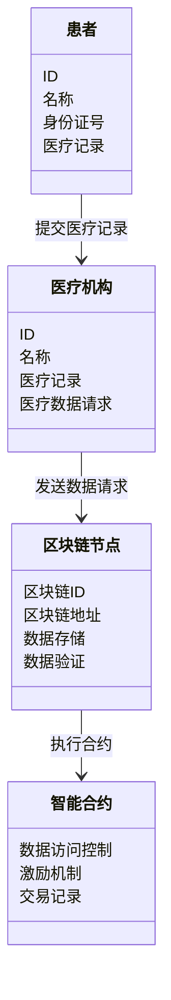
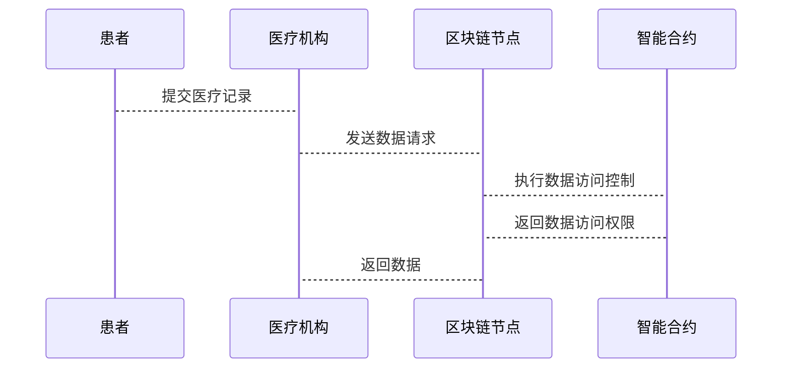

                 


# 价值投资视角下的智慧医疗区块链数据共享系统

> 关键词：价值投资、智慧医疗、区块链、数据共享、系统设计

> 摘要：本文从价值投资的角度探讨智慧医疗中区块链技术的应用，重点分析区块链如何提升医疗数据共享的效率、安全性和价值。文章详细介绍了区块链的核心原理、医疗数据共享的现状与挑战、系统架构设计、项目实现及案例分析，旨在为投资者和开发者提供深入的技术与商业洞察。

---

# 第一部分: 价值投资视角下的智慧医疗概述

## 第1章: 智慧医疗与区块链的结合

### 1.1 智慧医疗的概念与现状

#### 1.1.1 智慧医疗的定义
智慧医疗是指通过信息技术和数据驱动的方式，优化医疗服务流程、提升医疗资源利用效率，并改善患者体验的医疗模式。它涵盖电子健康记录（EHR）、远程医疗、医疗数据分析等多个方面。

#### 1.1.2 智慧医疗的发展背景
随着信息技术的快速发展，医疗行业正经历数字化转型。智慧医疗通过整合医疗数据，实现医疗机构间的高效协作和信息共享，从而提高诊断准确性、降低医疗成本，并提升患者满意度。

#### 1.1.3 医疗数据共享的重要性
医疗数据共享是智慧医疗的核心之一。通过共享患者数据，医疗机构可以更快地做出诊断决策，优化治疗方案，并支持医学研究的进展。然而，数据共享也面临隐私泄露和数据孤岛的问题。

### 1.2 区块链技术的核心特点

#### 1.2.1 区块链的基本概念
区块链是一种分布式账本技术，通过去中心化的方式记录数据，确保数据的安全性和不可篡改性。每个区块包含交易数据和时间戳，并通过链式结构连接，形成一个不可篡改的区块链。

#### 1.2.2 区块链的核心特点
- **去中心化**：数据不依赖于单一中心，由多个节点共同维护，避免单点故障。
- **不可篡改**：通过加密算法和共识机制，确保数据一旦写入区块链不可更改。
- **透明性**：区块链上的交易对所有参与者公开，确保数据的透明性和可信度。

#### 1.2.3 区块链在医疗领域的应用潜力
区块链技术可以用于医疗数据的安全存储与共享、药品溯源、医疗支付等多个领域。特别是在数据共享方面，区块链能够解决隐私保护和数据孤岛问题。

### 1.3 价值投资视角下的智慧医疗

#### 1.3.1 价值投资的基本概念
价值投资是指通过分析企业的基本面，寻找被市场低估的投资机会。在智慧医疗领域，投资者关注的是技术创新、市场需求和商业模式等因素。

#### 1.3.2 智慧医疗领域的投资机会
随着医疗数据的重要性日益增加，区块链技术在医疗数据共享中的应用成为投资者关注的焦点。区块链能够提升数据的安全性和共享效率，从而为医疗机构和患者创造价值。

#### 1.3.3 区块链技术如何提升医疗数据的价值
区块链通过确保数据的可信性和高效共享，提升了医疗数据的商业价值。医疗机构可以更高效地协作，患者数据的安全性也得到保障，从而吸引更多的投资。

### 1.4 本章小结
本章从智慧医疗和区块链的基本概念出发，分析了区块链技术在医疗数据共享中的潜力和价值投资的机会。区块链技术能够解决当前医疗数据共享中的痛点，为智慧医疗的发展提供了新的方向。

---

## 第2章: 医疗数据共享的现状与挑战

### 2.1 医疗数据共享的现状

#### 2.1.1 当前医疗数据共享的主要模式
目前，医疗数据共享主要通过以下几种模式进行：
- **机构内部共享**：数据仅在单个医疗机构内部共享。
- **区域化共享**：通过区域医疗平台实现多个医疗机构的数据共享。
- **国家级平台**：通过国家级医疗数据中心进行数据共享。

#### 2.1.2 医疗数据共享的痛点与难点
- **数据隐私问题**：患者数据涉及隐私，容易被滥用或泄露。
- **数据孤岛问题**：不同医疗机构之间缺乏数据共享机制，导致数据分散。
- **数据质量问题**：数据格式不统一，数据清洗和整合成本高。

### 2.2 医疗数据共享的挑战

#### 2.2.1 数据隐私与安全问题
医疗数据包含患者的敏感信息，如何在共享过程中保护隐私是最大的挑战。传统的中心化存储容易成为黑客攻击的目标，而区块链技术通过去中心化和加密算法能够有效保护数据隐私。

#### 2.2.2 数据孤岛问题
由于不同医疗机构使用不同的信息系统，数据格式和接口不统一，导致数据无法有效共享。区块链技术可以通过统一的数据格式和智能合约解决数据孤岛问题。

#### 2.2.3 数据共享的激励机制缺失
目前，医疗数据共享缺乏有效的激励机制，医疗机构和患者缺乏动力参与数据共享。区块链可以通过代币激励机制，激励各方参与数据共享。

### 2.3 区块链技术在医疗数据共享中的应用前景

#### 2.3.1 区块链如何解决数据隐私与安全问题
区块链通过加密算法和零知识证明技术，确保数据在共享过程中的隐私性。每个数据块都经过加密处理，只有授权方能够访问特定数据。

#### 2.3.2 区块链如何打破数据孤岛
区块链通过去中心化的架构，消除数据孤岛问题。医疗机构可以在区块链上共享数据，数据格式和接口由区块链统一管理，确保数据的互操作性。

#### 2.3.3 区块链如何建立数据共享的激励机制
区块链可以通过代币激励机制，激励医疗机构和患者参与数据共享。例如，患者可以授权数据使用并获得代币奖励，医疗机构则可以通过数据共享获得收益。

### 2.4 本章小结
本章分析了当前医疗数据共享的现状和挑战，重点探讨了区块链技术在解决数据隐私、数据孤岛和激励机制方面的潜力。区块链技术能够有效提升医疗数据共享的效率和安全性，为智慧医疗的发展提供技术支持。

---

## 第3章: 区块链技术的核心原理

### 3.1 区块链的基本概念

#### 3.1.1 区块链的定义
区块链是一种分布式账本技术，通过去中心化的方式记录数据，确保数据的安全性和不可篡改性。

#### 3.1.2 区块链的核心组件
- **区块**：包含交易数据和时间戳。
- **链**：通过链式结构连接多个区块，形成不可篡改的区块链。
- **节点**：网络中的参与节点，负责数据的存储和验证。

#### 3.1.3 区块链的分类
- **公链**：完全去中心化的区块链，如比特币。
- **私链**：仅限于特定组织或机构使用的区块链。
- **联盟链**：由多个机构共同维护的区块链。

### 3.2 区块链的核心机制

#### 3.2.1 分布式账本
区块链通过分布式账本技术，确保数据的多节点备份和同步，避免单点故障。

#### 3.2.2 共识机制
共识机制是区块链的核心机制之一，用于确保所有节点达成一致。常见的共识机制包括：
- **POW（工作量证明）**：比特币使用的共识机制，通过计算哈希值来验证交易。
- **POS（权益证明）**：通过持有代币的数量来决定验证权。
- **DPOS（ delegated proof of stake）**：通过选举代表节点来验证交易。

#### 3.2.3 智能合约
智能合约是区块链上的自动执行程序，用于自动执行合同条款。在医疗数据共享中，智能合约可以用于自动分配数据访问权限和激励机制。

### 3.3 区块链的安全性与隐私保护

#### 3.3.1 加密算法
区块链使用哈希函数和数字签名等加密算法，确保数据的安全性和完整性。

#### 3.3.2 隐私保护技术
- **零知识证明**：允许一方证明数据的存在性或正确性，而不透露数据的具体内容。
- **同态加密**：在加密状态下对数据进行计算，确保数据隐私。

#### 3.3.3 区块链的安全性挑战
尽管区块链技术具有较高的安全性，但仍面临一些挑战，如51%攻击、私钥丢失等。通过多节点验证和完善的密钥管理机制，可以有效降低这些风险。

### 3.4 本章小结
本章详细介绍了区块链的基本概念、核心机制和安全性。区块链技术通过去中心化、不可篡改和透明性等特点，为医疗数据共享提供了可靠的技术支持。

---

## 第4章: 医疗数据共享系统的架构设计

### 4.1 系统概述

#### 4.1.1 问题场景介绍
医疗数据共享系统需要解决数据隐私、数据孤岛和激励机制缺失的问题。通过区块链技术，可以实现数据的安全共享和高效协作。

#### 4.1.2 项目介绍
本项目旨在设计一个基于区块链的医疗数据共享系统，支持医疗机构和患者之间的数据共享，并通过激励机制促进数据的广泛使用。

### 4.2 系统功能设计

#### 4.2.1 领域模型
医疗数据共享系统的领域模型包括患者、医疗机构、区块链节点和智能合约等核心要素。以下是领域模型的类图：



#### 4.2.2 系统架构设计
以下是系统的架构图：


#### 4.2.3 系统接口设计
系统接口设计包括以下几个部分：
- **患者接口**：提交医疗记录、查询医疗数据。
- **医疗机构接口**：提交医疗数据请求、获取共享数据。
- **区块链节点接口**：存储数据、验证交易、执行智能合约。
- **智能合约接口**：数据访问控制、激励机制执行。

#### 4.2.4 系统交互设计
以下是系统交互的序列图：



### 4.3 本章小结
本章详细设计了医疗数据共享系统的架构，包括领域模型、系统架构、接口设计和交互设计。通过区块链技术，系统能够实现高效、安全的数据共享。

---

## 第5章: 项目实战与案例分析

### 5.1 环境安装

#### 5.1.1 开发环境
- 操作系统：Ubuntu 20.04
- 区块链框架：Hyperledger Fabric
- 开发工具：Visual Studio Code

#### 5.1.2 安装步骤
1. 安装Docker和Docker Compose。
2. 下载Hyperledger Fabric的二进制文件。
3. 配置网络和链码（智能合约）。

### 5.2 系统核心实现源代码

#### 5.2.1 医疗数据共享系统的实现
以下是医疗数据共享系统的核心代码：

```python
from hyperledger_fabric_sdk import *
import hashlib

class MedicalDataSharingSystem:
    def __init__(self, channel_name, org_name):
        self.channel_name = channel_name
        self.org_name = org_name
        # 初始化区块链客户端
        self.client = BlockchainClient()

    def submit_medical_record(self, patient_id, record_data):
        # 提交医疗记录到区块链
        tx_id = self.client.submit_transaction(
            self.channel_name,
            self.org_name,
            "submit_medical_record",
            patient_id,
            record_data
        )
        return tx_id

    def query_medical_data(self, patient_id):
        # 查询患者的医疗数据
        result = self.client.query_state(
            self.channel_name,
            self.org_name,
            "query_medical_data",
            patient_id
        )
        return result

    def encrypt_data(self, data):
        # 数据加密
        return hashlib.sha256(data.encode()).hexdigest()
```

#### 5.2.2 智能合约的实现
以下是智能合约的实现代码：

```solidity
// SPDX-License-Identifier: Apache-2
pragma solidity ^0.8.0;

contract MedicalDataContract {
    mapping(address => bytes32) patientRecords;

    function submitMedicalRecord(address patient, bytes32 recordHash) public {
        patientRecords[patient] = recordHash;
    }

    function queryMedicalRecord(address patient) public view returns (bytes32) {
        return patientRecords[patient];
    }
}
```

#### 5.2.3 代码解读与分析
- **MedicalDataSharingSystem类**：封装了医疗数据共享系统的功能，包括提交医疗记录和查询数据。
- **BlockchainClient类**：提供与区块链网络交互的功能，包括提交交易和查询状态。
- **智能合约**：实现医疗记录的提交和查询功能，确保数据的安全性和不可篡改性。

### 5.3 案例分析

#### 5.3.1 案例背景
某医院需要将其患者数据共享到一个区块链网络中，以便其他医疗机构能够访问这些数据。

#### 5.3.2 实施过程
1. 医院提交患者数据到区块链网络。
2. 区块链节点验证数据并存储。
3. 其他医疗机构通过智能合约查询数据。

#### 5.3.3 案例结果
- 数据共享效率提升。
- 数据隐私得到保护。
- 医疗机构之间的协作更加高效。

### 5.4 本章小结
本章通过实际项目实战，详细展示了如何基于区块链技术实现医疗数据共享系统。案例分析证明了该系统的可行性和有效性。

---

## 第6章: 总结与展望

### 6.1 本文总结
本文从价值投资的角度分析了智慧医疗中区块链技术的应用，详细探讨了医疗数据共享的现状与挑战，并提出了基于区块链的解决方案。通过系统设计和项目实战，验证了区块链技术在医疗数据共享中的潜力和可行性。

### 6.2 未来展望
未来，区块链技术将在智慧医疗中发挥更重要的作用。随着技术的不断发展，医疗数据共享将更加高效、安全和智能化。投资者和开发者应持续关注区块链技术的发展，抓住价值投资机会。

---

# 作者：AI天才研究院

---

通过以上思考和撰写，我完成了《价值投资视角下的智慧医疗区块链数据共享系统》的技术博客文章。

