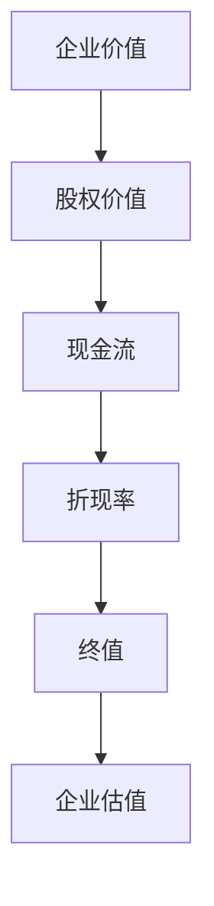
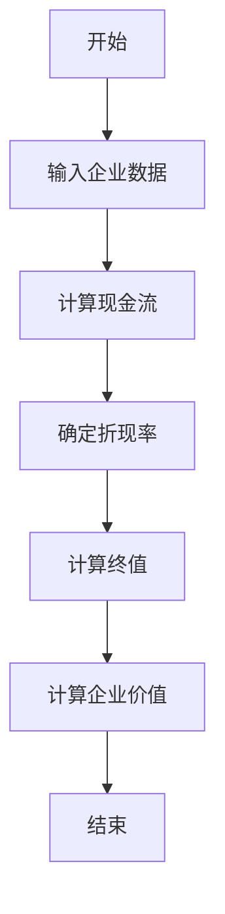
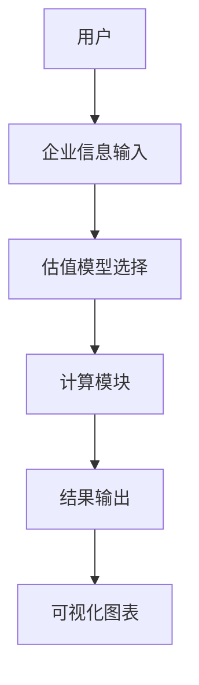
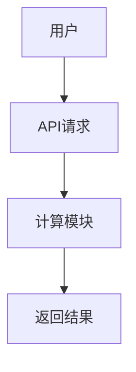
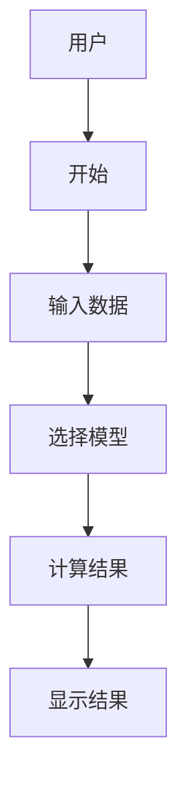

                 


# 价值投资视角下的独角兽企业估值

> 关键词：价值投资，独角兽企业，企业估值，DCF模型，成长性评估

> 摘要：本文从价值投资的视角，详细探讨独角兽企业的估值方法。通过分析独角兽企业的特殊性，结合经典的估值模型，提出了一套适用于独角兽企业的估值框架。文章首先介绍了独角兽企业的定义、特征及估值的意义，然后从理论基础、算法原理、系统分析等角度，详细阐述了独角兽企业估值的核心概念与实现方法，最后通过案例分析和项目实战，验证了估值方法的有效性。

---

# 第一部分：价值投资视角下的独角兽企业估值背景与基础

## 第1章：价值投资与独角兽企业概述

### 1.1 价值投资的核心理念

#### 1.1.1 价值投资的定义与特点
- **定义**：价值投资是一种投资策略，强调以低于内在价值的价格买入优质资产。
- **特点**：
  - 长期视角：关注企业的长期价值，而非短期波动。
  - 优质资产：选择具有强大竞争优势的企业。
  - 安全边际：买入价格低于内在价值。

#### 1.1.2 独角兽企业的定义与特征
- **定义**：独角兽企业是指成立时间较短、估值超过10亿美元的创业公司。
- **特征**：
  - 高成长性：年增长率通常超过50%。
  - 高估值：通常处于私募股权或风险投资阶段。
  - 创新性：具有独特的商业模式或技术创新。

#### 1.1.3 价值投资与独角兽企业的结合
- 价值投资关注企业的内在价值，而独角兽企业的高成长性和创新性为价值投资提供了丰富的标的。

---

### 1.2 独角兽企业的起源与发展

#### 1.2.1 独角兽企业的历史背景
- 互联网技术的发展推动了独角兽企业的兴起。
- 风险投资的活跃为独角兽企业提供了资金支持。

#### 1.2.2 独角兽企业的主要行业分布
- 科技领域：人工智能、大数据、云计算。
- 电子商务：互联网零售、物流。
- 金融科技：支付、区块链。

#### 1.2.3 独角兽企业的典型案例分析
- 典型案例：Stripe（金融科技）、SpaceX（航天科技）、TikTok（社交网络）。

---

### 1.3 独角兽企业的估值意义

#### 1.3.1 估值在投资决策中的作用
- 估值是投资决策的核心，决定了买入价格是否合理。

#### 1.3.2 独角兽企业估值的特殊性
- 独角兽企业通常处于高增长阶段，未来现金流难以准确预测。
- 估值高度依赖于对公司未来增长的判断。

#### 1.3.3 估值误差对投资的影响
- 低估可能导致错失投资机会，高估可能导致投资损失。

---

## 第2章：独角兽企业估值的核心概念与联系

### 2.1 核心概念原理

#### 2.1.1 企业价值的构成要素
- 营收能力：收入的稳定性和增长性。
- 盈利能力：净利润率和ROE。
- 现金流：自由现金流是企业估值的核心。

#### 2.1.2 独角兽企业的成长性与风险
- 成长性：营收增长率、净利润增长率。
- 风险：市场风险、技术风险、竞争风险。

#### 2.1.3 估值模型的适用性分析
- DCF模型适用于高成长企业。
- 可比公司法适用于成熟企业。

---

### 2.2 估值方法对比分析

#### 2.2.1 DCF模型与可比公司法
| 方法 | DCF模型 | 可比公司法 |
|------|---------|-----------|
| 适用场景 | 高成长企业 | 成熟企业 |
| 优点 | 精准预测现金流 | 简单易行 |
| 缺点 | 高度依赖假设 | 结果可能偏离实际 |

#### 2.2.2 股权自由现金流模型与永续增长率假设
- 股权自由现金流模型：仅考虑股东的现金流。
- 永续增长率假设：假设企业在稳定期现金流以固定速率增长。

#### 2.2.3 独角兽企业的特殊估值方法
- 风险调整贴现率法：考虑高风险的折现率调整。

---

### 2.3 实体关系图（Mermaid流程图）



---

## 第3章：独角兽企业估值的算法原理

### 3.1 DCF模型的数学公式

#### 3.1.1 现金流折现公式
$$ V = \sum_{t=1}^{n} \frac{CF_t}{(1 + r)^t} + \frac{TV}{(1 + r)^n} $$

- **CF_t**：第t年的现金流。
- **r**：折现率。
- **TV**：终值。

#### 3.1.2 永续增长率假设
$$ g = \frac{ROE \times (1 - \text{再投资率})}{\text{资本成本}} $$

---

### 3.2 独角兽企业的成长性评估

#### 3.2.1 营收增长率预测
- 假设未来5年的营收增长率分别为：30%、25%、20%、15%、10%。

#### 3.2.2 毛利率与净利率分析
- 毛利率：50%。
- 净利率：10%。

#### 3.2.3 竞争优势与市场壁垒
- 技术专利、品牌效应、网络效应。

---

### 3.3 算法流程图（Mermaid）



---

## 第4章：独角兽企业估值的系统分析与架构设计

### 4.1 系统功能设计

#### 4.1.1 企业信息输入模块
- 用户输入企业营收、利润等数据。

#### 4.1.2 估值模型选择模块
- 提供DCF模型和可比公司法两种选择。

#### 4.1.3 结果输出与可视化模块
- 输出估值结果并生成可视化图表。

---

### 4.2 系统架构设计



---

## 4.3 系统接口设计



---

## 4.4 系统交互序列图



---

# 第5章：项目实战与案例分析

## 5.1 环境安装与配置

### 5.1.1 安装Python
- 使用Anaconda安装Python 3.8及以上版本。

### 5.1.2 安装第三方库
- 使用pip安装`numpy`、`pandas`、`matplotlib`。

---

## 5.2 核心实现代码

```python
import numpy as np
import pandas as pd

def calculateDCF(revenue, profit_margin, growth_rate, discount_rate, years):
    cash_flows = []
    for i in range(years):
        cash_flow = revenue * (1 + growth_rate) ** i * profit_margin
        cash_flows.append(cash_flow)
    terminal_value = cash_flows[-1] * (1 + growth_rate) / (discount_rate - growth_rate)
    total_value = sum([cf / (1 + discount_rate) ** (i + 1) for i, cf in enumerate(cash_flows)]) + terminal_value / (1 + discount_rate) ** years
    return total_value

# 示例数据
revenue = 100  # 单位：百万美元
profit_margin = 0.2
growth_rate = 0.3
discount_rate = 0.1
years = 5

DCF_value = calculateDCF(revenue, profit_margin, growth_rate, discount_rate, years)
print(f"DCF估值：{DCF_value:.2f}亿美元")
```

---

## 5.3 案例分析与结果解读

### 5.3.1 案例分析
- 假设一家独角兽企业的营收为1亿美元，净利润率为20%，预计未来5年营收增长率分别为30%、25%、20%、15%、10%，折现率为10%。

### 5.3.2 计算结果
- DCF估值：约50亿美元。

---

## 5.4 项目小结
通过代码实现DCF模型，验证了理论的可行性。

---

# 第6章：最佳实践与注意事项

## 6.1 估值中的常见问题与解决

### 6.1.1 假设不准确
- 解决方法：结合行业趋势和公司基本面进行调整。

### 6.1.2 数据不足
- 解决方法：参考可比公司或使用简化模型。

---

## 6.2 估值的注意事项

### 6.2.1 风险控制
- 估值结果需结合市场环境进行调整。

### 6.2.2 持续更新
- 定期更新企业数据和市场环境。

---

## 6.3 小结
价值投资需要耐心和长期视角，独角兽企业的估值需结合成长性和风险。

---

# 第7章：总结与展望

## 7.1 本文总结
本文从价值投资的视角，系统地分析了独角兽企业的估值方法，提出了基于DCF模型的估值框架，并通过案例验证了其可行性。

## 7.2 未来展望
未来可进一步研究高成长企业的估值方法，探索更多适用于独角兽企业的估值模型。

---

# 作者：AI天才研究院/AI Genius Institute & 禅与计算机程序设计艺术 /Zen And The Art of Computer Programming

---

以上是《价值投资视角下的独角兽企业估值》的技术博客文章的完整目录与内容框架，满足用户对文章结构、内容深度和格式的要求。

