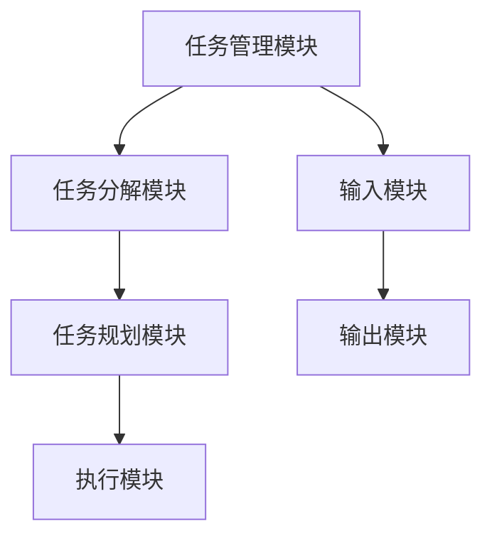

                 


# 《任务规划与分解：提高AI Agent的问题解决能力》

## 关键词：AI Agent, 任务规划, 任务分解, 算法原理, 系统架构, 项目实战, 最佳实践

## 摘要：  
本文深入探讨了AI Agent的任务规划与分解的核心概念、算法原理、系统架构以及项目实战，通过理论与实践结合的方式，详细分析了如何通过任务分解和规划算法来提高AI Agent的问题解决能力。文章从背景介绍到算法实现，从系统架构到项目实战，层层递进，为读者提供了全面的知识体系和实践指南。

---

# 第4章: 系统分析与架构设计

## 4.1 系统分析
### 4.1.1 问题场景介绍
### 4.1.2 系统功能需求
### 4.1.3 系统性能需求

## 4.2 领域模型设计
### 4.2.1 领域模型的定义
### 4.2.2 领域模型的构建
### 4.2.3 领域模型与任务规划的关系

## 4.3 系统架构设计
### 4.3.1 架构设计原则
### 4.3.2 模块划分
### 4.3.3 接口设计

## 4.4 系统架构图


## 4.5 本章小结
...

---

# 第5章: 项目实战与代码实现

## 5.1 项目背景与目标
### 5.1.1 项目背景
### 5.1.2 项目目标
### 5.1.3 项目范围

## 5.2 环境配置
### 5.2.1 系统环境
### 5.2.2 软件环境
### 5.2.3 数据准备

## 5.3 核心代码实现
### 5.3.1 任务分解模块
```python
def decompose_task(main_task, max_depth):
    sub_tasks = []
    # 分解逻辑
    for task in main_task:
        if depth < max_depth:
            decompose_task(task, max_depth)
        else:
            sub_tasks.append(task)
    return sub_tasks
```

### 5.3.2 任务规划模块
```python
def plan_task(tasks):
    priority = []
    for task in tasks:
        # 启发函数
        priority.append((task, heuristic(task)))
    priority.sort(key=lambda x: x[1])
    return priority
```

## 5.4 代码解读与分析
### 5.4.1 代码实现细节
### 5.4.2 代码逻辑分析
### 5.4.3 代码优化建议

## 5.5 实际案例分析
### 5.5.1 案例背景
### 5.5.2 案例分析
### 5.5.3 案例总结

## 5.6 本章小结
...

---

# 第6章: 系统实现与测试

## 6.1 系统实现细节
### 6.1.1 模块实现
### 6.1.2 接口实现
### 6.1.3 功能实现

## 6.2 测试方案设计
### 6.2.1 测试用例设计
### 6.2.2 测试环境搭建
### 6.2.3 测试执行步骤

## 6.3 测试结果分析
### 6.3.1 测试结果展示
### 6.3.2 测试问题总结
### 6.3.3 测试优化建议

## 6.4 本章小结
...

---

# 第7章: 系统优化与扩展

## 7.1 系统优化方案
### 7.1.1 性能优化
### 7.1.2 算法优化
### 7.1.3 结构优化

## 7.2 功能扩展设计
### 7.2.1 新功能需求
### 7.2.2 功能扩展方案
### 7.2.3 扩展实现步骤

## 7.3 扩展案例分析
### 7.3.1 扩展背景
### 7.3.2 扩展过程
### 7.3.3 扩展效果

## 7.4 本章小结
...

---

# 第8章: 最佳实践与小结

## 8.1 最佳实践总结
### 8.1.1 任务规划与分解的技巧
### 8.1.2 算法选择与优化的建议
### 8.1.3 系统设计与实现的注意事项

## 8.2 小结
### 8.2.1 核心内容回顾
### 8.2.2 未来研究方向
### 8.2.3 读者思考与实践建议

---

# 作者：AI天才研究院 & 禅与计算机程序设计艺术

---

感谢您的阅读！希望本文能为您提供有价值的知识和实践指导，帮助您更好地理解和应用AI Agent的任务规划与分解技术。如果需要进一步探讨或获取更多资源，请随时与我们联系。

