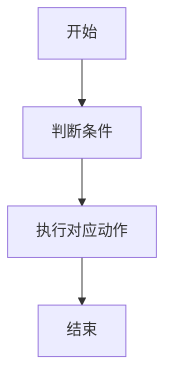
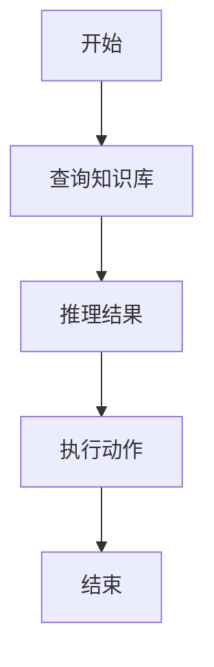
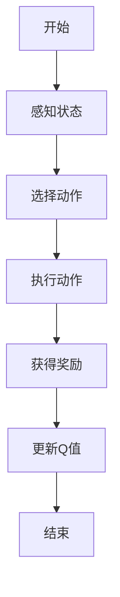
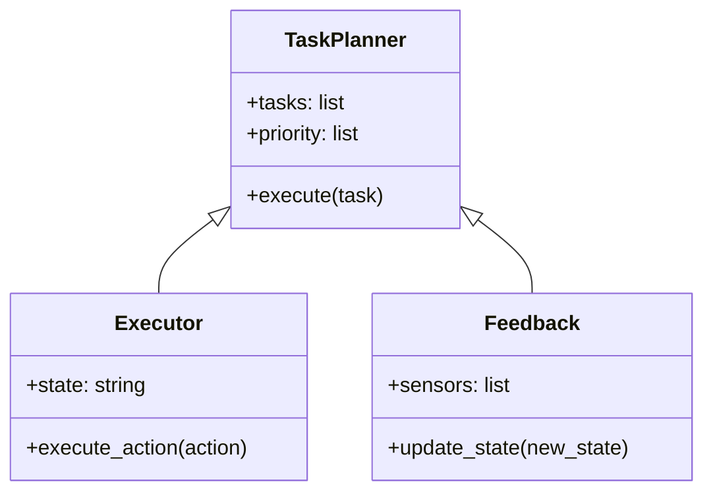

                 


# 任务规划与执行：AI Agent的行动决策机制

> 关键词：任务规划，AI Agent，行动决策，决策机制，算法原理，数学模型

> 摘要：本文深入探讨AI Agent的任务规划与执行机制，分析其核心概念、算法原理、数学模型，并结合实际案例进行系统设计与实现，最后总结最佳实践。

---

## 第一部分：任务规划与执行的背景与核心概念

### 第1章：任务规划与执行概述

#### 1.1 任务规划的基本概念
- **1.1.1 任务规划的定义与核心要素**
  - 任务规划是将目标分解为可执行步骤的过程，涉及目标分解、优先级排序和资源分配。
  - 核心要素包括任务目标、分解方式、优先级、执行顺序和约束条件。

- **1.1.2 任务规划的分类与应用场景**
  - 分为静态任务规划和动态任务规划，分别适用于确定性和不确定性环境。
  - 应用场景包括机器人导航、自动驾驶、智能助手和工业自动化。

- **1.1.3 任务规划的边界与外延**
  - 明确任务的范围和约束，避免超出目标范围。
  - 外延包括任务执行中的反馈机制和外部环境的动态变化。

#### 1.2 AI Agent的基本概念与特点
- **1.2.1 AI Agent的定义与分类**
  - AI Agent是能够感知环境并采取行动以实现目标的智能体。
  - 分为简单反射型、基于模型推理型和目标驱动型。

- **1.2.2 AI Agent的核心属性与特征**
  - 感知能力、决策能力、学习能力和执行能力。
  - 能够处理不确定性、动态变化和复杂任务。

- **1.2.3 AI Agent与传统任务规划的区别**
  - AI Agent具备自主学习和适应能力，任务规划更具动态性和智能性。

#### 1.3 任务规划与执行的核心问题
- **1.3.1 任务分解与组合问题**
  - 如何将复杂任务分解为子任务，并有效组合以实现目标。
  - 例如，将“整理房间”分解为“清理书桌”和“收拾床铺”。

- **1.3.2 任务优先级排序问题**
  - 确定任务的执行顺序，考虑时间、资源和重要性。
  - 例如，在紧急任务和重要任务之间优先处理紧急任务。

- **1.3.3 任务执行中的不确定性处理**
  - 应对环境变化和意外情况，调整执行计划。
  - 例如，在路径规划中绕开突然出现的障碍物。

#### 1.4 任务规划与执行的边界与外延
- **1.4.1 任务规划的边界条件**
  - 明确任务的起始点和终点，避免超出范围。
  - 例如，在特定区域内完成任务，不超出区域边界。

- **1.4.2 任务执行中的约束条件**
  - 包括资源限制、时间限制和环境限制。
  - 例如，在有限时间内完成任务，或在特定环境下操作。

- **1.4.3 任务规划与执行的外部依赖**
  - 依赖感知系统、外部数据库和通信模块。
  - 例如，依赖GPS进行路径规划，依赖传感器进行环境感知。

---

## 第二部分：任务规划与执行的核心概念与联系

### 第2章：任务分解与优先级排序

#### 2.1 任务分解的基本原理
- **2.1.1 任务分解的层次结构**
  - 采用树状结构，将复杂任务分解为子任务，逐步细化。
  - 例如，将“完成项目报告”分解为“收集数据”、“撰写大纲”和“撰写内容”。

- **2.1.2 任务分解的算法原理**
  - 使用分治法，将任务分解为子任务，并递归处理。
  - 示例代码：
    ```python
    def decompose_task(main_task):
        sub_tasks = split_into_subtasks(main_task)
        for task in sub_tasks:
            decompose_task(task)
    ```

- **2.1.3 任务分解的数学模型**
  - 表示为树状结构，使用层次分解模型。
  - $$ main\_task \rightarrow [sub\_task_1, sub\_task_2, \ldots] $$

#### 2.2 任务优先级排序的原理
- **2.2.1 优先级排序的指标体系**
  - 考虑任务的重要性和紧急性，使用加权评分法。
  - 例如，紧急任务优先级高于非紧急任务。

- **2.2.2 优先级排序的算法选择**
  - 使用贪心算法，根据权重计算优先级。
  - 示例代码：
    ```python
    tasks = [{'name': 'Task1', 'weight': 0.8}, {'name': 'Task2', 'weight': 0.5}]
    tasks.sort(key=lambda x: -x['weight'])
    ```

- **2.2.3 优先级排序的数学模型**
  - 使用加权和模型：
    $$ priority = \sum (weight_i \times score_i) $$

#### 2.3 任务分解与优先级排序的联系
- **2.3.1 任务分解对优先级排序的影响**
  - 分解后的子任务可能具有不同的优先级。
  - 例如，子任务A比子任务B更重要，因此优先执行A。

- **2.3.2 优先级排序对任务分解的反馈**
  - 根据优先级调整分解策略，优化任务结构。
  - 例如，优先处理高优先级子任务，延迟低优先级子任务。

- **2.3.3 任务分解与优先级排序的协同优化**
  - 综合考虑任务分解和优先级，实现全局优化。
  - 示例：
    - 分解任务为A、B、C，优先级排序为A > B > C，执行顺序为A → B → C。

#### 2.4 本章小结
- 任务分解和优先级排序是任务规划的基础，需要协同优化以实现高效执行。

---

## 第三部分：任务规划与执行的算法原理

### 第3章：基于规则的决策机制

#### 3.1 算法原理
- 基于预定义规则进行决策，适用于简单任务。
- 使用if-else结构判断条件，执行相应动作。

#### 3.2 实现代码
```python
def rule_based_decision(condition):
    if condition == 'high_priority':
        return 'execute_high_task'
    elif condition == 'low_priority':
        return 'execute_low_task'
    else:
        return 'do_nothing'
```

#### 3.3 算法流程图


---

### 第4章：基于模型的推理机制

#### 4.1 算法原理
- 使用知识表示和推理引擎，根据知识库进行推理。
- 适用于复杂任务，如医疗诊断和法律咨询。

#### 4.2 实现代码
```python
def model_based_reasoning(knowledge_base):
    for rule in knowledge_base:
        if rule.matches(current_state):
            return rule.apply(current_state)
    return default_action
```

#### 4.3 算法流程图


---

### 第5章：基于学习的强化学习机制

#### 5.1 算法原理
- 使用强化学习，通过试错学习最优策略。
- 状态、动作和奖励驱动，更新Q值。
- 示例：机器人路径规划，使用Q-learning算法。

#### 5.2 实现代码
```python
def q_learning(state, action, reward, next_state):
    learning_rate = 0.1
    gamma = 0.9
    current_q = q_table[state][action]
    next_max_q = max(q_table[next_state].values())
    target = reward + gamma * next_max_q
    new_q = current_q + learning_rate * (target - current_q)
    q_table[state][action] = new_q
```

#### 5.3 算法流程图


---

## 第四部分：任务规划与执行的数学模型

### 第4章：状态空间与动作空间

#### 4.1 状态空间
- 定义所有可能的状态，形成状态空间。
- 示例：二维空间中，状态由(x, y)坐标表示。

#### 4.2 动作空间
- 可能的动作集合，如移动方向。
- 示例：动作包括左、右、上、下、不动。

#### 4.3 数学模型
- 状态空间：S = {s1, s2, ..., sn}
- 动作空间：A = {a1, a2, ..., am}

---

### 第5章：奖励函数与损失函数

#### 5.1 奖励函数
- 定义完成任务的奖励，鼓励AI Agent采取正确动作。
- 示例：在路径规划中，到达目标点获得奖励1，碰撞障碍物获得奖励-1。

#### 5.2 损失函数
- 用于评估预测与真实值的差异，优化模型。
- 示例：均方误差损失函数：
  $$ L = \frac{1}{n}\sum_{i=1}^{n}(y_i - \hat{y}_i)^2 $$

---

## 第五部分：系统分析与架构设计

### 第6章：系统功能设计

#### 6.1 领域模型
- 使用Mermaid类图展示系统模块。
- 示例：


---

## 第六部分：项目实战

### 第7章：智能助手任务管理系统开发

#### 7.1 环境安装
- 安装Python和相关库，如numpy、pandas、scikit-learn。

#### 7.2 核心代码实现
- 任务分解模块：
  ```python
  def decompose_task(main_task):
      sub_tasks = main_task.split()
      return sub_tasks
  ```

- 优先级排序模块：
  ```python
  def sort_priority(tasks):
      return sorted(tasks, key=lambda x: (-x['priority'], x['time']))
  ```

#### 7.3 代码解读
- 解释每个模块的功能和实现细节。

#### 7.4 案例分析
- 实际案例分析，展示系统在具体场景中的应用。

#### 7.5 项目总结
- 总结开发经验，指出改进方向。

---

## 第七部分：最佳实践与注意事项

### 第8章：最佳实践

#### 8.1 核心要素
- 明确任务目标和约束条件，确保分解合理。

#### 8.2 可扩展性
- 设计模块化架构，便于后续扩展和维护。

#### 8.3 测试与验证
- 使用测试用例验证系统功能，确保正确性。

### 第9章：小结与展望

- 总结任务规划与执行的核心内容，展望未来的发展方向。

---

## 作者

作者：AI天才研究院/AI Genius Institute & 禅与计算机程序设计艺术/Zen And The Art of Computer Programming

