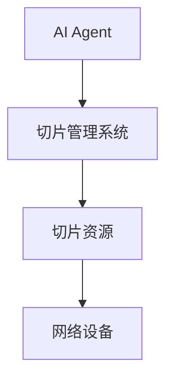

                 


# 企业AI Agent的5G网络智能切片技术

> 关键词：AI Agent, 5G网络切片, 智能切片, 网络资源分配, 强化学习

> 摘要：本文探讨了AI Agent在5G网络智能切片技术中的应用，分析了其核心概念、算法原理、系统架构，并通过实战案例展示了其在企业中的应用价值，最后提出了最佳实践和未来发展方向。

---

## 第1章 企业AI Agent与5G网络智能切片概述

### 1.1 企业AI Agent的定义与特点

#### 1.1.1 AI Agent的基本概念
AI Agent（智能代理）是能够感知环境、自主决策并执行任务的智能体。它具备以下特点：
- **自主性**：无需外部干预，自主决策。
- **反应性**：能实时感知环境变化并做出反应。
- **目标导向**：以实现特定目标为导向。
- **学习能力**：能通过经验改进性能。

#### 1.1.2 企业AI Agent的核心特点
在企业环境中，AI Agent通常用于优化资源分配、提升效率和降低成本。其核心特点包括：
- **智能化**：利用AI技术进行复杂决策。
- **实时性**：快速响应环境变化。
- **可扩展性**：能适应企业规模的扩展。

#### 1.1.3 企业AI Agent的应用场景
- **资源分配**：如云计算资源分配、网络资源调度。
- **自动化运维**：自动处理故障、优化系统性能。
- **智能客服**：通过AI Agent提供个性化服务。

### 1.2 5G网络智能切片技术

#### 1.2.1 5G网络切片的基本概念
5G网络切片是将物理网络分割为多个虚拟网络，每个切片独立运行，适用于不同场景。其特点包括：
- **隔离性**：各切片间互不影响。
- **定制化**：可根据需求调整资源分配。
- **动态性**：支持实时调整网络参数。

#### 1.2.2 智能切片的核心技术
智能切片技术通过AI算法优化切片分配，提升网络性能。核心技术包括：
- **动态资源分配**：根据实时需求调整资源。
- **智能调度算法**：利用AI算法优化网络性能。
- **自适应优化**：自动调整切片参数以适应变化。

#### 1.2.3 5G网络切片的应用前景
5G切片技术广泛应用于工业互联网、智慧城市、远程医疗等领域，为企业提供了灵活、高效的网络解决方案。

### 1.3 企业AI Agent与5G网络切片的结合

#### 1.3.1 问题背景与需求分析
企业网络中存在资源分配不均、延迟高等问题，亟需智能化解决方案。

#### 1.3.2 技术结合的必要性
通过AI Agent优化5G切片分配，提升网络性能和资源利用率。

#### 1.3.3 应用场景与优势
- **应用场景**：如工业自动化、智能交通管理。
- **优势**：提升网络效率、降低运营成本、增强用户体验。

---

## 第2章 企业AI Agent的智能切片技术原理

### 2.1 AI Agent在5G切片中的角色

#### 2.1.1 AI Agent在切片管理中的作用
AI Agent负责监控网络状态、优化切片分配和故障处理。

#### 2.1.2 AI Agent的决策机制
基于实时数据和预训练模型，AI Agent做出最优决策。

#### 2.1.3 AI Agent与网络切片的协同工作
通过接口交互，AI Agent与切片管理系统协同完成资源分配。

### 2.2 智能切片的实现原理

#### 2.2.1 切片资源分配算法
采用基于强化学习的动态分配算法，实时调整资源分配策略。

#### 2.2.2 切片性能优化策略
通过AI算法优化切片性能，如降低延迟、提高带宽利用率。

#### 2.2.3 切片动态调整机制
根据实时网络状态，动态调整切片参数，确保最佳性能。

### 2.3 AI Agent的算法与模型

#### 2.3.1 基于强化学习的切片优化
利用Q-learning算法优化切片资源分配，通过状态和动作的不断试错提升性能。

#### 2.3.2 基于监督学习的切片分配
采用回归模型预测网络需求，优化切片分配策略。

#### 2.3.3 混合学习模型的应用
结合强化学习和监督学习，提升切片分配的准确性和实时性。

### 2.4 本章小结

---

## 第3章 5G网络切片的智能管理架构

### 3.1 智能切片管理系统的架构设计

#### 3.1.1 系统功能模块划分
系统主要模块包括：数据采集模块、AI决策模块、切片管理模块。

#### 3.1.2 系统组件之间的关系
各模块协同工作，确保切片分配的高效性和准确性。

#### 3.1.3 系统的可扩展性设计
采用模块化设计，便于功能扩展和升级。

### 3.2 AI Agent与网络切片管理的接口设计

#### 3.2.1 Agent与切片管理系统的接口定义
定义标准接口，确保各模块的协同工作。

#### 3.2.2 接口交互流程
详细描述接口调用流程，确保系统运行的稳定性。

#### 3.2.3 接口协议的选择
选择适合的通信协议，如RESTful API，确保高效通信。

### 3.3 网络切片管理的实体关系图

#### 3.3.1 实体关系图的Mermaid表示


---

## 第4章 基于AI Agent的切片分配算法

### 4.1 切片分配算法的设计目标

#### 4.1.1 实现目标
优化网络性能，降低延迟，提高带宽利用率。

#### 4.1.2 算法特点
基于强化学习，动态调整资源分配策略。

#### 4.1.3 设计思路
通过状态观测、动作选择和奖励机制优化算法性能。

---

## 第5章 项目实战：基于AI Agent的5G切片管理系统实现

### 5.1 环境安装

#### 5.1.1 安装Python环境
安装Python 3.8及以上版本，安装必要的库如TensorFlow、Keras。

#### 5.1.2 安装5G切片管理模拟环境
使用Mininet或其他网络模拟工具搭建测试环境。

### 5.2 核心代码实现

#### 5.2.1 AI Agent代码实现
```python
import numpy as np
from keras.models import Sequential
from keras.layers import Dense

# 定义AI Agent模型
model = Sequential()
model.add(Dense(64, activation='relu', input_dim=64))
model.add(Dense(32, activation='relu'))
model.add(Dense(1, activation='sigmoid'))
model.compile(optimizer='adam', loss='binary_crossentropy', metrics=['accuracy'])

# 训练模型
model.fit(X_train, y_train, epochs=100, batch_size=32)
```

#### 5.2.2 切片管理代码实现
```python
def allocate_slice(resources, demands):
    # 使用强化学习算法分配切片资源
    state = resources + demands
    action = model.predict(state)
    return action
```

### 5.3 代码应用解读与分析

#### 5.3.1 AI Agent模型解读
模型通过多层神经网络处理输入数据，输出决策结果。

#### 5.3.2 切片分配算法分析
算法根据实时资源和需求，动态调整切片分配策略。

### 5.4 实际案例分析

#### 5.4.1 案例背景
某企业需要在5G网络中实现多个切片的动态分配。

#### 5.4.2 案例分析
通过AI Agent优化切片分配，降低延迟，提高网络性能。

#### 5.4.3 结果解读
分析优化前后的网络性能指标，验证算法的有效性。

### 5.5 项目小结

---

## 第6章 总结与展望

### 6.1 最佳实践 tips
- 定期更新AI模型，适应网络变化。
- 优化接口设计，确保系统高效运行。
- 监控网络状态，及时调整切片参数。

### 6.2 小结
本文详细探讨了AI Agent在5G切片管理中的应用，展示了其在企业中的巨大潜力。

### 6.3 注意事项
- 确保数据安全，防止信息泄露。
- 优化算法性能，降低计算开销。
- 提高系统容错能力，确保稳定性。

### 6.4 拓展阅读
推荐相关书籍和论文，供读者深入学习。

---

## 作者：AI天才研究院 & 禅与计算机程序设计艺术

---

**总结**：本文系统地介绍了企业AI Agent在5G网络智能切片技术中的应用，通过理论分析和实战案例，展示了其在企业中的巨大价值。未来，随着AI技术的进步，AI Agent将在5G切片管理中发挥更大的作用，为企业创造更多价值。

