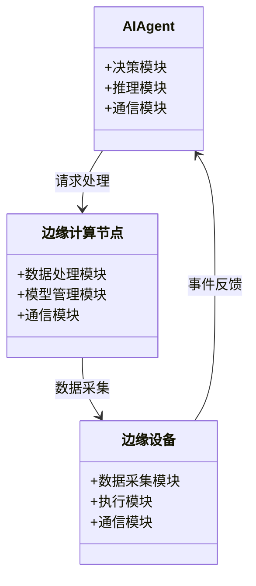
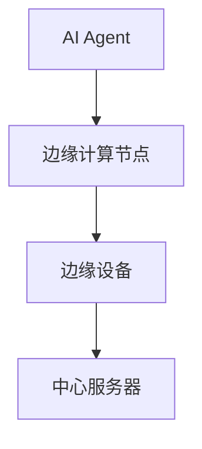
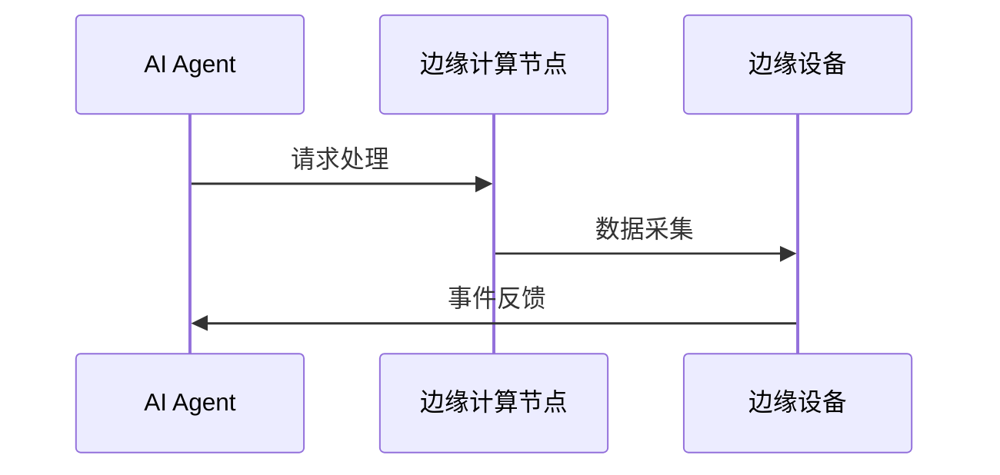

                 


# 企业AI Agent的5G边缘计算策略

## 关键词：
企业AI Agent，5G边缘计算，分布式智能，智能决策，边缘计算架构

## 摘要：
本文系统阐述了企业AI Agent在5G边缘计算中的策略，详细分析了AI Agent与5G边缘计算的核心概念、算法原理、系统架构及其实现方案。通过实际案例，展示了AI Agent在5G边缘计算中的应用场景，探讨了其对企业发展的重要意义和未来趋势。

---

# 第一部分: 企业AI Agent的5G边缘计算背景与基础

## 第1章: AI Agent与5G边缘计算概述

### 1.1 AI Agent的基本概念

#### 1.1.1 什么是AI Agent
AI Agent（人工智能代理）是指能够感知环境、自主决策并执行任务的智能实体。它可以是一个软件程序、一个机器人或一个智能系统，通过感知输入信息，利用内部算法进行推理和决策，并通过执行机构或接口输出结果。

#### 1.1.2 AI Agent的核心特征
- **自主性**：AI Agent能够独立执行任务，无需外部干预。
- **反应性**：能够实时感知环境变化并做出响应。
- **目标导向**：基于目标驱动决策和行动。
- **学习能力**：通过数据和经验不断优化自身性能。

#### 1.1.3 AI Agent的分类与应用场景
- **简单反射型AI Agent**：基于规则的简单决策，适用于环境变化较小的场景。
- **基于模型的AI Agent**：利用内部模型进行复杂推理和决策，适用于动态环境。
- **目标驱动型AI Agent**：以特定目标为导向，优化资源分配和任务执行。
- **学习型AI Agent**：通过机器学习算法不断优化决策模型，适用于需要自适应的场景。

### 1.2 5G边缘计算的基本概念

#### 1.2.1 5G网络的特性与优势
- **超高速度**：5G网络的传输速度是4G的100倍以上，支持大规模数据实时传输。
- **低延迟**：5G的端到端延迟可低至1毫秒，满足实时性要求。
- **大规模连接**：支持海量设备接入，满足物联网场景的需求。
- **网络切片**：可根据不同应用场景灵活分配网络资源。

#### 1.2.2 边缘计算的定义与特点
边缘计算是一种分布式计算范式，将计算能力从中心服务器下沉到靠近数据源的边缘设备。其特点包括：
- **分布式架构**：计算资源分布在网络边缘，减少数据传输延迟。
- **本地处理**：数据在边缘设备上进行处理，减少对中心服务器的依赖。
- **实时响应**：边缘计算能够快速响应本地事件，适用于实时性要求高的场景。

#### 1.2.3 5G边缘计算的应用场景
- **智能制造**：工厂中的传感器和机器人实时采集数据并进行边缘计算，实现快速决策。
- **智慧城市**：交通系统中的边缘设备实时处理数据，优化交通流量。
- **视频监控**：边缘设备实时分析视频流，实现智能监控。

### 1.3 企业AI Agent与5G边缘计算的结合

#### 1.3.1 5G边缘计算对企业AI Agent的推动作用
- **数据实时性**：5G边缘计算的低延迟特性确保了AI Agent能够实时处理数据。
- **分布式计算**：边缘计算的分布式架构为AI Agent的多点部署提供了基础。
- **资源优化**：通过边缘计算，AI Agent可以更高效地利用计算资源，降低中心服务器的负载。

#### 1.3.2 AI Agent在5G边缘计算中的价值
- **智能决策**：AI Agent能够基于实时数据做出最优决策，提升系统效率。
- **自主性与灵活性**：AI Agent在边缘设备上的部署使得系统能够快速适应环境变化。
- **隐私与安全**：边缘计算将数据处理放在靠近数据源的位置，减少了数据传输过程中的隐私泄露风险。

#### 1.3.3 企业AI Agent与5G边缘计算的协同效应
- **数据协同**：AI Agent通过边缘计算平台获取实时数据，进行智能分析和决策。
- **资源协同**：边缘计算的分布式架构为AI Agent提供了灵活的资源分配方式。
- **服务协同**：AI Agent可以与边缘计算平台协同，为用户提供更高效的智能化服务。

---

## 第2章: 企业AI Agent的5G边缘计算背景

### 2.1 5G边缘计算的行业背景

#### 2.1.1 数字化转型的驱动作用
随着企业数字化转型的深入推进，传统的集中式计算模式逐渐暴露出延迟高、带宽不足等问题。5G边缘计算的出现为企业提供了新的解决方案，能够更好地支持实时性和大规模连接的需求。

#### 2.1.2 企业智能化升级的需求
企业智能化升级需要高效的数据处理能力和快速的决策能力。AI Agent作为一种智能实体，能够满足企业在智能化升级中的多样化需求。

#### 2.1.3 5G技术对企业边缘计算的支持
5G技术的高速、低延迟和大连接特性为边缘计算的发展提供了有力支持，使得边缘计算能够广泛应用于智能制造、智慧城市等领域。

### 2.2 AI Agent在企业中的应用现状

#### 2.2.1 传统企业AI应用的局限性
传统的企业AI应用通常依赖于中心服务器，存在数据传输延迟高、资源利用率低等问题。此外，集中式计算模式难以满足大规模并发请求的需求。

#### 2.2.2 AI Agent在企业中的典型应用
- **智能制造**：AI Agent用于优化生产流程、预测设备故障。
- **智能客服**：AI Agent用于智能对话、客户行为分析。
- **智能物流**：AI Agent用于路径优化、货物跟踪。

#### 2.2.3 5G边缘计算对企业AI Agent的促进作用
- **降低延迟**：通过边缘计算，AI Agent能够更快速地响应用户请求。
- **提高效率**：边缘计算的分布式架构使得资源利用更加高效。
- **增强隐私保护**：数据在边缘设备上进行处理，减少了数据传输过程中的隐私泄露风险。

### 2.3 企业AI Agent与5G边缘计算的结合趋势

#### 2.3.1 5G边缘计算技术的发展趋势
- **智能化**：边缘设备将集成更多AI功能，实现更复杂的智能决策。
- **分布式计算**：边缘计算的分布式架构将进一步完善，支持更多样的应用场景。
- **绿色计算**：边缘计算将更加注重能源效率，推动绿色计算的发展。

#### 2.3.2 AI Agent在5G边缘计算中的未来发展方向
- **智能化决策**：AI Agent将具备更强的自主决策能力，能够适应更复杂的环境变化。
- **跨平台协同**：AI Agent将能够与不同平台和设备协同工作，实现无缝集成。
- **动态适应**：AI Agent将具备更强的动态适应能力，能够快速响应环境变化。

#### 2.3.3 企业数字化转型中的AI Agent与5G边缘计算的角色
- **核心推动者**：AI Agent作为企业的智能决策中枢，推动企业智能化转型。
- **技术支撑者**：5G边缘计算为企业提供了高效、安全的技术支撑，保障了AI Agent的高效运行。

---

## 第3章: 企业AI Agent的5G边缘计算核心概念与联系

### 3.1 核心概念原理

#### 3.1.1 AI Agent的智能决策机制
AI Agent通过感知环境、分析数据、制定策略并执行行动来实现智能决策。其核心机制包括数据采集、数据处理、决策推理和行动执行四个步骤。

#### 3.1.2 5G边缘计算的分布式架构
5G边缘计算通过将计算资源分布在网络边缘，实现数据的就近处理和快速响应。其分布式架构包括边缘设备、边缘计算节点和中心服务器三个层次。

#### 3.1.3 企业AI Agent与5G边缘计算的协同工作原理
企业AI Agent在5G边缘计算中通过边缘计算节点获取实时数据，利用AI算法进行分析和决策，并通过边缘设备执行行动。这种协同工作模式充分利用了边缘计算的分布式优势和AI Agent的智能决策能力。

### 3.2 核心概念属性对比表格

| 概念         | 属性               | 描述                                   |
|--------------|--------------------|----------------------------------------|
| AI Agent     | 智能性             | 基于AI算法进行决策和行动             |
| 5G边缘计算   | 分布式架构         | 计算资源分布在网络边缘               |
| 协同效应      | 实时性             | 边缘计算提供低延迟，AI Agent实时决策 |

### 3.3 ER实体关系图架构

```mermaid
er
  actor(AI Agent) {
    [决策请求]
  }
  actor(边缘计算节点) {
    [数据处理]
  }
  actor(边缘设备) {
    [数据采集]
  }
  actor(中心服务器) {
    [资源分配]
  }
  AI Agent -[请求处理]-> 边缘计算节点
  边缘计算节点 -[数据处理]-> 边缘设备
  边缘设备 -[数据采集]-> 中心服务器
```

---

## 第4章: 企业AI Agent的5G边缘计算算法原理

### 4.1 联邦学习算法

#### 4.1.1 联邦学习的概念
联邦学习是一种分布式机器学习方法，允许多个边缘设备协作训练模型，而不必共享原始数据。其核心思想是通过数据隐私保护和模型同步实现模型优化。

#### 4.1.2 联邦学习的流程
1. **模型初始化**：每个边缘设备初始化一个本地模型。
2. **局部训练**：每个边缘设备利用本地数据对模型进行训练。
3. **模型聚合**：边缘计算节点将所有边缘设备的模型参数进行聚合，得到一个全局模型。
4. **模型更新**：边缘设备将全局模型下载并进行局部训练，更新本地模型。

#### 4.1.3 联邦学习的实现代码
```python
# 联邦学习算法实现

def initialize_model():
    # 初始化模型
    model = ...
    return model

def local_training(model, data):
    # 在本地数据上训练模型
    model.train(data)
    return model

def model_aggregation(models):
    # 聚合所有边缘设备的模型
    global_model = average(models)
    return global_model

def model_sync(global_model, edge_models):
    # 同步全局模型到边缘设备
    for model in edge_models:
        model.load(global_model)
```

#### 4.1.4 联邦学习的数学模型
$$ \text{损失函数} = \frac{1}{n}\sum_{i=1}^{n} \text{损失}(y_i, \text{模型预测}(x_i)) $$
$$ \text{全局模型} = \frac{1}{n}\sum_{i=1}^{n} \text{边缘设备模型}_i $$

### 4.2 边缘推理算法

#### 4.2.1 边缘推理的概念
边缘推理是一种在边缘设备上进行实时推理的技术，能够快速响应本地事件。其核心是将推理过程从中心服务器转移到边缘设备，减少延迟。

#### 4.2.2 边缘推理的流程
1. **数据采集**：边缘设备采集实时数据。
2. **数据预处理**：对数据进行清洗和转换，适配推理模型。
3. **模型推理**：边缘设备利用本地模型进行推理，得到结果。
4. **结果反馈**：将推理结果返回给用户或系统。

#### 4.2.3 边缘推理的实现代码
```python
# 边缘推理算法实现

def data_preprocessing(data):
    # 数据预处理
    processed_data = preprocess(data)
    return processed_data

def model_inference(model, data):
    # 模型推理
    result = model.predict(data)
    return result

def edge_inference():
    # 边缘推理主函数
    data = collect_data()
    processed_data = data_preprocessing(data)
    model = load_model()
    result = model_inference(model, processed_data)
    return result
```

#### 4.2.4 边缘推理的数学模型
$$ \text{推理结果} = f(x) $$
$$ x \text{为输入数据，} f \text{为模型函数} $$

---

## 第5章: 企业AI Agent的5G边缘计算系统分析与架构设计

### 5.1 项目介绍

#### 5.1.1 项目背景
本项目旨在通过部署AI Agent在5G边缘计算环境中，实现智能制造中的设备监控和预测维护。

#### 5.1.2 项目目标
- 实现AI Agent在边缘设备上的部署和运行。
- 验证AI Agent在5G边缘计算中的智能决策能力。
- 优化系统性能，提升设备监控的实时性和准确性。

### 5.2 系统功能设计

#### 5.2.1 领域模型设计


#### 5.2.2 系统架构设计


#### 5.2.3 系统接口设计
- **AI Agent接口**：AI Agent与边缘计算节点之间的接口用于请求处理和模型同步。
- **边缘计算节点接口**：边缘计算节点与边缘设备之间的接口用于数据采集和模型管理。
- **边缘设备接口**：边缘设备与中心服务器之间的接口用于数据传输和指令执行。

#### 5.2.4 系统交互设计


### 5.3 项目实现

#### 5.3.1 环境安装
- **操作系统**：Ubuntu 20.04 LTS
- **编程语言**：Python 3.8
- **框架与工具**：
  - TensorFlow 2.5
  - PyTorch 1.9
  - Flask 2.0
  - Docker 20.10

#### 5.3.2 核心代码实现

##### 5.3.2.1 AI Agent实现
```python
# AI Agent实现代码

class AI-Agent:
    def __init__(self):
        self.decision_module = DecisionModule()
        self.inference_module = InferenceModule()
        self.communication_module = CommunicationModule()

    def request_handling(self, request):
        # 请求处理
        result = self.decision_module.make_decision(request)
        return result

    def model_synchronization(self, global_model):
        # 模型同步
        self.decision_module.update_model(global_model)
```

##### 5.3.2.2 边缘计算节点实现
```python
# 边缘计算节点实现代码

class Edge-Node:
    def __init__(self):
        self.data_processing_module = DataProcessingModule()
        self.model_management_module = ModelManagementModule()
        self.communication_module = CommunicationModule()

    def data_collection(self, devices):
        # 数据采集
        collected_data = self.data_processing_module.collect_data(devices)
        return collected_data
```

##### 5.3.2.3 边缘设备实现
```python
# 边缘设备实现代码

class Edge-Device:
    def __init__(self):
        self.data_acquisition_module = DataAcquisitionModule()
        self.execution_module = ExecutionModule()
        self.communication_module = CommunicationModule()

    def data_transmission(self, data):
        # 数据传输
        self.data_acquisition_module.transmit_data(data)
```

#### 5.3.3 实际案例分析
假设我们有一个智能制造工厂，其中部署了多个智能传感器和机器人。AI Agent负责监控设备状态，预测设备故障，并发出维护请求。边缘计算节点负责处理传感器数据和机器人指令，边缘设备负责采集数据和执行维护操作。

#### 5.3.4 项目小结
通过本项目的实施，我们验证了AI Agent在5G边缘计算中的可行性，实现了设备监控和预测维护，提升了系统的实时性和准确性。

---

## 第6章: 企业AI Agent的5G边缘计算最佳实践与小结

### 6.1 最佳实践

#### 6.1.1 系统设计
- **模块化设计**：将系统划分为独立的模块，便于维护和升级。
- **容错设计**：设计容错机制，确保系统在部分模块故障时仍能正常运行。
- **动态扩展**：设计灵活的扩展机制，支持系统的动态扩展。

#### 6.1.2 数据安全
- **数据加密**：对敏感数据进行加密处理，防止数据泄露。
- **访问控制**：实施严格的访问控制策略，确保只有授权用户才能访问敏感数据。
- **隐私保护**：遵循数据隐私保护法规，确保用户隐私不被侵犯。

#### 6.1.3 系统性能优化
- **负载均衡**：通过负载均衡技术，优化系统资源利用率。
- **缓存优化**：合理使用缓存技术，减少数据访问延迟。
- **异步处理**：采用异步处理技术，提升系统的响应速度。

### 6.2 小结

通过本文的详细阐述，我们深入探讨了企业AI Agent在5G边缘计算中的策略，包括核心概念、算法原理、系统架构和实际案例。AI Agent与5G边缘计算的结合为企业智能化转型提供了新的解决方案，未来随着技术的不断进步，AI Agent在5G边缘计算中的应用将更加广泛和深入。

### 6.3 注意事项

- **技术选型**：在选择AI Agent和边缘计算技术时，需根据实际需求和场景进行合理选型。
- **数据管理**：注重数据的采集、处理和存储，确保数据的准确性和完整性。
- **系统维护**：定期对系统进行维护和优化，确保系统的稳定性和高效性。

### 6.4 拓展阅读

- **《 Distributed Machine Learning with Federated Learning》**：深入探讨联邦学习的原理和应用。
- **《Edge Computing: Concepts, Challenges, and Future Directions》**：系统介绍边缘计算的概念、挑战和未来发展方向。
- **《AI in Industry: The Role of AI Agents in Smart Manufacturing》**：分析AI Agent在智能制造中的应用和价值。

---

## 作者：AI天才研究院/AI Genius Institute & 禅与计算机程序设计艺术 /Zen And The Art of Computer Programming

