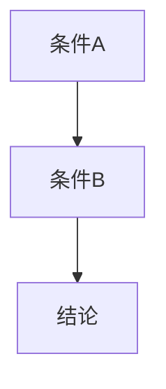
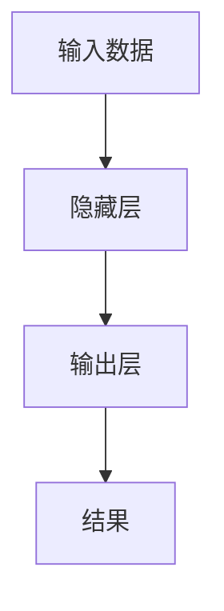
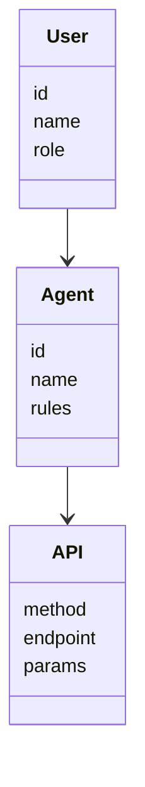
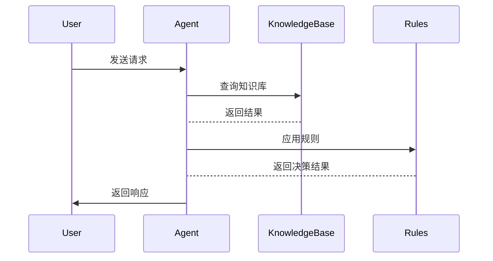

                 


# 《企业AI Agent的API设计与管理》

## 关键词：企业AI Agent、API设计、API管理、系统架构、人工智能代理

## 摘要：本文将深入探讨企业AI Agent的API设计与管理，从基本概念到实际应用，系统性地分析其设计原理、算法实现、系统架构及管理策略。文章将结合实际案例，详细讲解企业AI Agent的核心概念、API设计原则、系统实现方案及优化建议，帮助读者全面掌握企业AI Agent的API设计与管理方法。

---

# 第一部分：企业AI Agent概述

## 第1章：企业AI Agent的背景与概念

### 1.1 人工智能代理的基本概念

#### 1.1.1 人工智能代理的定义
人工智能代理（Artificial Intelligence Agent，简称AI Agent）是一种能够感知环境、自主决策并执行任务的智能实体。它通过接收输入信息、分析问题、制定解决方案并执行操作来实现目标。

#### 1.1.2 人工智能代理的核心特征
- **自主性**：能够在没有外部干预的情况下独立运行。
- **反应性**：能够实时感知环境变化并做出响应。
- **目标导向性**：所有行为都围绕特定目标展开。
- **学习能力**：通过数据和经验不断优化自身性能。

#### 1.1.3 人工智能代理与传统软件的区别
| 特性 | 传统软件 | AI Agent |
|------|----------|----------|
| 行为方式 | 预设规则执行 | 自主决策与学习 |
| 输入方式 | 固定输入 | 多模态感知（文本、图像、语音等） |
| 输出方式 | 单一输出 | 多维度交互（文本、动作、数据等） |
| 决策方式 | 程序预设 | 自主推理与优化 |

### 1.2 企业AI Agent的应用背景

#### 1.2.1 当前企业数字化转型的挑战
- 业务流程复杂化：企业面临多部门协作、多系统集成的挑战。
- 数据孤岛问题：各部门间数据难以共享，导致效率低下。
- 个性化需求增加：客户期望获得个性化的服务体验。

#### 1.2.2 AI Agent在企业中的潜在价值
- 提高效率：通过自动化处理业务流程，减少人工干预。
- 增强决策能力：利用大数据分析和机器学习提升决策准确性。
- 优化客户体验：通过智能交互提供个性化的客户服务。

#### 1.2.3 企业AI Agent的典型应用场景
1. **智能客服**：通过自然语言处理技术为客户提供24/7的智能咨询服务。
2. **自动化运维**：通过AI Agent自动监控系统状态并进行故障修复。
3. **智能推荐**：根据用户行为数据分析，为用户提供个性化的产品推荐。

### 1.3 企业AI Agent的分类与特点

#### 1.3.1 基于规则的AI Agent
- **特点**：通过预设的规则和条件进行决策，适用于规则明确的场景。
- **优势**：简单易懂，开发周期短。
- **劣势**：难以应对复杂多变的场景。

#### 1.3.2 基于机器学习的AI Agent
- **特点**：通过机器学习模型不断优化决策策略，适用于复杂场景。
- **优势**：能够处理非结构化数据，具有较强的学习能力。
- **劣势**：开发周期较长，需要大量数据支持。

#### 1.3.3 混合型AI Agent
- **特点**：结合基于规则和基于机器学习的优势，通过混合策略进行决策。
- **优势**：灵活性高，能够适应不同场景的需求。
- **劣势**：实现复杂，需要平衡规则和机器学习的权重。

### 1.4 企业AI Agent的边界与外延

#### 1.4.1 企业AI Agent的边界
- **输入边界**：AI Agent能够接收的输入类型（如文本、图像、语音等）。
- **输出边界**：AI Agent能够执行的操作（如生成文本、触发API调用等）。
- **决策边界**：AI Agent在决策过程中需要考虑的因素（如规则、数据、目标等）。

#### 1.4.2 与相关技术（如RPA）的区分
- **RPA（机器人流程自动化）**：通过模拟人类操作完成特定任务，通常基于规则。
- **AI Agent**：具有自主决策能力，能够根据环境变化动态调整行为。

#### 1.4.3 企业AI Agent的外延
- **智能助手**：如企业内部的智能助手，能够处理邮件、日程安排等任务。
- **智能监控系统**：通过AI Agent实时监控系统运行状态并进行预警。

---

## 第2章：企业AI Agent的核心概念与联系

### 2.1 AI Agent的核心概念原理

#### 2.1.1 知识表示
- **符号逻辑**：通过符号和逻辑规则表示知识（如IF-THEN规则）。
- **语义网络**：通过节点和边表示概念及其关系。

#### 2.1.2 逻辑推理
- **前向推理**：从已知事实出发，通过推理规则得出新结论。
- **反向推理**：从目标出发，逆向推理出所需事实。

#### 2.1.3 问题求解
- **穷举搜索**：通过遍历所有可能的解决方案找到最优解。
- **启发式搜索**：通过 heuristic 函数优先探索最有希望的路径。

### 2.2 核心概念属性特征对比表

| 概念 | 属性 | 特征 |
|------|------|------|
| 知识表示 | 表达方式 | 符号逻辑、语义网络 |
| 逻辑推理 | 推理方式 | 前向推理、反向推理 |
| 问题求解 | 求解方法 | 穷举搜索、启发式搜索 |

### 2.3 ER实体关系图架构

```mermaid
er
actor: 用户
agent: AI Agent
api: API接口
interaction: 交互记录
rules: 规则库
knowledge_base: 知识库
goal: 目标
```

---

## 第3章：企业AI Agent的算法原理

### 3.1 基于规则的推理算法

#### 3.1.1 算法原理
基于规则的推理算法通过预设的规则和条件进行决策。规则通常以IF-THEN的形式表示，例如：
$$ \text{IF} \; (A \; \text{且} \; B) \; \text{THEN} \; C $$

#### 3.1.2 算法实现


#### 3.1.3 代码实现
```python
def rule_based_inference(rules, facts):
    for rule in rules:
        antecedent = rule['antecedent']
        consequent = rule['consequent']
        if all(fact in facts for fact in antecedent):
            return consequent
    return None
```

### 3.2 基于机器学习的推理算法

#### 3.2.1 算法原理
基于机器学习的推理算法通过训练模型从数据中学习规律。常用的算法包括支持向量机（SVM）、随机森林（Random Forest）和神经网络（Neural Network）。

#### 3.2.2 算法实现


#### 3.2.3 代码实现
```python
from sklearn.ensemble import RandomForestClassifier

model = RandomForestClassifier()
model.fit(X_train, y_train)
y_pred = model.predict(X_test)
```

---

## 第4章：企业AI Agent的系统架构

### 4.1 系统设计概述

#### 4.1.1 领域模型


#### 4.1.2 系统架构


### 4.2 接口设计与交互

#### 4.2.1 API设计
- **输入接口**：接收用户的请求（如自然语言查询）。
- **输出接口**：返回处理结果（如JSON格式的响应）。

#### 4.2.2 交互设计


---

## 第5章：企业AI Agent的项目实战

### 5.1 项目背景与目标

#### 5.1.1 项目背景
以智能客服系统为例，目标是通过AI Agent实现自动回答用户问题。

### 5.1.2 环境安装
- **Python**：3.8+
- **库**：`flask`、`transformers`、`scikit-learn`

### 5.2 核心代码实现

#### 5.2.1 知识库构建
```python
from flask import Flask
from transformers import pipeline

app = Flask(__name__)
qa_pipeline = pipeline("question-answering")

@app.route("/answer", methods=["POST"])
def answer_question():
    question = request.json["question"]
    context = request.json["context"]
    result = qa_pipeline(question=question, context=context)
    return {"answer": result["answer"]}
```

#### 5.2.2 规则库实现
```python
def apply_rules(rules, context):
    for rule in rules:
        if rule["condition"](context):
            return rule["action"](context)
    return None
```

### 5.3 项目部署与测试

#### 5.3.1 部署
将代码部署到云服务器，配置域名和证书。

#### 5.3.2 测试
使用Postman发送请求，验证API的响应是否正确。

### 5.4 案例分析与优化

#### 5.4.1 案例分析
- **问题**：用户提出复杂问题，知识库无法直接回答。
- **优化**：引入机器学习模型进行语义分析。

#### 5.4.2 优化方案
```python
from sklearn.feature_extraction.text import TfidfVectorizer
from sklearn.metrics.pairwise import cosine_similarity

vectorizer = TfidfVectorizer()
tfidf_matrix = vectorizer.fit_transform(corpus)
similarity_matrix = cosine_similarity(tfidf_matrix)
```

---

## 第6章：企业AI Agent的API设计与管理

### 6.1 API设计原则

#### 6.1.1 易用性
- **简洁性**：API接口设计简单易懂。
- **可扩展性**：支持未来的扩展需求。

#### 6.1.2 安全性
- **认证与授权**：通过JWT实现认证。
- **数据加密**：HTTPS传输数据。

### 6.2 API管理策略

#### 6.2.1 API版本控制
- **版本号**：在URL中添加版本号，如`/api/v1/agent`。
- **兼容性**：确保新旧版本兼容。

#### 6.2.2 API监控与优化
- **日志记录**：记录API调用日志。
- **性能优化**：通过缓存减少重复计算。

---

## 第7章：企业AI Agent的未来展望与挑战

### 7.1 未来发展趋势

#### 7.1.1 技术融合
- **多模态交互**：支持文本、图像、语音等多种交互方式。
- **边缘计算**：AI Agent将更多部署在边缘设备上。

#### 7.1.2 应用场景扩展
- **智能工厂**：通过AI Agent实现生产设备的智能监控与维护。
- **智慧城市**：通过AI Agent优化城市交通、能源管理等。

### 7.2 当前挑战

#### 7.2.1 数据隐私
- **数据泄露风险**：AI Agent需要处理大量敏感数据，存在泄露风险。
- **合规性**：需要符合GDPR等数据隐私法规。

#### 7.2.2 技术瓶颈
- **计算资源**：AI Agent需要强大的计算能力支持。
- **模型可解释性**：复杂的模型往往难以解释其决策过程。

---

## 作者：AI天才研究院/AI Genius Institute & 禅与计算机程序设计艺术 /Zen And The Art of Computer Programming

---

通过以上目录大纲和内容框架，我们可以看到《企业AI Agent的API设计与管理》将从理论到实践，系统性地介绍企业AI Agent的设计与管理方法，帮助读者全面掌握这一领域的核心技术与实践技巧。

