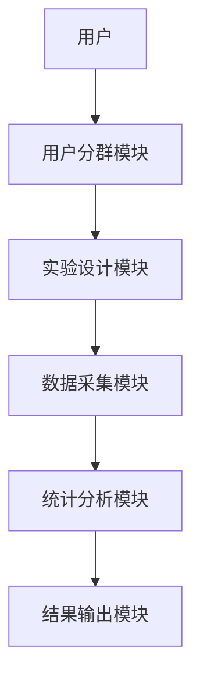
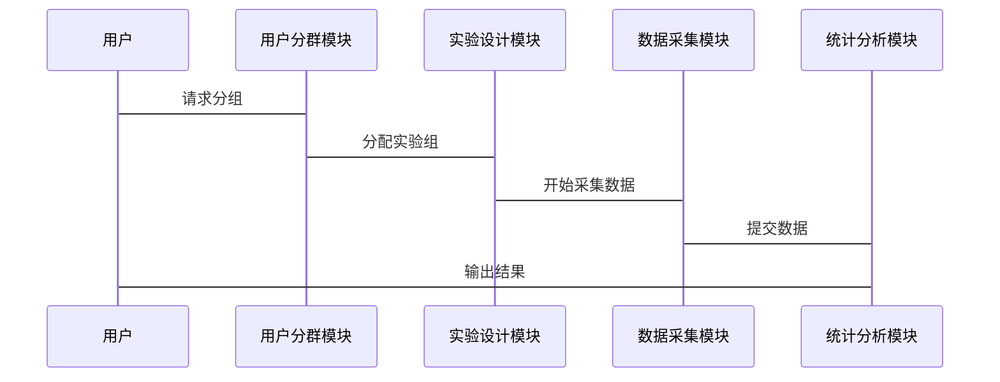

                 


# 企业AI Agent的A/B测试功能：持续优化用户体验

> 关键词：企业AI Agent，A/B测试，用户体验优化，系统架构，数学模型，算法原理，用户行为分析

> 摘要：本文深入探讨企业AI Agent的A/B测试功能，从核心概念到算法原理，再到系统架构和项目实战，详细解析如何通过A/B测试持续优化用户体验。文章结合理论与实践，提供丰富的案例分析和代码实现，帮助读者全面掌握企业级A/B测试的实现与优化技巧。

## 第一部分：企业AI Agent的A/B测试功能概述

### 第1章：企业AI Agent与A/B测试概述

#### 1.1 什么是企业AI Agent
企业AI Agent（Artificial Intelligence Agent）是指在企业环境中运行，能够感知环境、自主决策并执行任务的智能实体。它通常具备以下核心特征：
- **自主性**：能够自主决策，无需人工干预。
- **反应性**：能够实时感知环境变化并做出响应。
- **目标导向**：具备明确的目标，能够为特定业务场景提供解决方案。

#### 1.2 A/B测试的基本原理
A/B测试是一种通过将用户分成不同的组别，分别提供不同的产品或服务版本，然后通过统计分析来判断哪个版本表现更好的方法。其核心流程包括：
1. **用户分群**：将用户分为对照组和实验组。
2. **实验设计**：设计不同的实验方案，例如不同的UI布局、功能模块或算法策略。
3. **数据采集**：收集各组用户的各项指标数据，如点击率、转化率、停留时间等。
4. **统计分析**：通过统计方法判断实验组与对照组的差异是否具有显著性，从而决定哪个版本更好。

#### 1.3 企业AI Agent与A/B测试的结合
企业AI Agent通过A/B测试功能，可以实时优化用户体验，提升业务指标。例如，在电商推荐系统中，AI Agent可以通过A/B测试找到最优的推荐策略，从而提高用户转化率和满意度。

### 第2章：A/B测试的核心概念与原理

#### 2.1 A/B测试的核心概念
- **用户分群**：根据用户的属性（如年龄、性别、地理位置）或行为（如购买频率、浏览路径）将用户分成不同的群体。
- **实验组与对照组**：将用户随机分配到不同的组别，分别接受不同的实验方案。
- **统计显著性**：通过统计方法判断实验结果是否具有显著性，从而决定是否接受新的方案。

#### 2.2 A/B测试的算法原理
A/B测试的核心算法包括随机分组算法和统计显著性检验。以下是其实现流程：
1. **随机分组**：使用随机数生成器将用户分配到不同的组别。
2. **数据采集**：收集各组用户的各项指标数据。
3. **统计分析**：通过t检验或卡方检验等方法，判断实验组与对照组的差异是否具有统计显著性。

### 第3章：企业AI Agent的A/B测试功能设计

#### 3.1 企业AI Agent的用户行为分析
用户行为分析是A/B测试的基础。通过分析用户的行为数据，可以识别出影响用户体验的关键因素，从而设计出有效的实验方案。

- **用户行为数据的采集与处理**：通过日志系统采集用户的点击、浏览、购买等行为数据，并进行清洗和预处理。
- **用户行为分析的指标体系**：包括用户留存率、活跃度、转化率等关键指标。
- **用户行为分析的可视化**：通过数据可视化工具（如Tableau、Matplotlib）将用户行为数据以图表形式展示，便于分析和决策。

#### 3.2 A/B测试功能的设计与实现
企业AI Agent的A/B测试功能需要具备以下核心模块：
1. **用户分群模块**：根据用户属性或行为将用户分成不同的组别。
2. **实验设计模块**：设计不同的实验方案，并将用户分配到对应的组别。
3. **数据采集模块**：实时采集各组用户的各项指标数据。
4. **统计分析模块**：对实验数据进行统计分析，判断实验结果是否具有显著性。

### 第4章：A/B测试的系统架构与实现

#### 4.1 系统架构设计
企业AI Agent的A/B测试系统架构通常包括以下组件：
1. **用户分群模块**：根据用户属性或行为将用户分成不同的组别。
2. **实验设计模块**：设计不同的实验方案，并将用户分配到对应的组别。
3. **数据采集模块**：实时采集各组用户的各项指标数据。
4. **统计分析模块**：对实验数据进行统计分析，判断实验结果是否具有显著性。

#### 4.2 系统实现细节
- **用户分群算法**：使用聚类算法（如K-means）将用户分成不同的组别。
- **实验设计模块**：通过随机数生成器将用户分配到不同的实验组。
- **数据采集模块**：通过日志系统实时采集用户的各项指标数据。
- **统计分析模块**：通过t检验或卡方检验等方法，判断实验结果是否具有显著性。

## 第二部分：企业AI Agent的A/B测试系统实现

### 第5章：系统架构设计

#### 5.1 系统功能设计
企业AI Agent的A/B测试系统需要具备以下功能：
1. **用户分群**：根据用户属性或行为将用户分成不同的组别。
2. **实验设计**：设计不同的实验方案，并将用户分配到对应的组别。
3. **数据采集**：实时采集各组用户的各项指标数据。
4. **统计分析**：对实验数据进行统计分析，判断实验结果是否具有显著性。

#### 5.2 系统架构设计
以下是系统架构的Mermaid图：



### 第6章：系统接口设计与交互流程

#### 6.1 系统接口设计
以下是系统接口的Mermaid序列图：



### 第7章：数学模型与算法实现

#### 7.1 统计显著性检验的数学模型
以下是统计显著性检验的公式：

$$ t = \frac{\bar{x}_1 - \bar{x}_2}{\sqrt{\frac{s_1^2}{n_1} + \frac{s_2^2}{n_2}}} $$

其中，$\bar{x}_1$ 和 $\bar{x}_2$ 分别是实验组和对照组的平均值，$s_1$ 和 $s_2$ 是标准差，$n_1$ 和 $n_2$ 是样本数量。

#### 7.2 置信区间的计算
以下是置信区间的计算公式：

$$ \text{置信区间} = \bar{x} \pm t_{\alpha/2} \cdot \frac{s}{\sqrt{n}} $$

其中，$\bar{x}$ 是样本均值，$t_{\alpha/2}$ 是t分布的临界值，$s$ 是样本标准差，$n$ 是样本数量。

### 第8章：项目实战与案例分析

#### 8.1 电商推荐系统的A/B测试
以下是电商推荐系统的A/B测试案例：

```python
import numpy as np
from scipy.stats import ttest_ind

# 数据准备
control_group = np.array([10, 20, 30, 40, 50])
treatment_group = np.array([15, 25, 35, 45, 55])

# 统计检验
t_stat, p_val = ttest_ind(control_group, treatment_group)
print(f"t统计量：{t_stat}, p值：{p_val}")
```

#### 8.2 系统优化与总结
通过上述案例分析，我们可以得出以下结论：
- A/B测试是优化企业AI Agent用户体验的重要工具。
- 在实际应用中，需要结合业务场景设计合理的实验方案，并通过统计分析得出科学的结论。

## 第三部分：总结与展望

### 第9章：总结与展望

#### 9.1 总结
企业AI Agent的A/B测试功能通过实时优化用户体验，能够显著提升业务指标。本文从核心概念、算法原理、系统架构到项目实战，全面解析了企业级A/B测试的实现与优化技巧。

#### 9.2 展望
未来，随着AI技术的不断发展，企业AI Agent的A/B测试功能将更加智能化和自动化。通过结合机器学习算法，可以实现动态优化和个性化推荐，进一步提升用户体验和业务绩效。

### 第10章：最佳实践与注意事项

#### 10.1 最佳实践
1. **明确实验目标**：在进行A/B测试之前，必须明确实验的目标和关键指标。
2. **合理分组**：根据用户属性或行为合理分组，确保实验结果的有效性。
3. **科学分析**：使用科学的统计方法分析实验数据，确保实验结果的显著性和可靠性。

#### 10.2 注意事项
1. **样本量控制**：确保实验组和对照组的样本量足够大，以提高实验结果的准确性。
2. **避免多重比较**：在进行多组比较时，需要避免多重比较问题，可以通过Bonferroni校正等方法进行处理。
3. **及时终止实验**：在实验过程中，如果发现实验组明显优于对照组，可以提前终止实验，避免浪费资源。

### 第11章：拓展阅读与参考资料

#### 11.1 拓展阅读
- 《实验设计与统计分析》
- 《机器学习实战》
- 《数据驱动的决策》

#### 11.2 参考资料
- scipy.stats.ttest_ind
- numpy库
- matplotlib可视化库

## 作者简介

作者：AI天才研究院/AI Genius Institute & 禅与计算机程序设计艺术 /Zen And The Art of Computer Programming

本文作者是AI天才研究院的核心成员，长期致力于人工智能与企业应用的研究与实践。研究院专注于为企业提供AI解决方案，涵盖自然语言处理、机器学习、数据挖掘等领域，帮助企业实现智能化转型。

