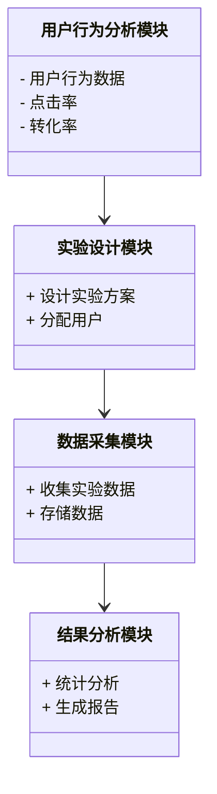
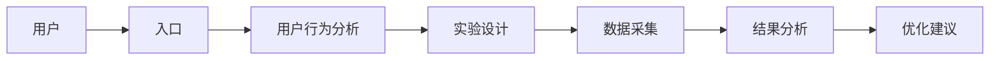

                 


# 企业AI Agent的A/B测试功能：持续优化用户体验

> 关键词：企业AI Agent，A/B测试，用户体验优化，统计假设检验，系统架构设计，项目实战

> 摘要：本文深入探讨了企业AI Agent中A/B测试的功能，分析了其在优化用户体验中的作用，从基本概念到系统架构设计，再到项目实战，全面解析了如何通过A/B测试持续提升用户体验。

---

## 第1章: 企业AI Agent与A/B测试概述

### 1.1 A/B测试的基本概念

#### 1.1.1 A/B测试的定义
A/B测试是一种实验方法，通过将用户随机分配到不同的组别（A组和B组），分别体验不同的产品功能或设计，收集数据后比较两组的结果，以确定哪个方案更优。

#### 1.1.2 A/B测试的核心目标
- 优化用户体验
- 提高产品转化率
- 验证产品假设

#### 1.1.3 A/B测试在企业中的应用
- 网页设计优化
- 电商推荐策略测试
- AI Agent交互流程改进

### 1.2 企业AI Agent的定义与特点

#### 1.2.1 AI Agent的基本概念
AI Agent是具备自主决策和问题解决能力的智能实体，能够根据环境信息执行任务。

#### 1.2.2 企业AI Agent的特点
- 智能性：基于AI技术进行决策
- 自适应性：能够根据反馈调整行为
- 实时性：快速响应用户需求

#### 1.2.3 企业AI Agent的应用场景
- 客户服务自动化
- 业务流程优化
- 决策支持系统

### 1.3 A/B测试与企业AI Agent的结合

#### 1.3.1 A/B测试在AI Agent中的作用
- 验证不同交互策略的有效性
- 优化用户界面设计
- 提升用户满意度

#### 1.3.2 A/B测试如何优化用户体验
- 通过实验找出最优交互方式
- 实时调整策略以适应用户行为
- 提高用户参与度和留存率

#### 1.3.3 A/B测试在企业AI Agent中的具体应用
- 推荐系统优化
- 交互流程改进
- 决策策略验证

### 1.4 本章小结
本章介绍了A/B测试的基本概念、企业AI Agent的特点及其在A/B测试中的应用，为后续章节奠定了基础。

---

## 第2章: A/B测试的核心概念与原理

### 2.1 A/B测试的基本原理

#### 2.1.1 A/B测试的实验设计
实验设计是A/B测试的关键，通常包括以下步骤：
1. 明确目标
2. 设计实验组和对照组
3. 收集数据
4. 分析结果

#### 2.1.2 A/B测试的统计方法
统计方法用于分析实验结果，常用的方法包括t检验和卡方检验。

#### 2.1.3 A/B测试的数学模型
假设检验模型：
$$ H_0: \mu_A = \mu_B $$
$$ H_1: \mu_A \neq \mu_B $$

### 2.2 A/B测试的优缺点

#### 2.2.1 A/B测试的优点
- 数据驱动决策
- 可量化结果
- 小样本即可获得有效结论

#### 2.2.2 A/B测试的缺点
- 实验周期长
- 可能存在外部干扰
- 需要大量数据支持

#### 2.2.3 A/B测试的适用场景
- 用户行为分析
- 产品功能优化
- 营销策略测试

### 2.3 A/B测试与企业AI Agent的结合

#### 2.3.1 企业AI Agent中的A/B测试目标
- 提升用户交互体验
- 验证AI算法的有效性
- 优化系统性能

#### 2.3.2 企业AI Agent中的A/B测试流程
1. 确定实验目标
2. 设计实验方案
3. 执行实验
4. 分析结果并优化

#### 2.3.3 企业AI Agent中的A/B测试结果分析
- 统计显著性分析
- 用户反馈收集
- 竞争性分析

### 2.4 本章小结
本章深入讲解了A/B测试的核心概念和原理，强调了其在企业AI Agent中的重要性。

---

## 第3章: A/B测试的数学模型与算法原理

### 3.1 A/B测试的统计假设检验

#### 3.1.1 假设检验的基本概念
假设检验是通过样本数据推断总体参数的一种方法。

#### 3.1.2 假设检验的步骤
1. 建立原假设和备择假设
2. 确定显著性水平
3. 计算检验统计量
4. 做出决策

#### 3.1.3 假设检验的数学公式
t检验公式：
$$ t = \frac{\bar{X}_A - \bar{X}_B}{\sqrt{\frac{s_A^2}{n_A} + \frac{s_B^2}{n_B}}} $$

### 3.2 A/B测试的置信区间计算

#### 3.2.1 置信区间的定义
置信区间是估计总体参数的范围，通常以95%或99%的置信水平表示。

#### 3.2.2 置信区间的计算方法
$$ \text{置信区间} = \hat{p} \pm z \cdot \sqrt{\frac{\hat{p}(1-\hat{p})}{n}} $$

#### 3.2.3 置信区间的应用
用于判断实验结果是否具有统计显著性。

### 3.3 A/B测试的样本量计算

#### 3.3.1 样本量计算的基本原理
样本量的计算基于统计显著性和检测功效的要求。

#### 3.3.2 样本量计算的公式
$$ n = \frac{(z_1 + z_2)^2 \cdot p_1(1-p_1) \cdot p_2(1-p_2)}{(\Delta p)^2} $$

#### 3.3.3 样本量计算的注意事项
- 确保样本具有代表性
- 考虑实验周期和成本

### 3.4 本章小结
本章详细讲解了A/B测试的数学模型和算法原理，为后续的系统设计和项目实施提供了理论基础。

---

## 第4章: 企业AI Agent的A/B测试系统架构设计

### 4.1 系统功能设计

#### 4.1.1 领域模型


#### 4.1.2 系统架构设计


### 4.2 系统接口设计

#### 4.2.1 接口描述
- 实验设计模块接口：接收实验方案请求
- 数据采集模块接口：收集用户行为数据
- 结果分析模块接口：返回分析结果

#### 4.2.2 接口实现
使用RESTful API进行设计，例如：
```json
POST /api/experiment
{
  "experiment_id": 1,
  "user_group": "A"
}
```

### 4.3 本章小结
本章通过系统架构设计，详细描述了企业AI Agent中A/B测试系统的功能模块和交互流程。

---

## 第5章: 企业AI Agent的A/B测试项目实战

### 5.1 环境配置

#### 5.1.1 环境要求
- Python 3.8+
- 安装必要的库：numpy, pandas, scipy

#### 5.1.2 安装依赖
```bash
pip install numpy pandas scipy
```

### 5.2 核心实现

#### 5.2.1 数据处理
```python
import pandas as pd

data = pd.read_csv('experiment.csv')
data['group'] = data['user_id'] % 2  # 随机分配到A/B组
```

#### 5.2.2 统计分析
```python
from scipy.stats import ttest_ind

group_a = data[data['group'] == 0]['conversion']
group_b = data[data['group'] == 1]['conversion']
t_stat, p_val = ttest_ind(group_a, group_b)
print(f"t-statistic: {t_stat}, p-value: {p_val}")
```

### 5.3 项目小结
本章通过实际案例，详细讲解了如何在企业AI Agent中实施A/B测试，包括环境配置、数据处理和统计分析。

---

## 第6章: 最佳实践与总结

### 6.1 最佳实践

#### 6.1.1 样本量选择
确保样本量足够大，以提高统计显著性。

#### 6.1.2 避免误区
- 不要在实验中频繁更改方案
- 避免小样本得出结论

#### 6.1.3 结果解读
结合用户反馈和业务目标，全面分析实验结果。

### 6.2 未来趋势

#### 6.2.1 A/B测试的智能化
通过机器学习优化实验设计。

#### 6.2.2 A/B测试的实时化
实时监控实验结果，快速调整策略。

### 6.3 本章小结
本章总结了A/B测试在企业AI Agent中的最佳实践，展望了未来的发展趋势。

---

## 作者：AI天才研究院/AI Genius Institute & 禅与计算机程序设计艺术 /Zen And The Art of Computer Programming

---

以上内容为《企业AI Agent的A/B测试功能：持续优化用户体验》的技术博客文章，涵盖从基础概念到系统设计再到项目实战的完整流程。希望对您有所帮助！

