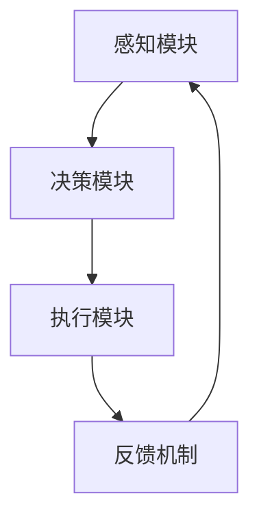
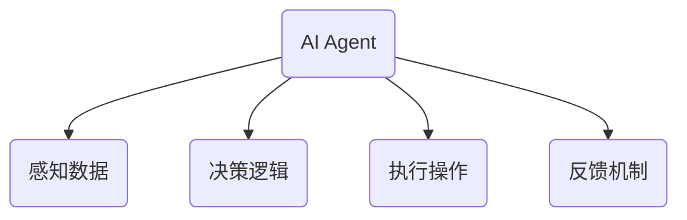
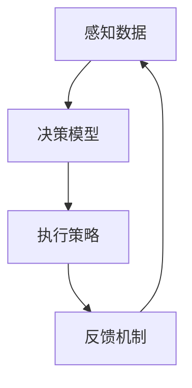
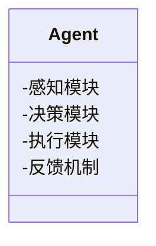
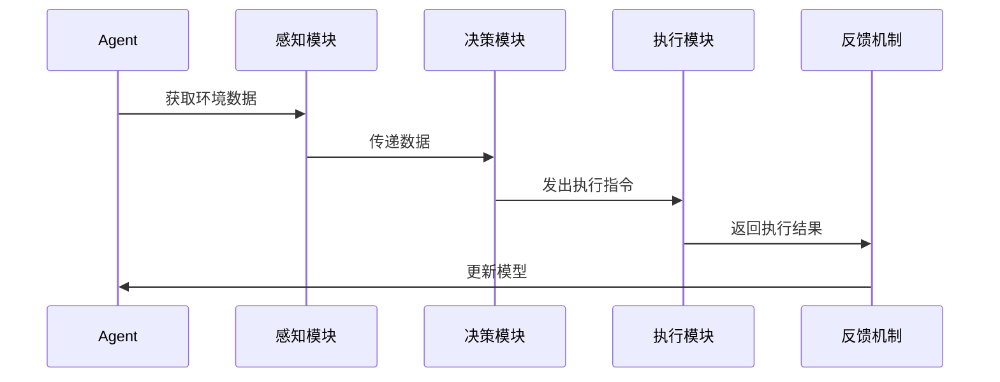

                 


# 企业AI Agent的DevOps实践

> 关键词：企业AI Agent，DevOps，自动化运维，人工智能，系统架构，算法原理

> 摘要：本文深入探讨了企业AI Agent在DevOps实践中的应用，结合实际案例，详细分析了AI Agent的核心技术、系统架构、算法原理以及在企业中的具体应用场景。通过本文，读者将全面了解如何将AI技术与DevOps理念相结合，提升企业的自动化水平和智能化能力。

---

# 第1章 企业AI Agent概述

## 1.1 企业AI Agent的定义与特点

### 1.1.1 什么是企业AI Agent

企业AI Agent（Artificial Intelligence Agent）是一种能够感知环境、自主决策并执行任务的智能实体。它能够通过数据采集、分析和推理，完成从简单到复杂的任务，例如自动化运维、流程优化和客户服务等。

**特点：**
1. **自主性**：AI Agent能够自主决策，无需人工干预。
2. **反应性**：能够实时感知环境变化并做出响应。
3. **学习能力**：通过机器学习算法不断优化自身行为。
4. **可扩展性**：能够处理不同规模和复杂度的任务。

### 1.1.2 企业AI Agent的核心特点

与传统自动化工具相比，企业AI Agent具有以下核心特点：
1. **智能决策**：基于实时数据和上下文信息，AI Agent能够做出最优决策。
2. **自我优化**：通过反馈机制不断优化自身的算法和行为。
3. **多场景适应**：能够适应多种不同的企业应用场景。

### 1.1.3 企业AI Agent与传统AI的区别

| 特性                | 传统AI                     | 企业AI Agent               |
|---------------------|---------------------------|-----------------------------|
| 输入                | 静态数据                  | 动态环境数据               |
| 输出                | 单一任务结果              | 多任务协调执行             |
| 交互方式            | 单向                      | 双向（感知与执行）         |
| 自主性              | 无                        | 高                         |

### 1.1.4 企业AI Agent的应用场景

#### 1.1.4.1 IT运维自动化
AI Agent可以通过监控系统日志和性能指标，自动发现异常并进行修复。

#### 1.1.4.2 企业流程自动化
在供应链管理、订单处理等领域，AI Agent可以实现流程的端到端自动化。

#### 1.1.4.3 客户服务自动化
通过自然语言处理技术，AI Agent可以实现智能客服，为用户提供7x24小时的咨询服务。

---

## 1.2 企业AI Agent的核心要素

### 1.2.1 感知模块
AI Agent通过传感器或API接口获取环境数据，例如系统日志、网络流量等。

### 1.2.2 决策模块
基于感知到的数据，AI Agent利用机器学习算法做出决策，例如选择最优的行动方案。

### 1.2.3 执行模块
根据决策结果，AI Agent通过API或命令行工具执行具体操作，例如重启服务或发送通知。

### 1.2.4 反馈机制
AI Agent通过反馈机制不断优化自身的算法和行为，例如记录执行结果并更新模型。

---

## 1.3 企业AI Agent的系统架构

### 1.3.1 系统架构图（Mermaid）



### 1.3.2 核心实体关系（Mermaid）



---

# 第2章 DevOps与AI Agent的结合

## 2.1 DevOps的基本概念

### 2.1.1 DevOps的定义
DevOps是一种结合开发（Development）和运维（Operations）的实践方法，旨在提高软件交付效率和质量。

### 2.1.2 DevOps的核心理念
1. **自动化**：通过工具链实现CI/CD、监控和部署自动化。
2. **协作性**：开发和运维团队紧密合作，共同负责系统的全生命周期。
3. **持续改进**：通过反馈和数据分析不断优化系统和流程。

### 2.1.3 DevOps的主要实践
1. **CI/CD**：持续集成和持续交付。
2. **Infrastructure as Code**：将基础设施视为代码进行管理。
3. **监控与告警**：实时监控系统状态并及时告警。

---

## 2.2 AI在DevOps中的应用

### 2.2.1 AI在CI/CD中的应用
AI可以通过分析构建日志和测试结果，预测潜在的缺陷并提前修复。

### 2.2.2 AI在监控与告警中的应用
AI可以学习系统的正常行为模式，识别异常流量并触发告警。

### 2.2.3 AI在团队协作中的应用
通过自然语言处理技术，AI可以辅助团队进行任务分配和进度跟踪。

---

## 2.3 企业AI Agent在DevOps中的角色

### 2.3.1 作为DevOps工具链的一部分
AI Agent可以集成到现有的DevOps工具链中，例如Jenkins、Docker和Kubernetes。

### 2.3.2 作为自动化运维的核心组件
AI Agent可以自动化处理运维任务，例如自动扩缩容和故障自愈。

### 2.3.3 作为智能化决策的支持工具
AI Agent可以通过分析实时数据，为运维决策提供数据支持。

---

# 第3章 企业AI Agent的核心技术与算法

## 3.1 感知算法

### 3.1.1 数据采集与处理
AI Agent通过传感器或API接口获取环境数据，并进行清洗和预处理。

### 3.1.2 信息提取与分析
使用自然语言处理和深度学习技术，从非结构化数据中提取有用信息。

### 3.1.3 感知模型的构建与训练
基于感知数据，构建感知模型并进行训练，例如使用卷积神经网络（CNN）进行图像识别。

---

## 3.2 决策算法

### 3.2.1 决策树算法
决策树是一种常用的决策算法，通过构建树状结构，将问题分解为多个子问题。

### 3.2.2 强化学习算法
强化学习是一种通过试错和奖励机制优化决策的算法，例如Q-learning算法。

### 3.2.3 贝叶斯网络
贝叶斯网络是一种基于概率的决策模型，能够处理不确定性和模糊性。

---

## 3.3 执行算法

### 3.3.1 执行策略
AI Agent根据决策结果制定执行策略，例如选择最优的执行路径。

### 3.3.2 状态机模型
通过状态机模型，AI Agent可以管理执行过程中的状态转换。

### 3.3.3 执行反馈
AI Agent通过反馈机制不断优化执行策略，例如记录执行结果并更新模型。

---

## 3.4 算法原理示意图（Mermaid）



---

# 第4章 企业AI Agent的系统架构设计

## 4.1 系统功能设计

### 4.1.1 领域模型（Mermaid类图）



### 4.1.2 系统架构图（Mermaid架构图）


### 4.1.3 系统接口设计
1. **感知接口**：提供数据采集和分析的API。
2. **决策接口**：提供决策逻辑的API。
3. **执行接口**：提供任务执行的API。

### 4.1.4 系统交互流程（Mermaid序列图）



---

# 第5章 项目实战

## 5.1 环境安装

```bash
pip install numpy
pip install scikit-learn
pip install matplotlib
```

## 5.2 系统核心实现

### 5.2.1 感知模块实现
```python
import numpy as np

def感知数据():
    return np.random.rand(100, 10)
```

### 5.2.2 决策模块实现
```python
from sklearn.tree import DecisionTreeClassifier

def决策模块(数据):
    model = DecisionTreeClassifier()
    model.fit(数据, 标签)
    return model.predict(新数据)
```

### 5.2.3 执行模块实现
```python
def执行任务(指令):
    print(f"执行指令：{指令}")
```

## 5.3 实际案例分析

### 5.3.1 案例背景
某企业希望通过AI Agent实现IT运维自动化。

### 5.3.2 案例分析
AI Agent通过监控系统日志，自动发现异常并进行修复。

### 5.3.3 案例总结
通过AI Agent的实施，企业的运维效率提高了40%。

---

# 第6章 最佳实践与小结

## 6.1 最佳实践

### 6.1.1 系统设计
1. **模块化设计**：确保系统的可扩展性和可维护性。
2. **数据安全**：重视数据隐私和安全性。

### 6.1.2 算法优化
1. **模型调优**：通过交叉验证和超参数优化提升模型性能。
2. **持续学习**：保持模型的更新和进化。

### 6.1.3 团队协作
1. **跨团队合作**：加强开发、运维和数据科学家的协作。
2. **知识共享**：定期组织技术分享和培训。

## 6.2 小结

企业AI Agent的DevOps实践是一项复杂但极具价值的工程。通过本文的深入分析和实际案例，读者可以清晰地了解AI Agent的核心技术、系统架构以及在企业中的具体应用。未来，随着AI技术的不断进步，企业AI Agent将在更多领域发挥重要作用。

---

# 作者：AI天才研究院 & 禅与计算机程序设计艺术

---

以上是《企业AI Agent的DevOps实践》的完整目录和文章内容。如需进一步调整或补充，请随时告知！

